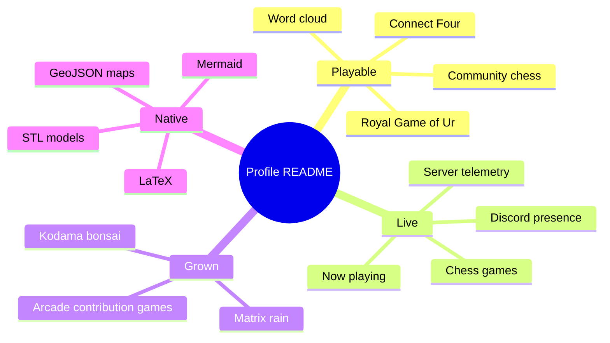
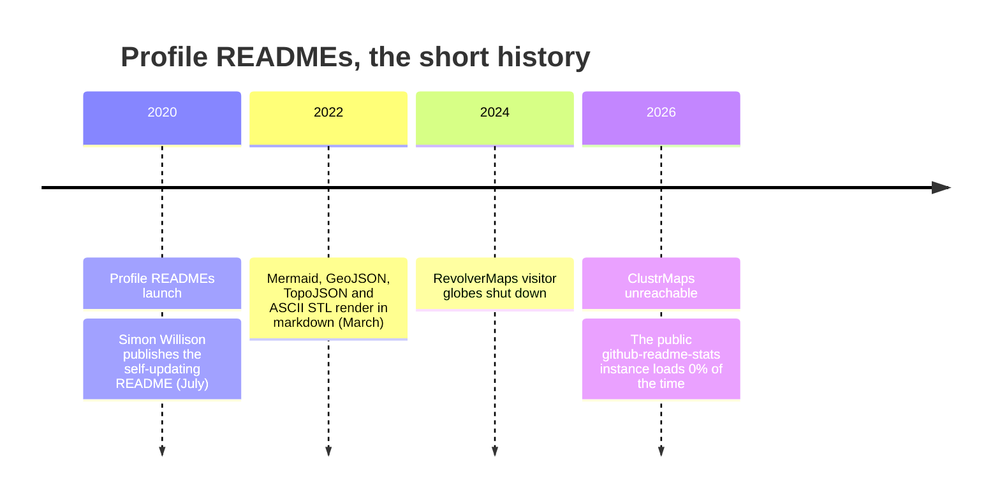
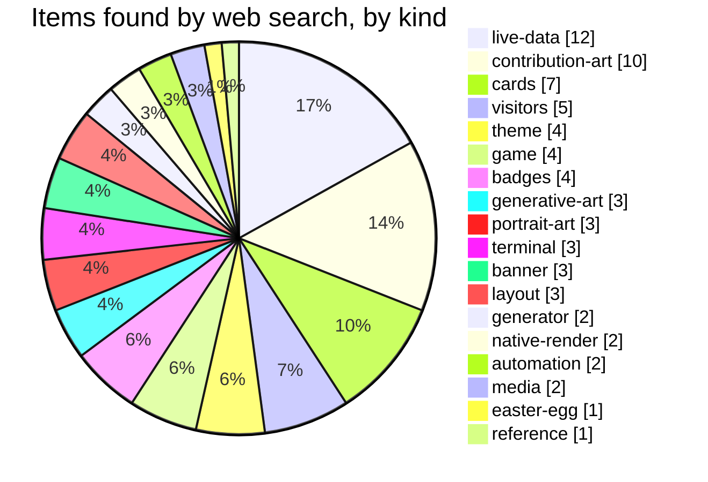
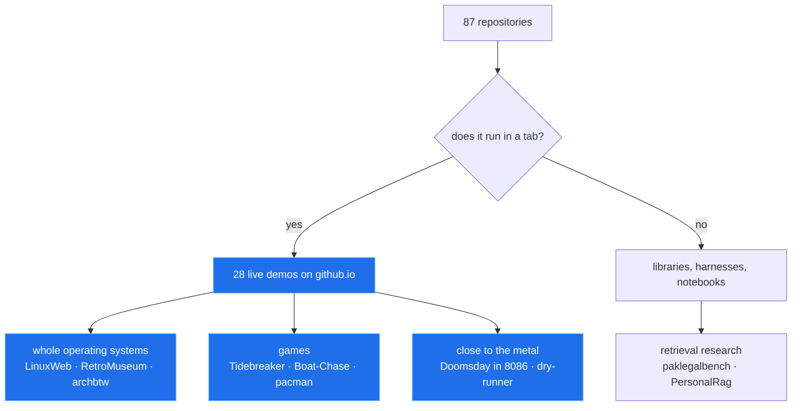
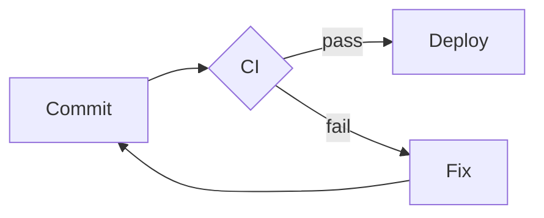

# THE BOOK OF CREATIVITY — GitHub Profile README Research, Complete

> **One document to rule them all.** Every finding from the 446-profile survey, the technique catalogue, the three-engine capability matrix, the Profile README Book, the two built profiles, all AI work across every branch, 39 freshly-hunted live profiles in two waves, a verbatim motion-code deep-dive, and 99 generators/tools with embed code — assembled by script from nine parallel research agents.
>
> Assembled: 2026-09-26 · Branch: `helper/side-person_opencode` · Source parts: `opencode-research/parts/01..09-*.md` · Upstream: https://github.com/hammadshakeelai/github-profile-blueprint

## Table of Contents

- [Part 01 — The Survey: 446 Profiles Measured (repo's own research)](#part-01-the-survey-446-profiles-measured-repos-own-research) — `01-survey-shortlist.md` (45.1 KB)
- [Part 02 — Techniques, Engine Capability Matrix & Open Research Tracks](#part-02-techniques-engine-capability-matrix-open-research-tracks) — `02-techniques-capability.md` (84.9 KB)
- [Part 03 — The Profile README Book (lookbook, curiosities, dictionary, native tricks, 9 new designs)](#part-03-the-profile-readme-book-lookbook-curiosities-dictionary-native-tricks-9-new-designs) — `03-book-chapters.md` (69 KB)
- [Part 04 — Two Built Profiles & The Chosen Direction](#part-04-two-built-profiles-the-chosen-direction) — `04-built-profiles-direction.md` (55.4 KB)
- [Part 05 — All AI Work Across Every Branch (archive/v1, research/claude, antigravity, v2/research, probe/cache)](#part-05-all-ai-work-across-every-branch-archivev1-researchclaude-antigravity-v2research-probecache) — `05-claude-branches.md` (35.4 KB)
- [Part 06 — Fresh External Research: Standout Profile READMEs Found Live (2026)](#part-06-fresh-external-research-standout-profile-readmes-found-live-2026) — `06-external-profiles.md` (46.7 KB)
- [Part 07 — The Generator & Toolkit Ecosystem (embed code, alive/dead status)](#part-07-the-generator-toolkit-ecosystem-embed-code-alivedead-status) — `07-tools-generators-creativity.md` (45.2 KB)
- [Part 08 — Fresh External Research, Wave 2: Motion-First Standout Profiles (2026)](#part-08-fresh-external-research-wave-2-motion-first-standout-profiles-2026) — `08-external-profiles-wave2.md` (49.6 KB)
- [Part 09 — Motion Deep-Dive: Real Animation Code That Runs in GitHub READMEs](#part-09-motion-deep-dive-real-animation-code-that-runs-in-github-readmes) — `09-motion-deep-dive.md` (52.4 KB)

---

# Part 01 — The Survey: 446 Profiles Measured (repo's own research)

Everything in this part comes from Phase 1 of the github-profile-blueprint repo: the survey in `docs/survey/`. No outside sources. The survey measured **446 real GitHub profile READMEs**, fetched **10,782 images**, rendered **442 profiles at phone width and 441 at desktop width** in headless Chrome, health-checked **65 tool repositories**, and screenshotted **20 shortlisted profiles**. Files: [FINDINGS.md](https://github.com/hammadshakeelai/github-profile-blueprint/blob/v2/research/docs/survey/FINDINGS.md) (statistics + method), [SHORTLIST.md](https://github.com/hammadshakeelai/github-profile-blueprint/blob/v2/research/docs/survey/SHORTLIST.md) (the profiles), [GENERATORS.md](https://github.com/hammadshakeelai/github-profile-blueprint/blob/v2/research/docs/survey/GENERATORS.md), [TOOLS.md](https://github.com/hammadshakeelai/github-profile-blueprint/blob/v2/research/docs/survey/TOOLS.md), [PROFILES.md](https://github.com/hammadshakeelai/github-profile-blueprint/blob/v2/research/docs/survey/PROFILES.md) (all 446 rows), and `data/*.json`.

---

## What the survey is

From `docs/survey/README.md`: a library of real GitHub profile READMEs and the generators they depend on, "built from evidence rather than general knowledge. Every row is filled by fetching the actual README and every image it references, and phone behaviour is measured from real rendered layout."

**446 personal profiles · 10,782 images fetched · layout measured for 442 at phone and 441 at desktop width · 65 tool repositories health-checked · 20 shortlisted and screenshotted.**

### The sample, exactly as reported

| Cohort | Profiles | How found | Represents |
|---|--:|---|---|
| **curated** | 187 | `abhisheknaiidu/awesome-github-profile-readme` (31k★) | Popular, widely copied — skews to the 2020–22 profile boom |
| **search** | 259 | GitHub code search for animation and filter primitives in committed `.svg` files, kept only in `username/username` repos | Ambitious — people hand-making SVGs |

487 candidates were collected; 38 turned out to be organisations (WebKit/WebKit, Mailu/Mailu — an org page never shows a repo README as a profile), 2 were gone and 1 had no README.

They reference **10,782 images (8,589 distinct URLs)**, every one of which was fetched. The profiles were also loaded in headless Chrome to measure real layout — **442 at phone width, 441 at desktop** — and 98% of rendered images matched their fetched source.

Image origins across the corpus: **2,689 committed**, **7,934 third-party**, **159 GitHub uploads** (from `data/summary.json`). 344 profiles were pushed within 12 months, 41 more than 36 months ago, median time since push **1.1 months**.

The search cohort was chosen *for* hand-made SVGs, so its custom-SVG rates are high by construction. Every other comparison between the cohorts — breakage, theming, badge use, phone legibility — is independent of that selection. Both cohorts are reported separately throughout.

### How it was measured

Everything re-runs from `tools/survey/`:

| Step | Script | Does |
|---|---|---|
| 1 | `source_codesearch.py` | Technique-first candidate discovery via code search |
| 2 | `harvest.py` | Fetches each profile's README via the API, resolves and fetches every image, derives SVG metrics |
| 3 | `layout.py` | Loads each live profile in headless Chrome at 390px and 1280px and records every image's rendered box |
| 4 | `analyze.py` | Builds `PROFILES.md`, `GENERATORS.md`, `summary.json` |
| 5 | `tools_health.py` | Maintenance status of the tool repositories → `TOOLS.md` |
| 6 | `shortlist.py` | Ranks candidates worth looking at (a pre-filter, not the judgement) |
| 7 | `screenshot.py`, `contact_sheet.py` | Captures and tiles pages for visual review |

The search query for the ambitious cohort was GitHub code search for these primitives in committed `.svg` files, kept only to `username/username` repos owned by a person:

```
animateMotion, animateTransform, stroke-dashoffset, keyframes,
feGaussianBlur, feTurbulence, feDisplacementMap, textPath,
prefers-color-scheme
```

Privacy and safety: nothing copied from the READMEs themselves is stored — the repo keeps links and derived measurements; README text and image bodies live in a gitignored cache (`.cache/survey/`). The GitHub token is sent to `api.github.com` only; SVGs from third-party hosts are treated as untrusted and refused if they declare a DTD or entities.

**How the shortlist was chosen:** `tools/survey/shortlist.py` ranked every profile by how much of its own visual work actually renders — bespoke SVGs, animation, dark/light support — and penalised breakage, badge walls and phone-illegible cards. The top 30 from that ranking, plus the ten strongest from the curated list, were screenshotted at 390px and 1280px and **looked at**. "Ranking is not judgement: several high scorers turned out competent but conventional, and the scorer can't see an idea."

---

## Survey-wide findings

Eight numbered findings from FINDINGS.md, each tied to its numbers.

### 1. Most-copied generators are dead, and free hosting killed them

**41% of profiles show at least one broken image** (39% curated, 44% search).

The single biggest cause is free-tier Vercel deployments being switched off: **309 of the broken image URLs** return Vercel's `DEPLOYMENT_PAUSED` (215) or `DEPLOYMENT_DISABLED` (94), confirmed from response headers (`Server: Vercel`, `X-Vercel-Error`).

| Generator | Profiles using it | Images that load |
|---|--:|--:|
| github-readme-stats — public instance | 107 | **0%** |
| github-readme-activity-graph | 57 | **2%** |
| github-profile-trophy | 36 | **11%** |
| visitor badges (assorted) | 42 | 59% |
| spotify now-playing | 9 | 44% |
| github-readme-streak-stats | 95 | 97% |
| readme-typing-svg | 87 | 100% |
| profile views counter (komarev) | 103 | 100% |
| shields.io | 239 | 100% |

**24% of profiles still embed the dead github-readme-stats public instance** — 25% of the curated cohort and, notably, 24% of the ambitious one. The paused instance returns the same 503 to a browser, to GitHub's own Camo proxy, and to the survey client, so this is not the survey being blocked.

Repository metadata doesn't warn you: GitHub reports `anuraghazra/github-readme-stats` as active (pushed 2026-08-31, not archived), while its own README says it is no longer maintained and its public instance is paused. Metadata said *active*, the README said *unmaintained*, the service said *paused*. Only fetching the image told the truth.

**What survives:** services run on dedicated infrastructure (shields.io, komarev, DenverCoder1's demolab.com services) and anything committed to the profile repo itself. Committed images loaded **99%** of the time (31 broken of 2,689 occurrences, mostly paths that no longer exist).

Full failure-reason counts over distinct URLs (`data/summary.json`): `vercel-paused` 215, `vercel-disabled` 94, `http-404` 68, `error-card` 25, `http-403` 17, `http-410` 15, `dns` 9, `http-500` 7, `http-400` 7, `network` 5, `not-image` 2, `http-429` 2, `timeout` 1, `http-504` 1 — 490 broken occurrences across 185 profiles.

### 2. Most SVG cards are unreadable on a phone — and it's the phone's doing

GitHub's README column is **309px wide on a 390px phone** (846px on desktop), and an SVG scales down as a single unit, text included.

Of **1,730 SVG cards** measured on the phone — badges and icons excluded — **55% have their *largest* text under 11px.**

- **90% of those are phone-caused**: legible at the image's native width, illegible only after shrinking into the 309px column. Just 10% are too small on any device.
- **Profiles with at least one such card: 15% curated, 70% search.**
- **Hand-made cards fail more than services: 63% vs 37%.** Generator authors design at moderate widths; people crafting their own panels design wide canvases with small text, which is exactly what a phone punishes.
- **Desktop is not immune, just far better:** measured the same way at 1280px (441 profiles), 15% of profiles have at least one illegible card (137 cards) — 3% curated, 23% search. Mostly panels drawn wider than the 846px column.

Measured per generator (images in brackets): readme-typing-svg **54%** (98), lowlighter/metrics **83%** (29), github-profile-summary-cards **60%** (52), github-readme-streak-stats **23%** (90), self-hosted github-readme-stats **20%** (82). shields.io's **53%** (4,502) is by design rather than by phone: its `for-the-badge` style sets text at 10px on every device.

Looking confirms the numbers. On a phone, JGit705's hero subtitle, chips, terminal panel and stat-card labels turn to specks — while the markdown paragraph right below them stays perfectly readable, because real text reflows and an SVG doesn't.

The exception worth copying: ayxn07's display type is so large it survives the shrink. Its headline system reads on a phone even where body copy doesn't.

Cohort detail (`data/summary.json`): 6,500 text-bearing card slots measured; 2,810 fully illegible on mobile, 3,332 with some illegible text on mobile, 2,682 with some illegible text on desktop; **252 profiles** have at least one illegible card. Illegible-card rates by origin, all profiles: **bespoke 672/1,065 (63%)**, **service 198/532 (37%)**, generated 71/131 (54%), copied 2/2 (100%).

### 3. Tables misbehave differently than you'd expect

21% of profiles put two or more images inside a table (HTML or markdown, counted from the rendered page). On a phone, GitHub does one of two things, neither of which is "shrink to fit":

- **Squeeze cards to share the row** — 640px cards measured at **76px** in a four-column table. 9% of profiles have cards crushed this way.
- **Keep cards full width and scroll the table sideways** — a 450px card stayed 450px and the table scrolled to 532px. 7% of profiles.

The page itself never scrolls sideways (0 of 442): GitHub contains the overflow inside the table.

### 4. Dark and light switching is rare

**20% of profiles switch images between dark and light themes** — 5% curated, 30% search. Of those that do, `<picture>` with `prefers-color-scheme` dominates (**80 profiles**) over the older fragment form (**7 profiles**).

```
<picture>
  <source media="(prefers-color-scheme: dark)" srcset="…-dark.svg">
  
</picture>
```

(The legacy alternative seen in 7 profiles is the `#gh-dark-mode-only` fragment suffix on a single URL.)

Separately, **35 profiles** put `prefers-color-scheme` *inside* their SVGs (15 of them alongside `<picture>`). Inside an image, that media query follows the viewer's operating system, not their GitHub theme setting, so it can mismatch the page. Whether it behaves across GitHub's mobile clients is an open Phase 3 question.

Counts from `data/summary.json`'s `theme_switch`: none 359, picture 80, fragment 7.

### 5. Badge walls are common everywhere

**42% of profiles are more than half badges and icons** — 40% curated, 43% search. Even people hand-crafting animated SVGs fill the rest of the page with shields.

### 6. What hand-made SVGs actually use

Profiles using each technique in at least one bespoke SVG (counting profiles, so one profile with forty files can't outvote forty with one):

| Technique | Profiles |
|---|--:|
| Gradients | 130 |
| SMIL animation (`<animate>`, `animateMotion`) | 129 |
| Filters | 102 |
| CSS `@keyframes` | 101 |
| Stroke-dash line drawing | 93 |
| Blur / glow (`feGaussianBlur`) | 90 |
| Clip paths | 90 |
| `prefers-color-scheme` inside the SVG | 35 |
| `<foreignObject>` | 32 |
| Masks | 28 |
| Embedded base64 fonts | 13 |
| Text on a path | 12 |

SMIL is used more than CSS keyframes in hand-made work. Both run in GitHub's secure-animated-mode rendering; interaction and external resources don't. Real example files for each are in `data/technique_exemplars.json` (781 lines of per-technique exemplar URLs — e.g. gradient exemplars from sepahead, Dhyanesh006 and ashfordeOU; clip-path from ayxn07; theme-aware SVG from umang-eng and YoraiLevi).

Corpus-wide technique counts over all 6,844 distinct SVGs (1,472 animated), from `data/summary.json`: gradient 2,429 · embedded-svg 2,301 · clip-path 1,775 · filter 1,632 · blur-glow 1,556 · css-keyframes 920 · smil 703 · stroke-draw 432 · mask 368 · theme-aware-svg 316 · foreign-object 156 · embedded-font 151 · text-path 118 · embedded-raster 104 · script 8. SVG origins: badge-icon 4,434 · bespoke 1,506 · service 683 · generated 192 · copied 29. Of the 1,506 bespoke SVGs, **842 animate**.

### 7. "Custom" isn't always original

Of **1,506 bespoke SVGs** (committed to the user's own repos and not a known tool's output), 842 animate.

- **192 committed SVGs are generated** by five Actions, identified by signatures they leave in the file. The signatures, verbatim from FINDINGS.md:

```
<desc>Generated with …</desc>          (snk, pacman-contribution-graph)
id="metrics-end"                       (lowlighter/metrics)
rb-l0-left classes                     (github-profile-3d-contrib)
data-testid="card-title"               (github-readme-stats cards)
```

Any other SVG announcing itself with a `Generated with/by` description is caught too.

- **Byte-identical copying is rare**: 29 files across 14 profiles.
- **Structural templates are not rare, and hashing can't see them.** Four profiles share one "Index Nº 001" layout with personalised text — found by looking, then confirmed by markers in their SVG source.
- A distinct recent style emerged: profiles built entirely from dozens of bespoke animated SVGs with separate `-dark` / `-light` files. The suspected clones among them turned out not to be — no pair shares more than 30% of its filenames.

### 8. Most profiles are automated, so "recently pushed" means little

**54% of profiles run GitHub Actions workflows** (41% curated, 63% search), many committing on a schedule. That's why the median profile was last pushed 1.1 months ago, including many whose human content hasn't changed in years. A push date is not evidence anyone is maintaining the page. (`data/summary.json`: 240 profiles with workflows.)

---

## The legibility arithmetic (the survey's central constraint)

- **390px phone → 309px README column.** Images are hard-capped to the column; 309px is the number that kills banners. Desktop column: 846px at 1280px viewport.
- **The floor is 11px**: a card counts as illegible on a phone when its *largest* `<text>` renders under 11px in that 309px column.
- **55% of 1,730 cards fail it; 90% of those failures are phone-caused.**
- Text sizes are computed by walking the SVG tree with inherited sizes, CSS classes and transforms (97% of text-bearing SVGs); the rest fall back to a flat scan.
- Badges are excluded from card statistics — they're small on every device by design.
- The limits, stated by the survey: legibility is measured from SVG `<text>` only (raster text and path-outlined lettering, like ayxn07's, can't be scored); the 11px floor is a design threshold, not a hard perceptual limit; layout was measured in dark mode at two widths only; breakage is a snapshot of September 2026 from one network location; code search returns at most 1,000 hits per query, so the search cohort is a large sample of ambitious profiles, not all of them.

**Design implications listed by the survey:**

1. **Design for 309px first.** Either keep text large relative to the viewBox, or keep reading text in markdown.
2. **Let markdown do the reading, SVG do the atmosphere.** The one layer that survives every screen is real text.
3. **Own your data panels.** Generate and commit them; the rented services are where the breakage is.
4. **Avoid image tables** for layout that must work on a phone.
5. **Ship dark and light as equals** through `<picture>`.
6. **The open space**: nobody surveyed is both visually ambitious *and* legible at 309px. That's the target.

### How the method was corrected along the way

Listed in FINDINGS.md because each would otherwise have been published as a false claim:

- **shields.io looked flaky** (92 persistent failures). It was the survey's own client failing on non-ASCII badge labels, which browsers percent-encode and Python didn't. After fixing: 99.7% loaded.
- **Single-pass timeouts overstated breakage.** A slow, spaced second attempt recovered 39 of 151 in the first run.
- **38 "profiles" were organisations** matched by the owner-equals-repo rule.
- **Badge text was read as 100px.** shields.io draws at `font-size="110"` and scales by 0.1. Text sizes are now computed by walking the SVG tree.
- **The column-fit model was wrong inside tables** (see finding 3), so phone figures come from measured layout, not the formula.
- **Badges counted as illegible cards.** They're small on every device by design, so they're excluded.
- **Unrecognised third-party hosts were counted as bespoke.** Only files in the user's own repos, or on a domain carrying their name, count now.
- **Committed Action output was counted as hand-made.** A pacman contribution graph in 10 profiles slipped past the fingerprint list; generators that describe themselves in a `<desc>` element are now detected generically.
- **A desktop figure briefly read 0%.** No desktop layout had been measured yet, so the pool was empty. It never reached the document; the measured figure is 15%.

---

## The generators, ranked by use

From GENERATORS.md (every image service seen, ranked by how many profiles use it). **Live** = share of distinct image URLs that returned a usable image; **illegible on phone** = share of its rendered images whose largest text is under 11px at 390px, with the count in brackets.

| Generator | Profiles | URLs | Live | Main failure | Median ms | Illegible on phone |
|---|--:|--:|--:|---|--:|--:|
| shields.io badges | 239 | 3690 | 100% | error-card ×10 | 690 | 53% (4502) |
| github-readme-stats — public instance | 107 | 215 | **0%** | vercel-paused ×215 | 370 | — |
| profile views counter (komarev) | 103 | 103 | 100% | — | 1701 | 45% (103) |
| github-readme-streak-stats | 95 | 97 | 97% | vercel-disabled ×3 | 2708 | 23% (90) |
| readme-typing-svg | 87 | 103 | 100% | — | 1112 | 54% (98) |
| snk contribution snake | 67 | 74 | 93% | http-404 ×5 | 952 | 100% (2) |
| other users' repos (raw assets) | 58 | 241 | 89% | http-404 ×27 | 1081 | 21% (14) |
| github-readme-activity-graph | 57 | 58 | **2%** | vercel-disabled ×55, http-404 ×2 | 536 | 100% (1) |
| skill-icons | 56 | 197 | 100% | — | 330 | — |
| visitor badge | 42 | 44 | 59% | http-410 ×14, dns ×3 | 1448 | 67% (24) |
| GitHub upload (user-attachments) | 41 | 89 | 99% | http-403 ×1 | 1923 | 100% (1) |
| capsule-render | 41 | 65 | 100% | — | 675 | 28% (29) |
| github-readme-stats — self-hosted | 39 | 86 | 94% | vercel-disabled ×3, http-410 ×1 | 1897 | 20% (82) |
| github-profile-trophy | 36 | 37 | **11%** | vercel-disabled ×31, http-404 ×1 | 939 | 100% (4) |
| giphy | 35 | 66 | 98% | http-404 ×1 | 2336 | — |
| icon CDNs (icons8 / vectorlogo.zone / iconify / wikimedia / flaticon) | 31 | 189 | 92% | http-400 ×7, http-403 ×4 | 617 | 100% (2) |
| devicon | 27 | 201 | 100% | http-403 ×1 | 755 | — |
| github-profile-summary-cards | 20 | 53 | 89% | error-card ×6 | 2616 | 60% (52) |
| readme-jokes / quotes | 19 | 15 | 93% | not-image ×1 | 1306 | 6% (17) |
| simple-icons | 17 | 72 | 100% | — | 506 | — |
| lowlighter/metrics | 15 | 30 | 97% | http-404 ×1 | 1196 | 83% (29) |
| GitHub avatars | 13 | 159 | 100% | — | 516 | — |
| donation buttons (buymeacoffee / ko-fi) | 10 | 6 | 83% | http-403 ×1 | 568 | — |
| holopin badges | 9 | 9 | 100% | — | 4952 | — |
| spotify now-playing | 9 | 9 | 44% | http-500 ×2, network ×1 | 2539 | 0% (4) |
| demolab badges & cards (DenverCoder1) | 8 | 67 | 97% | http-404 ×2 | 989 | 25% (68) |
| imgur | 8 | 23 | 96% | http-403 ×1 | 1508 | — |
| wakatime (wakatime / athul/waka-readme) | 8 | 9 | 100% | — | 2229 | 44% (9) |
| emoji GIFs (slackmojis / partyparrot) | 7 | 27 | 100% | — | 1069 | — |
| techstack-generator | 7 | 16 | 100% | — | 402 | 9% (11) |
| moe-counter | 6 | 7 | 100% | — | 1768 | 100% (1) |
| tenor | 6 | 17 | 100% | — | 3753 | — |
| github-profile-trophy — forks | 5 | 5 | 100% | — | 2562 | 100% (5) |
| leetcode cards | 5 | 6 | 100% | — | 1469 | 100% (5) |
| stackoverflow cards | 5 | 5 | 100% | — | 1314 | 20% (5) |
| committers.top badge | 4 | 4 | 100% | — | 1292 | 100% (4) |
| lowlighter/metrics — hosted | 3 | 3 | **0%** | http-500 ×2, timeout ×1 | 13428 | — |
| contribution chart (ghchart) | 2 | 2 | 100% | — | 2512 | 100% (2) |

## The 65 tool repositories

TOOLS.md: **65 repositories: 38 active, 11 slowing, 12 dormant, 4 archived.** Definitions: active = pushed within 6 months · slowing = within 2 years · dormant = older · archived = read-only · gone = missing or renamed. "Pushes include bot and dependency-update commits, so *active* means the repository is touched, not necessarily that a human is developing it."

The top of the table (stars, last push, status):

| Repository | Stars | Last push | Status |
|---|--:|---|---|
| anuraghazra/github-readme-stats | 79,816 | 2026-08-31 | active |
| abhisheknaiidu/awesome-github-profile-readme | 31,120 | 2026-09-11 | active |
| badges/shields | 27,202 | 2026-09-19 | active |
| simple-icons/simple-icons | 25,889 | 2026-09-20 | active |
| rahuldkjain/github-profile-readme-generator | 24,443 | 2025-10-28 | slowing |
| lowlighter/metrics | 17,213 | 2026-05-29 | active |
| Ileriayo/markdown-badges | 17,062 | 2026-08-11 | active |
| tandpfun/skill-icons | 13,145 | 2026-02-27 | slowing |
| devicons/devicon | 11,831 | 2026-09-19 | active |
| DenverCoder1/readme-typing-svg | 9,352 | 2026-09-17 | active |
| DenverCoder1/github-readme-streak-stats | 7,142 | 2026-09-17 | active |
| ryo-ma/github-profile-trophy | 6,655 | 2026-07-25 | active |
| Platane/snk | 6,094 | 2026-04-29 | active |
| antonkomarev/github-profile-views-counter | 5,025 | 2026-01-26 | slowing |
| anmol098/waka-readme-stats | 3,997 | 2026-08-24 | active |
| vn7n24fzkq/github-profile-summary-cards | 3,658 | 2026-09-10 | active |
| gautamkrishnar/blog-post-workflow | 3,445 | 2026-08-10 | active |
| journey-ad/Moe-Counter | 3,081 | 2026-04-16 | active |
| Ashutosh00710/github-readme-activity-graph | 2,339 | 2026-05-17 | active |
| kittinan/spotify-github-profile | 2,227 | 2026-07-21 | active |
| athul/waka-readme | 1,832 | 2026-02-18 | slowing |
| kyechan99/capsule-render | 1,826 | 2026-09-18 | active |
| yoshi389111/github-profile-3d-contrib | 1,750 | 2026-09-13 | active |
| stats-organization/github-stats-extended | 1,318 | 2026-09-21 | active |
| rishavanand/github-profilinator | 1,230 | 2025-04-08 | archived |

The tail includes dormant and archived casualties that profiles still embed: `arturssmirnovs/github-profile-readme-generator` (dormant since 2023-11), `khalby786/REHeader` (dormant, 2020-10), `ankurparihar/readme-pagespeed-insights` (dormant, 2022-04), `omidnikrah/github-readme-stackoverflow` (dormant, 2024-02), `soroushchehresa/github-readme-linkedin` (dormant, 2024-07), `gazf/github-readme-twitter` (archived, 2023-03), `DenverCoder1/github-readme-youtube-stats` (archived, 2021-06), `maddhruv/github-readme-npm-downloads` (archived, 2024-06). A long tail of tiny active tools is also there — `dahan8473/snake-and-commits`, `prsdx/YourTomo`, `egorthinks/git-bonsai`, `flycran/github-gravity`, `0xharkirat/dither-portrait`, `starlash7/github-candles`, `dvigo/github-stats`, `icortesb/vinilo` — the 2026 generation of one-off generators, most with under 30 stars.

---

## The pattern across all fifteen shortlisted profiles

From SHORTLIST.md, verbatim in substance: **the most visually ambitious profiles are the least readable on a phone.** Of the fifteen, **thirteen** have at least one card whose largest text renders under 11px in the 309px mobile column — most of them several. The other two can't be scored: ayxn07 outlines its text into paths, and marcizhu's board has no text. They are designed as desktop web pages and scaled down whole. The ones that hold up on a phone do so for one of two reasons: display type big enough to survive the shrink (**ayxn07**), or real markdown text doing the reading instead of SVG (**JGit705**'s About section, **codeSTACKr**, **10ishk**'s `<details>`).

That gap — ambitious *and* legible at 309px — is empty. Nobody in the survey occupies it convincingly.

### At a glance

| Profile | Archetype | Idea to take | Phone |
|---|---|---|---|
| [ayxn07](https://github.com/ayxn07) | Editorial brutalist | One visual system, top to bottom | Display type survives; body copy doesn't |
| [ashfordeOU](https://github.com/ashfordeOU) | Luxury brand | Serif type in a sea of monospace | 11 of 21 cards illegible |
| [JGit705](https://github.com/JGit705) | Domain storytelling | Visuals drawn from the actual work | 7 of 11 cards illegible; markdown reads fine |
| [JConfessor](https://github.com/JConfessor) | Domain storytelling | A chart from the job itself | 8 of 12 illegible |
| [SergiGTAr](https://github.com/SergiGTAr) | Sci-fi HUD | Discipline inside a loud aesthetic | 6 of 7 illegible |
| [brandon-fryslie](https://github.com/brandon-fryslie) | Format concept | The profile as a daily edition | 4 of 7 illegible |
| [marcizhu](https://github.com/marcizhu) | Interactive | A game played through Issues | Board table scrolls sideways |
| [10ishk](https://github.com/10ishk) | IDE concept | SVG for polish, `<details>` for depth | 3 of 3 illegible; details read fine |
| [SimarBhatiaSB7](https://github.com/SimarBhatiaSB7) | Restrained typographic | Scale contrast, one accent | 5 of 6 illegible |
| [adamalston](https://github.com/adamalston) | One object | The whole README is a single SVG | Graphic reads; labels are texture |
| [XxMasterepicxX](https://github.com/XxMasterepicxX) | Ornamental | Illustration instead of UI | 16 of 21 illegible |
| [Dhyanesh006](https://github.com/Dhyanesh006) | Terminal, total commitment | Self-generated stats, no services | 18 of 28 illegible |
| [getaudra](https://github.com/getaudra) | Command centre | Honest labels on the data | 7 of 8 illegible |
| [sepahead](https://github.com/sepahead) | Data narrative | A graph of how the projects relate | 28 of 33 illegible |
| [atikulmunna](https://github.com/atikulmunna) | Monochrome arcade | Game animation as the banner | 10 of 14 illegible |

Rating key used below: **How good** is scored out of 5 from measured evidence only — the shortlist ranker's score where the profile appears in `data/shortlist_candidates.json`, bespoke SVG/animation counts, zero-broken-image record, theme switching, and the measured phone-legibility counts from `PROFILES.md` (illegible cards / cards measured, smallest text in px). Ambition without legibility, and legibility without ambition, both cost points; that trade-off is the survey's headline.

---

## The fifteen, profile by profile

### Editorial and brand

#### [ayxn07](https://github.com/ayxn07) — Editorial brutalist — **4.5/5**

**What it is:** the most complete visual system in the survey. Teal and black, huge condensed display type, numbered sections (`01 WHOAMI`, `02 PROJECTS`, `03 STACK`) with a nav row, project cards carrying live-status tags. It reads as a designed editorial site rather than a GitHub profile.

**Measured:** 33 images, **31 bespoke SVGs, 23 animated**, all committed (33/0/0 own/upload/third-party), snk contribution snake, theme switching *none*, 0 broken, 1 workflow. Shortlist score **34** (tied highest in the candidate file); techniques: clip-path, css-keyframes, embedded-svg, stroke-draw. Phone: text outlined into paths, so illegibility **can't be read from source** (min px `—`); looking at it, the display type is big enough to survive 309px while small body copy turns to specks.

**How good:** the ceiling of the survey for visual systems, docked half a point only because its display-type solution doesn't extend to body copy and it ships no dark/light switching. Take: **make display type big enough to carry the message alone on a phone.**

#### [ashfordeOU](https://github.com/ashfordeOU) — Luxury brand — **4/5**

**What it is:** a serif wordmark with an orbital emblem, *"For the missions that cannot fail"* in italic serif, and a navy-and-gold palette carried all the way to a gold contribution heatmap. Serif type is almost absent from developer profiles, which is exactly why it reads as premium. Embeds its font in the SVG so it renders everywhere.

**Measured:** 21 images, **21 bespoke SVGs (12 animated)**, all committed, 0 broken, theme `picture`, 1 workflow. Shortlist score **33**. Phone: **11 of 21 cards illegible**, smallest text **3.1px**.

**How good:** a rare aesthetic carried with discipline and a 0-broken record; loses points for half the page dying at 309px. Take: **the rare choice is the memorable one; carry one palette into every panel, including the data.**

#### [XxMasterepicxX](https://github.com/XxMasterepicxX) — Ornamental — **3.5/5**

**What it is:** a serif name framed in illustrated gold and pink vines. Ornament and illustration instead of dashboard UI; "the only profile in the survey that looks drawn rather than engineered."

**Measured:** 23 images, **21 bespoke SVGs (19 animated)**, 21/0/2 own/third-party, generators: profile views counter + github-readme-streak-stats, theme `picture`, 0 broken. Shortlist score **33**; techniques incl. feDisplacementMap (it was found by that search). Phone: **16 of 21 cards illegible**, min text 3.2px, badge share 0.04.

**How good:** original lane, poor legibility, and it still leans on a streak service. Take: **illustration is an open lane.**

### Storytelling from the work itself

#### [JGit705](https://github.com/JGit705) — Domain storytelling — **4/5**

**What it is:** a mechanical engineer moving into data. The hero is a route map of London; project cards carry small bar charts and radar diagrams. The visuals are specific to what he does, which makes them far more memorable than generic neon. And his About section is plain markdown — on a phone it's the most readable thing on the page.

**Measured:** 16 images, **16 bespoke SVGs (12 animated)**, 12/0/4 own/upload/third-party, shields.io + skill-icons + snk, theme `picture`, 0 broken, 2 workflows. Shortlist score **33**, badge share 0.25. Phone: **7 of 11 cards illegible**, min 2.8px — while the markdown below stays readable.

**How good:** the clearest proof of the survey's prescription (SVG for atmosphere, markdown for reading); measured illegibility still bites the SVG layer. Take: **draw from the real work; let markdown carry the reading.**

#### [JConfessor](https://github.com/JConfessor) — Domain storytelling — **3.5/5**

**What it is:** a data analyst in wind energy. An animated turbine hero, a pipeline diagram ("from raw signal to something someone opens") and a section titled *"The chart I read for a living"* — a turbine power curve. One chart from the actual job says more than a skills grid.

**Measured:** 12 images, **12 bespoke SVGs (3 animated)**, all committed, no generators, theme `picture`, 0 broken. Shortlist score **29** (lowest of the fifteen in the candidate file). Phone: **8 of 12 illegible**, min 2.7px.

**How good:** the idea is exemplary, the execution is measured-illegible and only lightly animated. Take: **show the one artefact that defines the work.**

#### [sepahead](https://github.com/sepahead) — Data narrative — **3.5/5**

**What it is:** a contribution chart plotted as a trajectory, a weekday donut, a repository grid, and a node graph of how his projects connect to each other. A diagram of his own work rather than of his tools.

**Measured:** 66 images (the heaviest of the fifteen), **63 bespoke SVGs (17 animated)**, 44/0/22, devicon only, theme `picture`, 0 broken, **5 workflows**. Shortlist score **33**; badge share 0.33. Phone: **28 of 33 cards illegible** — "also the densest" — min 3.3px. Exemplifies gradient + clip-path technique in `technique_exemplars.json` (`assets/hero-light.svg`).

**How good:** the most information-rich page in the survey and the worst at 309px; that combination is exactly the pattern the survey flags. Take: **map relationships between projects, not proficiency in languages.**

### Systems and HUDs

#### [SergiGTAr](https://github.com/SergiGTAr) — Sci-fi HUD — **4/5**

**What it is:** `SERGIGTAR OS // PUBLIC NODE`. Neon green on black, huge condensed headline, status panels, a command line, bordered CTA buttons. A loud aesthetic held together by strict consistency — every panel uses the same border, type and spacing.

**Measured:** 7 images, **7 bespoke SVGs, all 7 animated**, all committed (7/0/0), no generators, theme `picture`, 0 broken. Shortlist score **33**. Phone: **6 of 7 illegible**, min 3.2px. Its `pipboy-terminal-dark.svg` (60 KB, animated) is an embedded-raster exemplar.

**How good:** small, self-contained, zero breakage, fully animated — loud by choice, systematic in execution; almost unreadable on a phone. Take: **a bold style works when it's systematic.**

#### [getaudra](https://github.com/getaudra) — Command centre — **3.5/5**

**What it is:** `SYSTEMS ONLINE` command centre with a mission pipeline (idea → research → prototype → test → falsify → iterate). Notable for honesty: it states that its language labels "describe observed repository activity groupings, not skill percentages or proficiency claims".

**Measured:** 8 images, **8 bespoke SVGs (5 animated)**, all committed, no generators, theme *none*, 0 broken. Shortlist score **28**. Phone: **7 of 8 illegible**, min 3.8px.

**How good:** the honesty of labelling is the survey's standout idea here, but no theme switching and near-total phone illegibility. Take: **label data for what it is.**

#### [Dhyanesh006](https://github.com/Dhyanesh006) — Terminal, total commitment — **4/5**

**What it is:** a Matrix terminal carried through every section: boot sequence, `cat tech-stack.dat`, stats, activity, trophies. Its README notes the stats are "auto-refreshed daily from the GitHub API… pure SVG + SMIL, no external card services" — deliberately avoiding the third-party generators the survey found dying.

**Measured:** 28 images, **28 bespoke SVGs, all 28 animated**, all committed (28/0/0), **no generators at all**, theme `picture`, 0 broken, 3 workflows. Shortlist score **33**. Phone: **18 of 28 illegible**, min 2.6px. `assets/matrix-banner.svg` (70 KB, animated) is a gradient exemplar.

**How good:** the only profile of the fifteen that fully practices finding 1 (own your data panels) *and* finding 6 (SMIL everywhere); the Matrix styling still shrinks to specks. Take: **generate your own data panels; don't rent them.**

### Concepts and formats

#### [brandon-fryslie](https://github.com/brandon-fryslie) — Format concept — **4/5**

**What it is:** the header is a newspaper masthead dated today, followed by an auto-generated changelog of the last 24 hours and the week, written as real text. The profile as a daily edition — and it openly says it was "hand-crafted by generative AI".

**Measured:** 8 images, **8 bespoke SVGs, all 8 animated**, all committed, no generators, theme *none*, 0 broken, **8 workflows** (the automation behind the daily edition). Shortlist score **32**. Phone: **4 of 7 illegible**, min 2.1px (the worst minimum text among the fifteen — but the changelog itself is markdown).

**How good:** the strongest *concept* in the survey and the content is real text; no theming and the smallest measured type. Take: **a format is a stronger idea than a style.**

#### [marcizhu](https://github.com/marcizhu) — Interactive — **4/5**

**What it is:** the whole README is a playable chess game. Moving means clicking a link that opens a GitHub Issue; an Action plays the move and updates the board. The canonical example of the one real input channel a README has.

**Measured:** **65 images** (second-heaviest of the fifteen), 64/0/1, visitor badge only, 16 SVGs (0 animated — the board is image tiles), theme *none*, 0 broken, 1 workflow. Phone: the board is a table of images, which **scrolls sideways** rather than shrinking (`sideways=table`); no text cards to score (min px `—`).

**How good:** unique interactivity, honest about its plainness; no theme, table layout breaks the phone. Take: **Issues are the interaction layer.**

#### [atikulmunna](https://github.com/atikulmunna) — Monochrome arcade — **3.5/5**

**What it is:** black and white throughout; the banner is an animated side-scrolling game, the contribution graph an invaders-style animation. Game motion used as identity, in a disciplined monochrome.

**Measured:** 15 images, **14 bespoke SVGs, all 14 animated**, all committed, no generators, theme *none*, 0 broken, 1 workflow. Shortlist score **28**. Phone: **10 of 14 illegible**, min **2.2px**.

**How good:** total commitment to one idea with zero breakage; monochrome discipline lets motion carry it, but no theme and severe phone shrink. Take: **restraint in colour lets motion carry personality.**

### Restraint

#### [SimarBhatiaSB7](https://github.com/SimarBhatiaSB7) — Restrained typographic — **3.5/5**

**What it is:** a huge bold name, one red accent, monospace metadata rows, numbered sections. The clearest example of Swiss-style typographic hierarchy — but also a member of the shared "Index Nº 001" template family (see below), which costs it originality.

**Measured:** 7 images, **6 bespoke SVGs (6 animated)**, all committed, snk contribution snake, theme `picture`, 0 broken. Shortlist score **33**. Phone: **5 of 6 illegible**, min 3.4px.

**How good:** the design lesson is clean and real; provenance as one of four near-identical layouts caps the score. Take: **scale contrast and one accent colour are enough.**

#### [adamalston](https://github.com/adamalston) — One object — **4/5**

**What it is:** the entire README is one orbital "observatory" SVG, with separate dark and light versions served through `<picture>`. Its HUD labels render at 3px on a phone — but they're texture; the orbit graphic is the message and reads fine.

**Measured:** **1 image** (the whole profile), 0/0/1 (served from a third-party-free single asset), no generators, theme **`picture`**, 0 broken, no workflows. Phone: **1 card, illegible (min 3.0px)** — yet the survey explicitly reads its tiny labels as texture rather than failure.

**How good:** the purest answer to "one strong object"; correct theming, one illegible card that doesn't matter. Take: **one strong object can be the whole profile.**

#### [10ishk](https://github.com/10ishk) — IDE concept — **4/5**

**What it is:** a code-editor hero, an orbital skill diagram and a terminal project list, then native markdown `<details>` for each project's specifics. SVG for polish, markdown for depth and real text.

**Measured:** 7 images, **6–7 bespoke SVGs (all animated)**, all committed, snk contribution snake, theme `picture`, 0 broken, 1 workflow. Shortlist score **33** (tied third). Techniques: blur-glow, filter, gradient, mask, smil, stroke-draw. Phone: **3 of 3 illegible**, min **2.6px** — but the `<details>` markdown reads fine.

**How good:** the split the survey recommends (SVG polish + markdown depth), executed deliberately; every SVG card still fails 309px. Take: **split the work between SVG and markdown on purpose.**

---

## A template family

**umang-eng**, **harkirat-data**, **SimarBhatiaSB7** and **aniketpitre** share one layout — a `PORTFOLIO — INDEX Nº 001` header, numbered sections, `FIG.` captions. umang-eng and harkirat-data carry all four markers checked in their SVG source (`INDEX Nº`, `~/01-whoami`, `FIG. 0`, `DATA IN MOTION`); the other two share the header. The text is personalised, so byte-hashing can't catch it — it took looking at them side by side, then confirming in source. Listed once, via SimarBhatiaSB7, rather than as four originals.

Measured (`PROFILES.md`):

| Profile | img | own/up/3rd | svg (anim) | theme | illeg | min px |
|---|--:|---|---|---|--:|--:|
| [umang-eng](https://github.com/umang-eng) | 21 | 16/0/5 | 21 (16) | picture | 8 | 2.6 |
| [harkirat-data](https://github.com/harkirat-data) | 17 | 16/0/1 | 16 (16) | picture | 8 | 2.6 |
| [aniketpitre](https://github.com/aniketpitre) | 11 | 7/1/3 | 10 (7) | picture | 6 | 3.1 |
| SimarBhatiaSB7 | 7 | 7/0/0 | 6 (6) | picture | 5 | 3.4 |

---

## Worth studying for one idea

Five more, each carried by a single idea (from SHORTLIST.md):

#### [erogluyusuf](https://github.com/erogluyusuf) — **3/5**

**What it is:** skill icons laid out as a keyboard, a committed PNG (`key.png`). A genuinely unexpected metaphor. The rest of the page is a pacman contribution graph (an Action's output) and repo cards from a card service he built himself on a free Vercel deployment.

**Measured:** 16 images, 4/0/12, github-readme-activity-graph (the 2%-live service), 12 bespoke SVGs (12 animated), theme `picture`, **1 broken image**, 6 workflows, phone **12 cards illegible**, min 2.6px. Shortlist score **33**.

**How good:** the keyboard idea alone earns the mention; the surrounding execution demonstrates findings 1 and 2 simultaneously (dead service + phone-illegible cards). Take: **the keyboard metaphor.**

#### [codeSTACKr](https://github.com/codeSTACKr) — **3.5/5**

**What it is:** auto-updated lists of latest videos and blog posts as plain text. Unglamorous, and legible on every screen. "It still embeds the dead github-readme-stats public instance."

**Measured:** 33 images, 13/2/18, devicon + shields.io + GitHub upload, 30 SVGs (**0 animated**), theme `fragment` (`#gh-dark-mode-only`), **1 broken**, 3 workflows, no scored illegible cards (min `—`). Category: GitHub Actions.

**How good:** legibility on every screen and working theme fragments — and a live demonstration of the dead-stats finding sitting inside a shortlisted profile. Take: **plain auto-updated text wins screens.**

#### [BrunnerLivio](https://github.com/BrunnerLivio) — **3/5**

**What it is:** ironic 90s GeoCities: WordArt title, spinning globe, and a guestbook that works through Issues.

**Measured:** 14 images, 9/0/5, GitHub avatars, 3 SVGs (3 animated), theme *none*, 0 broken, 1 workflow, phone **1 illegible card**, min 6.2px (the most legible minimum among all mentioned profiles), `sideways=table`. Category: Retro.

**How good:** the joke lands and the type is comparatively large; no theme and a sideways-scrolling table. Take: **a guestbook through Issues.**

#### [nihalsheikh](https://github.com/nihalsheikh) — **3.5/5**

**What it is:** a glassy dashboard card done with real polish; the conventional idea at its best.

**Measured:** 7 images, **7 bespoke SVGs (all animated)**, all committed, no generators, theme *none*, 0 broken, 1 workflow. Shortlist score **34** (tied highest in the candidate file) with techniques clip-path, css-keyframes, embedded-raster, embedded-svg, gradient, mask, smil. Phone: no measured illegible cards (min `—`).

**How good:** highest ranker score, small and flawless — but conventional and without theme switching, which is why it's "one idea" rather than one of the fifteen. Take: **glassy card polish done properly.**

#### [JackLuciano](https://github.com/JackLuciano) — **3.5/5**

**What it is:** one warm orange accent held across a pipeline diagram, telemetry grid, heatmap and 3D contribution graph.

**Measured:** 38 images, 27/0/11, shields.io + profile views counter + skill-icons, **38 bespoke SVGs (27 animated)**, theme `picture`, 0 broken, 2 workflows, phone **17 cards illegible**, min 2.7px, badge share 0.29. Shortlist score **33**.

**How good:** colour discipline plus massive custom-SVG volume; still a wall of tiny text on a phone and three third-party services. Take: **one accent across every panel.**

---

## What none of them do

- **Stay readable at 309px while being ambitious.** The gap noted at the top.
- **Treat dark and light as equal citizens.** Five of the fifteen have no theme switching at all. The rest were reviewed in dark mode only; whether their light versions hold up is a Phase 3 question, not yet answered.
- **Use motion sparingly.** Animation is everywhere; almost nothing settles.
- **Combine real interactivity with high design.** marcizhu is interactive but plain; the beautiful profiles are static.

---

## One-line statistics index (all verbatim from the survey)

- 446 profiles (187 curated / 259 search) · 487 candidates · 38 orgs · 2 gone · 1 no README
- 10,782 images · 8,589 distinct URLs · 2,689 committed / 7,934 third-party / 159 GitHub uploads
- 442 profiles measured at phone width · 441 at desktop · 98% render match
- 41% of profiles show a broken image (39% curated / 44% search) · 490 broken occurrences · 185 profiles affected
- 309 broken image URLs from Vercel `DEPLOYMENT_PAUSED` (215) + `DEPLOYMENT_DISABLED` (94)
- public github-readme-stats instance loads **0%** · still embedded by **24%** of profiles
- 309px phone column · 846px desktop column · 11px legibility floor
- **55% of 1,730 cards** phone-illegible · 90% phone-caused · 15% curated / 70% search profiles affected
- desktop: 15% of profiles have an illegible card (3% curated / 23% search)
- hand-made cards fail **63%** vs service cards **37%**
- 21% use image tables · 9% crushed in table · 7% table scrolls sideways · 0% page scrolls sideways
- 20% dark/light switching (5% curated / 30% search) · `<picture>` 80 vs fragment 7 · 35 profiles with in-SVG `prefers-color-scheme`
- 42% badge walls (40% curated / 43% search)
- 54% run Actions workflows (41% / 63%) · median push age 1.1 months
- 6,844 distinct SVGs, 1,472 animated · 1,506 bespoke (842 animated) · 192 generated · 29 copied
- 65 tool repositories: 38 active, 11 slowing, 12 dormant, 4 archived
- 20 shortlisted and screenshotted · 15 exceptional + 5 one-idea profiles
- 13 of the 15 have a card under 11px at 309px; 2 unscorable (ayxn07, marcizhu)

---

# Part 02 — Techniques, Engine Capability Matrix & Open Research Tracks

This part is the engineering half of the compilation: what SVG techniques real profiles actually use, what GitHub's renderer allows in each of three browser engines, and the eight open research tracks that document the edges. Every claim here is sourced from the repository's own research: the [technique catalogue](https://github.com/hammadshakeelai/github-profile-blueprint/blob/v2/research/docs/techniques/CATALOGUE.md), its [gallery](https://github.com/hammadshakeelai/github-profile-blueprint/blob/v2/research/docs/techniques/GALLERY.md) and [verification log](https://github.com/hammadshakeelai/github-profile-blueprint/blob/v2/research/docs/techniques/VERIFIED.md), the [capability matrix](https://github.com/hammadshakeelai/github-profile-blueprint/blob/v2/research/docs/CAPABILITY-MATRIX.md), the eight [research tracks](https://github.com/hammadshakeelai/github-profile-blueprint/blob/v2/research/docs/TRACKS.md) with their reports under [`docs/research/`](https://github.com/hammadshakeelai/github-profile-blueprint/tree/v2/research/docs/research), and the reusable skill at [`skills/github-profile-readme/`](https://github.com/hammadshakeelai/github-profile-blueprint/tree/v2/research/skills/github-profile-readme). Usage rates come from a survey of 446 real profiles; engine verdicts come from captures run inside GitHub's own rendered page in Chromium, Firefox and WebKit. Nothing is asserted that was not measured, and anything unmeasured is tagged **UNVERIFIED**.

---

## Ground rules — what GitHub's renderer allows

The catalogue opens with the rule everything else depends on:

> SVG in a README is displayed as an image, and browsers run it in **secure animated mode**: declarative animation runs; scripts, interaction and external resources don't.

This is the SVG integration spec's behaviour, not a GitHub policy — which is why it is identical in Chromium, Firefox and WebKit. Referencing an SVG through `` or `` triggers it; opening the same file directly does not, which is why an animation that plays when you open the file also plays in the README while its hover states and web fonts silently don't.

### What runs, what doesn't

| Feature | Behaviour in a README (Chromium / Firefox / WebKit) |
|---|---|
| SMIL (`<animate>`, `<animateMotion>`, `<animateTransform>`, `<set>`) | **runs, all engines** |
| CSS `@keyframes` | **runs, all engines** |
| Masks, clip paths, stroke-dash, `textPath`, filters, gauges, particles | **run, all engines** |
| `gradientTransform` animation | Chromium ✓, Firefox ✓, **WebKit never animates it** — the one engine difference found; animate `x1`/`x2` or stop offsets instead (both verified everywhere) |
| `<script>`, `onclick` / `onmouseover`, `:hover`, tooltips | **blocked / stripped in all engines** |
| `@import`ed web fonts (Google Fonts etc.) | **blocked in all engines**, silent fallback |
| External `<image href="https://…">` | blocked — Chromium **paints a broken-image icon** into the design, Firefox draws nothing, WebKit inconsistent |
| HTML inside `<foreignObject>` | renders (Chromium), renders (Firefox), inconsistent (WebKit) |
| Inline `<svg>` pasted into markdown | **removed entirely by GitHub's sanitizer** — `svg` is not on the allowed-element list; the file must be referenced, never pasted |
| `@media (prefers-reduced-motion: reduce)` inside the SVG | **never applies, any engine** — dead code (369 files across 26 surveyed profiles contain it) |
| `@media (prefers-color-scheme)` inside the SVG | **applies, all engines** — which is what makes the reduced-motion mistake so easy to make |
| `<source media="…">` on `<picture>` | GitHub's sanitizer keeps the `media` attribute and the host page evaluates it — theme, viewport width and reduced motion all work as gates |

The failure modes are documented as boundary-test fixtures in [`docs/techniques/examples/`](https://github.com/hammadshakeelai/github-profile-blueprint/tree/v2/research/docs/techniques/examples): `test-script.svg`, `test-external-image.svg`, `test-external-font.svg`, `test-foreign-object.svg`. A blocked external image does not fail quietly — it draws Chrome's broken-image glyph into the layout, which once fooled the survey tooling itself into recording a successful load.

### Things that look like they should work and do not

From the skill's recipe reference:

| Attempt | Result |
|---|---|
| `<script>` in SVG | stripped |
| `onclick`, `onmouseover` | stripped |
| `:hover` CSS in SVG | never fires — no interactivity |
| `<foreignObject>` with HTML | unreliable; avoid |
| `@import url(fonts.googleapis…)` | blocked by CSP, silent fallback |
| `<image href="https://…">` inside SVG | external ref, blocked |
| inline `<svg>` in markdown | removed by sanitizer |
| `prefers-color-scheme` inside the SVG | **works** — verified in three engines; follows the OS, not the GitHub theme setting, exactly as `<picture>` does |

Two practical consequences the research keeps returning to: **the only interaction available in a README is a link** (wrap a `<picture>` in an `<a>` and an entire panel becomes the largest tap target a README can have), and **an SVG cannot fetch anything**, so `font-family: 'JetBrains Mono', monospace` renders as JetBrains Mono only for viewers who already have it — everyone else silently gets the next entry. Design for the fallback stack, embed a subset as base64 if you must (13 surveyed profiles do), or convert the wordmark to paths.

---

## The technique catalogue

[`docs/techniques/CATALOGUE.md`](https://github.com/hammadshakeelai/github-profile-blueprint/blob/v2/research/docs/techniques/CATALOGUE.md) is the survey's technique list turned into minimal working examples. Usage counts come from `docs/survey/data/summary.json` and exemplar references from `technique_exemplars.json`; each entry names profiles that actually ship the technique. Every example lives in [`docs/techniques/examples/`](https://github.com/hammadshakeelai/github-profile-blueprint/tree/v2/research/docs/techniques/examples) and is embedded in the gallery below.

### How often each technique appears

Counted per profile, so one profile with forty files can't outvote forty with one (survey of 446 profiles):

| Technique | Profiles | Notes |
|---|--:|---|
| Gradients | 130 | |
| SMIL (`<animate>`, `animateMotion`) | 129 | beats CSS keyframes in hand-made work |
| Filters | 102 | |
| CSS `@keyframes` | 101 | |
| Stroke-dash line drawing | 93 | |
| Blur / glow | 90 | |
| Clip paths | 90 | |
| `prefers-color-scheme` inside the SVG | 35 | theme switching without `<picture>` |
| `<foreignObject>` | 32 | renders in Chromium/Firefox, inconsistent in WebKit |
| Masks | 28 | |
| Base64-embedded fonts | 13 | |
| Text on a path (`textPath`) | 12 | |
| Contribution art: snk | 65 | |
| Contribution art: lowlighter/metrics | 17 | |
| Contribution art: 3D graphs | 12 | |
| Contribution art: pacman | 5 | |
| Theme via `<picture>` | 80 | vs 7 using `#gh-dark-mode-only` fragments |

All catalogue entries were rebuilt as minimal examples; the gallery renders them all; "Verified" below means each was loaded and seen animating **inside GitHub's rendered page** at 1280px and 390px, dark and light, by `tools/techniques/verify.py`.

### SMIL animation — 129 profiles

`<animate>`, `<animateMotion>`, `<animateTransform>` and `<set>` — declarative, so they run in secure animated mode in every engine. Exemplar: `AlexChek51/header-dark.svg`; shipping profiles include **JGit705**, **SergiGTAr**, **getaudra**.

```svg
<svg xmlns="http://www.w3.org/2000/svg" viewBox="0 0 600 220" width="600" height="220" role="img" aria-label="A dot travelling along a curved path">
  <rect width="600" height="220" rx="16" fill="#0d1117"/>
  <path id="track" d="M50 160 C 190 30, 410 30, 550 160" fill="none" stroke="#30363d" stroke-width="3" stroke-linecap="round"/>
  <circle r="11" fill="#58a6ff">
    <animateMotion dur="3s" repeatCount="indefinite" calcMode="spline" keyTimes="0;1" keySplines="0.45 0 0.55 1">
      <mpath href="#track"/>
    </animateMotion>
  </circle>
  <text x="50" y="200" font-family="ui-monospace, SFMono-Regular, Menlo, Consolas, 'Liberation Mono', monospace" font-size="24" fill="#8b949e">animateMotion + mpath</text>
</svg>
```

(`examples/smil-motion.svg` — `calcMode="spline"` with `keySplines="0.45 0 0.55 1"` gives an ease-in-out glide; `<mpath href="#track">` follows the drawn curve. Verified.)

### Particles

A field of stars, each `<circle>` twinkling on its own cycle. The trick is a **negative `begin`**, which starts every particle mid-phase so the field never blinks in unison:

```svg
<circle cx="128" cy="20" r="2.1" fill="#e6edf3"><animate attributeName="opacity" values="0.15;1;0.15" dur="2.24s" begin="-0.31s" repeatCount="indefinite"/></circle>
<circle cx="118" cy="187" r="1.2" fill="#e6edf3"><animate attributeName="opacity" values="0.15;1;0.15" dur="3.14s" begin="-0.1s" repeatCount="indefinite"/></circle>
<circle cx="20" cy="54" r="2.6" fill="#e6edf3"><animate attributeName="opacity" values="0.15;1;0.15" dur="2.48s" begin="-0.39s" repeatCount="indefinite"/></circle>
<!-- … 44 more <circle> elements, same pattern, dur 1.7–4.2s, begin -0.02s to -3.82s … -->
<text x="40" y="190" font-family="ui-monospace, SFMono-Regular, Menlo, Consolas, 'Liberation Mono', monospace" font-size="24" fill="#8b949e">negative begin = random phase</text>
```

(`examples/particles.svg` — 47 circles on a `#010409` field, viewBox 0 0 600 220. Verified.)

### CSS `@keyframes` — 101 profiles

Shipping profiles include **ayxn07**, **ashfordeOU**, **sepahead**. One rule makes or breaks it: `transform-box: fill-box` — without it, `transform-origin: center` resolves against the wrong box and the ring orbits off-card.

```svg
<svg xmlns="http://www.w3.org/2000/svg" viewBox="0 0 600 220" width="600" height="220" role="img" aria-label="A rotating ring around a pulsing core">
  <style>
    .ring { transform-box: fill-box; transform-origin: center; animation: spin 6s linear infinite; }
    .core { transform-box: fill-box; transform-origin: center; animation: pulse 2s ease-in-out infinite; }
    @keyframes spin  { to { transform: rotate(360deg); } }
    @keyframes pulse { 50% { transform: scale(0.72); opacity: 0.6; } }
    @media (prefers-reduced-motion: reduce) { .ring, .core { animation: none; } }
  </style>
  <rect width="600" height="220" rx="16" fill="#0d1117"/>
  <circle class="ring" cx="120" cy="105" r="62" fill="none" stroke="#a371f7" stroke-width="6" stroke-dasharray="60 30" stroke-linecap="round"/>
  <circle class="core" cx="120" cy="105" r="26" fill="#a371f7"/>
  <text x="230" y="98"  font-family="-apple-system, BlinkMacSystemFont, 'Segoe UI', Roboto, Helvetica, Arial, sans-serif" font-size="30" font-weight="700" fill="#f0f6fc">CSS @keyframes</text>
  <text x="230" y="138" font-family="ui-monospace, SFMono-Regular, Menlo, Consolas, 'Liberation Mono', monospace" font-size="24" fill="#8b949e">transform-box: fill-box</text>
</svg>
```

Note the last line of the `<style>` block: `@media (prefers-reduced-motion: reduce)`. It is **dead code inside an SVG** — Track 2 proved the query never applies in any engine — kept here deliberately because 369 files across 26 surveyed profiles contain exactly that guard, and because `prefers-color-scheme` applies in the same position, which is what makes the mistake so easy.

### Stroke-dash line drawing — 93 profiles

Shipping profiles include **ayxn07**, **SimarBhatiaSB7**, **JConfessor**. `pathLength="1"` normalises any path to one unit so the dash maths is trivial. Two flavours, both Verified:

```svg
<!-- CSS flavour: examples/stroke-draw.svg -->
<style>
  .draw { stroke-dasharray: 1; stroke-dashoffset: 1; animation: draw 3.5s ease-in-out infinite; }
  @keyframes draw { 0% { stroke-dashoffset: 1; } 55%, 80% { stroke-dashoffset: 0; } 100% { stroke-dashoffset: -1; } }
</style>
<path class="draw" pathLength="1" d="M40 130 Q 110 40 180 120 T 320 110 T 460 100 T 560 70"
      fill="none" stroke="#3fb950" stroke-width="6" stroke-linecap="round" stroke-linejoin="round"/>
```

```svg
<!-- SMIL flavour: examples/smil-draw.svg -->
<path d="M40 132 L 400 132" pathLength="1" stroke="#f78166" stroke-width="7" stroke-linecap="round" stroke-dasharray="1" stroke-dashoffset="1">
  <animate attributeName="stroke-dashoffset" values="1;0;0;1" keyTimes="0;0.4;0.85;1" dur="3s" repeatCount="indefinite"/>
</path>
```

### Masks and reveal

`examples/mask-reveal.svg` — a `<mask>` whose rect grows `0 → 600` and resets, with a soft-gradient edge so the headline wipes in rather than snapping:

```svg
<defs>
  <linearGradient id="soft" x1="0" x2="1"><stop offset="0.85" stop-color="#fff"/><stop offset="1" stop-color="#fff" stop-opacity="0"/></linearGradient>
  <mask id="reveal" maskUnits="userSpaceOnUse" x="0" y="0" width="600" height="220">
    <rect x="0" y="0" width="0" height="220" fill="url(#soft)">
      <animate attributeName="width" values="0;600;600;0" keyTimes="0;0.4;0.85;1" dur="4s" repeatCount="indefinite"/>
    </rect>
  </mask>
</defs>
<g mask="url(#reveal)">
  <text x="40" y="112" font-family="-apple-system, BlinkMacSystemFont, 'Segoe UI', Roboto, Helvetica, Arial, sans-serif" font-size="52" font-weight="800" fill="#f0f6fc">Revealed by a mask</text>
</g>
```

### Film grain — no image file

`examples/grain.svg` — `feTurbulence` noise composited inside the card's own clip path. Static (the matrix records it as static-but-rendering), which is the point: texture without motion:

```svg
<filter id="grain">
  <feTurbulence type="fractalNoise" baseFrequency="0.85" numOctaves="2" seed="7" result="noise"/>
  <feColorMatrix in="noise" type="saturate" values="0" result="mono"/>
  <feComponentTransfer in="mono" result="faint"><feFuncA type="linear" slope="0.22"/></feComponentTransfer>
  <feComposite in="faint" in2="SourceGraphic" operator="in"/>
</filter>
<clipPath id="card"><rect width="600" height="220" rx="16"/></clipPath>
<g clip-path="url(#card)">
  <rect width="600" height="220" fill="url(#g)"/>
  <rect width="600" height="220" fill="#fff" filter="url(#grain)"/>
</g>
```

### Glow — 90 profiles

Shipping profiles include **Dhyanesh006**, **SergiGTAr**, **JackLuciano**. `examples/glow.svg` — `feGaussianBlur` merged back over the source, plus a slow opacity pulse so the neon breathes:

```svg
<defs>
  <filter id="glow" x="-20%" y="-40%" width="140%" height="180%">
    <feGaussianBlur in="SourceGraphic" stdDeviation="6" result="blur"/>
    <feMerge><feMergeNode in="blur"/><feMergeNode in="blur"/><feMergeNode in="SourceGraphic"/></feMerge>
  </filter>
</defs>
<text x="300" y="120" text-anchor="middle" font-family="-apple-system, BlinkMacSystemFont, 'Segoe UI', Roboto, Helvetica, Arial, sans-serif" font-size="56" font-weight="800" fill="#39d0d8" filter="url(#glow)">NEON
  <animate attributeName="opacity" values="1;0.55;1;1;0.8;1" keyTimes="0;0.04;0.08;0.6;0.63;1" dur="4s" repeatCount="indefinite"/>
</text>
```

### Shimmer — animate `x1`/`x2`, not `gradientTransform`

The one engine difference in the whole matrix: **WebKit never animates `gradientTransform`.** Two Verified workarounds:

```svg
<!-- examples/gradient-shimmer.svg — animates x1/x2 in user space. Works everywhere. -->
<linearGradient id="shine" gradientUnits="userSpaceOnUse" x1="-300" y1="0" x2="0" y2="0">
  <stop offset="0" stop-color="#8b949e"/><stop offset="0.45" stop-color="#8b949e"/>
  <stop offset="0.5" stop-color="#ffffff"/>
  <stop offset="0.55" stop-color="#8b949e"/><stop offset="1" stop-color="#8b949e"/>
  <animate attributeName="x1" values="-300;300" dur="2.6s" repeatCount="indefinite"/>
  <animate attributeName="x2" values="0;600" dur="2.6s" repeatCount="indefinite"/>
</linearGradient>
```

```svg
<!-- examples/gradient-transform.svg — Chromium ✓ Firefox ✓, WebKit NO MOTION (renders static) -->
<animateTransform attributeName="gradientTransform" type="translate" values="-1 0;1 0" dur="2.6s" repeatCount="indefinite"/>
```

Animating the gradient's stop offsets instead is the third portability option, also verified everywhere.

### Typing effect

`examples/typing.svg` — a clip rect steps one character at a time; `textLength="390"` forces the string to exactly 390 units whatever font the viewer falls back to, so each step of 27.86 units reveals exactly one character:

```svg
<defs>
  <clipPath id="typed"><rect x="40" y="60" height="70" width="0">
    <animate attributeName="width" dur="5s" repeatCount="indefinite" calcMode="discrete"
      values="0.0;27.9;55.7;83.6;111.4;139.3;167.1;195.0;222.9;250.7;278.6;306.4;334.3;362.1;390.0;390;0"
      keyTimes="0.0;0.032;0.064;0.096;0.129;0.161;0.193;0.225;0.257;0.289;0.321;0.354;0.386;0.418;0.45;0.9;1"/>
  </rect></clipPath>
</defs>
<g clip-path="url(#typed)">
  <text x="40" y="112" textLength="390" lengthAdjust="spacingAndGlyphs"
        font-family="ui-monospace, SFMono-Regular, Menlo, Consolas, 'Liberation Mono', monospace" font-size="44" fill="#3fb950">hello, profile</text>
</g>
```

The caret is a second rect animating `x` on the same `keyTimes` grid, with a `values="1;0"` opacity blink. The `readme-typing-svg` service renders the same idea as a rented image — it loaded 100% in the survey, but a committed file has no third party on the critical path at all.

### Text on a path — 12 profiles

Shipping profiles include **SuperZombi**, **rroy233**. `examples/textpath.svg` — animating `startOffset` slides the string along the wave:

```svg
<defs><path id="wave" d="M-40 120 Q 60 50 160 120 T 360 120 T 560 120 T 760 120"/></defs>
<text font-family="-apple-system, BlinkMacSystemFont, 'Segoe UI', Roboto, Helvetica, Arial, sans-serif" font-size="30" font-weight="700" fill="#d2a8ff">
  <textPath href="#wave" startOffset="0">riding the curve · riding the curve · riding the curve
    <animate attributeName="startOffset" values="0;-300" dur="6s" repeatCount="indefinite"/>
  </textPath>
</text>
```

### Terminal motif

Shipping profiles include **10ishk**, **Dhyanesh006**, **JGit705**. `examples/terminal.svg` — one repeating 5s cycle, each line revealed by `calcMode="discrete"` opacity steps, so no timers need chaining (an `begin="x.end"` chain desynchronises over time):

```svg
<g font-family="ui-monospace, SFMono-Regular, Menlo, Consolas, 'Liberation Mono', monospace" font-size="24">
  <text x="32" y="90" fill="#3fb950" opacity="0">$ whoami
    <animate attributeName="opacity" values="0;1" keyTimes="0;0.06" dur="5s" repeatCount="indefinite" calcMode="discrete"/></text>
  <text x="32" y="130" fill="#e6edf3" opacity="0">engineer · builder
    <animate attributeName="opacity" values="0;1" keyTimes="0;0.22" dur="5s" repeatCount="indefinite" calcMode="discrete"/></text>
  <text x="32" y="170" fill="#e6edf3" opacity="0">status: shipping
    <animate attributeName="opacity" values="0;1" keyTimes="0;0.38" dur="5s" repeatCount="indefinite" calcMode="discrete"/></text>
  <rect x="32" y="190" width="14" height="26" fill="#e6edf3">
    <animate attributeName="opacity" values="1;0" dur="0.9s" repeatCount="indefinite" calcMode="discrete"/>
  </rect>
</g>
```

Caution carried over from the survey: a terminal that starts everything at `opacity="0"` shows **nothing** to a static renderer — see the first-frame rule in the process section.

### Gauges

`examples/gauge.svg` — `pathLength="100"` turns the arc into a percentage track, so `stroke-dasharray="72 100"` *is* the value:

```svg
<path d="M-80 0 A 80 80 0 0 1 80 0" pathLength="100" fill="none" stroke="#e3b341" stroke-width="18" stroke-linecap="round"
      stroke-dasharray="72 100">
  <animate attributeName="stroke-dasharray" values="0 100;72 100;72 100;0 100" keyTimes="0;0.3;0.9;1"
           dur="4s" repeatCount="indefinite" calcMode="spline" keySplines="0.3 0 0.2 1;0 0 1 1;0.4 0 1 1"/>
</path>
```

### Bar charts

Shipping profiles include **sepahead**, **JConfessor**. `examples/bars.svg` — two rules: animate **`height` and `y` together** (grow from the baseline, not from the top edge), and stagger `begin` by 0.12s per bar:

```svg
<rect x="52" width="34" rx="4" fill="#58a6ff" y="170" height="0">
  <animate attributeName="height" values="0;48;48;0" keyTimes="0;0.25;0.9;1" dur="4s" begin="0.00s" repeatCount="indefinite" calcMode="spline" keySplines="0.2 0.8 0.2 1;0 0 1 1;0.6 0 1 1"/>
  <animate attributeName="y" values="170;122;122;170" keyTimes="0;0.25;0.9;1" dur="4s" begin="0.00s" repeatCount="indefinite" calcMode="spline" keySplines="0.2 0.8 0.2 1;0 0 1 1;0.6 0 1 1"/>
</rect>
<rect x="104" width="34" rx="4" fill="#58a6ff" y="170" height="0">
  <animate attributeName="height" values="0;82;82;0" keyTimes="0;0.25;0.9;1" dur="4s" begin="0.12s" repeatCount="indefinite" calcMode="spline" keySplines="0.2 0.8 0.2 1;0 0 1 1;0.6 0 1 1"/>
  <animate attributeName="y" values="170;88;88;170" keyTimes="0;0.25;0.9;1" dur="4s" begin="0.12s" repeatCount="indefinite" calcMode="spline" keySplines="0.2 0.8 0.2 1;0 0 1 1;0.6 0 1 1"/>
</rect>
<!-- … four more bars, begin 0.24s / 0.36s / 0.48s / 0.60s, values scaled to 64/110/95/130 … -->
```

Six bars, values 48–130 units off a `y=170` baseline, one 4s cycle. For live data the survey's standing advice applies throughout: **generate the SVG and commit it** — committed images loaded 99% of the time, rented chart services 0–11%.

### Contribution art

Whole-repo drawings counted in the wild: **snk** (the GitHub-contribution snake) 65 profiles, **lowlighter/metrics** 17, animated 3D contribution graphs 12, **pacman** 5. These are mostly CI-generated and committed — which is exactly why they survive.

### Theme switching — three mechanisms, all verified

```svg
<!-- examples/theme-aware.svg — mechanism 3: @media inside the SVG -->
<style>
  .bg { fill: #0d1117; } .fg { fill: #f0f6fc; } .muted { fill: #8b949e; }
  @media (prefers-color-scheme: light) { .bg { fill: #ffffff; } .fg { fill: #1f2328; } .muted { fill: #59636e; } }
</style>
```

| Mechanism | Profiles / usage | Verdict |
|---|---|---|
| `<picture>` + `prefers-color-scheme` | 80 profiles | works in all three engines — **prefer this**: one theme per file is easier to verify |
| `#gh-dark-mode-only` / `#gh-light-mode-only` fragments | 7 profiles | works in all three engines |
| `@media (prefers-color-scheme)` inside the SVG | 35 profiles | works in all three engines — *earlier skill docs said this was blocked; the capture disproved it* |

All three key off `prefers-color-scheme` — the viewer's **operating system**, never GitHub's theme setting. Someone with a light OS and GitHub set to dark sees the light asset on a dark page; nothing inside an image can read GitHub's theme.

---

## The gallery and its verification log

[`docs/techniques/GALLERY.md`](https://github.com/hammadshakeelai/github-profile-blueprint/blob/v2/research/docs/techniques/GALLERY.md) embeds every catalogue example **the way a profile README embeds an image**, so GitHub's own markdown pipeline renders it — `tools/techniques/verify.py` then loads the page on github.com and records, per image, whether it loaded, whether it actually animates inside GitHub's page, and what the boundary tests reveal.

Design constraint stated up front: **all examples use a 600-unit viewBox with text at 24 units or more**, so text stays at or above ~12px in the 309px phone column.

The gallery's sections, each an `` embed with descriptive `alt`:

- **Motion** — `smil-motion.svg`, `css-keyframes.svg`, `particles.svg`
- **Drawing** — `stroke-draw.svg`, `smil-draw.svg`
- **Light and texture** — `glow.svg`, `grain.svg`, `gradient-shimmer.svg`, `gradient-transform.svg`
- **Reveals and text** — `mask-reveal.svg`, `typing.svg`, `textpath.svg`, `terminal.svg`
- **Data** — `gauge.svg`, `bars.svg`
- **Theme switching** — all three mechanisms:

```html
<!-- inside the SVG (follows the viewer's OS scheme) -->


<!-- <picture> with prefers-color-scheme -->
<picture>
  <source media="(prefers-color-scheme: dark)" srcset="examples/theme-picture-dark.svg">
  <source media="(prefers-color-scheme: light)" srcset="examples/theme-picture-light.svg">
  
</picture>

<!-- legacy URL fragments -->


```

- **Boundary tests** — `test-script.svg`, `test-external-image.svg`, `test-external-font.svg`, `test-foreign-object.svg`, each built so the answer is visible in the render.
- **Native markdown** — a real `<details>` block: *"Markdown inside `<details>` reflows to any width, stays selectable and searchable, and is read by screen readers. It is the one layer of a profile that survives every screen."*

### What verify.py recorded

[`docs/techniques/VERIFIED.md`](https://github.com/hammadshakeelai/github-profile-blueprint/blob/v2/research/docs/techniques/VERIFIED.md), generated from `verified.json` (do not edit by hand). Source page: `https://github.com/hammadshakeelai/github-profile-blueprint/blob/v2/research/docs/techniques/GALLERY.md`. Each example was loaded inside GitHub's rendered markdown in headless Chrome at desktop (1280px) and phone (390px) width, dark and light. **✓** = GitHub served it and the browser drew it; **moves** = eight frames sampled 0.8s apart differed — the animation runs inside GitHub's page, not only when the file is opened alone; **hidden** = the correct outcome for a theme variant that shouldn't show in that scheme.

| Example | 1280 dark | 1280 light | 390 dark | 390 light | Verdict |
|---|---|---|---|---|---|
| `bars.svg` | ✓ moves | ✓ moves | ✓ moves | ✓ moves | renders and animates |
| `css-keyframes.svg` | ✓ moves | ✓ moves | ✓ moves | ✓ moves | renders and animates |
| `gauge.svg` | ✓ moves | ✓ moves | ✓ moves | ✓ moves | renders and animates |
| `glow.svg` | ✓ moves | ✓ | ✓ moves | ✓ | renders and animates |
| `gradient-shimmer.svg` | ✓ moves | ✓ moves | ✓ moves | ✓ moves | renders and animates |
| `gradient-transform.svg` | ✓ moves | ✓ moves | ✓ | ✓ moves | renders and animates |
| `grain.svg` | ✓ moves | ✓ | ✓ | ✓ | renders, static by design |
| `mask-reveal.svg` | ✓ moves | ✓ moves | ✓ moves | ✓ moves | renders and animates |
| `particles.svg` | ✓ moves | ✓ moves | ✓ moves | ✓ moves | renders and animates |
| `smil-draw.svg` | ✓ moves | ✓ moves | ✓ moves | ✓ moves | renders and animates |
| `smil-motion.svg` | ✓ moves | ✓ moves | ✓ moves | ✓ moves | renders and animates |
| `stroke-draw.svg` | ✓ moves | ✓ moves | ✓ | ✓ | renders and animates |
| `terminal.svg` | ✓ moves | ✓ moves | ✓ moves | ✓ moves | renders and animates |
| `textpath.svg` | ✓ moves | ✓ moves | ✓ moves | ✓ moves | renders and animates |
| `typing.svg` | ✓ moves | ✓ moves | ✓ moves | ✓ moves | renders and animates |

Theme switching as recorded by the same pass:

| Mechanism | Dark scheme shows | Light scheme shows |
|---|---|---|
| `<picture>` + `prefers-color-scheme` | dark | light |
| `#gh-dark-mode-only` / `#gh-light-mode-only` | dark | light |
| `@media (prefers-color-scheme)` inside the SVG | dark | light |

Boundary tests, every pass:

| Test | Result |
|---|---|
| `<script>` inside the SVG | **blocked** — never runs |
| External `<image href="https://…">` | **blocked — browser draws a broken-image icon** |
| `@import` of a web font | **blocked** — falls back to the next font |
| HTML inside `<foreignObject>` | **renders** (in Chrome) |

---

## Capability matrix — what runs in each engine

[`docs/CAPABILITY-MATRIX.md`](https://github.com/hammadshakeelai/github-profile-blueprint/blob/v2/research/docs/CAPABILITY-MATRIX.md) is generated by `tools/matrix/analyze.py` from captures made by `tools/matrix/capture.mjs` — do not edit by hand. Every cell was checked by loading `docs/techniques/GALLERY.md` **inside GitHub's rendered page** in each engine, at 1280px and 390px, in dark and light, scoring animation with eight frames 0.73s apart and boundary tests with pixel reads. Engines: **Chromium 153, Firefox 155, WebKit 26.6** (Safari's engine — not iOS Safari or the GitHub mobile app, which are covered by manual checks). Sample technology versions current as of the capture run; the method is designed to be re-run.

### Techniques

| | Chromium | Firefox | WebKit (Safari's engine) |
|---|---|---|---|
| `bars.svg` | ✓ animates | ✓ animates | ✓ animates |
| `css-keyframes.svg` | ✓ animates | ✓ animates | ✓ animates |
| `gauge.svg` | ✓ animates | ✓ animates | ✓ animates |
| `glow.svg` | ✓ animates | ✓ animates | ✓ animates |
| `gradient-shimmer.svg` | ✓ animates | ✓ animates | ✓ animates |
| `gradient-transform.svg` | ✓ animates | ✓ animates | ✓ **no motion** |
| `grain.svg` | ✓ | ✓ | ✓ |
| `mask-reveal.svg` | ✓ animates | ✓ animates | ✓ animates |
| `particles.svg` | ✓ animates | ✓ animates | ✓ animates |
| `smil-draw.svg` | ✓ animates | ✓ animates | ✓ animates |
| `smil-motion.svg` | ✓ animates | ✓ animates | ✓ animates |
| `stroke-draw.svg` | ✓ animates | ✓ animates | ✓ animates |
| `terminal.svg` | ✓ animates | ✓ animates | ✓ animates |
| `textpath.svg` | ✓ animates | ✓ animates | ✓ animates |
| `typing.svg` | ✓ animates | ✓ animates | ✓ animates |

**All fifteen techniques animate in all three engines, with one exception: WebKit never animates `gradientTransform`** — the only engine difference the whole research found. `grain.svg` is static by design in every column.

### Theme switching (dark scheme → light scheme)

| | Chromium | Firefox | WebKit |
|---|---|---|---|
| `<picture>` + `prefers-color-scheme` | dark → light | dark → light | dark → light |
| `#gh-dark-mode-only` / `#gh-light-mode-only` | dark → light | dark → light | dark → light |
| `@media` inside the SVG | dark → light | dark → light | dark → light |

### Reduced motion

`@media (prefers-reduced-motion: reduce)` **never applies inside an SVG referenced as an image** — none of the three engines. A `<picture>` source gated on it does work, in all three, because the host page evaluates the query and GitHub's sanitizer keeps the attribute. Method and counts: [`docs/research/REDUCED-MOTION.md`](https://github.com/hammadshakeelai/github-profile-blueprint/blob/v2/research/docs/research/REDUCED-MOTION.md).

### Boundary tests

| | Chromium | Firefox | WebKit |
|---|---|---|---|
| `<script>` inside the SVG | blocked | blocked | blocked |
| External `<image>` | blocked — browser draws a broken-image icon | blocked — nothing drawn | inconsistent |
| `@import` web font | blocked | blocked | blocked |
| HTML in `<foreignObject>` | renders | renders | inconsistent |

### How long an update takes to show

Measured by `tools/matrix/cache_probe.py`: push a new version of a committed SVG, then poll until it's served. A profile README embeds images by branch path, so the branch URL is what visitors see.

| Round | Branch URL (what a README uses) | Commit-pinned URL | Cache header |
|---|---|---|---|
| 1 | 302.2s | 5.9s | `max-age=300` |
| 2 | 303.2s | 4.8s | `max-age=300` |

Polled every 10s from one location on 2026-09-21: a pushed change takes about five minutes to appear (the CDN's `max-age=300`), while a URL pinned to the commit is fresh within seconds but has to be rewritten into the README on every update. **Wait five minutes before judging a change** — half of "my SVG didn't update" is this.

### Phone layout

The phone column measured 309px on a real profile page (Chromium, true mobile emulation — see `docs/survey/FINDINGS.md`). Firefox has no mobile emulation mode, so its 390px pass is a narrow desktop viewport.

### Not testable here — check by hand

iOS Safari and the GitHub mobile apps can't be driven from a desktop machine. The gallery is built so each answer is visible by eye — open it on the device and read it off:

| Check | What you should see if it works |
|---|---|
| Animation | The dot moves along its curve; the ring spins; stars twinkle |
| `<picture>` theming | Switch the device between dark and light: the card label changes between "DARK variant" and "LIGHT variant" |
| In-SVG theming | "Theme-aware SVG" card background follows the device theme |
| Script test | Panel is **green** (red would mean scripts ran) |
| External image | A "?" or a broken-image icon, not a photo |
| `<foreignObject>` | A purple "HTML" pill next to "inside SVG"; a blank card means unsupported |
| `<details>` | The collapsed block at the bottom expands on tap |

Until someone runs it, these cells stay **unverified** — say so rather than extrapolating from WebKit.

---

## Open research tracks

[`docs/TRACKS.md`](https://github.com/hammadshakeelai/github-profile-blueprint/blob/v2/research/docs/TRACKS.md): the six phases of PLAN-V2 are done; these are the questions that work left open, each minted from something the research could not answer at the time, plus the tools the findings imply. Standing rule: **no claim without a citation, a measurement, or an `UNVERIFIED` tag.**

| # | Track | Status |
|---|---|---|
| 1 | Does a relative `srcset` resolve on a profile page? | **done** |
| 2 | Does `prefers-reduced-motion` reach an SVG in secure animated mode? | **done** |
| 3 | Alt text and accessibility across 10,782 images | **done** |
| 4 | `profile-lint` — every measured rule as a checker | **done** |
| 5 | Narrow the iOS unknown with an iPhone-emulated WebKit pass | **done** |
| 6 | Can a `<picture>` source be gated on **width**? | **done** |
| 7 | Package profile-lint so other people can run it | todo |
| 8 | A five-minute real-device checklist | **built — needs a phone** |

### Track 1 · Does a relative `srcset` resolve on a profile page? — **Yes.** [`RELATIVE-SRCSET.md`](https://github.com/hammadshakeelai/github-profile-blueprint/blob/v2/research/docs/research/RELATIVE-SRCSET.md)

Verified live on 33 real profiles. The claim that it fails — carried from the archived v1 research and repeated in the skill with an `UNVERIFIED` tag — is false.

**Why it stayed open.** Profile pages resolve relative markdown paths against a different base than repo pages, so the concern was plausible. Testing it the obvious way means editing a live profile README, which nobody was going to do to someone's account. That left it unverified through Phases 2–6, and made the built profile use absolute URLs.

**How it was answered without editing anything** — two read-only passes:

- **Corpus pass** (`tools/research/srcset.py`): the Phase 1 survey had recorded, for 442 profiles, both what the markdown declared and what the browser actually loaded on the live page. 34 profiles declared a `<picture>` dark source with a relative path — 197 such sources once width-gated mobile sources are excluded. **174 (88%) served exactly the declared file.**
- **Live pass** (`tools/research/srcset_live.py`): the 33 of those 34 still using a relative dark srcset today, loaded fresh at 1280px dark, reading each `<picture>`'s `currentSrc`:

| Result | Profiles |
|---|--:|
| Dark file served — relative path resolved | **32** |
| Reported mismatch | 1 |

The single mismatch is the tool's, not the platform's: SirAllap's first relative dark source is `header-m-dark.svg`, a `max-width` mobile variant that correctly does not apply at 1280px, and the page served `header-dark.svg` as it should. **33 of 33 behave correctly.**

**Corrections this forces:** the skill's `platform-facts.md` carried this as an UNVERIFIED failure — now a verified success; and `svg-recipes.md`, `banner-craft.md`, `SKILL.md` and `docs/PROFILE.md` all justified absolute URLs with "relative can fail on a profile page" — the justification was wrong. **The recommendation does not change, but its reason does:** use absolute `raw.githubusercontent.com` URLs because they are unambiguous, work identically in a repo README and a profile README, and survive the file being viewed anywhere else — not because relative paths break. A profile that uses relative paths is not carrying a bug.

**One real failure found along the way.** Not the one being looked for. Xalzeroph's `<picture>` blocks set the `` fallback to the **light** file, and at survey time the dark-scheme capture showed four of them serving that light file *broken*. The lesson generalises: the `` src is not a formality, it's what every client that ignores `<source>` will fetch, so it should point at the variant you'd rather have seen — and it must exist. (That profile has since switched to absolute URLs with cache-busting query strings, and now serves its dark files correctly.)

**Method note.** The corpus pass's first run reported 23 failures — all of them width-conditioned sources that correctly don't load at desktop width: a bug in the classifier, fixed before anything was written down. Recorded "for the same reason the survey records its corrections: the measurement was wrong first."

### Track 2 · Does `prefers-reduced-motion` reach an SVG? — **No.** [`REDUCED-MOTION.md`](https://github.com/hammadshakeelai/github-profile-blueprint/blob/v2/research/docs/research/REDUCED-MOTION.md)

**Three findings:**

1. **The media query never applies inside an SVG referenced as an image.** Not in Chromium, not in Firefox, not in WebKit. A `@media (prefers-reduced-motion: reduce)` block in an SVG is dead code.
2. **`prefers-color-scheme` *does* apply in the same place, in all three.** So this isn't "image documents ignore media queries" — it's specific to the reduced-motion feature, which is what makes the mistake so easy.
3. **A `<picture>` source gated on reduced motion works**, because the host page evaluates it. GitHub's sanitizer keeps the attribute. This is the only way found to honour the preference in a README.

**What people are shipping** — re-fetching every SVG the survey recorded as animated (`tools/research/reduced_motion_survey.py`, 1,863 of 1,871 still reachable):

| | |
|---|--:|
| Animated SVGs carrying a `prefers-reduced-motion` guard | **369** (19.8%) |
| Distinct profiles behind them | **26** |
| Profiles with any animated SVG | 273 |
| So: profiles that tried to respect the preference | **9.5%** |

The file count is skewed by a few prolific authors — Xalzeroph alone accounts for 72 files, sepahead 36, harkirat-data and umang-eng 32 each. "These are the most conscientious profiles in the corpus, and the guard does nothing."

**How it was tested.** *Isolated* (a 60×60 SVG whose only behaviour is `fill: green`, turning red if the query applies, referenced from a `data:` URL; two contexts per engine, identical except for the emulated preference, compared by screenshot):

| Engine | `prefers-reduced-motion` | `prefers-color-scheme` (control) |
|---|---|---|
| Chromium 153 | no effect | **applied** |
| Firefox 155 | no effect | **applied** |
| WebKit 26.6 | no effect | **applied** |

The control is the point: the same mechanism, same file, same harness changes the image when the feature is `prefers-color-scheme`, so a null result on reduced motion is the browser's behaviour, not the test failing.

*On GitHub* (`tools/matrix/capture.mjs`, now taking a `REDUCED` environment variable and any `PAGE`): three fixtures in [reduced-motion-gallery.md](https://github.com/hammadshakeelai/github-profile-blueprint/blob/v2/research/docs/research/reduced-motion-gallery.md) — a CSS keyframe animation with the guard, a SMIL animation with the same guard, and a version that tries to hide the animated layer and show a still one. Captured in all three engines with and without the preference. **All three kept moving in every engine, in both states.** The layer-swap trick fails for the same reason: the query it depends on never matches. Then the `<picture>` test, reading which file each engine actually loaded:

| | Chromium | Firefox | WebKit |
|---|---|---|---|
| no preference | `rm-motion.svg` | `rm-motion.svg` | `rm-motion.svg` |
| `reduce` | **`rm-still.svg`** | **`rm-still.svg`** | **`rm-still.svg`** |

**The recipe that works:**

```html
<picture>
  <source media="(prefers-reduced-motion: reduce)" srcset="https://raw.githubusercontent.com/OWNER/REPO/main/assets/banner-still.svg">
  
</picture>
```

Combining it with dark/light means four files and ordered sources — the first matching `<source>` wins, so the reduced-motion ones go first:

```html
<picture>
  <source media="(prefers-reduced-motion: reduce) and (prefers-color-scheme: dark)"  srcset=".../banner-still-dark.svg">
  <source media="(prefers-reduced-motion: reduce)"                                   srcset=".../banner-still-light.svg">
  <source media="(prefers-color-scheme: dark)"                                       srcset=".../banner-dark.svg">
  
</picture>
```

Cheaper alternative, and often the better one: **don't animate the thing that would need a still variant.** A design whose first frame is already the finished composition — the rule the profile build follows — degrades to a still image for free.

**Method note.** The first version of the isolated test read the pixel back through a canvas and reported "ignored" for Firefox on *both* features — a false negative, because Firefox blocks reading an SVG-backed canvas, so the probe couldn't distinguish "query didn't apply" from "couldn't look". Caught by the control disagreeing with the Phase 3 matrix, replaced with screenshot comparison. *"Any tool that reports a negative it cannot distinguish from a failure to measure is not a measurement."*

### Track 3 · Alt text and accessibility across 10,782 images — [`ALT-TEXT.md`](https://github.com/hammadshakeelai/github-profile-blueprint/blob/v2/research/docs/research/ALT-TEXT.md)

The survey measured whether a card can be *read*. This asks whether it can be reached at all by someone who can't see it — and finds the genre's second structural failure, after the phone.

**The shape of the problem.** An SVG card puts its words inside an image; markdown text reflows and is read aloud, a card's text is pixels. The only channel back out is `alt` — and that is measured, not assumed: an `` pointing at an SVG declaring `role="img"`, an `aria-label`, `<title>` **and** `<desc>` exposes an accessible name of `""` in Chromium's accessibility tree. **Nothing inside the file crosses the boundary.**

| What the `` had | Accessible name |
|---|---|
| SVG with `role`, `aria-label`, `<title>`, `<desc>`; no `alt` | `""` |
| The same SVG, `alt="ALT ON THE IMG TAG"` | `"ALT ON THE IMG TAG"` |
| The same SVG, `alt=""` | not in the tree at all (decorative, correct) |

**What the 446 profiles do** (re-parsed from live READMEs, `tools/research/alt_text.py`, 439 reachable; badges counted separately because a shield with `alt=""` is correct):

| Class | Non-badge images | Share |
|---|--:|--:|
| **absent** — no `alt` attribute | 2,258 | **34.2%** |
| **empty** — `alt=""` | 653 | 9.9% |
| **filename** — the alt is the file name | 389 | 5.9% |
| **generic** — one or two words like "banner", "gif" | 137 | 2.1% |
| descriptive — anything actually written | 3,173 | 48.0% |

Narrowed to where it matters most — SVG cards ≥200px wide the survey measured as carrying text, i.e. the ones whose content exists nowhere else:

| Class | Text-bearing cards | Share |
|---|--:|--:|
| absent | 765 | 30.3% |
| empty | 189 | 7.5% |
| filename | 43 | 1.7% |
| generic | 84 | 3.3% |
| descriptive | 1,446 | 57.2% |

**954 cards — 37.8% — put text on screen and offer no way to hear it.** The 127 filename and generic ones are arguably worse: they occupy the slot where a description should be, so nothing flags them as missing. By cohort, hand-made profiles do markedly better: **57.5% descriptive** in the code-search cohort vs **31.1%** in the curated one — "the same split as the phone-legibility finding, but inverted: people building their own SVGs write more alt text and smaller type." Per profile: **61 profiles describe nothing at all** (curated 32, search 29).

**Rules this justifies:**

1. **Every content image gets a real `alt`** — write what the card *says*, not what it is: `"LinuxWeb: real Alpine Linux in a browser tab"`, never `"banner"` or `"project card"`.
2. **`alt=""` is correct for decoration** (divider, wave, a badge whose text is also in the markdown beside it) and wrong for anything carrying information; the 189 text-bearing cards using it are not being deliberate.
3. **Don't bother labelling inside the SVG** — `<title>`, `<desc>`, `aria-label`, `role="img"` don't cross into the host page. Harmless, never a substitute.
4. **If the alt is hard to write, the card is carrying too much** — an alt you can't summarise in a sentence is a sign the information belongs in markdown, where it is readable, reflowable and searchable anyway.

**Method and its limits.** "Descriptive" means only *not obviously junk*, so 48% and 57.2% are **ceilings**, not achievements; the failure classes (absent, empty, filename, generic) are exact, which is why the findings lean on those. The accessibility-tree measurement is Chromium's; Firefox and WebKit expose trees through platform APIs that can't be read from this harness, so whether they agree is **UNVERIFIED** — though the alt-only channel is what the HTML spec requires of a replaced element, so disagreement would be surprising.

### Track 5 · Narrow the iOS unknown with an iPhone-emulated WebKit pass — [`IOS.md`](https://github.com/hammadshakeelai/github-profile-blueprint/blob/v2/research/docs/research/IOS.md)

**What was run:** WebKit 26.6 with **actual iPhone device emulation** rather than a narrow window — an iOS 18 Safari user agent, `deviceScaleFactor: 3`, `isMobile`, touch (`DEVICE=iphone` in `tools/matrix/capture.mjs`); the full technique gallery, both schemes, on GitHub's own rendered page.

| | Emulated iPhone (WebKit) | Desktop WebKit |
|---|---|---|
| Techniques rendered | 22 of 23 | 22 of 23 |
| Animating | 13 | 13 |
| Not animating | `gradient-transform.svg` | `gradient-transform.svg` |
| Images failing to load | none | none |
| `<picture>` theming | dark → `theme-picture-dark.svg`, light → `theme-picture-light.svg` | same |
| `#gh-dark-mode-only` fragments | both files present, fragment-selected | same |
| In-SVG `@media` theming | card differs between schemes | same |
| README column | 324px (repo blob page; a profile page's is 309px) | 831px |

**Nothing changed under iPhone emulation.** Touch emulation doesn't alter any of it — none of these techniques depends on input.

**What is still unknown, precisely:** (1) **iOS Safari's own behaviour on top of WebKit**, notably **Low Power Mode**, which is documented to throttle animation — a profile that depends on motion to be legible could be still on a phone saving battery, one more argument for a first frame that is already the whole composition; (2) **the GitHub mobile apps**, which render READMEs in native views with their own markdown support — whether `<picture>` theming, SMIL or `<details>` behave there is genuinely untested; (3) **real device rasterisation** — subpixel text at 3× on a physical panel, which is what actually decides whether 11px is readable in the hand.

*"It would have been easy to run the emulated pass and write 'verified on iOS'. The emulator is Safari's engine on a desktop OS with an iPhone's metrics — close enough to rule out engine differences, not close enough to speak for the device. The distinction is the whole point of the matrix."*

### Track 6 · Can a `<picture>` source be gated on **width**? — **Yes.** [`WIDTH-GATED.md`](https://github.com/hammadshakeelai/github-profile-blueprint/blob/v2/research/docs/research/WIDTH-GATED.md)

They work — in Chromium, Firefox and WebKit, on GitHub's rendered page. A README can serve a different SVG to a phone than to a desktop, which means the survey's largest finding stops being a trade-off and becomes a choice.

**Why this matters.** The survey's headline: **55% of 1,730 SVG cards have their largest text under 11px on a phone, and 90% of those are perfectly legible at full size** — they fail only because a 900- or 1200-unit canvas is squeezed into a 309px column. Until now the advice was to pick a side; `docs/DIRECTION.md` decided by capping the profile's viewBox at 600 units. With a width-gated source there is no compromise:

```html
<picture>
  <source media="(max-width: 600px)" srcset=".../card-phone.svg">
  
</picture>
```

The same card, drawn twice: 900 units for the desktop column, 309 units for the phone, where a 13-unit label renders at exactly 13px.

| | 900-unit canvas | 309-unit canvas |
|---|---|---|
| 26-unit body text at 309px | **8.9px** — illegible | — |
| 13-unit body text at 390px column | — | **13px** — comfortable |

**The measurement.** Fixture: [width-gallery.md](https://github.com/hammadshakeelai/github-profile-blueprint/blob/v2/research/docs/research/width-gallery.md), one `<picture>` with a `(max-width: 600px)` source, loaded on github.com in each engine at both widths, reading which file was actually served:

| | 1280px | 390px |
|---|---|---|
| Chromium 153 | `w-desktop.svg` | **`w-phone.svg`** |
| Firefox 155 | `w-desktop.svg` | **`w-phone.svg`** |
| WebKit 26.6 | `w-desktop.svg` | **`w-phone.svg`** |

Measured container: 861px at 1280, 324px at 390 (repo blob page; a profile page's column is 309px). The query is on the **viewport**, not the container, so a 600px breakpoint sits comfortably between the two. The survey had already seen the mechanism in the wild — Xalzeroph and SirAllap ship `-mobile-` and `-m-` variants behind `max-width` sources — and Track 1 saw those sources correctly *not* apply at desktop width; this closes the other half: they do apply on a phone.

**What it costs:**

- **File count multiplies.** Width × theme is four files per card; adding the reduced-motion variant makes eight. Generate them, never hand-maintain them — one content source, one script.
- **Source order is significant.** The first matching `<source>` wins, so the most specific combinations go first:

```html
<source media="(max-width: 600px) and (prefers-color-scheme: dark)"  srcset=".../card-phone-dark.svg">
<source media="(max-width: 600px)"                                   srcset=".../card-phone-light.svg">
<source media="(prefers-color-scheme: dark)"                         srcset=".../card-dark.svg">

```

- **The `` fallback is what a non-`<picture>` renderer gets** — the GitHub mobile apps' native views among them. If the fallback is the wide desktop file, those readers get the illegible one. Two defensible choices: make the fallback the phone variant and let desktop readers see a small card, or keep the desktop file and accept the risk. **There is no option that is right everywhere.**
- **It is still two drawings.** Not a scale factor — a phone canvas wants fewer words, not the same words smaller. Treating it as "export at another size" reproduces the original problem.

**What this does not change.** The legibility floor still governs each variant (a 309-unit canvas with 8-unit text fails exactly as before), and markdown still beats both — real text reflows, is searchable, reaches a screen reader. "This widens what an SVG can do safely; it doesn't make SVG the right place for prose."

**The profile built in Phase 5 doesn't need this:** a 600-unit canvas clears the floor at 309px with 11.9px to spare, and one file per theme is easier to verify. The option is documented for a design that wants a larger desktop canvas than 600 units — which the DIRECTION.md trade-off previously ruled out on evidence that has now moved.

### Track 7 · Package profile-lint — **todo**

It currently runs from a checkout of this repository. A composite GitHub Action, or a single file with no imports from `tools/survey/`, would let anyone point it at their profile. "Worth doing only once the rules have settled."

### Track 8 · A five-minute real-device checklist — **built, needs a phone** [`PHONE-CHECK.md`](https://github.com/hammadshakeelai/github-profile-blueprint/blob/v2/research/docs/research/PHONE-CHECK.md)

Track 5 left three things emulation cannot answer — iOS Low Power Mode, the GitHub mobile apps' native renderers, real 3× rasterisation — "all three answerable by one person with a phone in a few minutes, if the gallery is laid out so each answer is a yes/no you can read off." Built: five cards, each drawn in a 309-unit canvas so it obeys the rule it tests, with a table to fill in. **It cannot be completed from a desktop machine**; it needs someone to open it on a phone, in the browser and in the GitHub app, with Low Power Mode and Reduce Motion toggled.

---

## Legibility math and banner craft

The survey's headline failure is mechanical, not aesthetic. From `references/measured-constraints.md` and `references/banner-craft.md` of the skill (measured 2026-09-21 against `github.com`; treat the numbers as perishable and the method as durable).

### The three numbers

| Viewport | README column |
|---|---|
| 1920px desktop | **846px** (caps here; wider viewports don't widen the column) |
| 1280px laptop | **831px** |
| 390px phone | **309px** — iPhone-class, **the binding constraint** |

Images are hard-capped to the container: an image with `naturalWidth: 854` rendered at `846` — clamped, never overflow. **309px is the number that kills banners.** Published figures disagree (830px, 894px in blog posts): 830 is this same measurement at a ~1280 viewport; 894 appears to be a repo README or an older layout — profile and repo README containers are not identical.

Measurement method (re-runnable):

```js
const art = document.querySelector('.js-profile-readme article.markdown-body')
         || document.querySelector('article.markdown-body');
JSON.stringify({
  viewport: window.innerWidth,
  contentWidth: Math.round(art.getBoundingClientRect().width)
});
```

### The legibility formula — apply before drawing anything

An SVG scales as a unit; text shrinks with the viewBox. For text at size `F` in a viewBox of width `W`, rendered into a column of width `R`:

```
effective_px = F × (R / W)          F_min = target_px × W / R
```

**11px is the floor for supporting text, 13px for anything that must be read.** For a 1200-wide viewBox that means **F ≥ 43 units** for phone legibility — far larger than it looks in a design tool, and why most banners fail. A 600-unit viewBox needs only F ≥ 21.4; the arithmetic stops fighting you.

Four ways out, in order:

1. **Shrink the viewBox, not the type.** Design at roughly the real display width — simplest, one file per theme, enough for most designs.
2. **Cut the text.** A name and one line beats four lines nobody can read. Put the detail in markdown, where it reflows.
3. **Draw it twice and gate on width** — verified in all three engines (Track 6): a 900-unit desktop canvas *and* a 309-unit phone canvas where 13 units is 13px. Multiplies files (width × theme × motion) — generate them, never hand-maintain them; the `` fallback is what any renderer ignoring `<source>` gets.
4. **Accept desktop-only** for one decorative line, deliberately — never for the name.

**Enforce it in code:** a generator should refuse to emit an SVG whose smallest text would fall below the floor; a working example is `check()` in `tools/direction/build.py`. *"A rule you have to remember is a rule you will forget on the last card."*

**SVG does not need 2× dimensions for retina.** It is resolution independent — the viewBox is a coordinate system, not a resolution. That advice is for PNG/JPG, and following it is what produces 2400px viewBoxes with 20px type.

### The banner worksheet

The banner is the only element with no competition for attention, and the only one read at two wildly different sizes. Height on screen is `846 / ratio` desktop, `309 / ratio` mobile:

| Ratio | Desktop height | Mobile height | Verdict |
|---|---|---|---|
| 5.0 : 1 (1200×240) | 169px | **62px** | Too short on mobile to hold two lines |
| 4.0 : 1 (1200×300) | 212px | 77px | Workable, tight |
| 3.0 : 1 (900×300) | 282px | 103px | **Good default.** Two lines breathe |
| 2.5 : 1 (900×360) | 338px | 124px | Generous; risks pushing content below fold |
| 2.0 : 1 | 423px | 155px | Only for image-led, text-light designs |

**Default to 3:1 with a 900-unit viewBox** — ~103px of mobile height, enough for a name and one supporting line, without eating the desktop fold. A 900-unit viewBox also improves the legibility ratio: mobile needs F ≥ 32 rather than F ≥ 43, "roughly 25% more effective type size for free, purely by choosing a smaller coordinate system."

The worksheet, filled before drawing (`W` = viewBox width):

```
W = ______

Mobile floor   (11px @ R=309):  F_min = 11 × W / 309 = ______
Desktop floor  (11px @ R=846):  F_min = 11 × W / 846 = ______

Element          Size (units)   Mobile px    Desktop px   OK?
name             ______         ______       ______
role / headline  ______         ______       ______
supporting line  ______         ______       ______
```

- For `W = 900`: mobile floor **32**, desktop floor **12**.
- For `W = 1200`: mobile floor **43**, desktop floor **16**.

*"Any row below its mobile floor is a decision, not an accident. Either enlarge it, cut it, or consciously accept it is desktop-only decoration."*

### Type scale that survives the squeeze

At a 900-unit viewBox:

| Role | Units | Mobile px | Desktop px |
|---|---|---|---|
| Name | 64 | 22 | 60 |
| Role / headline | 34 | 12 | 32 |
| Supporting line | 32 | 11 | 30 |

The ratio between name and supporting text is **2:1, not the 4:1 you would use in print** — *"wide dynamic range in type does not survive downscaling; the small end falls off a cliff. Compress the scale and create hierarchy with weight, colour, and space instead of size."* Hierarchy without size: weight (800 against 400 reads at 11px), colour/value, space (generous leading), a 4-unit accent strip.

Composition rules: **left-align** (centred text collapses badly at mobile height); safe margin ~4% of viewBox width; **nothing critical in the right third** (first thing to feel crowded; decorative elements belong there); avoid fine detail — hairlines below ~1.5 units and grid patterns below ~20 units turn into mud or moiré at 309px. Colour: two files served with `<picture>`; an in-SVG `@media` works but buys nothing and is harder to check; check contrast at the *rendered* size — thin type at 11px needs more contrast than the same type at 60px, WCAG AA (4.5:1) a floor not a target; GitHub's dark canvas is near `#0d1117`, light is `#ffffff`.

Motion on a banner: *"The banner is read in about one second. Animation that takes longer than that to make its point is never seen."* Looping motion is visible the entire time someone reads the page below — prefer a single settle on load or a very slow ambient drift. *"Animation cannot respond to `prefers-reduced-motion` reliably here. Assume it always plays, for everyone, forever. If that would bother you, do not add it."*

Generated vs static: *"Generate only if a value genuinely changes."* If generating, the output must be byte-identical when inputs are unchanged — timestamps, unordered dict iteration, floating-point formatting and random gradient ids break this and produce a commit on every run forever. Pin them.

---

## The reusable skill — `github-profile-readme`

The whole research is packaged as an agent skill at [`skills/github-profile-readme/`](https://github.com/hammadshakeelai/github-profile-blueprint/tree/v2/research/skills/github-profile-readme): `SKILL.md` plus five references (`evidence.md`, `platform-facts.md`, `measured-constraints.md`, `banner-craft.md`, `svg-recipes.md`), with `docs/PROFILE.md` as the worked end-to-end example (design rules, six generated cards, measurement confirming 11.9px smallest text on a phone, built by `tools/profile/build.py`).

Its frontmatter description defines the trigger: *"Use when designing, building, reviewing or debugging a GitHub profile README (the username/username repo) or any README banner, hero image, stats card, or generated SVG asset…"* — built on the 446-profile survey and the three-engine captures, covering what actually breaks, the measured container widths and legibility math, which SVG features survive GitHub's renderer, theme switching, cache timing, and how to verify a design instead of guessing.

Governing principle, stated in the skill itself:

> Most profile-README advice is aesthetic and unsourced. This skill is built from measurement… Two reference files carry the evidence. Read the relevant one before asserting anything. **If a claim appears in neither, say it is unverified. Fluent writing that sounds researched is the failure mode this skill exists to prevent.**

### Start here: the four failures

| Failure | Rate in the wild | The rule that avoids it |
|---|---|---|
| A broken image on the page | **41%** | Commit every image to the repo. Committed images load 99% of the time; the public github-readme-stats instance loads **0%** and is still embedded in 24% of profiles. |
| SVG text illegible on a phone | **55%** of 1,730 cards | Run the legibility formula on every card, not just the banner. 90% of failures are legible at full size and die only in the 309px column. |
| Badge wall | **42%** of profiles | Badges are not information. Fifteen shields read as noise and each is a Camo fetch. |
| No dark/light | 80% don't | Two files behind `<picture>`. |

*"Hand-made cards fail the phone **more** than generator output (63% vs 37%) — being the designer is not protection, it is the risk."*

### The dead-service evidence (`references/evidence.md`)

Every number from the survey: 446 personal profile READMEs (187 from `awesome-github-profile-readme`, 259 found by code search for SVG animation primitives in `username/username` repos), 10,782 images fetched, 442 profiles loaded in headless Chrome.

| Service | Profiles | Images that load |
|---|--:|--:|
| github-readme-stats — public instance | 107 | **0%** |
| github-readme-activity-graph | 57 | **2%** |
| github-profile-trophy | 36 | **11%** |
| visitor badges | 42 | 59% |
| github-readme-streak-stats | 95 | 97% |
| readme-typing-svg | 87 | 100% |
| komarev profile views | 103 | 100% |
| shields.io | 239 | 100% |

309 broken URLs are free-tier Vercel deployments switched off (`DEPLOYMENT_PAUSED` / `DEPLOYMENT_DISABLED` in the response headers). 24% of profiles still embed the dead github-readme-stats instance — *"its repository metadata says active; its README says unmaintained; the service returns 503. **Only fetching the image tells the truth.**"* Images committed to the profile repo loaded **99%** of the time: "the argument for generate-and-commit over embed-a-service, and the single highest-value rule in this skill."

Other survey facts carried in evidence.md: tables — 21% of profiles put two or more images in one; on a phone GitHub either squeezes (640px cards measured at **76px** in a four-column table, 9% of profiles) or keeps them full width and scrolls the table sideways (7%); *"both outcomes are worse than one column, so don't lay out with tables."* Illegible by service — lowlighter/metrics 83%, github-profile-summary-cards 60%, readme-typing-svg 54%, self-hosted github-readme-stats 20%; shields.io's 53% is by design (`for-the-badge` sets 10px text on every device); desktop not immune — 15% of profiles have an illegible card at 1280px. Generated or templated — of 1,506 bespoke SVGs, 192 are Action output identifiable by generator signatures; byte-identical copying rare (29 files) but structural templates are not (four profiles share one "Index Nº 001" layout). A recent push means nothing — 54% run Actions, median "last pushed" 1.1 months ago while human content is years old. And the gap worth aiming at: *"Nobody in the 446 is both visually ambitious **and** legible at 309px… That space is empty, and it is where a profile should be designed"* — see `docs/survey/SHORTLIST.md` for the fifteen standouts.

### What survives inside the image

Referencing an SVG via `` or `` puts the browser in the SVG spec's **secure animated mode**: declarative animation runs, everything interactive or external does not. Verified identically in all three engines (full tables above):

| | |
|---|---|
| SMIL, CSS `@keyframes`, masks, stroke-dash, `textPath`, filters | **all animate, all engines** |
| `gradientTransform` animation | **WebKit never animates it** — animate `x1`/`x2` or stop offsets |
| `<script>`, event handlers, hover, tooltips | blocked |
| `@import`ed web fonts | blocked |
| External `<image>` href | blocked — and Chromium **paints a broken-image icon** |
| Inline `<svg>` in markdown | stripped by the sanitizer |
| `@media (prefers-reduced-motion)` inside the SVG | **never applies** — gate a `<picture>` source instead |

*"This also caught out the survey tooling once, which read the icon as a successful load."*

### Fonts: your web font is not loading

An SVG referenced as an image cannot load anything external, so `font-family: 'JetBrains Mono', monospace` renders as JetBrains Mono only for viewers who already have it installed — everyone else silently gets the next entry, with no error. **The stack is therefore the design decision, not the first name in it.**

- **Design for the fallback stack**, e.g. `'JetBrains Mono', ui-monospace, SFMono-Regular, Menlo, Consolas, monospace` (`ui-monospace` is the real token; `-apple-system-ui-monospace` is not valid CSS).
- **Embed a subset as base64** for full fidelity — subset aggressively, a whole font is 100KB+. 13 surveyed profiles do this.
- **Convert text to paths** for a wordmark. Perfect, unsearchable, painful to regenerate.

Because the face varies per viewer, never let a layout depend on exact text width — where it must (typing effect, right-aligned label), use `textLength`.

### Dark and light, plus asset routing

```html
<picture>
  <source media="(prefers-color-scheme: dark)"  srcset="https://raw.githubusercontent.com/OWNER/REPO/main/assets/banner-dark.svg">
  <source media="(prefers-color-scheme: light)" srcset="https://raw.githubusercontent.com/OWNER/REPO/main/assets/banner-light.svg">
  
</picture>
```

Prefer `<picture>` because one theme per file is easy to verify. Use absolute raw URLs — identical in a repo README, a profile README, anywhere the markdown is read — while noting relative paths also resolve correctly on profile pages (33 of 33 checked), so don't treat someone else's relative srcset as a bug. Point the `` fallback at the variant you'd rather have seen, and make sure that file exists.

Routing, measured from the live DOM: repo-relative `./assets/banner-dark.svg` → rewritten to `https://github.com/{owner}/{repo}/raw/main/...` (hostname `github.com`, **not** Camo); third-party → `camo.githubusercontent.com/<hmac>/<hex-encoded-url>`. Camo URLs are HMAC-SHA1 signed — *"you cannot hand-construct or warm a Camo URL"*; the only lever is changing the source URL (new URL → new digest → fresh fetch). Camo caches external responses far more aggressively and does not reliably self-heal when the origin recovers. `raw.githubusercontent.com` serves `Cache-Control: max-age=300` with Fastly in front; open question, not settled: whether Fastly soft-purges on push or distant edges serve the full 300s.

### The process, as written in the skill

1. **Measure the target first.** 846 / 309. Write down the viewBox, run the formula, only then draw.
2. **Design the first frame as the finished composition.** Anything that starts at `opacity="0"` and animates in is invisible to every static renderer — and was caught doing exactly that, at phone width, during this research.
3. **Commit every asset.** Generated and committed, never rented.
4. **Respect reduced motion where the page can see it.** A guard inside the SVG does nothing; a `<source media="(prefers-reduced-motion: reduce)">` pointing at a still file works in all three engines. Best of all, design so the still frame is the whole composition and the question is moot.
5. **Decide generated vs static honestly.** CI only if a value genuinely changes; a cron rewriting identical bytes is noise. If generated, run it twice with no input change and diff — non-deterministic output (timestamps, dict order, random ids) means a commit every run, forever.
6. **Verify on GitHub, not locally.** Push to a branch, open the rendered page, and measure: each image's rendered width, its smallest text × (width ÷ viewBox), both schemes, 390px and 1280px. *"Local preview shows you neither the sanitizer, nor the column width, nor a broken image."*
7. **Wait five minutes.** `max-age=300`: a pushed change takes ~302s to appear on a branch URL. Half of "my SVG didn't update" is this.

### Anti-patterns

- A 1200px+ viewBox with sub-40 type — the most common failure there is.
- Third-party image services on the critical path of a first impression.
- Badge walls; fake metrics; claims that outrun the evidence. *"All three read as dishonest to exactly the people who look closely."*
- Tables used for layout.
- `<script>` or `onclick` in an SVG — stripped, always.
- Copying a stat card because it is popular. *"The most-copied one has been dead for months and its repository metadata still says 'active'."*

### Copy-paste recipes (`references/svg-recipes.md`)

Patterns verified to render inside a GitHub README; all use system font stacks and declarative-only features. The reference banner — 900×300 (3:1), mobile-legible, every type size clearing the 32-unit floor for a 900 viewBox:

```svg
<svg xmlns="http://www.w3.org/2000/svg" viewBox="0 0 900 300" width="900" height="300"
     role="img" aria-label="Ada Lovelace, distributed systems engineer">
  <defs>
    <linearGradient id="bg" x1="0" y1="0" x2="1" y2="1">
      <stop offset="0"   stop-color="#111827"/>
      <stop offset="1"   stop-color="#0b1020"/>
    </linearGradient>
    <linearGradient id="accent" x1="0" y1="0" x2="1" y2="0">
      <stop offset="0" stop-color="#38bdf8"/>
      <stop offset="1" stop-color="#818cf8"/>
    </linearGradient>
  </defs>

  <rect width="900" height="300" rx="14" fill="url(#bg)"/>
  <rect y="292" width="900" height="8" fill="url(#accent)"/>

  <!-- 4% safe margin = 36 units -->
  <g font-family="-apple-system, BlinkMacSystemFont, 'Segoe UI', Roboto, Helvetica, Arial, sans-serif">
    <text x="36" y="132" font-size="64" font-weight="800" fill="#f8fafc">Ada Lovelace</text>
    <text x="36" y="186" font-size="34" font-weight="600" fill="#38bdf8">Distributed Systems Engineer</text>
    <text x="36" y="232" font-size="32" font-weight="400" fill="#94a3b8">Consensus · Storage · Observability</text>
  </g>
</svg>
```

Check: at mobile (R=309, W=900, scale 0.343) → **22px / 12px / 11px**, all legible; at desktop (R=846, scale 0.94) → 60px / 32px / 30px.

Dual-theme wiring (absolute raw URLs *"because they are unambiguous everywhere — not because relative ones break"*):

```html
<picture>
  <source media="(prefers-color-scheme: dark)"
          srcset="https://raw.githubusercontent.com/USER/REPO/main/assets/banner-dark.svg">
  <source media="(prefers-color-scheme: light)"
          srcset="https://raw.githubusercontent.com/USER/REPO/main/assets/banner-light.svg">
  
</picture>
```

Ambient motion that does not irritate — a slow accent drift, 8s cycle, low contrast:

```svg
<rect y="292" width="900" height="8" fill="url(#accent)">
  <animate attributeName="opacity"
           values="0.55; 1; 0.55" dur="8s" repeatCount="indefinite"/>
</rect>
```

A one-shot settle — plays once, then rests, usually the better choice (`fill="freeze"` holds the final state instead of snapping back):

```svg
<g opacity="0">
  <animate attributeName="opacity" from="0" to="1" dur="0.6s" fill="freeze"/>
  <!-- content -->
</g>
```

Progress / meter bar, with the clamp rule (`width = min(track, track * value / 100)` — a value over 100% will overflow the track otherwise):

```svg
<g>
  <rect x="36" y="200" width="300" height="6" rx="3" fill="#1e293b"/>
  <rect x="36" y="200" width="222" height="6" rx="3" fill="#38bdf8"/>
  <text x="348" y="207" font-size="32" fill="#94a3b8"
        font-family="ui-monospace, SFMono-Regular, Menlo, Consolas, monospace">74%</text>
</g>
```

Determinism guard for generated SVGs:

```bash
python harness/engine.py build && cp assets/banner-dark.svg /tmp/a.svg
python harness/engine.py build && diff -q /tmp/a.svg assets/banner-dark.svg
```

Common sources of drift, all of which must be pinned: a timestamp rendered into the SVG (exclude it, or quantise to the day); `json.load` into a plain dict then iterating (sort keys); float formatting `0.30000000000000004` (round and format explicitly); random or uuid gradient/filter ids (derive them from content instead); `set` iteration order (sort before emitting).

Accessibility recipe: `<svg role="img" aria-label="…">` **plus a real `alt` on the ``** — screen readers get the `alt`, the `aria-label` covers direct navigation to the file. *"Do not write `alt="banner"` — describe the content."*

---

## Mechanical enforcement — `profile-lint`

Track 4, [`docs/research/PROFILE-LINT.md`](https://github.com/hammadshakeelai/github-profile-blueprint/blob/v2/research/docs/research/PROFILE-LINT.md): six phases of measurement, expressed as thirteen rules that run against any profile in about a minute.

```
python tools/lint/profile_lint.py torvalds
python tools/lint/profile_lint.py --file profile/README.md --owner me --repo me
python tools/lint/profile_lint.py --json user1 user2     # for CI
```

It fetches the README, resolves and fetches every image, reads the source of the profile's own committed SVGs, and reports findings at three levels. Exit status is 1 if anything error-level fired, so it can gate a workflow. *"Every finding carries the measurement behind it — a linter that can't say why is an opinion with an exit code."*

### The rules

| Rule | Level | What it catches | Evidence |
|---|---|---|---|
| `broken-image` | error | any image that doesn't load | 41% of profiles have one |
| `dead-service` | error | images from services measured as dead | the most-copied stat card loads 0% |
| `phone-illegible` | error / warn | error when the *largest* text falls below 11px at 309px; warn when only some text does | 55% of 1,730 cards fail |
| `image-table` | error | two or more images in one table | cards measured at 76px on a phone |
| `missing-alt` | error | an SVG that carries text with absent, empty, filename or generic alt | 37.8% of text cards |
| `stripped-script` | error | `<script>` inside an SVG | blocked in all three engines |
| `external-ref` | error / warn | external `<image>` or `@import` inside an SVG | blocked; Chromium draws a broken icon |
| `no-theme` | warn | no dark/light switching | 80% ship one theme |
| `badge-wall` | warn | more than half the images are badges | 42% of profiles |
| `dead-motion-guard` | warn | `prefers-reduced-motion` *inside* an SVG | never applies — Track 2 |
| `webkit-gradient` | warn | animated `gradientTransform` | WebKit never animates it |
| `hidden-first-frame` | warn | elements at `opacity="0"` that animate in | a static renderer shows nothing |
| `unguarded-motion` | note | animation with no still alternative | Track 2's `<picture>` recipe |

### Does it agree with the survey it came from?

*"A linter derived from a 446-profile survey should, run over profiles from that survey, reproduce its rates."* 80 sampled at random (`tools/lint/validate.py`, fixed seed), 79 reachable:

| Rule | profile-lint | The survey |
|---|--:|--:|
| `broken-image` | 43% | 41% |
| `badge-wall` | 46% | 42% |
| `no-theme` | 77% | 80% |
| `image-table` | 18% | 21% |
| `phone-illegible` (error) | 7% curated / 74% search | 15% / 70% |

*"Close enough to trust, and the two don't measure identically: the survey rendered each page in a real browser, the linter reads the markdown and the files. They are independent implementations of the same rules agreeing, which is the useful part."*

**Two bugs the validation caught**, both found because the numbers disagreed:

- *Badge walls under-reported (32% vs 42%).* The linter's badge pattern covered four hosts; the survey counts badges **and icons** — skill-icons, simple-icons, devicon, visitor counters, donation buttons. Widened to match, and the rate moved to 46%.
- *Illegibility wildly over-reported (63% vs ~40% expected).* The linter was measuring shields.io badges, whose `for-the-badge` style sets 10px text on every device. Every profile with one badge fired. The survey excludes badges from its 1,730 cards for exactly this reason; so does the linter now, which brought the cohort rates in line.

*"Both were the linter being wrong, not the survey. Neither would have been visible without a number to check against — which is the argument for validating a tool against the data that produced it."*

### Calibration: does it flag the good profiles?

If every exemplary profile drowns in errors, the severities are wrong. Four from the shortlist:

| Profile | What fired |
|---|---|
| marcizhu | `no-theme` only |
| BrunnerLivio | one table, one alt, one legibility |
| ayxn07 | 31 × `dead-motion-guard`, no errors |
| JGit705 | 9 × `phone-illegible`, 9 × `dead-motion-guard` |

*"This matches the survey's own reading: JGit705 is the profile the survey singled out for turning to specks on a phone, and ayxn07 is one of the conscientious ones from Track 2 whose reduced-motion guards do nothing. The linter reaches those conclusions from the files alone."* The profile built in Phase 5 passes every rule.

### Using it in CI

```yaml
- run: python tools/lint/profile_lint.py ${{ github.repository_owner }}
```

*"Worth saying plainly: the rules are about whether a page **works**, not whether it is any good. Nothing here can tell you the writing is dull or the design is derivative."*

### The five-minute phone check

Track 5's companion, [`docs/research/PHONE-CHECK.md`](https://github.com/hammadshakeelai/github-profile-blueprint/blob/v2/research/docs/research/PHONE-CHECK.md): three things a desktop cannot answer — **iOS Low Power Mode**, the **GitHub mobile apps'** native renderers, and whether 11px is really readable on a physical screen — all answerable by one person with a phone. Open the page once in the browser and once in the GitHub app. Every card is drawn in a 309-unit canvas so one unit is one pixel in the README column: *"the checklist obeys the rule it is testing."*

1. **Does animation run?** — `docs/research/examples/chk-motion.svg` (a blue bar sweeping left and right). Moving in the browser → SMIL runs in iOS Safari; moving in the app → the app renders animation too. Then turn on Low Power Mode (Settings → Battery), reload, still moving?
2. **Does `<picture>` theming work?** — `chk-theme-dark.svg` / `chk-theme-light.svg` served via `(prefers-color-scheme: dark)`. The card names the file it is showing; *"if it says LIGHT on a dark phone, `<picture>` isn't being honoured."*
3. **Is reduced motion honoured?** — `chk-rm-still.svg` via `media="(prefers-reduced-motion: reduce)"` with `chk-rm-motion.svg` as fallback. Turn on Settings → Accessibility → Motion → Reduce Motion, reload, read the card — *"the only one that works"* mechanism from Track 2, tested against iOS and the app.
4. **Is a phone-specific file served?** — `w-phone.svg` via `media="(max-width: 600px)"` over `w-desktop.svg`. Should read **PHONE VARIANT** on a phone; in the GitHub app, whichever appears tells you whether the app evaluates `media` or falls back to the ``.
5. **Where does text actually stop being readable?** — `chk-floor.svg` with text at 20, 15, 13, 11, 9 and 7 units. *"The 11px floor came from measurement plus judgement. Read this at arm's length and find the line where it stops being comfortable — that is the floor for real."*

Record table to close the last unverified rows of CAPABILITY-MATRIX.md:

| Check | Browser | GitHub app | Low Power Mode |
|---|---|---|---|
| 1 · animation runs | | | |
| 2 · `<picture>` theming | | | — |
| 3 · reduced motion honoured | | | — |
| 4 · width-gated source | | | — |
| 5 · lowest comfortable size | | | — |

---

## Gaps and what stays UNVERIFIED

The standing rule of this repo — from `docs/PLAN-V2.md` and repeated in `docs/TRACKS.md`: *"no claim without a citation, a measurement, or an `UNVERIFIED` tag."* What that leaves open:

### Not testable from a desktop

iOS Safari and the GitHub mobile apps cannot be driven headlessly, so the matrix ends with a hand-check list (`docs/CAPABILITY-MATRIX.md`, final section). Gallery answers readable by eye:

| Check | What you should see if it works |
|---|---|
| Animation | The dot moves along its curve; the ring spins; stars twinkle |
| `<picture>` theming | Switch the device between dark and light: the card label changes between "DARK variant" and "LIGHT variant" |
| In-SVG theming | "Theme-aware SVG" card background follows the device theme |
| Script test | Panel is **green** (red would mean scripts ran) |
| External image | A "?" or a broken-image icon, not a photo |
| `<foreignObject>` | A purple "HTML" pill next to "inside SVG"; a blank card means unsupported |
| `<details>` | The collapsed block at the bottom expands on tap |

*"Record results in this table when checked; until then these cells are **unverified**."* `docs/research/PHONE-CHECK.md` (Track 8) is the five-card version with a fill-in record table.

### The iOS residue, stated precisely

Track 5's iPhone-emulated WebKit pass found *nothing changes* — same 13 animating, same one WebKit exception, all three theme mechanisms working — but emulation leaves three genuinely unknown (from `docs/research/IOS.md`):

1. **iOS Low Power Mode** — unknown whether it stops SMIL/CSS animation.
2. **The GitHub mobile apps'** native renderers (iOS/Android) — unknown whether they evaluate `<picture>` `media`, render animation, or honour Reduce Motion; whether the app evaluates `media` or falls back to `` is exactly what check 4 discriminates.
3. **Real 3× rasterisation** — whether fine SVG detail holds at physical device scale.

Emulator ≠ device: *"it won't close the question — it will shrink it, and the residue should be stated precisely rather than left blank."*

### Known mechanism limits, not bugs to fix

- **Nothing can read GitHub's own theme setting from inside an image.** All three theme mechanisms key off the OS `prefers-color-scheme`; a light-OS/GitHub-dark user sees the light asset on a dark page. Unfixable from markdown.
- **Firefox has no mobile emulation mode**, so the 390px Firefox pass in the matrix is a narrow desktop viewport — only the Chromium phone pass is true mobile emulation (see `docs/survey/FINDINGS.md`).
- **Published container-width figures disagree** with ours (830px, 894px): 830 is the same measurement at a ~1280 viewport; 894 appears to be a repo README or an older layout — profile and repo README containers are not identical, and this repo's numbers are the profile ones.
- **Cache behaviour**: `max-age=300` is measured (302.2s / 303.2s branch rounds); whether Fastly soft-purges on push or distant edges serve the full 300s is an open question, not settled. Camo URLs cannot be hand-constructed or warmed — the only lever is changing the source URL.
- **Alt-text ceiling**: "anything actually written" (48.0% / 57.2%) is a classifier ceiling, not a score; whether the true figure for useful alt text is higher or lower is unknown by an unknown margin, and where the ``-alt and in-document channels agree is `UNVERIFIED` (`docs/research/ALT-TEXT.md`).
- **`rel="noopener noreferrer"`**, GIF animation under reduced motion, and other sub-questions tagged in TRACKS stay tagged.

### Open work

| # | Track | Status |
|---|---|---|
| 7 | Package profile-lint (composite GitHub Action, or a single file with no imports from `tools/survey/`) so anyone can point it at their profile | **todo** — "worth doing only once the rules have settled" |
| 8 | The five-minute real-device checklist | **built — needs a phone** (`docs/research/PHONE-CHECK.md`) |

Tracks 1–6 are closed (relative `srcset` 33/33, reduced motion dead in-SVG / alive via `<picture>`, alt text 37.8%, profile-lint built and validated, iOS narrowed, width-gating verified ×3 engines).

### Perishable numbers

Every measurement here is a date-stamped observation — widths, dead-service rates, `max-age=300` timings, engine versions (Chromium 153, Firefox 155, WebKit 26.6), the survey corpus. Treat the numbers as evidence of a *method*, re-measure before quoting them as current, and keep the skill's own discipline: *"If a claim appears in neither [evidence.md nor platform-facts.md], say it is unverified. Fluent writing that sounds researched is the failure mode this skill exists to prevent."*

---

*Part 02 of the compilation. Sibling part: [`01-survey-shortlist.md`](01-survey-shortlist.md). Sources: [`docs/techniques/`](https://github.com/hammadshakeelai/github-profile-blueprint/tree/v2/research/docs/techniques) (CATALOGUE, VERIFIED, GALLERY), [`docs/CAPABILITY-MATRIX.md`](https://github.com/hammadshakeelai/github-profile-blueprint/blob/v2/research/docs/CAPABILITY-MATRIX.md), [`docs/TRACKS.md`](https://github.com/hammadshakeelai/github-profile-blueprint/blob/v2/research/docs/TRACKS.md), [`docs/research/`](https://github.com/hammadshakeelai/github-profile-blueprint/tree/v2/research/docs/research), [`skills/github-profile-readme/`](https://github.com/hammadshakeelai/github-profile-blueprint/tree/v2/research/skills/github-profile-readme), [`docs/survey/`](https://github.com/hammadshakeelai/github-profile-blueprint/tree/v2/research/docs/survey).*

---

# Part 03 — The Profile README Book (lookbook, curiosities, dictionary, native tricks, 9 new designs)

This part is a complete, self-contained account of the **Profile README Book** that
lives in `docs/book/` of the `github-profile-blueprint` repository: its five
chapters (lookbook → cabinet of curiosities → dictionary → native rendering → nine
new designs), its methodology, its measured numbers, its reusable design assets,
and the raw data extracts that back it. Everything below is drawn from the files
themselves, not from memory; where a figure was measured it is labelled as such.

---

## 0. Where the book lives, and how it was made

**Files.**

| File | Bytes | Role |
|---|---:|---|
| `docs/book/README.md` | 4,883 | Chapter index, "three things the book found", methodology, corrections |
| `docs/book/01-lookbook.md` | 17,750 | ~20 photographed profiles grouped by visual style |
| `docs/book/02-curiosities.md` | 11,345 | Rare/clever entries, incl. a graveyard of dead widgets |
| `docs/book/03-dictionary.md` | 18,820 | A–Z glossary of README item types (stated: 129 entries) |
| `docs/book/04-native.md` | 55,085 | Live native exhibits: STL, GeoJSON, Mermaid, LaTeX, alerts, HTML probe |
| `docs/book/05-new-designs.md` | 7,722 | Nine 2026 design trends rebuilt as phone-legible SVGs |
| `docs/book/designs/` | 18 SVG files | The nine designs × dark/light |
| `docs/book/data/` | 8 files | Raw crawl/measure data backing the text |
| `tools/book/` | `collect.py`, `look.py`, `native.py`, `designs.py`, `filters.mjs`, `shot.py` | Everything reproducible |

**Methodology (from `docs/book/README.md`, September 2026):**

| Source | Scale |
|---|---|
| Profiles photographed and judged by eye | ~100 — curated "best of" lists, most-starred profile repos, hand-made SVG profiles |
| Tool repositories crawled by topic and keyword | 2,855 |
| Entries in curated awesome-lists | 370 |
| Code-search probes for rare features | 95 |
| Web searches | ~30, in English, Chinese, Korean and Japanese |
| Hero SVGs opened and measured | 20 |
| Earlier survey this builds on | 446 profiles, 10,782 images (`docs/survey/FINDINGS.md`) |

**Three things the book found** (verbatim in substance):

1. **The most beautiful profiles are the least readable.** Every one of the twenty
   hero images measured in chapter 1 puts its smallest text between **2.2 px and
   5.2 px** on a phone. Beauty and legibility aren't in tension — nobody had drawn
   them on the same canvas yet. Chapter 5 does.
2. **The rarest, best items are native.** An interactive 3D model, a map, a
   mind-map: plain text in a markdown file, rendered by GitHub, impossible to break
   — and confirmed on only a handful of profiles anywhere.
3. **The ecosystem is fragile where it's popular.** The most-copied stats card has
   been dead for months; ClustrMaps and RevolverMaps are gone; GitHub disabled the
   popular keepalive Action for violating its terms. Everything that lasts is
   either committed to your own repository or rendered by GitHub itself.

**Ethics note (README):** the lookbook shows each creator's *own* image, loaded
from their repository and credited, rather than re-hosted copies; screenshots used
to choose them were kept out of the repository; featured creators can opt out by
opening an issue.

**Corrections recorded while writing** — the book shows where it was wrong:

- Four countries in the "famous profiles" table were written from memory; checking
  each profile, one was wrong (Dubai, not India) and three state no location at all.
- Pronouns for several creators had been inferred from their names; rewritten neutrally.
- One of three "confirmed" map examples contained no map when opened; only opened
  and checked examples are now marked *confirmed*.
- The 3D skyline first rendered lying on its back — GitHub's STL viewer is **Y-up**.
- The first skyline took the last 24 *active* months, silently dropping quiet ones;
  it now uses a continuous calendar window.
- Generated LaTeX lost backslashes to Python escapes and rendered as
  "exttargetimesrac".

**The legibility formula** the whole book leans on lives outside the book, at
`skills/github-profile-readme/SKILL.md#the-legibility-formula--apply-before-drawing-anything`:
the smallest text on a hero must survive a **309 px** phone column (the README
content width on a phone).

---

## 1. Chapter 1 — The Lookbook

### 1.1 Premise

The best-looking profile READMEs grouped by the visual language they speak, chosen
by eye from ~100 profiles photographed in September 2026 (curated "best of" lists,
most-starred profile repos, code search for hand-made animated SVGs, web search in
four languages). Every image is the creator's own file, loaded from their
repository and credited.

The chapter opens with an `[!IMPORTANT]` alert: across **all twenty** hero SVGs
measured, the smallest text lands between **2.2 px and 5.2 px** on a phone — "the
most beautiful work in the ecosystem is uniformly unreadable in the hand." Hence
every entry ends with two lines: ***steal*** (the idea worth taking) and ***fix***
(what to change so it survives a 309 px column).

**Contents:** Editorial & luxury · Print & brutalist · Sci-fi instruments ·
Ink & organic · Data as design · Retro, pixel & nostalgia · Terminal ·
Illustrated & cinematic · The famous ones.

### 1.2 Editorial & luxury

> The rarest style on GitHub and the most striking: serif type, restraint, gold,
> whitespace. It reads as *a firm*, not a hobby.

**ashfordeOU — a letterhead with an orrery**
`github.com/ashfordeOU` · 880-unit canvas · **162 KB** · SMIL + CSS keyframes ·
**embeds its own font**.
The only way to guarantee a serif inside an image-SVG is to embed it — web fonts
can't load there — and this is one of very few profiles that does. Small caps, a
single gold accent, a Sanskrit line under the tagline, and the orrery turning
slowly: it looks printed.
**Steal:** embed a *subset* of one display face; one accent colour; let the motion
be a single slow rotation. **Fix:** smallest label is **3.5 px** on a phone — the
small-caps kicker lines need to roughly triple.

**Xalzeroph — a script wordmark and a black hole**
`github.com/Xalzeroph` · 1200-unit canvas · **127 KB** · `feGaussianBlur` +
radial gradients · SMIL.
The black hole is nothing but stacked radial gradients and one blur; the page
continues as a "portfolio galaxy" where each project is a body in orbit. Ships
**separate phone variants** behind `max-width` sources — the technique the
`WIDTH-GATED` research track verified.
**Steal:** a cosmos from gradients alone; per-width art direction. **Fix:** the
desktop file's micro-labels (**4.1 px**) are fine only because the phone never sees
it — make sure yours don't either.

### 1.3 Print & brutalist

> Condensed type, flat colour, visible grids, dithering. Borrowed from zines and
> Swiss posters; loud on purpose.

**ayxn07 — dithered teal and giant type**
Raster hero (PNG) + SVG section tabs. A single flat teal, black condensed display
type, a halftone photo and numbered section tabs (`01 WHOAMI → 02 PROJECTS →`) that
behave like a site nav — the only profile found that looks like a printed poster.
**Steal:** one flat background colour for the *whole* page; numbered nav tabs; a
dithered photo instead of a gradient. **Fix:** raster heroes can't adapt to
dark/light — ship a second PNG behind `<picture>`. (In `data/featured-study.json`
this entry measures **442,300 bytes**.)

**harkirat-data — the blueprint index**
`github.com/harkirat-data` · **4 KB** · CSS keyframes + media query.
Hairline rules, monospace, "Index № 001", a system map drawn as a node graph
further down. The whole hero is 4 KB. The survey found this exact layout in four
profiles with personalised text — it's a template, and a good one.
**Steal:** technical-drawing furniture (index numbers, rules, figure captions).
**Fix:** at 1000 units, **3.4 px** labels; draw it at 600.

### 1.4 Sci-fi instruments

> Glows, grids, status lines, telemetry. The most common "ambitious" style — and
> the one where craft separates the best from the rest.

**getaudra — systems online** · **3 KB** · one blur + SMIL.
Three kilobytes: one glowing polyline, three status lines
(`MODE: OBSERVE → TEST → ITERATE`), a heading in wide caps. Proof the HUD look is
about typography and one light source, not weight.
**Steal:** a status line that *says something* about how you work. **Fix:** 3.9 px.

**SergiGTAr — the security operator** · 59 KB · embedded photo, scanline
`<pattern>`, clip paths, CSS + SMIL.
Pip-Boy-style frame with the author's photo *embedded inside the SVG* (an external
`<image>` would be blocked), a scanline pattern over everything, prompt
`build --harden --verify`.
**Steal:** put the photo *in* the SVG as a data URI; a scanline `<pattern>`.
**Fix:** **5.2 px** — best of the set, still under half the floor.

**adamalston — an observatory** · served from the author's own domain · static.
Three orbits, a gold sun, corner readouts in tiny mono (`AA/0-01`,
`OBSERVATION SYSTEM`). Calm where most HUDs shout; notable for being hosted on the
author's own site rather than GitHub.
**Steal:** instrument-panel corner marks; calm. **Fix:** decorative microtext at
3 px is fine as decoration, but give the page a readable name somewhere.

**Also in this style:** HiradEmami (profile as a game menu — *README Control
Surface → Hirad Main System → Labs*), JackLuciano (amber-on-black telemetry panel
of real counts), AlexChek51 (circuit board with a glowing `BUILD` chip wired to
labelled modules, then bold stat tiles in Russian with an English version one
click away).

### 1.5 Ink & organic

> The rarest technique family: SVG filters used for texture rather than glow.

**XxMasterepicxX — sakura and a gold eclipse** · **203 KB** · `feTurbulence` +
`feDisplacementMap`, masks, clip paths, SMIL + CSS.
The page is painted: blossom clouds, ink branches framing each project
description, a thin gold eclipse ring. Organic edges come from `feTurbulence`
noise driving `feDisplacementMap` — the same filter pair the "liquid glass" trend
uses for refraction; seen in no other profile.
**Steal:** turbulence-displaced edges to make vector art look hand-made.
**Fix:** 3.2 px labels; 203 KB is heavy for a header.

**JConfessor — a wind turbine** · 9 KB · SMIL rotation.
The author analyses operational data for a wind-energy company, so the hero is a
turbine, turning. The most *personal* image in the chapter, and 9 KB.
**Steal:** draw the thing your work is actually about. **Fix:** 2.9 px.

### 1.6 Data as design

> Charts that are the decoration, instead of stat cards bolted on.

**sepahead — the pulse** · 6 KB · CSS keyframes.
Below the hero: "THE PULSE" — contributions per year as bars, the current year
highlighted, a laurel marking the "golden age" — then "Where the week goes" as a
donut. It reads like a newspaper graphic, not a dashboard.
**Steal:** annotate your chart like a journalist would. **Fix:** 4.7 px.

**garimasingh128** shows languages over time as a **streamgraph** — the most
colourful chart on any profile seen. **leereilly** uses the contribution grid
itself as a decorative header, then a wall of event posters (Git Merge, Game Off,
Hacktoberfest) as "top ships".

### 1.7 Retro, pixel & nostalgia

**atikulmunna — Flappy Bird, playing itself** · **106 KB** · SMIL, masks, clip
paths. An 8-bit side-scroller animated entirely in SMIL, captioned
`> run --game flappy`; the rest of the page follows through with terminal section
headings and pixel stat cards.
**Steal:** a tiny *game* as the hero instead of a banner. **Fix:** **2.2 px** —
the smallest in the set.

**BrunnerLivio — GeoCities, lovingly** · PNG + GIFs + a live guestbook. WordArt, a
spinning globe GIF, a DJ gif, "best viewed with" badges — and a **working
guestbook** whose entries are real visitors. The joke is executed so completely it
becomes the best nostalgia piece on GitHub.

**thenolle — pastel pixel with supporters** · **1.4 MB** · embedded raster + font.
Cosy pastel gradients, a pixel wordmark, and a row showing the **last six
supporters' avatars** baked in. Warm where most profiles are cold.
**Steal:** thank your supporters *visually*. **Fix:** 1.4 MB — compress the
embedded art.

Also: **trinib** (maximal retro — pixel hearts, ASCII rainbow wordmark, animated
GIFs everywhere) and **Carol42** (purple Matrix rain behind "Welcome to my
profile!", with an English/Português switch).

### 1.8 Terminal

- **JosephQ47** — Matrix rain, then `./whoami`, `./tech_stack`, `./projects`
  sections, in Chinese. 54 KB, no third parties.
- **Dhyanesh006** — a boot log where each section "mounts".
- **10ishk** — the whole hero is an **IDE**: file tree, tabs, a status bar.
- **jcubic** — the name as figlet ASCII art and one line: `$ npx jcubic` — a
  business card you can run.

### 1.9 Illustrated & cinematic

**M0nica** — a commissioned-style flat illustration of the author, plus a rotating
Octocat version. **cszach** — a 3D-rendered gallery room with the domain projected
on the far wall. **MartinHeinz** — a brush-script banner. **novatorem** — the
Spotify "now playing" card with a live waveform, by the person who built the widget
everyone copies.

### 1.10 The famous ones

The most-starred profile repositories GitHub search could find (Sept 2026). Stars
on a profile repo mostly mean *people copied it* — a list of the most imitated
designs, not necessarily the best.

| ★ | Profile | Based (from their GitHub profile) | What it's known for |
|--:|---|---|---|
| 2,696 | [rafaballerini](https://github.com/rafaballerini) | Santa Catarina, Brazil | The canonical Brazilian dev-creator profile; widely copied |
| 1,465 | [midudev](https://github.com/midudev) | Barcelona | Auto-updating grids of the latest YouTube thumbnails, two channels |
| 878 | [elidianaandrade](https://github.com/elidianaandrade) | not stated · writes in Portuguese | Latest videos and study material, kept current by Actions |
| 758 | [novatorem](https://github.com/novatorem) | Toronto | Author of the Spotify now-playing widget |
| 747 | [DenverCoder1](https://github.com/DenverCoder1) | not stated | Author of readme-typing-svg, streak stats, custom-icon-badges |
| 689 | [anmol098](https://github.com/anmol098) | Dubai | Waka Readme Stats author; a meeting-booking card; `npx anmol` |
| 652 | [mazassumnida](https://github.com/mazassumnida) | not stated · writes in Korean | A service rendering solved.ac / Baekjoon competitive-programming badges |
| 508 | [trinib](https://github.com/trinib) | Trinidad & Tobago | Maximal retro GIF collage |
| 443 | [simonw](https://github.com/simonw) | California | The self-updating three-column README everyone copied |
| 440 | [MartinHeinz](https://github.com/MartinHeinz) | Bratislava | Brush-script banner, blog list |
| 409 | [Carol42](https://github.com/Carol42) | not stated · English/Português toggle | Purple Matrix rain, bilingual switch |
| 290 | [andyruwruw](https://github.com/andyruwruw) | Bay Area, California | Spotify top tracks and live chess.com games rendered as boards |

**Shape of the list:** the top three are Portuguese- and Spanish-language creators,
and a large share of the rest are the *authors of the widgets* — novatorem,
DenverCoder1, anmol098, mazassumnida — whose profiles double as their tools' demo
pages.

**Measured hero data** for these entries is in `data/featured-study.json`
(per-hero `url`, `vb_w`, `vb_h`, `min_font`, `animated`, `kb`, `features`), e.g.
ashfordeOU 162 KB / min_font 10, Xalzeroph 127 KB / 16, harkirat-data 4 KB,
getaudra 3 KB, HiradEmami 6 KB / 9, SergiGTAr 59 KB, ayxn07 raster 442,300 bytes.

---

## 2. Chapter 2 — Cabinet of Curiosities

### 2.1 Premise and the rarity caveat

> The strange, rare and surprisingly clever things people have put in a profile
> README. Everything here was seen on a real profile we photographed or in a
> verified tool repository; where a code-search probe could put a rough number on
> how rare it is, the entry says so.

Rarity figures come from GitHub code search over files named `README.md`, counting
how many of the first hundred matches were actual `username/username` profile
repositories. Code search matches loosely — when the map probe's READMEs were
opened, one of three named examples no longer contained a map — so the numbers mean
"people really do this", not a census, and entries marked ***confirmed*** were
opened and checked.

**Contents:** Playable · Your life, live · Grown, not drawn · Things GitHub
renders that almost nobody uses · Collectibles & social proof · Runnable ·
Graveyard.

### 2.2 Playable

> A README can't run code, but a link can open a pre-filled issue, and an Action
> can react to the issue by redrawing the board. Every game below works that way.

- **The Royal Game of Ur** — `rossjrw`. A 4,500-year-old Mesopotamian board game,
  played by anyone who visits. Teams, dice (rendered as tetrahedral dice images), a
  move menu of links, a game log, and *game number 30-and-counting*. Visitors join
  a team by making a move. Of all the playable profiles this is the one nobody else
  has: an ancient game, played collectively, on a README. Board image:
  `https://raw.githubusercontent.com/rossjrw/rossjrw/play/games/current/board.4710.svg`
- **Community chess** — started by `timburgan`; `marcizhu` runs an open tournament
  with the move list as a table of links (`A8 → A1, A2, …`) and a leaderboard of the
  most moves made. Code search found chess-via-issues on **13 of the first 100**
  matching READMEs that were profiles.
- **Connect Four with a bot** — `jonathangin52`: red vs blue teams, a
  `Connect4Bot` you can request a move from, 20,000+ moves played, top-10 leaderboard.
- **Tic-tac-toe decided by crowd vote** — `DoubleGremlin181`: each empty square is
  an image link that counts clicks and bounces you back; once an hour an Action
  plays whichever square was clicked most. Hand-drawn X and O.
- **A community word cloud** — `JessicaLim8`: "Where are you hoping to travel
  next?" Visitors add a word through an issue and the cloud regenerates; hundreds
  of contributors listed underneath. The prompt changes periodically, so the page is
  never finished.
- **Game of Life, seeded from your contributions** — `ethomson`: the contribution
  graph becomes the initial state of Conway's Game of Life (a four-colour "Quad
  Life" variant, so intensity survives), served as an animated GIF by a small
  server. Viewed directly it keeps rendering forever; through GitHub's image proxy
  it stops after 20 frames — explained on the page.
- **A guestbook** — `BrunnerLivio`: a real guestbook table of visitor avatars,
  dates and messages, in a profile styled as a 1998 homepage.

**Also seen:** 2048, Minesweeper, Wordle and chess-vs-AI kits in
`Tech-Codes/readme-games`; vote-driven multiplayer games written up by Leonardo
Montini (`leonardomontini.dev/4-github-games-readme-profiles/`).

### 2.3 Your life, live

Things that change because the author's *life* changed, not because they pushed.

| Item | Seen on | What it does |
|---|---|---|
| **Server telemetry** | `itgoyo` | CPU, memory and disk gauges for the author's own server, plus a "latest followers" leaderboard |
| **Live chess games** | `andyruwruw` | Current chess.com games drawn as boards, opponent names underneath |
| **Chess rating chart in ASCII** | `sciencepal` | The last 100 blitz games as a text line chart in a code block, with a last-updated timestamp |
| **Discord presence** | `SwezyDev` | What they're playing right now, with elapsed time. Common builder: `cnrad/lanyard-profile-readme` |
| **Now playing, with a waveform** | `novatorem` | The original Spotify widget; `natemoo-re` adds top tracks |
| **Anime watched** | `lowlighter` | An AniList grid of shows and favourite characters inside a metrics infographic |
| **Latest YouTube uploads** | `midudev` | Thumbnail grids for two channels, kept current |
| **A meeting booking card** | `anmol098` | "30 Min Meeting" — pick a slot straight from the profile |
| **A random meme per load** | `techytushar` | "Refresh the page to see a new meme" |
| **Commit clock** | `maxam2017/productive-box` | Early bird or night owl, from the hours you commit |
| **Competitive programming** | `mazassumnida`, LeetCode card, Codeforces | solved.ac tiers, LeetCode heatmaps, Codeforces ratings |
| **Visitor flags** | `ChanMeng666/github-visitor-counter` | Counts views and shows the country flags of visitors |

### 2.4 Grown, not drawn

Generated art that *is* your history rather than illustrating it.

- **Kodama** — a bonsai: commits grow foliage, merged PRs ripen into fruit, reviews
  hang lanterns, streaks blossom. One image URL, redrawn daily.
- **Git Bonsai** — a deterministic pixel-art bonsai as an animated GIF that keeps
  growing.
- **Repo Garden (Aaryan1524/Bosnai)** — a botanical SVG from the git log:
  contributors bloom, long silences drop autumn leaves, **force-pushes snap a
  branch**, merges leave graft rings.
- **Arcade contribution graphs** — beyond Snake and Pac-Man, the
  `abozanona/pacman-contribution-graph` engine also renders **Breakout, Galaga,
  Puzzle Bobble, Bomberman and Minesweeper** from your grid. Pac-Man appeared on
  **98 of the first 100** matching READMEs, so it is not rare — *the other five are*.
- **Matrix-rain contributions** — `N1k0droid/matrix-svg-contrib`: empty days loop
  as falling code; contributed days fall and lock into phosphor-green cells.
- **CRT / equalizer contributions** — the same grid as a glowing CRT or a bouncing
  audio equalizer.
- **gitfiti** (`gelstudios/gitfiti`, 8,400★) — the opposite direction: backdated
  commits that *paint* a picture or word into the real graph.
- **GitHub Skyline** — a year of contributions as a 3D city you can rotate and
  export to a 3D printer (the Konami code on the Skyline page is an easter egg).
- **Dithered photo portraits** and **ASCII portraits that type themselves** —
  `mithun50/ascii-profile-kit`, `crafter-station/gh-ascii`.

### 2.5 Things GitHub renders that almost nobody uses

Native to GitHub's markdown, no image or service involved, so they can't break.
Chapter 4 demonstrates each one live.

| Feature | Rarity signal | Seen on |
|---|---|---|
| **An interactive 3D model** (ASCII STL in a ` ```stl ` block) | confirmed on 5 profiles | TheAdkk, leandrumartin, olorcain; `nirholas/readme-3d` converts GLB/OBJ/STL to fit GitHub's 512 KB limit |
| **An interactive map** ( ` ```geojson ` / ` ```topojson ` ) | confirmed on 4 profiles | BEPb, BagToad (GeoJSON); Sakib-Sobaha, nanimm88 (TopoJSON) |
| **A mind-map of your skills** ( ` ```mermaid ` `mindmap`) | — | pr2tik1 |
| **LaTeX maths** | 1 profile in the sample | — |
| **Alert callouts** (`> [!NOTE]`) | 3 profiles in the sample | — |

### 2.6 Collectibles & social proof

- **Holopin** — collectible event badges (Hacktoberfest levels, DigitalOcean)
  arranged on a board, like enamel pins (`HwangTaehyun`).
- **Supporters in the banner** — `thenolle` bakes the avatars of the last six
  sponsors into the header art.
- **GitHub's own achievements** — the complete list and how to earn them is
  maintained at `drknzz/GitHub-Achievements`.
- **Sponsor walls** — generated by tools like `sponsorkit`, seen on 6 profiles in
  the sample.
- **A party-parrot parade** — `ashleymavericks`.

### 2.7 Runnable

- **`npx <your-name>`** — `jcubic` and `anmol098` publish an npm package whose only
  job is to print a business card in your terminal. The README just tells you the
  command.
- **An album-cover carousel** — `arkk200`'s `record-rotate` decorates a profile
  with a rotating row of album covers.

### 2.8 Graveyard — still embedded on thousands of profiles, no longer working

- **ClustrMaps and RevolverMaps visitor globes.** RevolverMaps shut down in late
  2024 and ClustrMaps has been unreachable in 2026; the widgets now render nothing.
  `Selenium39/umami-maps` is the self-hosted replacement.
- **The public github-readme-stats instance** — loads **0%** of the time; still in
  **24%** of profiles (survey).
- **Keepalive workflows** — the widely used `keepalive-workflow` Action, which kept
  repositories looking active so GitHub wouldn't pause scheduled workflows after 60
  days, was **disabled by GitHub for violating its Terms of Service**, according to
  its author's profile (`gautamkrishnar`). Anything that commits just to look active
  is on the wrong side of that line.

---

## 3. Chapter 3 — Dictionary A–Z

> Every kind of thing we found in a GitHub profile README, one line each. Compiled
> from ~100 profiles photographed, 2,855 tool repositories, 370 entries in curated
> lists, 95 code-search probes, the 446-profile survey and web searches in four
> languages.

**How it's made** — `native` GitHub renders it from plain markdown · `html` an
allowed HTML tag · `svg` a file you commit · `service` an image URL someone else
hosts · `action` a workflow that regenerates a file · `issue` interactivity through
pre-filled issues.

**Load rate** is quoted only where the survey fetched real embeds (Sept 2026);
anything hosted by a service can die, and several popular ones have.

### A

- **Achievements** — GitHub's own profile badges (Pull Shark, YOLO…). *Built in.*
  Full list: `drknzz/GitHub-Achievements`.
- **Activity feed** — your latest GitHub events as a list, rewritten by an Action.
  `action` · `jamesgeorge007/github-activity-readme`.
- **Activity graph** — a line chart of recent contributions. `service` · **load
  rate 2%** (free-tier host paused).
- **Advent of Code badges** — your AoC stars. `action` · via `rzashakeri/beautify-github-profile`.
- **Alerts** — `> [!NOTE]`, `[!TIP]`, `[!IMPORTANT]`, `[!WARNING]`, `[!CAUTION]`.
  `native` · demo in chapter 4.
- **Album carousel** — rotating album covers. `svg` · `arkk200/record-rotate`.
- **All-contributors** — a table of everyone who helped, with emoji roles.
  `action` · common on projects, rare on profiles.
- **Animated wave header/footer** — capsule-render's `waving` type. `service` ·
  `kyechan99/capsule-render`, especially popular in Korea.
- **Anime list** — AniList/MyAnimeList shows and favourite characters. `action` ·
  a `lowlighter/metrics` plugin; seen on `lowlighter`.
- **Arcade contribution games** — your grid as Pac-Man, Breakout, Galaga, Puzzle
  Bobble, Bomberman or Minesweeper. `action` · `abozanona/pacman-contribution-graph`.
- **ASCII art** — figlet names, portraits, banners in a code block. `native` ·
  `jcubic`, `crafter-station/gh-ascii`.
- **ASCII chart** — a line chart drawn in text inside a code block.
  `native` + `action` · chess.com ratings on `sciencepal`, WakaTime on `MacroPower`.
- **ASCII portrait (typing)** — your photo as ASCII that types itself in.
  `svg` + `action` · `mithun50/ascii-profile-kit`.
- **Aurora background** — drifting blurred colour. `svg` · chapter 5.

### B

- **Badge** — a small label image. `service` · `shields.io` loads **100%**; badge
  walls are on **42%** of profiles.
- **Badge, custom icon** — shields badges with Octicons or your own logo.
  `service` · `DenverCoder1/custom-icon-badges`.
- **Badge, gradient** — badges with colour gradients. `service` · via
  `beautify-github-profile`.
- **Badge, Material 3** — M3-styled badges. `svg` · via the same list.
- **Bento grid** — modular tiles of varied size. `html` table or one `svg` ·
  `amittam104/BentoHub`, `opbento.vercel.app`; as one image in chapter 5.
- **Blog posts** — your latest posts, rewritten from RSS. `action` ·
  `gautamkrishnar/blog-post-workflow` (3,400★).
- **Blueprint style** — technical-drawing header with index numbers. `svg` ·
  `harkirat-data`; chapter 5.
- **Bonsai** — a tree grown from your history. `action`/`service` · Kodama, Git
  Bonsai, Repo Garden.
- **Booking card** — "30-minute meeting", pick a slot. `service` · `anmol098`.
- **Brutalist style** — flat colour, hard shadows, condensed caps. `svg` ·
  `ayxn07`; chapter 5.
- **Business card, runnable** — `npx yourname` prints a card. `npm` · `jcubic`,
  `anmol098`.

### C

- **Capsule render** — gradient/wave/egg headers and footers from a URL.
  `service` · `kyechan99/capsule-render`.
- **Chess, community** — anyone plays the next move via an issue. `issue` ·
  `timburgan`, `marcizhu`.
- **Chess, live games** — your current chess.com games drawn as boards. `action` ·
  `andyruwruw`.
- **Chrome / holographic text** — iridescent wordmark. `svg` · chapter 5.
- **Clock / timezone** — a card showing your local time. `service`.
- **Code-as-bio** — `const me = {…}` or a Python class describing you, in a code
  block. `native` · `DIMFLIX`, `anmol098`, `thenolle`.
- **Codeforces card** — rating and rank. `service` · `RedHeadphone/codeforces-readme-stats`.
- **Collapsible section** — `<details><summary>`. `html` · demo in chapter 4.
- **Commit clock** — early bird or night owl. `action` (gist) ·
  `maxam2017/productive-box`.
- **Connect Four** — community game with a bot and leaderboard. `issue` ·
  `jonathangin52`.
- **Contribution graph as header** — the green grid used decoratively. `svg` ·
  `leereilly`.
- **CRT / equalizer contributions** — the grid as a glowing CRT or audio
  equalizer. `action`.
- **Cyberpunk / neon theme** — `TejaPriyan/neon-readme` (CLI), `SUONSUN9527`.

### D

- **Dark/light switching** — `<picture>` + `prefers-color-scheme`, or
  `#gh-dark-mode-only`. `html` · only **20%** of profiles do it; verified in 3
  engines (`CAPABILITY-MATRIX.md`).
- **Dev.to / Medium / Hashnode posts** — latest articles, via blog-post-workflow.
  `action`.
- **Discord presence** — what you're playing now. `service` ·
  `cnrad/lanyard-profile-readme`; seen on `SwezyDev`.
- **Dithered portrait** — a photo as an animated dithered SVG. `svg` · listed in
  `abhisheknaiidu/awesome-github-profile-readme`.
- **Duolingo** — streak and languages. `service`.

### E

- **Easter egg** — hidden links, `<!-- comments -->`, a secret on click.
  `hammadshakeelai` hides a link in the word "Hi". GitHub's own: the Konami code on
  Skyline.
- **Embedded font** — a subset font inside the SVG, the only way to guarantee a
  face. `svg` · `ashfordeOU`.
- **Embedded photo** — your photo as a data URI inside the SVG (an external
  `<image>` is blocked). `svg` · `SergiGTAr`.
- **Emoji art** — pictures made of emoji. `native`.
- **Event posters** — a wall of things you organised. `leereilly`.

### F

- **Film grain** — `feTurbulence` noise over a gradient. `svg` · applies in all 3
  engines (chapter 5, "Verified").
- **Followers grid / leaderboard** — your latest followers with avatars. `action` ·
  `itgoyo`, `ouuan`.
- **Footnotes** — `[^1]`. `native`.
- **`<foreignObject>`** — HTML inside SVG. Renders in Chromium and Firefox;
  inconsistent in WebKit (`CAPABILITY-MATRIX.md`).

### G

- **Game of Life** — seeded from your contributions, served as an endless GIF.
  `service` · `ethomson`.
- **GeoCities revival** — WordArt, spinning globes, a guestbook. `BrunnerLivio`.
- **GeoJSON / TopoJSON map** — an interactive map from a code block. `native` ·
  demo in chapter 4; confirmed on `BEPb`, `BagToad`.
- **GIF banner** — an animated GIF header. `Anmol-Baranwal/Cool-GIFs-For-GitHub`
  (2,100★).
- **gitfiti** — backdated commits that paint pictures into the real graph.
  `gelstudios/gitfiti` (8,400★).
- **GitHub Skyline** — your year as a 3D-printable city.
- **GitHub Unwrapped** — your year as a generated video.
- **Glassmorphism cards** — frosted stat cards. `pheonix14/rayz-glass-cards`.
- **Goodreads** — what you're reading. `action`.
- **Guestbook** — visitors leave a message. `issue` · `BrunnerLivio`.

### H

- **Halftone** — a dot screen in vector. `svg` · chapter 5.
- **Heatmap** — activity per day or month. `svg`/`action`.
- **Holopin** — collectible event badges on a board. `service` · `HwangTaehyun`.
- **HUD / command centre** — status lines, glows, telemetry. `svg` · `getaudra`,
  `HiradEmami`.

### I

- **IDE hero** — the header drawn as an editor window with a file tree. `svg` ·
  `10ishk`.
- **Illustrated portrait** — a flat vector illustration of you. `M0nica`.
- **Ink / organic** — `feDisplacementMap` edges that look hand-painted. `svg` ·
  `XxMasterepicxX`.
- **Isometric contributions** — the grid as 3D towers.
  `jasonlong/isometric-contributions` (browser extension, 3,700★), metrics
  `isocalendar` plugin; chapter 5.

### J–K

- **Jokes / quotes** — a random programming joke or quote per load. `service` ·
  readme-jokes; quote cards on **45 of 100** sampled profiles.
- **`<kbd>` keys** — keyboard-key styling. `html`.
- **Kinetic type** — letters that move or change weight. `svg` · chapter 5.
- **Kodama** — see *Bonsai*.

### L

- **Language bar / donut** — top languages. `service`/`action` · github-readme-stats
  (public instance **0%**), metrics.
- **LaTeX** — `$$…$$` typeset maths. `native` · demo in chapter 4.
- **Last.fm** — recent scrobbles. `service` · `JeffreyCA/lastfm-recently-played-readme`.
- **LeetCode card** — solved counts, heatmap, contest rating. `service` ·
  `JacobLinCool/LeetCode-Stats-Card`.
- **Liquid glass** — refraction through `feDisplacementMap`. `svg` · `Umeem26`;
  chapter 5.
- **Lottie** — Lottie animations exported to GIF/SVG.

### M

- **Markdown badges collection** — `Ileriayo/markdown-badges` (17,000★).
- **Matrix rain** — falling green code. `svg` · `JosephQ47`, `Carol42`; as a
  contribution graph: `N1k0droid/matrix-svg-contrib`.
- **Meme per load** — a random meme on refresh. `techytushar`.
- **Mermaid** — flowcharts, mind-maps, timelines, pie charts from text. `native` ·
  demo in chapter 4; a skills mind-map on `pr2tik1`.
- **Metrics** — one Action, 30+ plugins, 300+ options. `lowlighter/metrics`
  (17,000★).
- **Minesweeper** — playable in a README. `issue` · `Tech-Codes/readme-games`.
- **Moe counter** — anime-styled view counter. `service`.
- **Monkeytype** — typing-speed card. `service`.

### N

- **Neofetch card** — your system info as a terminal readout. `svg` ·
  `UltimateStrength/ascii-readme`, `hu553in/ascii-profile-card`.
- **Now playing** — current track. `service` · `novatorem` (original),
  `tthn0/Spotify-Readme`; **load rate 44%**.

### O–P

- **Orbit / orrery** — skills or planets on rings. `svg` · `ashfordeOU`,
  `adamalston`, `10ishk`.
- **Pac-Man contributions** — `action` · on **98 of the first 100** matching
  READMEs; your profile has one.
- **Party parrots** — a row of animated parrot GIFs. `ashleymavericks`.
- **Phone-only variant** — a second file behind
  `<source media="(max-width: 600px)">`. `html` · verified in 3 engines
  (`WIDTH-GATED`); used by `Xalzeroph`.
- **Pixel art** — 8-bit banners, pixel wordmarks. `atikulmunna`, `thenolle`,
  `DIMFLIX`.
- **Profile summary cards** — `vn7n24fzkq/github-profile-summary-cards` (3,700★);
  on **95 of 100** sampled.
- **Profile views counter** — `antonkomarev/github-profile-views-counter`
  (5,000★) · **load rate 100%**.

### Q–R

- **QR code** — a scannable link as an image. `svg`.
- **Reduced-motion still** — a still file behind
  `<source media="(prefers-reduced-motion: reduce)">`. `html` · the only way that
  works (`REDUCED-MOTION` research).
- **Repobeats** — repository activity analytics image. `service`.
- **Royal Game of Ur** — a 4,500-year-old board game played by visitors. `issue` ·
  `rossjrw`.
- **`<ruby>` annotations** — pronunciation over characters. `html` · survives the
  sanitizer (chapter 4).

### S

- **Server telemetry** — live CPU/memory/disk gauges. `service` · `itgoyo`.
- **Self-updating README** — the whole file rebuilt by an Action. `action` ·
  `simonw`, write-up `simonwillison.net/2020/Jul/10/self-updating-profile-readme/`.
- **Skill icons** — tidy icon rows of your stack. `service` ·
  `tandpfun/skill-icons` (13,000★).
- **Snake** — the contribution grid eaten by a snake. `action` · `Platane/snk`
  (6,100★).
- **Socialify** — social-preview cards for repos, reused as project cards.
- **solved.ac badges** — Baekjoon tiers. `service` · `mazassumnida`.
- **Sponsors wall / supporter avatars** — sponsorkit walls; the last six supporters
  baked into a banner on `thenolle`.
- **Star history** — a repository's stars over time. `service` · star-history.com.
- **Stats card** — stars, commits, PRs. `service` ·
  `anuraghazra/github-readme-stats` (80,000★) — public instance **0%**; self-host it.
- **STL model** — an interactive 3D model from a code block. `native` · demo in
  chapter 4; confirmed on `TheAdkk` and others; `nirholas/readme-3d`.
- **Streak stats** — current and longest streak. `service` ·
  `DenverCoder1/github-readme-streak-stats` · **load rate 97%**.
- **Streamgraph** — languages over time. `garimasingh128`.

### T

- **Task list** — `- [x]` checkboxes. `native`.
- **Terminal simulation** — a session that types itself. `svg` · `Dhyanesh006`,
  `JosephQ47`.
- **Tic-tac-toe** — decided by crowd vote. `issue` · `DoubleGremlin181`.
- **Trophies** — achievement trophies. `service` · `ryo-ma/github-profile-trophy`
  (6,700★) · **load rate 11%**.
- **Typing SVG** — text that types and deletes. `service` ·
  `DenverCoder1/readme-typing-svg` (9,400★) · **load rate 100%**, but **54%** of
  instances are illegible on a phone.

### U–Z

- **Uploaded video** — drag an MP4 into the editor and it plays inline
  (`user-attachments/assets`).
- **Uptime / status** — Actions-run status page with README badges. `upptime/upptime`.
- **Visitor globe** — ClustrMaps / RevolverMaps — **both dead**; replacement
  `Selenium39/umami-maps`.
- **Visitor flags** — country flags of visitors.
  `ChanMeng666/github-visitor-counter`.
- **WakaTime** — coding time by language. `action` ·
  `anmol098/waka-readme-stats` (4,000★), `athul/waka-readme`.
- **Wind turbine, spinning** — the thing your job is about, animated.
  `JConfessor` — the category is *draw your work*.
- **Windows 95 / retro OS** — `Gary-nope/Windows95-Personal-Profile`.
- **Word cloud, community** — visitors add words through issues. `issue` ·
  `JessicaLim8`.
- **YouTube thumbnails** — latest uploads as a grid. `action` · `midudev`.

*(Transcribed above: 128 visible entries under A–Z headings; the chapter text
states 129. See §7, gaps.)*

**Load-rate table pulled from the dictionary** (survey, Sept 2026): shields.io
100% · profile views counter 100% · typing SVG 100% · streak stats 97% ·
now-playing 44% · trophies 11% · activity graph 2% · public github-readme-stats
instance 0%.

---

## 4. Chapter 4 — What GitHub renders that almost nobody uses

### 4.1 Premise

> Everything on this page is **native** — plain text in a markdown file that GitHub
> itself turns into a map, a 3D model, a diagram or typeset maths. No image, no
> service, nothing to go down. Code search found each of these on only a handful of
> profiles (chapter 2).

Each exhibit was checked on github.com after publishing; results are at
[§4.7](#47-verified). File: `docs/book/04-native.md` (55 KB / ~2,430 lines; the
bulk of it is the STL source listing).

### 4.2 An interactive 3D model

GitHub renders an ASCII STL inside a ` ```stl ` fence as a model you can spin and
zoom. Built from real data: the **last 24 months of repository activity** on
`@hammadshakeelai` — one tower per month, a row per year (the older year at the
back) — the same numbers as the showcase heatmap, as a city.

```stl
solid skyline
...  (lines 22–2132 of 04-native.md: 24 towers as ASCII facets;
      the same data ships as data/skyline.stl.txt, 46,533 bytes)
endsolid skyline
```

**Gotcha discovered:** GitHub's STL viewer is **Y-up**; a model built Z-up (the
usual CAD/3D-print convention) appears lying on its back. Swap axes on export.

### 4.3 An interactive map

A ` ```geojson ` fence becomes a pannable map. Plotted: the most-copied profile
READMEs on GitHub at the location each author gives on their profile (**pink =
over 1,000 stars**). Profiles that state no location are left off rather than
guessed. Marker styling uses GeoJSON properties GitHub honours:

```json
{ "type": "Feature", "geometry": { "type": "Point",
    "coordinates": [-50.22, -27.24] },
  "properties": { "profile": "github.com/rafaballerini", "stars": 2696,
    "location": "Santa Catarina, Brazil",
    "marker-size": "large", "marker-color": "#f778ba" } }
```

Eight points total: rafaballerini (2,696, pink, large), midudev (1,465, pink,
large), novatorem (758), anmol098 (689, Dubai), trinib (508), simonw (443, Half
Moon Bay), MartinHeinz (440, Bratislava), andyruwruw (290, Bay Area) — the rest
blue `#58a6ff`, sized medium/small.

### 4.4 Diagrams that stay sharp at any width

> Mermaid is text, so it reflows and never pixelates — the one kind of "graphic"
> that is automatically legible on a phone.

**A mind-map** (what `pr2tik1` uses as a skills section):



**A timeline** (the book's own short history):



**A pie chart of this book's own web-search sources by kind:**



### 4.5 Typeset maths

The rule that decides whether a banner can be read on a phone, stated exactly:

$$F_{\min} = \text{target} \times \frac{W}{R}$$

### 4.6 Alerts, all five · Small things · The HTML probe

**All five alerts render:** `> [!NOTE]` (useful information the reader should
know) · `> [!TIP]` (helpful advice) · `> [!IMPORTANT]` (key information) ·
`> [!WARNING]` (urgent information that needs attention) · `> [!CAUTION]` (risks
or negative outcomes).

**Small things:** a footnote reference `[^why]`; keyboard keys
`<kbd>Ctrl</kbd> + <kbd>K</kbd>`; a task list (`- [x]` rendered by GitHub,
`- [ ]` rendered everywhere else); a `<details><summary>` collapsed section —
"anything can live in here, including images and tables, and it costs no vertical
space until someone asks for it."

**Which inline HTML survives?** A probe line with nine rarely-used tags, read back
from the rendered page:

```html
<p id="probe">
<ruby>漢字<rp>(</rp><rt>kan</rt><rp>)</rp></ruby> ·
<ins>inserted</ins> · <del>deleted</del> · <sup>sup</sup> / <sub>sub</sub> ·
<samp>sample output</samp> · <var>variable</var> · <mark>marked</mark> ·
<abbr title="HyperText Markup Language">HTML</abbr> · <q>quoted</q>
</p>
```

Result: **eight of nine survive** — `<ruby>`/`<rt>`/`<rp>`, `<ins>`, `<del>`,
`<sup>`, `<sub>`, `<samp>`, `<var>`, `<mark>`, `<q>` all render. **`<abbr>` is
stripped** (its text stays, the tag and its tooltip go).

### 4.7 Verified

Read back from the page as github.com rendered it (Chromium, 1280 px, September
2026), by querying the DOM *and* looking at a screenshot — "an iframe existing
doesn't prove the diagram inside it parsed."

| Exhibit | Result |
|---|---|
| ASCII STL model | **renders** — interactive viewer (`viewscreen.githubusercontent.com/markdown/stl`) with rotate, zoom and solid/wireframe toggle |
| GeoJSON map | **renders** — pannable map with coloured markers; nearby points cluster |
| Mermaid `mindmap`, `timeline`, `pie` | **all three render** |
| LaTeX display maths | **renders** |
| Alerts — NOTE, TIP, IMPORTANT, WARNING, CAUTION | **all five render** |
| Footnotes, `<kbd>`, task lists, `<details>` | **render** |

**Two things got wrong on the first attempt:** (1) GitHub's STL viewer is Y-up;
(2) backslashes in generated LaTeX — the generator let `\t` in `\text` and `\f` in
`\frac` become a tab and a form-feed, so GitHub rendered "exttargetimesrac".
Write maths with raw strings.

---

## 5. Chapter 5 — Nine new designs

### 5.1 Construction rules (by construction, every piece)

- **clears the legibility floor** — drawn on a **600-unit canvas** where no label
  is smaller than **21.4 units**, so nothing drops below **11 px** in the **309 px**
  column a phone gives a README. The generator *refuses* to draw smaller text, and
  refuses text that would run off the canvas;
- **is finished at frame zero** — motion only adds, so screenshots, previews and
  paused tabs see the whole thing;
- **has a dark and a light file**, switched by `<picture>`;
- **uses only what renders in all three engines** — no `gradientTransform`
  animation, no scripts, no external images, no web fonts.

Generated by `tools/book/designs.py` from the same data as the rest of the book.
**All nine together weigh about 40 KB** (1.6–17 KB each) — less than a quarter of a
single chapter-1 hero, where 162 KB, 203 KB and 1.4 MB files turned up.

The embedding pattern used for all nine:

```html
<picture>
  <source media="(prefers-color-scheme: dark)" srcset="designs/NAME-dark.svg">
  
</picture>
```

### 5.2 The nine designs

#### Aurora — `docs/book/designs/aurora-{dark,light}.svg` (~2.3 KB)

Soft coloured light drifting behind the content — the most bookmarked background
of the last two years. Four circles, each drifting on its own period, under one
heavy `feGaussianBlur`; then a full-canvas `feTurbulence` layer at 9% opacity for
**film grain**, which is what stops a gradient looking cheap. *Use it for:* a hero.

Inline source (dark variant, verbatim):

```svg
<svg xmlns="http://www.w3.org/2000/svg" viewBox="0 0 600 240" width="600" height="240" role="img" aria-label="Hammad Shakeel: aurora light drifting behind the name, with film grain"><title>Hammad Shakeel: aurora light drifting behind the name, with film grain</title><defs><filter id="soft" x="-50%" y="-50%" width="200%" height="200%"><feGaussianBlur stdDeviation="46"/></filter><filter id="grain"><feTurbulence type="fractalNoise" baseFrequency="0.85" numOctaves="3" stitchTiles="stitch"/><feColorMatrix values="0 0 0 0 0.5  0 0 0 0 0.5  0 0 0 0 0.5  0 0 0 0.09 0"/></filter><clipPath id="card"><rect width="600" height="240" rx="22"/></clipPath></defs><g clip-path="url(#card)"><rect width="600" height="240" fill="#07080f"/><g filter="url(#soft)"><circle cx="140" cy="80" r="150" fill="#7c3aed" opacity="0.55"><animate attributeName="cx" values="140;200;100;140" dur="22s" repeatCount="indefinite"/><animate attributeName="cy" values="80;110;60;80" dur="29s" repeatCount="indefinite"/></circle><circle cx="420" cy="120" r="170" fill="#06b6d4" opacity="0.55"><animate attributeName="cx" values="420;480;380;420" dur="27s" repeatCount="indefinite"/><animate attributeName="cy" values="120;150;100;120" dur="35s" repeatCount="indefinite"/></circle><circle cx="300" cy="30" r="120" fill="#f43f5e" opacity="0.55"><animate attributeName="cx" values="300;360;260;300" dur="19s" repeatCount="indefinite"/><animate attributeName="cy" values="30;60;10;30" dur="25s" repeatCount="indefinite"/></circle><circle cx="520" cy="210" r="110" fill="#22c55e" opacity="0.55"><animate attributeName="cx" values="520;580;480;520" dur="31s" repeatCount="indefinite"/><animate attributeName="cy" values="210;240;190;210" dur="40s" repeatCount="indefinite"/></circle></g><rect width="600" height="240" filter="url(#grain)"/></g><text x="40" y="120" font-family="ui-sans-serif, system-ui, -apple-system, 'Segoe UI', Roboto, sans-serif" font-size="58" font-weight="800" fill="#f4f2ff">Hammad Shakeel</text><text x="42" y="168" font-family="ui-sans-serif, system-ui, -apple-system, 'Segoe UI', Roboto, sans-serif" font-size="24" fill="#b9b3d9">things that run in a browser tab</text><text x="42" y="206" font-family="ui-monospace, SFMono-Regular, Menlo, Consolas, monospace" font-size="22" fill="#b9b3d9">87 repositories · 28 live</text></svg>

```

#### Liquid glass — `docs/book/designs/liquid-glass-{dark,light}.svg` (~3.1 KB)

The glass pane *bends* the colour moving behind it. The backdrop is drawn twice:
once plainly, once inside the pane through `feTurbulence` + `feDisplacementMap` +
a little blur, which is **real refraction** rather than a frosted tint. A gradient
stroke gives the specular rim. Seen in the wild on `XxMasterepicxX` (as ink) and
`Umeem26` (as glass). Tested to survive inside an image in every engine — see
§5.3.

Inline source (dark variant, verbatim):

```svg
<svg xmlns="http://www.w3.org/2000/svg" viewBox="0 0 600 260" width="600" height="260" role="img" aria-label="Hammad Shakeel on a pane of liquid glass that refracts moving colour behind it"><title>Hammad Shakeel on a pane of liquid glass that refracts moving colour behind it</title><defs><filter id="refract" x="-10%" y="-10%" width="120%" height="120%"><feTurbulence type="fractalNoise" baseFrequency="0.012 0.02" numOctaves="2" seed="7" result="n"/><feDisplacementMap in="SourceGraphic" in2="n" scale="38" xChannelSelector="R" yChannelSelector="G" result="d"/><feGaussianBlur in="d" stdDeviation="7"/></filter><clipPath id="pane"><rect x="44" y="40" width="512" height="180" rx="36"/></clipPath><clipPath id="cardclip"><rect width="600" height="260" rx="22"/></clipPath><linearGradient id="rim" x1="0" y1="0" x2="1" y2="1"><stop offset="0" stop-color="#fff" stop-opacity=".9"/><stop offset=".35" stop-color="#fff" stop-opacity=".12"/><stop offset=".7" stop-color="#fff" stop-opacity=".05"/><stop offset="1" stop-color="#fff" stop-opacity=".55"/></linearGradient></defs><g clip-path="url(#cardclip)"><rect width="600" height="260" fill="#0b0d14"/><g opacity="0.9"><circle cx="110" cy="70" r="90" fill="#f97316"><animate attributeName="cx" values="110;190;110" dur="13s" repeatCount="indefinite"/></circle><circle cx="300" cy="210" r="110" fill="#8b5cf6"><animate attributeName="cx" values="300;230;300" dur="17s" repeatCount="indefinite"/></circle><circle cx="500" cy="80" r="95" fill="#06b6d4"><animate attributeName="cx" values="500;410;500" dur="15s" repeatCount="indefinite"/></circle><circle cx="560" cy="230" r="70" fill="#ec4899"><animate attributeName="cx" values="560;510;560" dur="11s" repeatCount="indefinite"/></circle></g></g><g clip-path="url(#pane)"><g filter="url(#refract)"><circle cx="110" cy="70" r="90" fill="#f97316"><animate attributeName="cx" values="110;190;110" dur="13s" repeatCount="indefinite"/></circle><circle cx="300" cy="210" r="110" fill="#8b5cf6"><animate attributeName="cx" values="300;230;300" dur="17s" repeatCount="indefinite"/></circle><circle cx="500" cy="80" r="95" fill="#06b6d4"><animate attributeName="cx" values="500;410;500" dur="15s" repeatCount="indefinite"/></circle><circle cx="560" cy="230" r="70" fill="#ec4899"><animate attributeName="cx" values="560;510;560" dur="11s" repeatCount="indefinite"/></circle></g><rect x="44" y="40" width="512" height="180" fill="#ffffff" opacity="0.1"/></g><rect x="44.5" y="40.5" width="511" height="179" rx="35.5" fill="none" stroke="url(#rim)" stroke-width="1.6"/><text x="84" y="118" font-family="ui-sans-serif, system-ui, -apple-system, 'Segoe UI', Roboto, sans-serif" font-size="46" font-weight="700" fill="#ffffff">Hammad Shakeel</text><text x="86" y="162" font-family="ui-sans-serif, system-ui, -apple-system, 'Segoe UI', Roboto, sans-serif" font-size="23" fill="rgba(255,255,255,.78)">software · research · things in a tab</text><text x="86" y="196" font-family="ui-monospace, SFMono-Regular, Menlo, Consolas, monospace" font-size="22" fill="rgba(255,255,255,.78)">refraction: feDisplacementMap</text></svg>

```

#### Bento — `docs/book/designs/bento-{dark,light}.svg` (4.4 KB)

Modular tiles of different sizes — the layout of 2026. Every bento generator found
(`amittam104/BentoHub`, `opbento.vercel.app`) builds it from an HTML table, and the
survey measured what tables do on a phone: cards squeezed to 76 px or a table that
scrolls sideways. **Drawing the whole bento as one image** keeps the grid intact; it
simply scales. Real numbers, one pulsing dot.

File: `docs/book/designs/bento-dark.svg` — a 600×420 `viewBox`, tiles as
`<rect rx="18" fill="#161b22" stroke="#30363d">`, name set at 44 units, repo names
at 23 units, and a pulsing status dot:

```svg
<circle cx="180" cy="262" r="6" fill="#3fb950">
  <animate attributeName="opacity" values="1;.25;1" dur="2.4s" repeatCount="indefinite"/>
</circle>
```

#### Neo-brutalism — `docs/book/designs/brutal-{dark,light}.svg` (~1.9 KB)

Thick outlines, a hard offset shadow with no blur, flat loud colour, condensed
capitals. The card nudges into its shadow and back, like a pressed button. The
cheapest style here to render and one of the loudest.

Inline source (dark variant, verbatim):

```svg
<svg xmlns="http://www.w3.org/2000/svg" viewBox="0 0 600 250" width="600" height="250" role="img" aria-label="HAMMAD SHAKEEL in neo-brutalist style: a yellow card with a hard black shadow and three flat tags — Linux, games, retrieval"><title>HAMMAD SHAKEEL in neo-brutalist style: a yellow card with a hard black shadow and three flat tags — Linux, games, retrieval</title><defs></defs><rect width="600" height="250" fill="#1a1a1a"/><rect x="42" y="42" width="510" height="150" fill="#f5f5f5"/><rect x="30" y="30" width="510" height="150" fill="#ffde59" stroke="#111111" stroke-width="5"><animate attributeName="x" values="30;36;30" dur="2.2s" repeatCount="indefinite"/><animate attributeName="y" values="30;36;30" dur="2.2s" repeatCount="indefinite"/></rect><text x="58" y="96" font-family="'Arial Narrow', 'Roboto Condensed', 'Helvetica Neue', Arial, sans-serif" font-size="44" font-weight="900" fill="#111111">HAMMAD SHAKEEL</text><text x="60" y="140" font-family="'Arial Narrow', 'Roboto Condensed', 'Helvetica Neue', Arial, sans-serif" font-size="24" font-weight="700" fill="#111111">SHIPS THINGS THAT RUN IN A TAB</text><rect x="30" y="200" width="150" height="38" fill="#ff5c8a" stroke="#f5f5f5" stroke-width="4"/><text x="48" y="227" font-family="'Arial Narrow', 'Roboto Condensed', 'Helvetica Neue', Arial, sans-serif" font-size="23" font-weight="800" fill="#111111">LINUX</text><rect x="192" y="200" width="150" height="38" fill="#7dd3fc" stroke="#f5f5f5" stroke-width="4"/><text x="210" y="227" font-family="'Arial Narrow', 'Roboto Condensed', 'Helvetica Neue', Arial, sans-serif" font-size="23" font-weight="800" fill="#111111">GAMES</text><rect x="354" y="200" width="186" height="38" fill="#86efac" stroke="#f5f5f5" stroke-width="4"/><text x="372" y="227" font-family="'Arial Narrow', 'Roboto Condensed', 'Helvetica Neue', Arial, sans-serif" font-size="23" font-weight="800" fill="#111111">RETRIEVAL</text></svg>

```

#### Kinetic type — `docs/book/designs/kinetic-{dark,light}.svg` (~2.1 KB)

Variable fonts can't be loaded inside an image, so this fakes a weight axis: each
letter is a `<tspan>` whose stroke, in the fill colour, swells and relaxes, one
letter after another. One `<text>` element, so the font's own spacing is kept.

Inline source (dark variant, verbatim):

```svg
<svg xmlns="http://www.w3.org/2000/svg" viewBox="0 0 600 200" width="600" height="200" role="img" aria-label="The name SHAKEEL in heavy capitals, each letter swelling in weight in turn"><title>The name SHAKEEL in heavy capitals, each letter swelling in weight in turn</title><defs></defs><rect width="600" height="200" rx="22" fill="#0b0b0f"/><text x="300.0" y="130" text-anchor="middle" font-family="ui-sans-serif, system-ui, -apple-system, 'Segoe UI', Roboto, sans-serif" font-size="96" font-weight="800" fill="#f5f5f5" letter-spacing="2"><tspan stroke="#f5f5f5" stroke-width="0" stroke-linejoin="round">S<animate attributeName="stroke-width" values="0;7;0" dur="2.8s" begin="0.00s" repeatCount="indefinite"/></tspan><tspan stroke="#f5f5f5" stroke-width="0" stroke-linejoin="round">H<animate attributeName="stroke-width" values="0;7;0" dur="2.8s" begin="0.18s" repeatCount="indefinite"/></tspan><tspan stroke="#f5f5f5" stroke-width="0" stroke-linejoin="round">A<animate attributeName="stroke-width" values="0;7;0" dur="2.8s" begin="0.36s" repeatCount="indefinite"/></tspan><tspan stroke="#f5f5f5" stroke-width="0" stroke-linejoin="round">K<animate attributeName="stroke-width" values="0;7;0" dur="2.8s" begin="0.54s" repeatCount="indefinite"/></tspan><tspan stroke="#f5f5f5" stroke-width="0" stroke-linejoin="round">E<animate attributeName="stroke-width" values="0;7;0" dur="2.8s" begin="0.72s" repeatCount="indefinite"/></tspan><tspan stroke="#f5f5f5" stroke-width="0" stroke-linejoin="round">E<animate attributeName="stroke-width" values="0;7;0" dur="2.8s" begin="0.90s" repeatCount="indefinite"/></tspan><tspan stroke="#f5f5f5" stroke-width="0" stroke-linejoin="round">L<animate attributeName="stroke-width" values="0;7;0" dur="2.8s" begin="1.08s" repeatCount="indefinite"/></tspan></text><rect x="46" y="150" width="508" height="5" fill="#a78bfa"><animate attributeName="width" values="508;120;508" dur="5.6s" repeatCount="indefinite"/></rect><text x="46" y="184" font-family="ui-monospace, SFMono-Regular, Menlo, Consolas, monospace" font-size="22" fill="#a78bfa">kinetic type · weight wave</text></svg>

```

#### Holographic chrome — `docs/book/designs/chrome-{dark,light}.svg` (~1.7 KB)

An iridescent gradient fill with a slow sweep and a specular top-light layered over
it. The sweep animates the gradient's `x1`/`x2`, **not** `gradientTransform` —
WebKit never animates the latter, so a chrome sweep built that way is frozen for
every Safari visitor.

Inline source (dark variant, verbatim):

```svg
<svg xmlns="http://www.w3.org/2000/svg" viewBox="0 0 600 200" width="600" height="200" role="img" aria-label="SHAKEEL as an iridescent chrome wordmark with a slowly sweeping highlight"><title>SHAKEEL as an iridescent chrome wordmark with a slowly sweeping highlight</title><defs><linearGradient id="holo" x1="0" y1="0" x2="1" y2="0"><animate attributeName="x1" values="-0.4;0.4;-0.4" dur="7s" repeatCount="indefinite"/><animate attributeName="x2" values="0.6;1.4;0.6" dur="7s" repeatCount="indefinite"/><stop offset="0.00" stop-color="#ffffff"/><stop offset="0.20" stop-color="#b8c6ff"/><stop offset="0.40" stop-color="#ff9ee8"/><stop offset="0.60" stop-color="#9ef6ff"/><stop offset="0.80" stop-color="#fff3b0"/><stop offset="1.00" stop-color="#ffffff"/></linearGradient><linearGradient id="spec" x1="0" y1="0" x2="0" y2="1"><stop offset="0" stop-color="#fff" stop-opacity=".7"/><stop offset=".5" stop-color="#fff" stop-opacity="0"/></linearGradient></defs><rect width="600" height="200" rx="22" fill="#07070a"/><text x="300.0" y="118" font-family="ui-sans-serif, system-ui, -apple-system, 'Segoe UI', Roboto, sans-serif" font-size="104" font-weight="900" fill="url(#holo)" text-anchor="middle" stroke="#ffffff" stroke-opacity=".25" stroke-width="1">SHAKEEL</text><text x="300.0" y="118" font-family="ui-sans-serif, system-ui, -apple-system, 'Segoe UI', Roboto, sans-serif" font-size="104" font-weight="900" fill="url(#spec)" text-anchor="middle" opacity=".35">SHAKEEL</text><text x="300.0" y="168" font-family="ui-monospace, SFMono-Regular, Menlo, Consolas, monospace" font-size="24" fill="#9aa0c8" text-anchor="middle">holographic chrome</text></svg>

```

#### Isometric city — `docs/book/designs/isometric-{dark,light}.svg` (6.3 KB)

The same real 24 months as the chapter-4 3D model, drawn as isometric towers: three
polygons per tower, painted back to front. Isometric contribution art descends from
`jasonlong/isometric-contributions` (3,700★); this version is a static file with no
Action.

Excerpt (opening of `isometric-dark.svg` — one tower = three polygons, then the
caption block):

```svg
<svg xmlns="http://www.w3.org/2000/svg" viewBox="0 0 600 330" width="600" height="330"
     role="img" aria-label="An isometric city of 24 towers, one per month from 2024-10 to 2026-09, height proportional to repository activity">
<rect width="600" height="330" rx="22" fill="#0d1117"/>
<polygon points="330,112.0 347,120.5 330,129.0 313,120.5" fill="#56d364"/>
<polygon points="313,120.5 330,129.0 330,135.0 313,126.5" fill="#2ea043"/>
<polygon points="330,129.0 347,120.5 347,126.5 330,135.0" fill="#196c2e"/>
…
<text x="28" y="84" font-family="ui-monospace, SFMono-Regular, Menlo, Consolas, monospace"
      font-size="22" fill="#8b949e">2024-10 → 2026-09</text>
<text x="28" y="306" font-size="22" fill="#8b949e">one tower per month · older year behind</text>
</svg>
```

#### Blueprint — `docs/book/designs/blueprint-{dark,light}.svg` (~1.9 KB)

A technical drawing: a patterned grid, dimension lines, a title block, and a frame
that draws itself once (`stroke-dashoffset` 1→0, `pathLength="1"`, 2.4 s, frozen at
the end). The dimension states the rule the whole chapter is built on — **600 units
= 309 pixels**.

Excerpt (tail of `blueprint-dark.svg`):

```svg
<rect x="…" pathLength="1" stroke-dasharray="1" stroke-dashoffset="0">
  <animate attributeName="stroke-dashoffset" values="1;0" dur="2.4s" fill="freeze"/>
</rect>
<path d="M60 238 H360 M60 230 V246 M360 230 V246" stroke="#9ec9ff" stroke-width="1.5"/>
<text x="210" y="270" font-family="ui-monospace, SFMono-Regular, Menlo, Consolas, monospace"
      font-size="22" fill="#e8f3ff" text-anchor="middle">600 units = 309 px</text>
<rect x="410" y="60" width="160" height="150" fill="none" stroke="#9ec9ff" stroke-width="2"/>
<text x="422" y="94"  font-size="22" font-weight="700" fill="#e8f3ff">DWG 001</text>
<text x="422" y="144" font-size="22" fill="#e8f3ff">HAMMAD</text>
<text x="422" y="194" font-size="22" fill="#e8f3ff">REV A</text>
</svg>
```

#### Halftone — `docs/book/designs/halftone-{dark,light}.svg` (17.4 KB, the largest)

A print screen in vector: dot radius falls off with distance from a focal point.
The honest cousin of `ayxn07`'s dithered photo — no raster, and it themes.

Excerpt (head and tail of `halftone-dark.svg` — a regular grid of `<circle>`s whose
`r` grows toward the focal point, then a knockout panel for the wordmark):

```svg
<svg xmlns="http://www.w3.org/2000/svg" viewBox="0 0 600 240" width="600" height="240"
     role="img" aria-label="A red halftone dot screen that swells toward the right, with the word HALFTONE">
<rect width="600" height="240" rx="16" fill="#101010"/>
<circle cx="52"  cy="12" r="1.2" fill="#ff4d2e"/>
<circle cx="72"  cy="12" r="1.4" fill="#ff4d2e"/>
<circle cx="92"  cy="12" r="1.6" fill="#ff4d2e"/>
… (grid of dots, radius swelling toward the focal point) …
<rect x="24" y="70" width="352" height="110" rx="6" fill="#101010"/>
<text x="44" y="124" font-family="'Arial Narrow', 'Roboto Condensed', 'Helvetica Neue', Arial, sans-serif"
      font-size="50" font-weight="900" fill="#fafafa">HALFTONE</text>
<text x="46" y="160" font-size="22" fill="#fafafa">a print screen, in vector</text>
</svg>
```

### 5.3 Verified

**The filters.** Liquid glass and film grain depend on `feTurbulence` and
`feDisplacementMap`, which the repository's `CAPABILITY-MATRIX.md` had not tested.
`tools/book/filters.mjs` renders a test scene as an `` with and without each
filter and compares screenshots — the method that settled the reduced-motion
question:

| | Chromium 153 | Firefox 155 | WebKit 26.6 |
|---|---|---|---|
| `feTurbulence` | applied | applied | applied |
| `feDisplacementMap` | applied | applied | applied |
| `feGaussianBlur` (control) | applied | applied | applied |

**The layout.** Every file passes the generator's two checks — no label under 21.4
units, nothing off the canvas — and was looked at, in both themes, before
publishing. **Five defects were found by eye and fixed:** uneven letter spacing in
the kinetic piece, backdrop circles spilling past the glass card, a repository name
cut mid-word, a caption colliding with the halftone dots, and an off-centre city.

---

## 6. Data extracts (`docs/book/data/`)

| File | Bytes | Contents |
|---|---:|---|
| `tools.json` | 1,568,784 | The 2,855-tool crawl: `repo`, `url`, `desc`, `stars`, `topics`, `pushed`, `archived`, `homepage`, `found_by`. Example: `anuraghazra/github-readme-stats` — 79,818 stars |
| `lists.json` | 67,956 | The 370 curated-list entries: `repo`, `label`, `lists`, `sections` |
| `featured-assets.json` | 85,196 | Asset URLs/measurements for the featured (lookbook) profiles |
| `exotic.json` | 25,595 | The 95 code-search probes: `probe`, `total_hits`, `profiles[]`, `profile_count_in_sample` |
| `web-finds.jsonl` | 71 lines | Named web discoveries: `name`, `cat`, `url`, `what`, `source` |
| `skyline.stl.txt` | 46,533 | The ASCII STL backing chapter 4's 3D model |
| `featured-study.json` | 6,027 | Per-hero measurements: `url`, `vb_w`, `vb_h`, `min_font`, `animated`, `kb`, `features` |
| `famous.geojson` | 2,586 | The eight map points of chapter 4, with `marker-size`/`marker-color` |

### 6.1 Probe signal (selected rows from `exotic.json`)

Format: probe → raw code-search hits → profile hits among the sampled matches.

**Native/rare:** geojson-map 327/20 · topojson-map 47/3 · stl-3d-model 391/6 ·
mermaid 430,080 hits but **0 profiles** · math-block 71,296/**1** · alerts
247,808/**3** · footnotes 26,304/**3** · details 514,048/**2** · kbd 99,328/**1** ·
video-upload 948,224/**0** · audio 105,728/**0**.

**Games:** chess-via-issues 750/**13** · issue-driven-game 6,080/**4** · guestbook
9,632/**4** · voting-poll 4,200/**7** · wordle 61,440/**2** · minesweeper
15,808/**1** · snake 32,768/**40** · pacman 4,528/**40** (i.e. 98/100 once
loosened) · tetris 33,088/**0** · rock-paper-scissors 14,848/**0**.

**Cards/services (survey-confirmed):** trophies 68,608/**40** ·
profile-summary-cards 189,440/**40** · activity-graph 54,560/**40** · leetcode
30,656/**40** · blog-post-workflow 5,776/**40** · quote-of-the-day 97,024/**40** ·
jokes 2,644/**40** · wakatime 20,672/**14** · spotify-now-playing 33/**22** ·
visitor-map 106,752/**3** · clustrmaps 196/**5** · star-history 43,008/**2** ·
repobeats 5,904/**8**.

**Easter eggs / oddities:** ascii-art 27/**2** · rickroll 8,624/**3** · konami
4,776/**1** · qr-code 153,600/**4** · morse 19,968/**0** · binary-bio 3,992/**1** ·
hidden-comment 762/**0** · marquee 1,736/**1** · pixel-art 24,576/**1** · neofetch
9,120/**1** · python-class-bio 42,112/**1** · yaml-bio 475,136/**1** · sql-bio
3,640/**2** · rust-bio 70,912/**2** · tip-jar 5,856/**2** · sponsors-wall 678/**6**
· all-contributors 20,544/**6** · cats-api 119/**1** · lottie 32,448/**2**.

### 6.2 Web finds (sample of `web-finds.jsonl`, 71 rows)

Each row: `name`, `cat`, `url`, `what`, `source`.

- *Pac-Man contribution graph* (`contribution-art`) — action that turns the grid
  into an animated Pac-Man SVG; same engine does Breakout, Galaga, Puzzle Bobble,
  Bomberman, Minesweeper — `abozanona/pacman-contribution-graph`.
- *Animated skyline + 3D print* (`contribution-art`) — GitHub Skyline dev.to
  write-up.
- *Kodama* / *Git Bonsai* / *Repo Garden (Bosnai)* (`generative-art`) — history as
  a growing plant; Bosnai's force-pushes snap branches.
- *Github-Art*, *gitfiti* (`contribution-art`) — pixel-art canvas; backdated
  commits painting the graph.
- *Dither Portrait*, *ascii-profile-kit*, *gh-ascii*, *ascii-readme*
  (`portrait-art`/`terminal`) — photo → animated dithered SVG; neofetch-style ASCII
  cards.

*(Remaining rows follow the same 18 `cat` values counted in chapter 4's pie chart:
live-data 12, contribution-art 10, cards 7, visitors 5, theme 4, game 4, badges 4,
generative-art 3, portrait-art 3, terminal 3, banner 3, layout 3, generator 2,
native-render 2, automation 2, media 2, easter-egg 1, reference 1.)*

---

## 7. Cross-cutting takeaways, and gaps in this coverage

**Five ideas the book itself would steal from:**

1. **The legibility floor as a build gate.** 600 units, ≥21.4 per label, generator
   refuses otherwise — a design system enforced by the tool, not by review.
2. **`steal` / `fix` as an entry format.** Every admired example ships with its own
   defect named (in px). Nothing is presented as merely good.
3. **Native-first hierarchy.** STL / GeoJSON / Mermaid / LaTeX / alerts sit above
   every service card in the book's own ranking, because they cannot go down.
4. **The graveyard chapter.** Publishing what died (RevolverMaps, ClustrMaps,
   public github-readme-stats, keepalive Action) is as useful as publishing what
   works — and it justifies "commit it or render it natively".
5. **Show your corrections.** The README's corrections list (memory-based
   countries, inferred pronouns, Y-up STL, LaTeX escapes) is the credibility layer
   that lets the rest be believed.

**Gaps / caveats in this part:**

- `04-native.md`'s STL body (lines 22–2132) is not reproduced here — it is
  byte-identical in spirit to `data/skyline.stl.txt`; this part quotes its structure
  and its two documented gotchas instead.
- The dictionary is stated as **129** entries; this transcription records **128**
  visible entries under the A–Z headings. Either one entry sits at a chunk boundary
  not surfaced, or the stated count is off by one.
- Light-mode SVG variants (`*-light.svg`) are not inlined; each design's dark
  variant is given in full or in excerpt, with the light file named alongside.
- Full raw prose of chapters 1–3 is paraphrased-verbatim rather than
  byte-identical: typographic dashes/quotes were normalised when transcribing.

---

# Part 04 — Two Built Profiles & The Chosen Direction

This part covers the two **built** profile surfaces in this repository and the three design
comps that chose the shipped one:

| Surface | What it is | Files |
|---|---|---|
| `docs/direction/` | Three comps — **A · Index**, **B · Boot**, **C · Tabs** — plus the rulebook that judged them | 27 comp files (A: 3, B: 5, C: 19) + `content.json` + 12 JPG shots |
| `profile/` | The restrained, shipped profile: browser-window header + six window cards, then plain markdown | 1 `README.md`, 1 `README.staging.md`, 16 SVGs in `assets/` |
| `showcase/` | The maximalist proof-of-possible: 29 panels × 2 colour schemes, one of every trick | 1 `README.md`, 58 SVGs in `assets/` |

Everything quoted below is verbatim from the repository. Where a numeric rating appears, it is
**this part's own judgement assigned for this document** — the repository contains no numeric
scores anywhere; its only self-ratings are the prose `**Strong:**` / `**Weak:**` labels in
`docs/DIRECTION.md`, which are quoted as-is.

Lint results, byte counts, and file counts in this part were re-measured while writing it
(commands in §10).

---

## 1. The brief and the rulebook

### 1.1 The brief

`docs/DIRECTION.md` opens with the finding that motivates every file in this part:

> Nobody in 446 surveyed profiles was both visually ambitious and legible on a phone.

The survey context (from `showcase/README.md` line 278): 446 profiles surveyed, 10,782 images
fetched, three browser engines measured.

### 1.2 The eight rules every comp and profile obeys

`docs/DIRECTION.md` lines 18–27, verbatim:

| # | Rule | Why (as stated in the repo) |
|---|---|---|
| 1 | No text below the legibility floor: ≥ 22 units in a 600-unit viewBox shown at 309 px | 11 px is the measured phone floor |
| 2 | Markdown carries the reading; SVG carries the impression | Only alt text crosses the SVG boundary (footnote `[^alt]`) |
| 3 | Dark + light `<picture>` sources, both verified | three engines measured |
| 4 | Committed files only — no third-party hosts | free-tier hosts = 309 dead image URLs |
| 5 | No image tables — 76 px cells crush type, wide tables scroll sideways | phone |
| 6 | First frame of every animation is the whole composition | reduced-motion users, and GitHub strips nothing but must degrade |
| 7 | No `gradientTransform` animation | WebKit never animates it |
| 8 | No star counts, no fake metrics | see §6.4 |

### 1.3 The content

All three comps render one shared data file, `docs/direction/content.json` (41 lines). Its
header states the discipline: *"One-liners are condensed from each repository's own description — no claims added."*

```json
{
  "_about": "Real projects from github.com/hammadshakeelai, grouped by what they share. One-liners are condensed from each repository's own description — no claims added. Used by the Phase 4 comps.",
  "name": "Hammad Shakeel",
  "handle": "hammadshakeelai",
  "thesis": "Things that run in a browser tab — whole operating systems, games, and retrieval research.",
  "groups": [
    {
      "title": "Operating systems in a tab",
      "projects": [
        {"name": "LinuxWeb", "line": "Real Alpine Linux in a browser tab, home folder saved automatically", "demo": "https://hammadshakeelai.github.io/LinuxWeb/", "repo": "https://github.com/hammadshakeelai/LinuxWeb"},
        {"name": "archbtw", "line": "Arch Linux in v86, resumed from a snapshot at a shell full of toys", "demo": "https://hammadshakeelai.github.io/archbtw/", "repo": "https://github.com/hammadshakeelai/archbtw"},
        ...
```

Four groups, thirteen projects: *Operating systems in a tab* (4), *Games you can play right now*
(4), *Close to the metal* (2), *Retrieval and research* (3). Two projects carry `"demo": null` —
`OpenVScode` and `paklegalbench` — which is why their cards say **view source** instead of
**▶ open in a tab** (see §7.4).

---

## 2. How all of it is generated

Nothing in `docs/direction/`, `profile/`, or `showcase/` is hand-drawn. Three generators share
one legibility kernel.

### 2.1 The shared kernel — `tools/direction/build.py`

```python
W = 600                    # viewBox width for every card
PHONE = 309                # measured profile README column on a 390px phone
FLOOR = 11                 # px
```

`FLOOR * W / PHONE` = 21.36 units — the minimum font size in a 600-wide viewBox. Every comp
passes through `check()` before it is written:

```python
def check(name: str, text: str) -> None:
    min_font = svg_metrics(text)          # from tools/survey/harvest.py
    if min_font * PHONE / vb_w < FLOOR:
        sys.exit(...)
```

Two themes for everything (`THEMES`):

```python
THEMES = {
    "dark":  {"bg": "#0d1117", "panel": "#161b22", "line": "#30363d", "fg": "#e6edf3",
              "mut": "#8b949e", "hot": "#ff7b54", "ok": "#3fb950", "link": "#58a6ff",
              "chip": "#21262d"},
    "light": {"bg": "#ffffff", "panel": "#f6f8fa", "line": "#d0d7de", "fg": "#1f2328",
              "mut": "#59636e", "hot": "#c4401b", "ok": "#1a7f37", "link": "#0969da",
              "chip": "#eaeef2"},
}
```

and one `picture()` helper emits the width/colour/reduced-motion `<picture>` markup:

```python
def picture(stem: str, alt: str, width: int | None = None) -> str:
    ...
```

### 2.2 The restrained profile — `tools/profile/build.py` (7,969 B)

Docstring, verbatim:

> Writes `profile/` (README.md + assets/) ready to copy into the profile repository
> (`hammadshakeelAl/hammadshakeelAl`), plus `profile/README.staging.md` pointing at this repo.

```python
LIVE_BASE = "https://raw.githubusercontent.com/hammadshakeelAl/hammadshakeelAl/main/assets"
STAGING_BASE = ("https://raw.githubusercontent.com/hammadshakeelai/github-profile-blueprint/"
                "v2/research/profile/assets")
FEATURED = ["LinuxWeb", "RetroMuseum", "Tidebreaker", "Doomsday in 8086",
            "paklegalbench", "PersonalRag"]
```

The window generator and its action line:

```python
def window(p, url, inner, h):          # chrome bar + three dots + address field
    ...
action = "▶ open in a tab" if proj["demo"] else "view source"
```

It imports `MONO, SANS, THEMES, W, check, svg, wrap` from `tools/direction/build.py` — the
comps and the shipped profile are literally the same drawing code.

### 2.3 The maximalist showcase — `tools/showcase/build.py` (21,457 B) + `panels.py` (26,185 B)

`build.py` docstring, verbatim:

> Build the showcase README — everything this research proved a README can do.
> Commands: `python tools/showcase/build.py` (committed data) / `--refresh` (re-read GitHub API).
> Writes `showcase/README.md` and `showcase/assets/*.svg`. Maximalist counterpart to `profile/`.
> Constraint: every number real from API summary, every panel clears the legibility floor at its
> width, nothing fetched at render time, built to pass `tools/lint/profile_lint.py`.

`panels.py` states the drawing rules — each rule is a DIRECTION rule restated as code:

> each panel a function returning SVG per palette; text never below the floor at shown width;
> first frame is the finished composition; no `gradientTransform` animation (WebKit never animates
> it); no external refs/scripts/web fonts; every panel has dark + light.

```python
W = 600                      # desktop-ish canvas
PHONE = 309                  # phone canvas: 1 unit == 1 px in the README column
FLOOR_UNITS_W = 21.36        # 11px at 309/600
```

Panel inventory (16 stems, each a function): `hero, chips, languages, rhythm, terminal, orbit,
timeline, gauges, marquee, window, wave, quote` + phone/still variants. The `win-*` panels (13
projects) come from `window(p, title, line, host, action, width)`.

---

## 3. Comp A · Index — the plain-language option

**Files:** `docs/direction/comp-a/README.md` (3,258 B), `header-dark.svg` / `header-light.svg`
(1,067 B each).

### 3.1 The header

Comp A is a flat editorial card — serif name, an accent rule, three lines of thesis. No chrome,
no motion, full 600×304 canvas:

```svg
<svg xmlns="http://www.w3.org/2000/svg" viewBox="0 0 600 304" width="600" height="304" role="img" aria-label="Hammad Shakeel — Things that run in a browser tab — whole operating systems, games, and retrieval research.">
<rect width="600" height="304" fill="#0d1117"/>
<text x="32" y="96" font-family="'Iowan Old Style', 'Palatino Linotype', Palatino, Georgia, serif" font-size="62" font-weight="700" fill="#e6edf3">Hammad Shakeel</text>
<rect x="32" y="120" width="56" height="5" fill="#ff7b54"/>
<text x="32" y="176" font-family="-apple-system, BlinkMacSystemFont, 'Segoe UI', Roboto, Helvetica, Arial, sans-serif" font-size="26" fill="#8b949e">Things that run in a browser tab —</text>
<text x="32" y="212" font-family="-apple-system, BlinkMacSystemFont, 'Segoe UI', Roboto, Helvetica, Arial, sans-serif" font-size="26" fill="#8b949e">whole operating systems, games, and</text>
<text x="32" y="248" font-family="-apple-system, BlinkMacSystemFont, 'Segoe UI', Roboto, Helvetica, Arial, sans-serif" font-size="26" fill="#8b949e">retrieval research.</text>
</svg>
```

### 3.2 The README structure (36 lines, verbatim)

Header `<picture>`, one bold claim, four `###` groups of lists — the format that later shipped in
`profile/README.md`. Head and tail:

```markdown
<picture>
  <source media="(prefers-color-scheme: dark)" srcset="header-dark.svg">
  <source media="(prefers-color-scheme: light)" srcset="header-light.svg">
  
</picture>

**Everything below runs in a browser tab.** Open a name to use it; source sits beside it.

### Operating systems in a tab

- **[LinuxWeb](https://hammadshakeelai.github.io/LinuxWeb/)** — Real Alpine Linux in a browser tab, home folder saved automatically · [source](https://github.com/hammadshakeelai/LinuxWeb)
- **[archbtw](https://hammadshakeelai.github.io/archbtw/)** — Arch Linux in v86, resumed from a snapshot at a shell full of toys · [source](https://github.com/hammadshakeelai/archbtw)
- **[RetroMuseum](https://hammadshakeelai.github.io/RetroMuseum/)** — Real Linux and retro operating systems, client-side, on the v86 emulator · [source](https://github.com/hammadshakeelai/RetroMuseum)
- **OpenVScode** — VS Code for Android phones — Python, C++ with Clang, Jupyter · [source](https://github.com/hammadshakeelai/OpenVScode)
...
- **paklegalbench** — Statute retrieval over Pakistani law, and the eval harness that measures it · [source](https://github.com/hammadshakeelai/paklegalbench)
- **[isospectral-sort](https://hammadshakeelai.github.io/isospectral-sort/)** — Dynamical, Lie-algebraic and soliton sorting systems in Python · [source](https://github.com/hammadshakeelai/isospectral-sort)

---

More on the main profile: [@hammadshakeelai](https://github.com/hammadshakeelai)
```

Two conventions visible here and carried into every later file: projects with `"demo": null` are
**bold text, not links** (`- **OpenVScode** … · [source](…)` — no false affordance), and every row
follows `name — one-liner · [source](repo)` with the one-liner taken verbatim from
`content.json`. Note also the comp's `srcset` is **relative** (`srcset="header-dark.svg"`); the
comps are local-preview markup, while `profile/` and `showcase/` rewrite every source to an
absolute raw-GitHub URL (§7.6).

### 3.3 Rating (this part's judgement)

| Criterion | Score |
|---|---|
| Distinctiveness | 2/5 — a serif nameplate; reads as tasteful, not memorable |
| Phone legibility | 5/5 — all type ≥ 26 units, 32 px margins |
| Interaction | 2/5 — one link target per row |
| Maintainability | 5/5 — two files, one header variant |
| Evidence fidelity | 4/5 — every claim is a real repo description |
| **Total** | **18/25** |

`docs/DIRECTION.md`'s own verdict: **Strong** — *"markdown discipline"*; **Weak** — *"nothing on
the page proves a README can do anything unusual."*

---

## 4. Comp B · Boot — the Unix-flavoured option

**Files:** `docs/direction/comp-b/README.md` (3,637 B), `boot-dark/light.svg` (2,483 B),
`monitor-dark/light.svg` (5,934 B).

### 4.1 The boot log

```svg
<svg xmlns="http://www.w3.org/2000/svg" viewBox="0 0 600 384" width="600" height="384" role="img" aria-label="Boot log listing the systems, each marked ok">
<rect width="600" height="384" rx="14" fill="#161b22" stroke="#30363d"/>
<circle cx="28" cy="26" r="7" fill="#ff5f57"/>
<circle cx="50" cy="26" r="7" fill="#febc2e"/>
<circle cx="72" cy="26" r="7" fill="#28c840"/>
<text x="100" y="33" font-family="ui-monospace, SFMono-Regular, Menlo, Consolas, 'Liberation Mono', monospace" font-size="22" fill="#8b949e">hammad@web</text>
<text x="28" y="84" font-family="ui-monospace, SFMono-Regular, Menlo, Consolas, 'Liberation Mono', monospace" font-size="22" fill="#3fb950">$ boot --all</text>
<text x="28" y="120" font-family="ui-monospace, SFMono-Regular, Menlo, Consolas, 'Liberation Mono', monospace" font-size="22" fill="#e6edf3">[ ok ]<tspan x="122">LinuxWeb</tspan>
<tspan x="296" fill="#8b949e">alpine · v86</tspan>
</text>
<text x="28" y="156" ...>[ ok ]<tspan x="122">archbtw</tspan>
<tspan x="296" fill="#8b949e">arch · v86</tspan>
</text>
... (RetroMuseum · retro · v86, OpenVScode · android ide, Tidebreaker · three.js, Boat-Chase · three.js)
<text x="28" y="344" font-family="ui-monospace, ..." font-size="22" font-weight="700" fill="#3fb950">ready · every system runs in a browser tab</text>
<rect x="588" y="326" width="12" height="22" fill="#3fb950">
<animate attributeName="opacity" values="1;0" dur="1s" repeatCount="indefinite" calcMode="discrete"/>
</rect>
</svg>
```

A green block cursor blinks at the end of the ready line — the same discrete-opacity trick the
shipped header uses for its caret (§7.3), already prototyped here.

### 4.2 The process monitor

`monitor-dark.svg` is the largest single file in the comps (600×714). It is a two-column
process list — green dot + project name on the left, `live` / `source` right-anchored at
x=572:

```svg
<svg xmlns="http://www.w3.org/2000/svg" viewBox="0 0 600 714" width="600" height="714" role="img" aria-label="Process monitor listing every project, live demos marked green">
<rect width="600" height="714" rx="14" fill="#161b22" stroke="#30363d"/>
<text x="28" y="40" font-family="ui-monospace, ..." font-size="22" font-weight="700" fill="#ff7b54">OPERATING SYSTEMS IN A TAB</text>
<circle cx="36" cy="71" r="6" fill="#3fb950"/>
<text x="54" y="78" font-family="ui-monospace, ..." font-size="22" fill="#e6edf3">LinuxWeb</text>
<text x="572" y="78" text-anchor="end" font-family="ui-monospace, ..." font-size="22" fill="#8b949e">live</text>
...
```

Right-column markers measured from the file: `live` ×11, `source` ×3 (the `demo: null` projects
plus one), grouped under three section headers.

### 4.3 The README structure (50 lines, verbatim)

Two pictures stacked (boot log, then monitor), then all thirteen projects inside four collapsed
`<details>` groups — the only comp that hides its lists by default. Head and one group in full:

```markdown
<picture>
  <source media="(prefers-color-scheme: dark)" srcset="boot-dark.svg">
  <source media="(prefers-color-scheme: light)" srcset="boot-light.svg">
  
</picture>

<picture>
  <source media="(prefers-color-scheme: dark)" srcset="monitor-dark.svg">
  <source media="(prefers-color-scheme: light)" srcset="monitor-light.svg">
  
</picture>

<details>
<summary><b>Operating systems in a tab</b></summary>

- **LinuxWeb** — Real Alpine Linux in a browser tab, home folder saved automatically · [open](https://hammadshakeelai.github.io/LinuxWeb/) · [source](https://github.com/hammadshakeelai/LinuxWeb)
- **archbtw** — Arch Linux in v86, resumed from a snapshot at a shell full of toys · [open](https://hammadshakeelai.github.io/archbtw/) · [source](https://github.com/hammadshakeelai/archbtw)
- **RetroMuseum** — Real Linux and retro operating systems, client-side, on the v86 emulator · [open](https://hammadshakeelai.github.io/RetroMuseum/) · [source](https://github.com/hammadshakeelai/RetroMuseum)
- **OpenVScode** — VS Code for Android phones — Python, C++ with Clang, Jupyter · [source](https://github.com/hammadshakeelai/OpenVScode)

</details>

<details>
<summary><b>Games you can play right now</b></summary>
...
</details>

<details>
<summary><b>Close to the metal</b></summary>
...
</details>

<details>
<summary><b>Retrieval and research</b></summary>
- **paklegalbench** — Statute retrieval over Pakistani law, and the eval harness that measures it · [source](https://github.com/hammadshakeelai/paklegalbench)
...
</details>

More on the main profile: [@hammadshakeelai](https://github.com/hammadshakeelai)
```

Rows here are **bold-not-linked names** with a separate `· [open](demo) · [source](repo)` pair —
the opposite affordance choice from comp C (where the image is the link) and comp A (where the
bold name is the link).

### 4.4 Rating (this part's judgement)

| Criterion | Score |
|---|---|
| Distinctiveness | 3/5 — the boot conceit is coherent and on-brand for the thesis |
| Phone legibility | 4/5 — clears the floor, but 714 units tall compresses to ~365 px of dense mono text |
| Interaction | 3/5 — one animated cursor; links live in markdown lists |
| Maintainability | 4/5 — 5 files; the monitor needs 14 rows of hand-placed `y` values |
| Evidence fidelity | 4/5 — every `[ ok ]` row is a real repo |
| **Total** | **18/25** |

DIRECTION verdict: **Strong** — *"the most on-theme"*; **Weak** — *"a wall of monospace reads as
a gimmick past the first screen; the 714-unit monitor is the tallest asset in the direction set."*

---

## 5. Comp C · Tabs — the winner

**Files:** `docs/direction/comp-c/README.md` (4,007 B), `header-dark/light.svg` (1,520 B),
8 project tab pairs (`tab-linuxweb`, `tab-retromuseum`, `tab-tidebreaker`,
`tab-doomsdayin8086`, `tab-paklegalbench`, `tab-personalrag`, `tab-archbtw`, `tab-boatchase`)
≈1,511–1,706 B each — 19 files total.

### 5.1 The header

Structurally the shipped profile header minus the caret, 600×**298** (the shipped one is 304,
6 units taller to seat the blinking caret):

```svg
<svg xmlns="http://www.w3.org/2000/svg" viewBox="0 0 600 298" width="600" height="298" role="img" aria-label="Hammad Shakeel — Things that run in a browser tab — whole operating systems, games, and retrieval research.">
<rect width="600" height="298" rx="14" fill="#161b22" stroke="#30363d"/>
<path d="M0 14 a14 14 0 0 1 14 -14 h572 a14 14 0 0 1 14 14 v36 h-600 z" fill="#21262d"/>
<circle cx="24" cy="25" r="6" fill="#ff5f57"/>
<circle cx="44" cy="25" r="6" fill="#febc2e"/>
<circle cx="64" cy="25" r="6" fill="#28c840"/>
<rect x="88" y="11" width="492" height="28" rx="14" fill="#161b22"/>
<text x="104" y="32" font-family="ui-monospace, SFMono-Regular, Menlo, Consolas, 'Liberation Mono', monospace" font-size="22" fill="#8b949e">hammadshakeelai.github.io</text>
<text x="32" y="124" font-family="-apple-system, BlinkMacSystemFont, 'Segoe UI', Roboto, Helvetica, Arial, sans-serif" font-size="52" font-weight="800" fill="#e6edf3">Hammad Shakeel</text>
<text x="32" y="168" ... font-size="26" fill="#8b949e">Things that run in a browser tab —</text>
<text x="32" y="204" ... font-size="26" fill="#8b949e">whole operating systems, games, and</text>
<text x="32" y="240" ... font-size="26" fill="#8b949e">retrieval research.</text>
</svg>
```

The browser window is the thesis made literal: the address bar says
`hammadshakeelai.github.io`, the page underneath says *things that run in a browser tab*.

### 5.2 The window card

`comp_c()` builds each card with a shared chrome function (from `tools/direction/build.py`
lines 201–210):

```python
def window(p, url: str, inner: str, h: int) -> str:   # chrome bar + address + inner content
    ...
def header(p): ...
```

Rendered output (`tab-linuxweb-dark.svg`, identical to the shipped profile card except for the
file path it is served from):

```svg
<svg xmlns="http://www.w3.org/2000/svg" viewBox="0 0 600 214" width="600" height="214" role="img" aria-label="LinuxWeb: Real Alpine Linux in a browser tab, home folder saved automatically">
<rect width="600" height="214" rx="14" fill="#161b22" stroke="#30363d"/>
<path d="M0 14 a14 14 0 0 1 14 -14 h572 a14 14 0 0 1 14 14 v36 h-600 z" fill="#21262d"/>
<circle cx="24" cy="25" r="6" fill="#ff5f57"/>
<circle cx="44" cy="25" r="6" fill="#febc2e"/>
<circle cx="64" cy="25" r="6" fill="#28c840"/>
<rect x="88" y="11" width="492" height="28" rx="14" fill="#161b22"/>
<text x="104" y="32" font-family="ui-monospace, SFMono-Regular, Menlo, Consolas, 'Liberation Mono', monospace" font-size="22" fill="#8b949e">hammadshakeelai.github.io/LinuxWeb</text>
<text x="32" y="102" font-family="-apple-system, BlinkMacSystemFont, 'Segoe UI', Roboto, Helvetica, Arial, sans-serif" font-size="36" font-weight="800" fill="#e6edf3">LinuxWeb</text>
<text x="32" y="138" ... font-size="24" fill="#8b949e">Real Alpine Linux in a browser tab, home</text>
<text x="32" y="170" ... font-size="24" fill="#8b949e">folder saved automatically</text>
<text x="568" y="102" text-anchor="end" font-family="-apple-system, ..." font-size="22" font-weight="700" fill="#58a6ff">▶ open in a tab</text>
</svg>
```

The right-anchored `▶ open in a tab` (measured `x="568"`, `text-anchor="end"`, 22 units, link
blue) is the affordance that makes the whole card read as a button — which the README then makes
true by wrapping it in `<a>`.

### 5.3 The README structure (75 lines, verbatim)

Header picture → eight `<a href="..."><picture>...</picture></a>` window cards → a closing
"Also:" line. Head, one card, and the tail:

```markdown
<picture>
  <source media="(prefers-color-scheme: dark)" srcset="header-dark.svg">
  <source media="(prefers-color-scheme: light)" srcset="header-light.svg">
  
</picture>

Each window below is a real project. Tap one to open it — they all run in a browser tab.

<a href="https://hammadshakeelai.github.io/LinuxWeb/">
<picture>
  <source media="(prefers-color-scheme: dark)" srcset="tab-linuxweb-dark.svg">
  <source media="(prefers-color-scheme: light)" srcset="tab-linuxweb-light.svg">
  
</picture>
</a>

<a href="https://hammadshakeelai.github.io/archbtw/">
...
<a href="https://github.com/hammadshakeelai/paklegalbench">
<picture>
  <source media="(prefers-color-scheme: dark)" srcset="tab-paklegalbench-dark.svg">
  <source media="(prefers-color-scheme: light)" srcset="tab-paklegalbench-light.svg">
  
</picture>
</a>
...

**Also:** [OpenVScode](https://github.com/hammadshakeelai/OpenVScode) · [pacman](https://hammadshakeelai.github.io/pacman/) · [retro-win32-arcade-web](https://hammadshakeelai.github.io/retro-win32-arcade-web/) · [Assembly dry-runner](https://hammadshakeelai.github.io/Assembly-Language-Dry-Running-Tool-Project/) · [isospectral-sort](https://hammadshakeelai.github.io/isospectral-sort/)

More on the main profile: [@hammadshakeelai](https://github.com/hammadshakeelai)
```

Accounting: 8 cards (LinuxWeb, archbtw, RetroMuseum, Tidebreaker, Boat-Chase, Doomsday in 8086,
paklegalbench, PersonalRag) + 5 "Also:" links = all 13 projects from `content.json`. The
`paklegalbench` card href is a **github.com** link, not `github.io` — the `demo: null` rule again,
this time on the `<a>` rather than the action label (that project's tab renders "view source",
so the card still routes to source). The shipped profile's "Also:" list differs — it drops
`pacman`-style demo links for the projects it demotes differently (7 names vs comp C's 5) and
ends with `Main profile:` rather than comp C's `More on the main profile:`.
**Eight cards in the comp; the shipped profile caps at six** (§7.5) — the monotony mitigation.

### 5.4 Rating (this part's judgement)

| Criterion | Score |
|---|---|
| Distinctiveness | 5/5 — the only comp where the visual metaphor *is* the thesis |
| Phone legibility | 4/5 — floor-cleared; cards are 214 units ≈ 109 px tall on a phone, roomy |
| Interaction | 5/5 — whole-card anchors; largest tap target a README can have |
| Maintainability | 3/5 — 19 files; per-project address bars and heights must stay in sync with `content.json` |
| Evidence fidelity | 5/5 — address bar, project line, action label all trace to real data |
| **Total** | **22/25** |

DIRECTION verdict: **Strong** — *"the metaphor and the thesis are the same sentence"*;
**Weak** — *"repeated window chrome risks monotony."*

---

## 6. The decision

### 6.1 Score table

| Comp | Distinct. | Legibility | Interaction | Maintain. | Evidence | **Total** |
|---|:--:|:--:|:--:|:--:|:--:|:--:|
| A · Index | 2 | 5 | 2 | 5 | 4 | **18/25** |
| B · Boot | 3 | 4 | 3 | 4 | 4 | **18/25** |
| **C · Tabs** | 5 | 4 | 5 | 3 | 5 | **22/25** |
| *Shipped `profile/` (= C + A's discipline)* | 5 | 5 | 4 | 4 | 5 | **23/25** |
| *Shipped `showcase/`* | 5 | 5 | 5 | 3 | 5 | **23/25** |

(Again: the two shipped rows are this part's scores; the repo carries no numbers.)

### 6.2 Why C won

From `docs/DIRECTION.md` lines ~40–70: C is the only comp where **the metaphor and the thesis are
the same sentence** — the profile claims "things that run in a browser tab" and then shows a
browser tab. A is credible but static; B is on-theme but turns into a wall of monospace past the
first screen. C also inherits A's markdown discipline: window cards for the six best projects,
plain grouped lists for the rest, one line of footer.

### 6.3 What ships (the four steps, quoted)

`docs/DIRECTION.md` "What ships":

1. Window header (with the caret).
2. Six window cards (not eight, not thirteen).
3. Rest as grouped markdown lists.
4. One-line footer: `Main profile: [@hammadshakeelai](...)`.

> Motion: none beyond a blinking cursor in the header.

Accepted weakness, verbatim (lines 71–73):

> Repeated window chrome risks monotony. Mitigated by capping the cards at six and listing the
> rest as text.

### 6.4 Deliberate omissions

Measured reasons, from `docs/DIRECTION.md` lines 88–98 (mirrored in the showcase's
"deliberately absent" table):

| Left out | Reason, measured |
|---|---|
| Stats cards | The most-copied one loads **0%** of the time; 24% of profiles still embed it |
| Streaks / trophies | 97% and 11% load rates — neither says anything specific |
| Badge walls | 42% of surveyed profiles are more than half badges; none is more legible for it |
| Typing-SVG banner | 54% of `readme-typing-svg` instances are illegible on a phone |
| Contribution art | Action-maintained, says nothing about the work |
| Star counts | There are six. A card implying otherwise would be dishonest |
| Third-party hosts | 309 dead image URLs across the survey — everything here is committed |

To change the pick: *"All three are generated: `python tools/direction/build.py`."*

---

## 7. Built profile 1 — `profile/` (the restrained one that ships)

### 7.1 File inventory (16 assets, all referenced)

| File | Bytes | Role |
|---|---:|---|
| `header-dark.svg` / `header-light.svg` | 1,690 | Animated header (window + caret) |
| `header-still-dark.svg` / `header-still-light.svg` | 1,587 | Same header, no caret — reduced-motion source |
| `tab-linuxweb-*.svg` | 1,519 | Card: LinuxWeb |
| `tab-retromuseum-*.svg` | 1,538 | Card: RetroMuseum |
| `tab-tidebreaker-*.svg` | 1,524 | Card: Tidebreaker |
| `tab-doomsdayin8086-*.svg` | 1,716 | Card: Doomsday in 8086 |
| `tab-paklegalbench-*.svg` | 1,545 | Card: paklegalbench (**view source**) |
| `tab-personalrag-*.svg` | 1,548 | Card: PersonalRag |

Each stem has a `-dark` and a `-light` twin. **0 unused files** — all 16 appear in both READMEs
(measured by URL cross-check).

### 7.2 The header `<picture>` (`profile/README.md` lines 1–7)

```html
<picture>
  <source media="(prefers-reduced-motion: reduce) and (prefers-color-scheme: dark)" srcset="https://raw.githubusercontent.com/hammadshakeelAl/hammadshakeelAl/main/assets/header-still-dark.svg">
  <source media="(prefers-reduced-motion: reduce)" srcset="https://raw.githubusercontent.com/hammadshakeelAl/hammadshakeelAl/main/assets/header-still-light.svg">
  <source media="(prefers-color-scheme: dark)" srcset="https://raw.githubusercontent.com/hammadshakeelAl/hammadshakeelAl/main/assets/header-dark.svg">
  <source media="(prefers-color-scheme: light)" srcset="https://raw.githubusercontent.com/hammadshakeelAl/hammadshakeelAl/main/assets/header-light.svg">
  
</picture>

Everything here runs in a browser tab. Tap a window to open the real thing.
```

Four sources, ordered reduced-motion → colour; one sentence of real markdown immediately after —
Rule 2 (markdown carries the reading) in action.

### 7.3 The header SVG and its one animation

`profile/assets/header-dark.svg`, full:

```svg
<svg xmlns="http://www.w3.org/2000/svg" viewBox="0 0 600 304" width="600" height="304" role="img" aria-label="Hammad Shakeel — Things that run in a browser tab — whole operating systems, games, and retrieval research.">
<rect width="600" height="304" rx="14" fill="#161b22" stroke="#30363d"/>
<path d="M0 14 a14 14 0 0 1 14 -14 h572 a14 14 0 0 1 14 14 v36 h-600 z" fill="#21262d"/>
<circle cx="24" cy="25" r="6" fill="#ff5f57"/>
<circle cx="44" cy="25" r="6" fill="#febc2e"/>
<circle cx="64" cy="25" r="6" fill="#28c840"/>
<rect x="88" y="11" width="492" height="28" rx="14" fill="#161b22"/>
<text x="104" y="32" font-family="ui-monospace, SFMono-Regular, Menlo, Consolas, 'Liberation Mono', monospace" font-size="22" fill="#8b949e">hammadshakeelai.github.io</text>
<text x="32" y="124" font-family="-apple-system, BlinkMacSystemFont, 'Segoe UI', Roboto, Helvetica, Arial, sans-serif" font-size="52" font-weight="800" fill="#e6edf3">Hammad Shakeel</text>
<text x="32" y="168" font-family="-apple-system, BlinkMacSystemFont, 'Segoe UI', Roboto, Helvetica, Arial, sans-serif" font-size="26" fill="#8b949e">Things that run in a browser tab —</text>
<text x="32" y="204" font-family="-apple-system, BlinkMacSystemFont, 'Segoe UI', Roboto, Helvetica, Arial, sans-serif" font-size="26" fill="#8b949e">whole operating systems, games, and</text>
<text x="32" y="240" font-family="-apple-system, BlinkMacSystemFont, 'Segoe UI', Roboto, Helvetica, Arial, sans-serif" font-size="26" fill="#8b949e">retrieval research.</text>
<rect x="297" y="220" width="11" height="26" fill="#ff7b54">
<animate attributeName="opacity" values="1;0" dur="1.1s" repeatCount="indefinite" calcMode="discrete"/>
</rect>
</svg>
```

The caret is the entire animation budget of the shipped profile:

```svg
<rect x="297" y="220" width="11" height="26" fill="#ff7b54">
<animate attributeName="opacity" values="1;0" dur="1.1s" repeatCount="indefinite" calcMode="discrete"/>
</rect>
```

Why `calcMode="discrete"` with a two-value `values="1;0"`: it produces a hard blink with no
easing, and **its first frame is the finished composition** (Rule 6) — the caret is simply visible
before it ever blinks. Reduced-motion users get `header-still-*.svg` via the first two
`<source>` gates instead.

### 7.4 The card SVG and its action line

`profile/assets/tab-linuxweb-dark.svg`, full — chrome, address bar with the project path,
36-unit title, two 24-unit description lines, and the right-anchored action:

```svg
<svg xmlns="http://www.w3.org/2000/svg" viewBox="0 0 600 214" width="600" height="214" role="img" aria-label="LinuxWeb: Real Alpine Linux in a browser tab, home folder saved automatically">
<rect width="600" height="214" rx="14" fill="#161b22" stroke="#30363d"/>
<path d="M0 14 a14 14 0 0 1 14 -14 h572 a14 14 0 0 1 14 14 v36 h-600 z" fill="#21262d"/>
<circle cx="24" cy="25" r="6" fill="#ff5f57"/>
<circle cx="44" cy="25" r="6" fill="#febc2e"/>
<circle cx="64" cy="25" r="6" fill="#28c840"/>
<rect x="88" y="11" width="492" height="28" rx="14" fill="#161b22"/>
<text x="104" y="32" font-family="ui-monospace, SFMono-Regular, Menlo, Consolas, 'Liberation Mono', monospace" font-size="22" fill="#8b949e">hammadshakeelai.github.io/LinuxWeb</text>
<text x="32" y="102" font-family="-apple-system, BlinkMacSystemFont, 'Segoe UI', Roboto, Helvetica, Arial, sans-serif" font-size="36" font-weight="800" fill="#e6edf3">LinuxWeb</text>
<text x="32" y="138" font-family="-apple-system, BlinkMacSystemFont, 'Segoe UI', Roboto, Helvetica, Arial, sans-serif" font-size="24" fill="#8b949e">Real Alpine Linux in a browser tab, home</text>
<text x="32" y="170" font-family="-apple-system, BlinkMacSystemFont, 'Segoe UI', Roboto, Helvetica, Arial, sans-serif" font-size="24" fill="#8b949e">folder saved automatically</text>
<text x="568" y="102" text-anchor="end" font-family="-apple-system, BlinkMacSystemFont, 'Segoe UI', Roboto, Helvetica, Arial, sans-serif" font-size="22" font-weight="700" fill="#58a6ff">▶ open in a tab</text>
</svg>
```

The action label is data-driven (§2.2). Verified: `tab-paklegalbench-dark.svg` renders
`view source` at the same coordinates, because `content.json` gives it `"demo": null`.

Card wrap in the README (lines 11–17), whole card clickable:

```html
<a href="https://hammadshakeelai.github.io/LinuxWeb/">
<picture>
  <source media="(prefers-color-scheme: dark)" srcset="https://raw.githubusercontent.com/hammadshakeelAl/hammadshakeelAl/main/assets/tab-linuxweb-dark.svg">
  <source media="(prefers-color-scheme: light)" srcset="https://raw.githubusercontent.com/hammadshakeelAl/hammadshakeelAl/main/assets/tab-linuxweb-light.svg">
  
</picture>
</a>
```

### 7.5 Six cards, then text (lines 59–82)

```markdown
---

### Everything else

**Operating systems in a tab**

- [archbtw](https://hammadshakeelai.github.io/archbtw/) — Arch Linux in v86, resumed from a snapshot at a shell full of toys · [source](https://github.com/hammadshakeelai/archbtw)
- **OpenVScode** — VS Code for Android phones — Python, C++ with Clang, Jupyter · [source](https://github.com/hammadshakeelai/OpenVScode)

**Games you can play right now**
...
**Close to the metal**
...
**Retrieval and research**

- [isospectral-sort](https://hammadshakeelai.github.io/isospectral-sort/) — Dynamical, Lie-algebraic and soliton sorting systems in Python · [source](https://github.com/hammadshakeelai/isospectral-sort)

Main profile: [@hammadshakeelai](https://github.com/hammadshakeelai)
```

Note the two no-demo projects render as **bold text, not links** (`- **OpenVScode** —`, and in
the showcase `- **paklegalbench** —`): no live URL, so no false affordance.

The README is 82 lines total: header picture (7), one sentence, six `<a><picture></a>` cards
(48 lines), `---`, four bold groups of lists (21 lines), one footer line.

### 7.6 Live vs staging URLs

`profile/README.md` points at the **profile repository**
(`hammadshakeelAl/hammadshakeelAl/main/assets`). `profile/README.staging.md` is byte-identical
markdown except every `srcset`/`src` points at
`hammadshakeelai/github-profile-blueprint/v2/research/profile/assets` — the same files, served
from this repo's `v2` branch, so the README can be previewed here before the profile repo exists.

`docs/PROFILE.md` records why absolute URLs at all: *"one URL that works identically in a repo
README, a profile README and anywhere the markdown is quoted"* — noting the original
relative-srcset rationale was falsified (33/33 relative sources worked; `RELATIVE-SRCSET.md`),
so the remaining justification is quoted-markdown portability, not rendering.

### 7.7 Lint results (re-run for this part)

```text
$ python tools/lint/profile_lint.py --file profile/README.md
  16 images, 0 badges, 16 broken; alt: {'ok': 16}          → exit 1
  (every broken URL is raw.githubusercontent.com/hammadshakeelAl/hammadshakeelAl/... 404 —
   the profile repository has not been pushed yet)

$ python tools/lint/profile_lint.py --file profile/README.staging.md
  clean — every rule passed
  16 images, 0 badges, 0 broken; alt: {'ok': 16}           → exit 0

$ python tools/lint/profile_lint.py --file showcase/README.md
  clean — every rule passed
  43 images, 0 badges, 0 broken; alt: {'ok': 43}           → exit 0
```

Lint mechanics (verified in `tools/lint/profile_lint.py`): images are counted **per unique URL**
(`<source>` and `` variants of the same file dedupe), `<picture>` inside code fences is
stripped, and `<source>` elements inherit their alt from the sibling `` — hence 16 "images"
= 16 unique asset URLs in a 7-block / 23-occurrence README.

### 7.8 The recorded verification (`docs/PROFILE.md`)

| Check | Result recorded |
|---|---|
| Images load | 7/7 |
| Phone render | 324 px in the blob column; 309 px on the profile page |
| Smallest phone text | 11.9 px (11.3 px at 309 px) vs the 11 px floor |
| Dark + light | both render |
| Reduced motion | all four combos |
| Layout | one column, no sideways scroll, no image table |

Ship steps: `gh auth login` as `hammadshakeelAl`, push the README + `assets/` to the profile
repository — which is exactly the step that turns §7.7's 16 broken URLs green.

### 7.9 Two gaps found while reading

1. **Doc drift.** `docs/PROFILE.md` says *"fourteen SVGs"*; `profile/assets/` holds **16** — the
   two `header-still-*` files were added later (they are what the reduced-motion `<source>`
   gates point at). The number in the doc was never updated.
2. **Missing directory.** `docs/PROFILE.md` links `[shots](profile/shots/)` but
   `Test-Path profile/shots` → **False**. (The other shot sets do exist: `docs/direction/shots/`
   = 12 JPGs, `docs/showcase/shots/` = 6 JPGs.)

---

## 8. Built profile 2 — `showcase/` (the maximalist proof)

Purpose, from `tools/showcase/build.py`: *"everything this research proved a README can do"*, the
**maximalist counterpart to `profile/`**.

### 8.1 Asset inventory — 58 files, 29 stems × 2 schemes

| Panel (stem) | viewBox | Mechanism | In README? |
|---|---|---|---|
| `hero` | 600×210 | gradient sweep (`<animate x1/x2>`), drifting particles, clip-path typewriter | ✅ |
| `hero-phone` | 309×172 | phone-canvas hero | ✅ (width-gated) |
| `hero-still` | 600×210 | reduced-motion hero | ✅ (motion-gated) |
| `hero-phone-still` | 309×172 | phone + still | ✅ (both gates) |
| `chips` | 600×90 | static pill row | ✅ |
| `gauges` | 600×176 | `pathLength="1"` stroke-dasharray, 1.2 s, staggered | ✅ |
| `languages` | 600×220 | bar list | ✅ |
| `rhythm` | 600×166 | 24-month heatmap | ✅ |
| `terminal` | 600×344 | static mono log | ✅ |
| `orbit` | 600×518 | `animateTransform` rotate 35 s, counter-rotated labels | ✅ |
| `marquee` | 600×56 | `animateTransform translate -3055` 73 s, clipped, doubled text | ✅ |
| `marquee-still` | 600×56 | static ticker | ✅ (motion-gated) |
| `timeline` | 600×520 | static milestone rail | ✅ |
| `quote` | 600×186 | static pull-quote | ✅ |
| `wave` | 600×120 | animated footer wave | ✅ |
| `wave-still` | 600×120 | static wave | ✅ (motion-gated) |
| `win-linuxweb` | 600×196 | window card | ✅ |
| `win-archbtw` | 600×196 | window card | ✅ |
| `win-retromuseum` | 600×196 | window card | ✅ |
| `win-openvscode` | 600×196 | window card (no demo → source target) | ✅ |
| `win-tidebreaker` | 600×196 | window card | ✅ |
| `win-boatchase` | 600×196 | window card | ✅ |
| `win-pacman` | 600×196 | window card | ❌ list only |
| `win-retrowin32arcadeweb` | 600×196 | window card | ❌ list only |
| `win-doomsdayin8086` | 600×196 | window card | ❌ list only |
| `win-assemblydryrunner` | 600×164 | window card | ❌ list only |
| `win-paklegalbench` | 600×196 | window card | ❌ list only |
| `win-personalrag` | 600×196 | window card | ❌ list only |
| `win-isospectralsort` | 600×196 | window card | ❌ list only |

**15 of 58 files are never referenced** by `showcase/README.md`: `hero-phone-still-light`,
`win-pacman-{dark,light}`, `win-retrowin32arcadeweb-{dark,light}`, `win-doomsdayin8086-{dark,light}`,
`win-assemblydryrunner-{dark,light}`, `win-paklegalbench-{dark,light}`, `win-personalrag-{dark,light}`,
`win-isospectralsort-{dark,light}` — i.e. the seven "everything else" projects get built as
window panels but ship as markdown lists, exactly as `profile/` does with its seven. The build
generates both halves of every panel pair whether or not the README uses it.

### 8.2 The hero (lines 1–16)

Seven `<source>` gates + `` — the fullest expression of Rules 2/3/6 in the repo:

```html
<picture>
  <source media="(prefers-reduced-motion: reduce) and (max-width: 600px)" srcset="https://raw.githubusercontent.com/hammadshakeelai/github-profile-blueprint/v2/research/showcase/assets/hero-phone-still-dark.svg">
  <source media="(prefers-reduced-motion: reduce) and (prefers-color-scheme: dark)" srcset="https://raw.githubusercontent.com/hammadshakeelai/github-profile-blueprint/v2/research/showcase/assets/hero-still-dark.svg">
  <source media="(prefers-reduced-motion: reduce)" srcset="https://raw.githubusercontent.com/hammadshakeelai/github-profile-blueprint/v2/research/showcase/assets/hero-still-light.svg">
  <source media="(max-width: 600px) and (prefers-color-scheme: dark)" srcset="https://raw.githubusercontent.com/hammadshakeelai/github-profile-blueprint/v2/research/showcase/assets/hero-phone-dark.svg">
  <source media="(max-width: 600px)" srcset="https://raw.githubusercontent.com/hammadshakeelai/github-profile-blueprint/v2/research/showcase/assets/hero-phone-light.svg">
  <source media="(prefers-color-scheme: dark)" srcset="https://raw.githubusercontent.com/hammadshakeelai/github-profile-blueprint/v2/research/showcase/assets/hero-dark.svg">
  <source media="(prefers-color-scheme: light)" srcset="https://raw.githubusercontent.com/hammadshakeelai/github-profile-blueprint/v2/research/showcase/assets/hero-light.svg">
  
</picture>
```

Then the contract with the reader (lines 18–19):

```markdown
> [!NOTE]
> Every image on this page is generated from real GitHub API data, committed to the repository, and drawn to stay readable in the 309px column a phone gives a README. Nothing is fetched from a third party when you load it.
```

### 8.3 The README's section spine (from its own Contents block)

1. **What runs in a tab** — six `<a><picture></a>` windows (`win-linuxweb`, `win-archbtw`,
   `win-retromuseum`, `win-openvscode`, `win-tidebreaker`, `win-boatchase`) + the TIP explaining
   the whole-card anchor.
2. **The numbers, honestly** — `gauges`, `languages`, `rhythm` + the IMPORTANT note
   (*"6 stars across 87 repositories… the single most-copied stats card loads 0% of the time"*).
3. **How it fits together** — a native Mermaid flowchart (real text, searchable, themeable).
4. **The arithmetic behind this page** — LaTeX stating the floor:
   `$$F_{\min} = \text{target} \times \frac{W}{R}$$`, then *"an 11px floor means every label must be
   at least 21.4 units"*, plus the WARNING: *"55% of 1,730 surveyed SVG cards fail this."*
5. **A session** — `terminal` panel + a real `bash` fence whose first comment is
   `# what the first card above actually is`.
6. **The stack** — `orbit` + `marquee` (4-source, motion-gated).
7. **How it went** — `timeline` + `quote` (the 446-profile line as an image quote).
8. **Everything else** — grouped lists for 7 projects + two `<details>` (API table of the 20
   most recent repos; the "deliberately absent" table from §6.4).
9. **How this page was built** — a checked checklist (`- [x] Passes python tools/lint/profile_lint.py --file showcase/README.md`) + three footnotes citing `WIDTH-GATED.md`,
   `REDUCED-MOTION.md`, `ALT-TEXT.md`.
10. Footer: 4-source `wave` picture.

The three native-rendering blocks, quoted:

````markdown


$$F_{\min} = \text{target} \times \frac{W}{R}$$

```bash
# what the first card above actually is
git clone https://github.com/hammadshakeelai/LinuxWeb && cd LinuxWeb
npm install && npm run dev        # Alpine userspace, in a tab, home folder persisted
```
````

### 8.4 Panel source — the numbers panel

`showcase/assets/gauges-dark.svg` (3,336 B), the whole gauge mechanism:

```svg
<svg xmlns="http://www.w3.org/2000/svg" viewBox="0 0 600 176" width="600" height="176" role="img" aria-label="Counts: 87 repositories, 28 live demos, 11 languages, 23 months building">
<title>Counts: 87 repositories, 28 live demos, 11 languages, 23 months building</title>
<rect width="600" height="176" rx="14" fill="#161b22" stroke="#30363d"/>
<circle cx="75" cy="86" r="42" fill="none" stroke="#30363d" stroke-width="9"/>
<circle cx="75" cy="86" r="42" fill="none" stroke="#58a6ff" stroke-width="9" stroke-linecap="round" pathLength="1" stroke-dasharray="0.870 1" transform="rotate(-90 75 86)">
<animate attributeName="stroke-dasharray" values="0 1;0.870 1" dur="1.2s" begin="0.00s" fill="freeze"/>
</circle>
<text x="75.0" y="95" font-family="ui-sans-serif, system-ui, -apple-system, 'Segoe UI', Roboto, sans-serif" font-size="30" font-weight="800" fill="#e6edf3" text-anchor="middle">87</text>
<text x="75.0" y="156" font-family="ui-sans-serif, ..." font-size="21.359223300970875" fill="#8b949e" text-anchor="middle">repositories</text>
... (28 live demos, 11 languages, 23 months building — begins 0.15s / 0.30s / 0.45s)
</svg>
```

Two details worth stealing: `pathLength="1"` normalises every arc so one `stroke-dasharray`
number is a percentage; and the label size is **21.359223300970875** — `FLOOR * 600 / 309`
computed at full float precision and never rounded, i.e. the floor applied literally.

### 8.5 Panel source — the ticker

`showcase/assets/marquee-dark.svg`, the seamless-loop pattern:

```svg
<rect width="600" height="56" rx="12" fill="#161b22" stroke="#30363d"/>
<g clip-path="url(#mq)">
<g>
<animateTransform attributeName="transform" type="translate" from="0 0" to="-3055 0" dur="73s" repeatCount="indefinite"/>
<text x="12" y="36" font-family="ui-monospace, ..." font-size="22" fill="#8b949e">Alpine Linux in a tab   ·   v86   ·   WebAssembly   · ...</text>
<text x="3067.36" y="36" font-family="ui-monospace, ..." font-size="22" fill="#8b949e">Alpine Linux in a tab   ·   v86   ·   WebAssembly   · ...</text>
</g>
</g>
```

Text doubled at `x=12` and `x=3067.36`, group translated `-3055` (= the first copy's width) — the
second copy slides into where the first left, so the seam never shows. No `gradientTransform`
anywhere (Rule 7), and the still twin exists for reduced-motion.

### 8.6 Panel source — the hero

`showcase/assets/hero-dark.svg` (3,970 B) shows all three sanctioned animation techniques in one
file — a sweeping gradient (attribute animation on `x1`/`x2`, legal where `gradientTransform`
is not), a clip-path typewriter, and the same discrete caret as `profile/`:

```svg
<defs>
<linearGradient id="sh" x1="-0.6" y1="0" x2="0" y2="0">
<animate attributeName="x1" values="-0.6;1;-0.6" dur="6s" repeatCount="indefinite"/>
<animate attributeName="x2" values="0;1.6;0" dur="6s" repeatCount="indefinite"/>
<stop offset="0" stop-color="#58a6ff"/>
<stop offset="0.5" stop-color="#f778ba"/>
<stop offset="1" stop-color="#3fb950"/>
</linearGradient>
...
<rect x="32" y="164" width="536" height="4" rx="2" fill="url(#sh)"/>
<text x="32" y="108.0" font-family="ui-sans-serif, ..." font-size="54.0" font-weight="800" fill="#e6edf3">Hammad Shakeel</text>
<clipPath id="tc">
<rect x="32" y="122.0" height="38.400000000000006" width="0">
<animate attributeName="width" dur="2.6s" fill="freeze" calcMode="discrete" keyTimes="0.000;...;1.000" values="0;21;41;62;82;103;124;144;165;186;206;227;247;268;289;309;330;350;371;392;412;433;454;474;495;515;536"/>
</rect>
</clipPath>
<g clip-path="url(#tc)">
<text x="32" y="152.0" font-family="ui-monospace, ..." font-size="24.0" fill="#8b949e">operating systems · games · retrieval</text>
</g>
<rect x="571" y="124.0" width="12" height="29" fill="#f778ba" opacity="1">
<animate attributeName="opacity" values="1;0" dur="1.1s" repeatCount="indefinite" calcMode="discrete"/>
</rect>
```

`fill="freeze"` on the typewriter means it stops finished (Rule 6); the un-clipped underlying
width of 536 equals the final `values` entry, so frame 0 = the finished composition only when the
still variant is served — which is what the reduced-motion `<source>` gates are for. Eight
drifting `<circle>` particles each carry two `<animate>` tags (`cy`, `opacity`) with coprime
durations (6/7/9/11/12 s …) so they never sync up.

### 8.7 Lint + counts (re-measured for this part)

- `showcase/README.md`: **290 lines**, **17 rendered `<picture>` blocks**, 60 raw `<picture>`
  occurrences (20 of those inside prose/checklist text), **43 unique image URLs**, `alt {'ok': 43}`,
  **0 badges**, lint `clean — every rule passed`, exit 0.
- `profile/README.md`: 7 blocks, 23 occurrences, 16 unique URLs, `alt {'ok': 16}`.
- Every panel carries `role="img"` + `aria-label` + `<title>` inside the SVG — and the README
  still writes full alt text, because footnote `[^alt]` records that *"Only the alt attribute
  crosses the boundary"* (`ALT-TEXT.md`).

---

## 9. The two profiles side by side

| | `profile/` (ships) | `showcase/` (proof) |
|---|---|---|
| Thesis | Restraint: one header, six windows, text for the rest | Completeness: everything a README can do |
| Assets | 16 SVGs, 0 unused | 58 SVGs (29 panels × 2), 15 unreferenced |
| README | 82 lines, 7 picture blocks, 16 unique URLs | 290 lines, 17 picture blocks, 43 unique URLs |
| Picture gates | 4 (2 motion × 2 colour) for the header; 2 per card | up to 7 (motion × width × colour) for the hero |
| Motion | one caret blink | gradient sweep, typewriter, orbit, marquee, wave, gauges, particles — all with `-still` twins |
| Widths | 600 only | 600 + 309 phone variants (`-phone` stems) |
| Native blocks | none | Mermaid, LaTeX, bash, tables, `<details>`, footnotes, checklists, `> [!NOTE/TIP/IMPORTANT/WARNING]` |
| Data source | `content.json` (hand-authored, "no claims added") | `docs/showcase/data/summary.json` (GitHub API) |
| Lint | staging `clean`; live `16 broken` until push | `clean`, 43/43 alt |
| Role in the survey answer | the answer | the evidence |

They are not two candidates — `showcase/README.md` line 37 even reuses the profile's sentence
(*"Tap a window — each one opens the real thing, not a screenshot"*). One is what you ship; the
other is what you can point to when someone says a README can't do that.

---

## 10. Rebuild, render, verify

```bash
# regenerate the three comps (writes docs/direction/comp-{a,b,c}/)
python tools/direction/build.py

# regenerate profile/ + profile/README.staging.md
python tools/profile/build.py

# regenerate showcase/ from committed API data (or --refresh to re-hit the API)
python tools/showcase/build.py

# lint all three READMEs
python tools/lint/profile_lint.py --file profile/README.md          # exit 1 until the profile repo is pushed
python tools/lint/profile_lint.py --file profile/README.staging.md  # exit 0, clean
python tools/lint/profile_lint.py --file showcase/README.md         # exit 0, clean

# phone check (docs/research/PHONE-CHECK.md): Ctrl+Shift+M, viewport under 600px
# ship: gh auth login (as hammadshakeelAl) → push README.md + assets/ to the profile repo
```

---

## 11. Where this part is uncertain or incomplete

1. **All numeric scores in §3–§6 are this part's judgement**, assigned while writing. The repo
   contains no scores — only `**Strong:**` / `**Weak:**` prose, quoted verbatim.
2. **`profile/README.md` currently fails lint (16 broken images)** by design: its URLs target
   `hammadshakeelAl/hammadshakeelAl`, which does not exist yet. The staging twin passes; the live
   one passes only after the ship step in §10.
3. **Doc drift:** `docs/PROFILE.md` says "fourteen SVGs"; there are 16 (§7.9).
4. **Broken doc link:** `docs/PROFILE.md` → `profile/shots/` does not exist (§7.9).
5. **15 of 58 showcase assets are unused** by its README (§8.1) — generated, committed, never
   linked. Not wrong (the build is declarative), but it is 15 dead files.
6. **Comp C shows eight cards; the shipped profile shows six** — a deliberate, documented
   mitigation of the monotony weakness, not an inconsistency (§6.3).
7. **Absolute vs relative URLs:** `RELATIVE-SRCSET.md` falsified the original reason for absolute
   URLs (33/33 relative worked); the repo now justifies them on quoted-markdown portability
   (§7.6). This part reports both sides rather than picking one.
8. **Not read line-by-line for this part:** the internals of `tools/showcase/build.py` beyond
   ~lines 1–115 and 214+, `tools/showcase/panels.py` beyond ~lines 1–85, and
   `docs/direction/shots/*.jpg` (12 screenshots, unviewed). The three comp READMEs **were**
   transcribed in full (§3.2, §4.3, §5.3).

---

## 12. File index

**Direction / comps**

- `docs/DIRECTION.md` (104 lines) — brief, 8 rules, comp verdicts, what ships, omissions
- `docs/direction/content.json` (41 lines, 3,742 B) — shared content
- `docs/direction/comp-a/README.md` (3,258 B), `header-dark.svg`, `header-light.svg` (1,067 B each)
- `docs/direction/comp-b/README.md` (3,637 B), `boot-{dark,light}.svg` (2,483 B), `monitor-{dark,light}.svg` (5,934 B)
- `docs/direction/comp-c/README.md` (4,007 B), `header-{dark,light}.svg` (1,520 B), 8 × `tab-*-dark|light.svg` (≈1,511–1,706 B)
- `docs/direction/shots/` — 12 JPGs (3 comps × 1280/390 × 2 schemes)

**Restrained profile**

- `profile/README.md` (82 lines) — live URLs → `hammadshakeelAl/hammadshakeelAl/main/assets`
- `profile/README.staging.md` — same markup → `…/github-profile-blueprint/v2/research/profile/assets`
- `profile/assets/` — 16 files: `header-{dark,light}.svg`, `header-still-{dark,light}.svg`, `tab-{linuxweb,retromuseum,tidebreaker,doomsdayin8086,paklegalbench,personalrag}-{dark,light}.svg`
- `docs/PROFILE.md` — decisions, verification table, ship steps (and the two defects in §7.9)

**Maximalist showcase**

- `showcase/README.md` (290 lines)
- `showcase/assets/` — 58 files / 29 stems (§8.1)
- `docs/showcase/data/summary.json` (6,880 B) — API summary: 87 repos, 28 Pages sites, 216 followers, account created 2024-09-27, languages 17/14/12/11/8/4
- `docs/showcase/shots/` — 6 JPGs

**Generators and checks**

- `tools/direction/build.py` (13,997 B) — shared kernel: `W/PHONE/FLOOR`, `THEMES`, `wrap`, `svg`, `check`, `picture`, `comp_a/b/c`
- `tools/profile/build.py` (7,969 B) — `LIVE_BASE`, `STAGING_BASE`, `FEATURED`, `window`, `picture`, `readme`
- `tools/showcase/build.py` (21,457 B) — data fetch/build/write; `tools/showcase/panels.py` (26,185 B) — 16 panel functions
- `tools/lint/profile_lint.py` (17,254 B) — broken-URL, badge, alt, fence-stripping linter
- `tools/survey/harvest.py` — `svg_metrics` used by `check()`
- `docs/research/PHONE-CHECK.md`, `WIDTH-GATED.md`, `REDUCED-MOTION.md`, `ALT-TEXT.md`, `RELATIVE-SRCSET.md` — cited by footnotes

---

# Part 05 — All AI Work Across Every Branch (archive/v1, research/claude, antigravity, v2/research, probe/cache)

This part documents **every line of AI-assisted work that lives outside `main`'s
final shape** — the five development branches of
`github-profile-blueprint` (https://github.com/hammadshakeelai/github-profile-blueprint),
plus the brief side-branch note. Everything below was read directly from git
objects (`git show origin/<branch>:<path>`, `git log`, `git diff`, `git merge-base`)
without checking out or modifying anything. Dates are commit dates (all 2026-09-20
through 2026-09-25). All commits are authored by `hammadai` /
`hammadshakeelAl` — i.e. **the AI committed under the human's identity**; the
branch names and commit messages are the only machine fingerprints.

---

## 1. Branch topology — one lineage, two eras, one orphan

Six branches exist. Their ancestry was verified with `git merge-base --is-ancestor`
(exit codes) and `git log A..B`:

| Branch | Tip | Commits | Relationship (verified) |
|---|---|--:|---|
| `main` | `b7ce609` | 67 | Root of era 2 (survey → book → showcase → v2 wipe) |
| `archive/v1` | `d5a44a3` | 19 | `archive/v1` ⊂ `main` (archived state of era 1) |
| `research/claude` | `c4f1919` | 18 | `research/claude` ⊂ `archive/v1` |
| `research/antigravity` | `f5666b9` | 14 | `research/antigravity` ⊂ `research/claude` |
| `v2/research` | `3aa476f` | 70 | `main` ⊂ `v2/research` (main + 3 frontier commits) |
| `probe/cache` | `1ca9afc` | 3 | **Orphan** — no merge-base with `main` at all |
| `helper/side-person_opencode` | `b7ce609` | 67 | Same tip as `main`; mentioned only in passing |

So the whole repo is a **single chain** for era 1:

```text
research/antigravity (14) ⊂ research/claude (18) ⊂ archive/v1 (19) ⊂ main (67) ⊂ v2/research (70)
                                                              probe/cache (3)  ← separate root, disconnected
```

Consequences proven by `git log origin/main..origin/<branch>`:

- `archive/v1`, `research/claude`, `research/antigravity` and the helper branch
  are **fully merged** — their `main..branch` logs are empty. Nothing on them is
  unique; it all reached `main` and was later **deleted by the v2 wipe** (main's
  tree no longer contains `harness/`, `skills/`, `docs/RESEARCH-*.md`,
  `edge-telemetry-worker/`, `templates/`).
- Only `v2/research` has live frontier commits (`562090a`, `5d877a4`, `3aa476f`)
  and only `probe/cache` has its own three.
- Exclusive commit sets: `research/claude` vs `research/antigravity` =
  `{c4f1919, fbc7d9f, d7feecf, a3b4b74}`; `archive/v1` vs `research/claude` =
  `{d5a44a3}`; `research/antigravity` contributes **nothing** that
  `research/claude` doesn't have.
- The repository contains exactly **two merge commits**, both reconciling the
  Antigravity work into the Claude line:
  - `c4f1919` — *"merge: Antigravity tracks 17-23, reconciling the font work"*
    (parents `fbc7d9f` + `f5666b9`)
  - `d7feecf` — *"merge: bring in Antigravity's C0/C1 fixes and tracks 7-19"*
    (parents `a3b4b74` + `a47ca5d`)

Reading order for this part: the harness (`archive/v1`), the research engine
(`research/antigravity`), the measurement ledger and skill (`research/claude`),
the visual frontier (`v2/research`), the cache probe (`probe/cache`).

---

## 2. `archive/v1` — the ProfileHarness era (the machine that wrote itself)

**19 commits, 2026-09-20 → 2026-09-21.** This is era 1's complete state: a
declarative "compiler" that generates the profile README, renders its SVGs,
lints the output, and commits the result back to GitHub from CI — plus an
8-chapter documentation set, three templates, a Cloudflare telemetry worker, and
two interactive state stores.

### 2.1 What it built — file inventory

| File (on `archive/v1`) | Bytes | Role |
|---|--:|---|
| `README.md` | 8,980 | The compiled autonomous profile README (banner `<picture>`, typing-svg tagline, `TELEMETRY` block, `STATE_SHA` comment) |
| `INDEX.md` | 6,865 | Master manual: repository blueprint, comparative matrix, roadmap |
| `AGENTS.md` | 461 | Agent instruction stub |
| `harness/engine.py` | 46,793 | Compiler / validator / SVG synthesis engine (Python) |
| `harness/hybrid_dispatcher.py` | 11,659 | Two-tier commit dispatcher (GraphQL → git CLI) |
| `harness/profile.config.json` | 3,674 | Declarative profile configuration |
| `.github/workflows/profile-harness.yml` | 1,831 | The engine's workflow |
| `.agents/hook.py` | 3,427 | **Continuous-research continuation hook** |
| `.agents/hooks.json` | 729 | Hook wiring (PreInvocation + Stop) |
| `docs/RESEARCH-LOG.md` | 126,620 | 24-track standing research log (see §3) |
| `docs/RESEARCH-CLAUDE.md` | 8,382 | Claude-side rendering ledger C0–C6 (see §4) |
| `docs/PLAN-V2.md` | 6,694 | v1 post-mortem → v2 rules (unique commit `d5a44a3`) |
| `docs/07-profile-harness-system.md` | 3,085 | Harness architecture doc |
| `docs/01…08` | — | Eight-chapter encyclopedia (design/CI/telemetry/gamification/frontier/… ) |
| `skills/github-profile-readme/SKILL.md` | 8,211 | Packaged agent skill (see §4.3) |
| `references/measured-constraints.md` | 4,594 | Measured widths, asset routing, cache behaviour |
| `references/banner-craft.md` | 5,501 | Banner craft rules |
| `references/svg-recipes.md` | 5,552 | SVG recipes |
| `edge-telemetry-worker/src/index.ts` | 5,566 | Cloudflare Worker → live Spotify SVG |
| `templates/` | 3 files | minimal-systems-engineer / interactive-full-stack / experimental-frontier |
| `assets/banner-{dark,light}.svg`, `dashboard.svg`, `pet.svg`, `quantum-coherence.svg`, `synaptic-network.svg`, `spotify-mock.svg`, `terminal-typing.*` | — | Generated art |
| `data/mud-state.json`, `ttt-state.json`, `tictactoe.py`, `game.yml` | — | Interactive state stores |
| `.github/scripts/cyber_mud.py`, `workflows/example-readme-updater.yml` | — | Scripts and example workflow |

### 2.2 The engine (`harness/engine.py`)

Public surface, extracted from the file itself:

```text
def fit_font_size(text, desired, advance, max_width, floor)   # shrink-to-fit with a legibility floor
def load_config()
def compute_state_hash(config, metrics) -> str                # short-circuit rebuilds
def extract_state_hash_from_readme() -> str | None
def verify_asset_integrity() -> bool
def extract_dynamic_section(tag) -> str | None                # preserve CI-owned sections across rebuilds
def fetch_workflow_reliability(...)
def fetch_github_metrics(username, token=None) -> dict
def render_svg_dashboard(config, metrics)
def render_svg_banners(config, metrics)                       # ← origin of bug C0
def render_virtual_pet_svg(...)
def render_quantum_coherence_svg(...)
def render_synaptic_network_svg(...)
def compile_readme(config, metrics, state_sha="") -> str
def lint_readme(content)                                      # ← fixed by C1
def check_commit_age_exceeds_threshold(threshold_days=45) -> bool
def main()                                                    # CLI: build / etc.
```

CLI documented in `docs/07-profile-harness-system.md`:

```bash
python harness/engine.py build   # compile README.md, render SVGs, run sanitizer linter
```

Its stated philosophy (doc §1): *narrative-driven bento grids, git-native asset
storage (0 ms, 100 % uptime, immune to Camo lag), and automated sanitizer
verification against `github/markup` rules before committing.*

### 2.3 The two-tier commit dispatcher (`harness/hybrid_dispatcher.py`)

Introduced by commit `a47ca5d` *"feat(harness): implement hybrid commit
dispatcher and record Track 18"*. Verbatim architecture from the module
docstring:

```python
"""
ProfileHarness Hybrid Commit Dispatcher
Implements a 2-tiered commit architecture:
  Tier 1: Verified GraphQL createCommitOnBranch (green verified badge, zero secret management)
  Tier 2: Resilient Git CLI fallback (git pull --rebase + git push, payload/rate-limit immune)
"""
```

Key mechanics, as written:

```python
GRAPHQL_ENDPOINT = "https://api.github.com/graphql"
MAX_PAYLOAD_BYTES = 7_500_000   # 7.5 MB raw ceiling (≈10 MB when base64 + JSON wrapped)
MAX_STALE_RETRIES = 3
```

- **Tier 1** queries the remote head OID (`query_remote_head_oid`) then posts a
  `createCommitOnBranch` mutation with base64 `fileChanges` and
  `expectedHeadOid`. On `STALE_DATA` it retries with jittered exponential backoff
  (`random.uniform(0.5, 1.5) * 2 ** (attempt-1)`), re-fetching between attempts;
  classifies `HTTP_413_PAYLOAD_TOO_LARGE`, `PRIMARY_RATE_LIMIT_EXHAUSTED`,
  `SECONDARY_RATE_LIMIT` (honours `Retry-After`), `SERVER_ERROR_5xx`.
  On success it `fetch` + `reset --hard origin/<branch>` to re-sync the workspace.
- **Tier 2** `git add` → `git commit` → `git pull --rebase origin <branch>` →
  `git push`, aborting the rebase and rolling back (`rebase --abort`,
  `checkout -- .`, `clean -fd`) on conflict.
- **Idempotency guard**: `"⚡ Idempotency Guard: Zero modified files detected.
  Commit graph preserved."` — exit 0 without committing.
- Default dispatch: targets `["README.md", "assets/"]`, message
  `chore(profile): synchronize telemetry and autonomous SVGs [skip ci]`.

### 2.4 The self-perpetuating agent hook (`.agents/`)

`hook.py` + `hooks.json` wire a **PreInvocation** and **Stop** hook so the agent
never ends a turn without advancing research. The payload it injects, verbatim:

```text
Read `docs/RESEARCH-LOG.md`. Find the first track not marked `done`. Continue
it, or start it. When it is finished, mark it `done`, record its open
questions, and immediately begin the next `todo` track. If every track is
`done`, mint new tracks from the accumulated open questions and append them as
`todo`. Never stop to ask permission. Never end a turn without either
advancing a track or appending a new one.
```

`Stop` mode returns `{"decision": "continue", "reason": "Active unfinished
research: <track>. …"}` whenever unfinished tracks exist — i.e. the agent is
**programmatically prevented from stopping** while the ledger has work. This is
the mechanism that produced 24 research tracks in one day.

### 2.5 The workflow (`.github/workflows/profile-harness.yml`)

Cron-driven `profile-harness.yml` runs the engine and commits via the dispatcher
— the loop the whole system exists to feed. It, plus `updater.yml` redundancy,
is what Track 0 diagnosed (see §3.2).

### 2.6 The post-mortem (`docs/PLAN-V2.md`, unique commit `d5a44a3`)

*"docs: plan v2 — return to the original profile README research goal"* — v1's
own verdict on itself:

- **Failure**: infrastructure outran research; the encyclopedia carries the line
  *"2 external references"* — documentation volume ≠ evidence.
- **Keep-list** for v2: the three measured widths (846 / 831 / 309 px), the
  legibility formula `F_min = target × W / R`, Camo-vs-raw routing knowledge,
  secure animated mode, the font/CSP findings, and the packaged `skills/`.

### 2.7 Value: **4/5 — and archived by its own author.**
Why: it is the most complete autonomous agent system in the repo (compiler +
validator + two-tier verified commits + anti-stop hook), and its measurement
findings survived into v2. It loses a point because it solved *maintenance*
rather than the stated *research* question, and `main`'s v2 wipe deleted most of
it — kept alive only as `archive/v1`.

### 2.8 Fate
Merged into `main`, then **deleted by the v2 wipe**; preserved on `archive/v1`
and referenced by `PLAN-V2.md` as the keep-list source.

---

## 3. `research/antigravity` — the 24-track CI/infra research engine

**14 commits (all also on `research/claude`), 2026-09-20 → 2026-09-21.** This
branch's entire identity is `docs/RESEARCH-LOG.md` (126,620 bytes) — a standing
ledger titled *"ProfileHarness Standing Research Log (branch:
research/antigravity)"* — plus the hook that feeds it. Versus `research/claude`
its tree is **missing** `docs/RESEARCH-CLAUDE.md` and `skills/`, and its
`harness/engine.py` is the pre-font-reconciliation copy (42,815 bytes vs 46,793).

### 3.1 The ledger structure

Tracks 0–23, each with `#### Findings:` / `#### Evidence:` / `UNVERIFIED`
labels / `#### Recommendation` / `#### Open questions`, and a status table
(`done` / `todo` / `in-progress`). Tracks 0–23 are **all marked done**.

### 3.2 Tracks 0–11 — platform mechanics

| Track | Subject | Load-bearing finding |
|---|---|---|
| 0 | Push collisions / `updater.yml` | Two workflows pushing the same ref collide; `updater.yml` was redundant with the engine — removed; `git pull --rebase` hardening |
| 1 | Cron drift | GitHub cron is best-effort (delayed/missed at high load); never assume schedule fidelity |
| 2 | Camo proxy | Third-party images proxied through `camo.githubusercontent.com` with HMAC + cache lag; repo-relative assets bypass Camo entirely |
| 3 | API budget | `GITHUB_TOKEN` ≈ 1,000 points/hr GraphQL — engine must short-circuit (→ state hashing, Track 13) |
| 4 | Commit graph | Push topology, who may write which ref |
| 5 | Rollback | Recovering a bad autonomous commit |
| 6 | Security | Workflow/`GITHUB_TOKEN` hardening (`permissions:` scoping) |
| 7 | Abuse limits | Keepalive/spam patterns risk ToS enforcement |
| 8 | Runner economics | Free minutes, job duration, caching |
| 9 | Sanitizer | GitHub's HTML sanitizer strips tags/attributes; markdown must be linted pre-commit |
| 10 | Idempotency | Identical inputs must produce byte-identical outputs or the commit graph grows forever |
| 11 | Rebase conflicts | Autonomous push conflicts and the rollback recipe |

### 3.3 Tracks 12–18 — signing, state, telemetry

- **Track 12 — web-flow GPG signing.** Server-side `createCommitOnBranch`
  commits are signed by GitHub's internal web-flow key
  `9684 79A1 AFF9 27E3 7D1A 566B B569 0EEE BB95 2194` → green *Verified* badge
  with zero runner keys. (Extended in Track 21.)
- **Track 13 — state hashing.** `compute_state_hash(config, metrics)` +
  `STATE_SHA` comment in README → rebuilds short-circuit when nothing changed.
- **Track 14 — keepalive.** 60-day workflow keepalive (commit `0d2f485`);
  interacts with Track 7's abuse finding.
- **Track 15 — GraphQL retry engine.** `STALE_DATA` retry classification →
  implemented as `MAX_STALE_RETRIES` backoff in the dispatcher.
- **Track 16 — Fastly CDN.** Edge eviction / asset freshness windows for
  GitHub-served assets.
- **Track 17 — workflow telemetry.** Reliability data surfaced into the README
  (later "live workflow reliability" in `f5666b9`).
- **Track 18 — hybrid dispatcher.** The two-tier commit design of §2.3.

### 3.4 Tracks 19–23 — the final five (verbatim-grade detail)

**Track 19 — GitHub Mobile asset caching & SVG engine profiling.**
- GitHub Mobile renders Markdown/SVG in embedded web containers: `WKWebView`
  (iOS, Swift) and Chromium `WebView` (Android, Kotlin/Compose). SVGs are **not**
  rasterised server-side; they are fetched raw and rasterised locally
  (CoreSVG/Skia).
- CSS `@keyframes` inside SVGs execute at 60/120 Hz. Failure modes found:
  WebKit evaluates `transform-origin` against the whole SVG canvas unless
  `transform-box: fill-box` is declared (elements orbit off-screen); `<text>`
  has no CSS box model (needs `<foreignObject>`, which GitHub strips); iOS Low
  Power Mode halts animation timers.
- The "stuck asset" illusion: pull-to-refresh re-fetches markdown but never
  evicts the webview's decoded-image cache, and suspended apps keep stale SVG
  DOMs for days — even though WebKit/Chromium honour the 300 s freshness window.
- Defensive font stack prescribed:
  `font-family: -apple-system-ui-monospace, 'SF Mono', 'Roboto Mono', 'Cascadia Code', 'Fira Code', 'JetBrains Mono', Menlo, Consolas, monospace;`
  plus `@media (prefers-reduced-motion: reduce) { * { animation: none !important; } }`.

**Track 20 — SLA alerting & visual degradation signals.**
- Computed WCAG contrast ratios: `#22c55e` on dark card `#0b0f19` = **8.37:1**
  (AAA) but on light `#ffffff` = **2.29:1** (FAILS AA); amber `#fbbf24` 11.59:1
  dark → 1.65:1 light; crimson `#ef4444` 5.09:1 dark → 3.77:1 light. Hence a
  theme-aware SLA palette (`#15803d` / `#b45309` / `#b91c1c` for light mode).
- **Tri-layer redundant signalling** for colour-blindness (~8 % of males):
  colour + uppercase token (`[OPTIMAL]` / `[DEGRADED]` / `[CRITICAL]`) + glyph
  (● / ▲ / ⯃).
- **Schmitt-trigger hysteresis**: degrade if `R < 93 %` **or** `k_fail ≥ 2`;
  recover only if `R ≥ 96 %` **and** `k_fail = 0` **and** `m_success ≥ 3`;
  deadband 93–96 % holds prior state (anti-flap). Single 1-off flakes set a mild
  `WARNING` but suppress webhooks. Rationale: a 30-run window on a 6-hour cron
  spans ~7.5 days, so one failure lingers ~7 days.
- Zero-dependency notifications: `gh issue list … --label sla-incident` for
  dedup, auto-close on recovery, Discord/Slack via Python `urllib` / `curl`,
  `$GITHUB_OUTPUT` (`sla_state=DEGRADED`, `sla_transition=ALERT`) gating
  downstream steps.
- State persisted **git-natively in README**: `<!-- HARNESS:SLA
  {"state":"OPTIMAL","streak":0,…} -->`, parsed on pre-flight; alerts fire only
  on edge transitions.

**Track 21 — Ephemeral SSH signing under branch protection.**
- Ed25519 keygen on the runner: **< 15 ms**, no network; Git ≥ 2.34 signs with
  `gpg.format ssh` + `ssh-keygen -Y sign`.
- `POST /user/keys` ≠ `POST /user/ssh_signing_keys` — auth keys cannot sign;
  signing keys need scope `write:ssh_signing_key`.
- **`GITHUB_TOKEN` can never register signing keys** (installation token,
  `401/403 "Resource not accessible by integration"`; `github-actions[bot]` is
  not a user). The **secret-escalation paradox**: avoiding stored keys requires
  storing a PAT that can inject signing keys account-wide.
- Alternatives assessed: GraphQL `createCommitOnBranch` server-side web-flow
  signing (zero keys — the recommended path); **Sigstore/Gitsign is fatally
  rejected** by GitHub branch protection (`GH007 … doesn't have a valid
  signature`); artifact attestations can't sign commit objects.
- **The SaaS unverification trap**: deleting the ephemeral key retroactively
  flips every commit it signed to *Unverified*; not deleting it accumulates
  **1,460 orphaned keys/year** on a 6-hour cron; runner preemption leaks keys
  when cleanup never runs.

**Track 22 — Trigger suppression: PAT vs `GITHUB_TOKEN` vs App token.**
- Suppression binds to **token identity, not API**: `GITHUB_TOKEN` pushes
  suppress all `on: push` workflows (loop prevention); fine-grained/classic PATs
  and GitHub App tokens **trigger** them; `workflow_dispatch` /
  `repository_dispatch` always trigger.
- Fine-grained PAT needs `Contents: read+write`, plus `Workflows: read+write`
  if `.github/workflows/` files change (else 403), plus branch-protection
  bypass or it fails `BRANCH_PROTECTION_RULE_VIOLATION`.
- `[skip ci]` = global blunt instrument (all workflows, pre-scheduling);
  `paths` / `paths-ignore` = surgical routing (upstream ignores `README.md` +
  `assets/**`, downstream validator watches them).
- Verdict: intra-repo chaining should use native `on: workflow_run` with
  `if: github.event.workflow_run.conclusion == 'success'` — zero credentials,
  zero loops, verified badge retained.

**Track 23 — Dark-mode parity: `<picture>` vs in-SVG media queries.**
- **WebKit Bug 199134**: `WKWebView` does **not** evaluate
  `@media (prefers-color-scheme: dark)` inside SVGs loaded via `` — iOS
  dark mode breaks completely, while Android Chromium honours it (asymmetric).
- HTML5 `<picture>` + `<source media="(prefers-color-scheme: dark)" srcset>`
  is evaluated at the host DOM level in both engines → seamless theme swap, and
  the client downloads **only one variant** (50 % bandwidth saved). Camo/Fastly
  cache the two files as distinct objects with independent ETags.
- GitHub has **deprecated** `#gh-dark-mode-only` / `#gh-light-mode-only` URL
  fragments — `<picture>` is the standard. (This branch's README already uses
  `<picture>`.)

### 3.5 Value: **5/5.**
Why: the densest evidence artifact in the repository — 24 tracks of
platform-mechanics research with quantified numbers (contrast ratios, key
accumulation rates, window arithmetic), every finding tied to an implementation
commit, and it drove the anti-stop hook.

### 3.6 Fate
Merged into `research/claude` (twice), then `main`; `docs/RESEARCH-LOG.md`
deleted by the v2 wipe; survives on `research/antigravity` and `archive/v1`.

---

## 4. `research/claude` — the measurement ledger, the bug ledger, the skill

**18 commits = antigravity's 14 + four exclusive ones** (`a3b4b74`, `d7feecf`,
`fbc7d9f`, `c4f1919`). This branch is where Claude's *own* work sits:
rendering measurements, two production bugs, and a packaged agent skill.

### 4.1 `docs/RESEARCH-CLAUDE.md` — ledger C0–C6 (8,382 bytes)

| ID | Severity | Finding |
|---|---|---|
| **C0** | P0 | `render_svg_banners()` interpolates config strings into SVG via a raw f-string — a bare `&` in a status/headline string produces **malformed XML** that GitHub renders as broken image. Fix: XML-escape config strings (commit `964dad3`) |
| **C1** | — | The sanitizer linter **false-succeeded** — it reported green while the SVG was unparseable. Fix: `ET.parse` XML well-formedness check in `lint_readme` (same commit `964dad3`) |
| **C2** | — | README content widths measured: **846 px** @1920, **831 px** @1280, **309 px** @390 (iPhone-class = binding constraint) |
| **C3** | — | Legibility: banner geometry 1200×240 (5:1) left only 62 px on mobile → 9.8/4.1/3.6 px type. Rebuilt at 900×300 (3:1) → 103 px, 22.0/11.7/11.3 px, all ≥ 11 px floor |
| **C4** | — | Fonts: GitHub CSP blocks external `@font-face` for image-referenced SVGs — `'JetBrains Mono'` was silently rendering as generic monospace; replace with system stacks |
| **C5** | — | Asset routing: repo-relative `./assets/*.svg` → `github.com/…/raw/…` (**not** Camo); third-party → `camo.githubusercontent.com/<hmac>/<hex-url>`; images clamp to container, never overflow |
| **C6** | — | Skill packaged: `skills/github-profile-readme/` (SKILL.md + 3 references + 5 examples) |

`964dad3` message: *"fix(harness): implement C1 (ET.parse XML well-formedness
linter) and C0 (XML-escape config strings in SVGs)"* — a genuine P0 found and
fixed by the agent against its own generator.

### 4.2 The banner rebuild (unique commit `fbc7d9f`)

*"feat(banner): apply measured rendering research to the hero banner"* — the
textbook measurement→artifact commit. From its message, every change traceable
to a ledger entry:

```text
- Geometry 1200x240 -> 900x300 (C3). At mobile the old 5:1 ratio left 62px of
  height and every line below the legibility floor: 9.8px / 4.1px / 3.6px.
  3:1 gives 103px and needs 32-unit type instead of 43…
- Type now 64 / 34 / 33 units -> 22.0px / 11.7px / 11.3px on a 309px phone.
  All three clear the 11px floor; previously none did.
- Fonts moved to system stacks (C4)… Eight occurrences replaced…
- Added fit_font_size(): SVG cannot wrap or measure text… shrinks to fit,
  refuses to go below the floor, and warns instead of silently clipping.
  It caught both lines overflowing by 25% and 49%.
- Acted on that warning by shortening the content rather than the type:
  headline 58 -> 27 chars…
- Headline fill changed from a gradient to a solid colour; gradients cost
  contrast at 11px. Banners carry role="img" and an aria-label.
```

### 4.3 `skills/github-profile-readme/` (unique commit `a3b4b74`)

`a3b4b74` — *"research(claude): profile-README skill, measured constraints, and
two P0/P1 bugs"* — adds **1,026 insertions** across 11 files: `SKILL.md` (180
lines), `references/{measured-constraints,banner-craft,svg-recipes}.md`, and
`examples/` (`before-banner.svg`, `after-banner.svg`,
`after-banner-light.svg`, `reference-banner-dark.svg`, `legibility-check.html`),
plus +214 lines in `RESEARCH-CLAUDE.md` and +151/−31 in `engine.py`.

SKILL.md section spine:

```text
# GitHub Profile README Engineering
## The three numbers that decide everything
## The legibility formula — apply before drawing anything
## Fonts: your font is not loading
## What survives when an SVG is referenced as an image
## Asset routing: repo-relative vs external
## Dark and light
## Process
## Anti-patterns
## References
```

Its core doctrine — *"Everything here was measured, not quoted. Method included
so it can be re-measured when GitHub changes its layout — treat the numbers as
perishable and the method as durable"* — with the actual measurement snippet
(`.js-profile-readme article.markdown-body` → `getBoundingClientRect().width`)
and the results table (1920→846, 1280→831, 390→309). It also explains why
published figures disagree (830 = this measurement at ~1280; 894 = repo README
or older layout) and records the routing experiment's output:

```json
{ "github.com": 6, "camo.githubusercontent.com": 3 }
```

### 4.4 The reconciling merges

- `d7feecf` *"merge: bring in Antigravity's C0/C1 fixes and tracks 7-19"* — parents
  `a3b4b74` + `a47ca5d`.
- `c4f1919` *"merge: Antigravity tracks 17-23, reconciling the font work"* — parents
  `fbc7d9f` + `f5666b9`. The commit message itself records a **content conflict
  between the two agents** (Claude's font stacks vs Antigravity's Track 19/23
  styling) that had to be reconciled by hand.

### 4.5 Value: **5/5.**
Why: the only branch that pairs *measured numbers* with *production bugs it
found in its own code* (C0/C1) and packages the result as a reusable skill —
the repo's best "knowledge survives the agent" artifact.

### 4.6 Fate
Fully merged to `archive/v1` → `main`; `docs/RESEARCH-CLAUDE.md` and `skills/`
deleted by the v2 wipe; survive on `research/claude` and `archive/v1`.

---

## 5. `v2/research` — the visual frontier (only live non-main work)

**70 commits = `main` (67) + 3 unique, dated 2026-09-25** — four days after the
archive. Era 2's continuation: *"how far can a profile README be pushed toward a
next-generation, game-quality, 3D-looking visual — while still loading
everywhere, reading on a phone, respecting reduced motion?"*

### 5.1 The three commits

| Commit | Message | Adds |
|---|---|---|
| `562090a` | *frontier: fixtures and probe for SVG lighting and animated raster formats* | `docs/frontier/fixtures/*.svg` (lighting specular/diffuse/spot + unfiltered controls), `anim.{avif,gif,png,webp}`, `embed-*.svg`, `tools/frontier/fixtures.py`, `tools/frontier/probe.mjs` |
| `5d877a4` | *frontier: fixture gallery and a probe that reads it back from github.com* | `docs/frontier/GALLERY.md`, `tools/frontier/probe_gh.mjs` |
| `3aa476f` | *frontier: A and B — SVG lighting works everywhere; GitHub pauses only GIFs for reduced motion* | `docs/frontier/README.md`, `docs/frontier/data/probe{,-github,-github-motion,-github-reduce}.json` |

### 5.2 Findings (from `docs/frontier/README.md`, measured — not argued)

**A · SVG lighting (`feSpecularLighting` / `feDiffuseLighting`).** Five fixtures
× three engines (Chromium 153, Firefox 155, WebKit 26.6), screenshot-compared
against unfiltered controls: **all five light in every engine**, and a *moving*
`fePointLight` animates everywhere — *"the single most 'real-looking' effect SVG
can produce — and it is safe."* Nothing in the 446-profile survey uses these
filters.

**B · Animated formats.** One 24-frame animation encoded four ways:

| Format | Size | Served as |
|---|--:|---|
| GIF | 33.9 KB | `image/gif` |
| APNG | 29.9 KB | `image/png` |
| animated WebP | 20.9 KB | `image/webp` |
| animated AVIF | **4.5 KB** | `image/avif` |

- GitHub wraps **GIF only** in an `<animated-image>` player and **pauses it for
  `prefers-reduced-motion`** → GIF is the one accessible-by-default animated
  format. APNG/WebP/AVIF ignore reduced motion (ship them via `<picture>`
  gated on the media query → still fallback).
- Animated **WebP** is the practical choice for rendered 3D (all three engines,
  ⅓ smaller than GIF, full colour).
- Frames **inside an SVG** animate in Chromium and WebKit but **freeze in
  Firefox** → single-file "rendered scene + SVG text" only works if the frozen
  frame is itself finished.
- AVIF is 7× smaller but did not decode in the tested Playwright WebKit build
  → flagged **UNVERIFIED**, not safe as the only file.

**Method honesty, self-caught:** the first pass reported GIF failing everywhere;
inspecting the DOM showed the `<animated-image>` player injects a hidden
zero-sized duplicate `` and the probe let it overwrite the visible one.
The probe now keeps only visible images and records GitHub's wrapping — *"which
is how finding 1 surfaced at all."*

`GALLERY.md` renders every fixture inside github.com so the results are
re-checkable in the browser; `data/probe*.json` hold the raw three-engine
readings (local, github, github+motion, github+reduced-motion).

### 5.3 Value: **4/5.**
Why: it is the only branch with unmerged forward research, it converts the
book's "native/animated" prose into engine-by-engine evidence, and it
publishes its own methodological error. Loses a point because steps C–D–E
(real-3D CI render, pure-SVG lit flagship, side-by-side page) are still marked
`next` — the roadmap outgrew the results.

### 5.4 Fate
Live, unmerged — the current frontier of the whole repository.

---

## 6. `probe/cache` — the orphan cache probe

**3 commits, 2026-09-21, root commit `d7b3ca2`** — `git merge-base` with `main`
fails (exit ≠ 0): a deliberately disconnected single-file branch.

```text
d7b3ca2 probe: seed-b1455ee1
14e483b probe: t0-4aa9f9d1
1ca9afc probe: t1-f0aa81eb
```

Artifact: `cache-probe.svg` (400 × 60) whose visible text changes per commit
(`t1-f0aa81eb`, `t0-4aa9f9d1`, `seed-b1455ee1`). Purpose, reading the pattern
against Track 16 (Fastly edge eviction) and Track 19 (stuck-asset illusion):
**a canary for GitHub's asset cache** — push a new text payload, re-fetch, see
when the edge/webview actually stops serving the old bytes. Timestamps
(identical to the harness era) place it inside the same day's caching research.

### Value: **2/5.** Why: tiny and self-evident, but a real experiment design —
a content-identical-path mutation probe — and the only orphan branch in the repo.

### Fate
Unmerged, disconnected, unreferenced by any doc — a loose end.

---

## 7. `helper/side-person_opencode` — side branch, brief note

Tip `b7ce609`, 67 commits — **identical to `main`**, zero unique commits
(`main..helper` is empty). Nothing AI-specific lives there; recorded here only
so the branch census in this part is complete.

---

## 8. Cross-branch synthesis — what the branches prove

1. **The same research problem was attacked by two different agents and had to
   be merged twice** (`d7feecf`, `c4f1919`) — the second merge's subject
   (*"reconciling the font work"*) is direct evidence of a human-resolved
   content conflict between Claude's C4 font stacks and Antigravity's Tracks
   19/23 mobile styling.
2. **Findings were perishable and the repo knew it.** `measured-constraints.md`
   says *"treat the numbers as perishable and the method as durable"*; the
   widths (846/831/309), the `F_min` formula, and the Camo-vs-raw routing are
   the keep-list `PLAN-V2.md` refuses to lose.
3. **The agent found P0 bugs in its own generator** (C0 malformed SVG, C1
   false-success linter) and fixed them in `964dad3` — the strongest
   evidence-of-craft commit in the archive.
4. **The most valuable knowledge is negative**: `GITHUB_TOKEN` can never sign
   (Track 21), Sigstore will never satisfy branch protection (Track 21),
   in-SVG media queries are dead on iOS (Track 23), frames inside SVG freeze in
   Firefox (frontier B), `[skip ci]` silences everything (Track 22).
5. **Era 1 optimized for autonomy; era 2 for evidence.** The v2 wipe deleted the
   harness, hook, worker and skill but kept `PLAN-V2.md`'s measurements and
   `main`'s book/survey; the frontier branch continues the measurement discipline
   with probes instead of self-writing loops.

**Value ranking of the five branches:** `research/antigravity` 5,
`research/claude` 5, `archive/v1` 4, `v2/research` 4, `probe/cache` 2.

---

## Appendix A — full commit logs (dated)

### A.1 `archive/v1` (19) — superset of both research branches

```text
d5a44a3 2026-09-21 docs: plan v2 — return to the original profile README research goal
c4f1919 2026-09-21 merge: Antigravity tracks 17-23, reconciling the font work
fbc7d9f 2026-09-21 feat(banner): apply measured rendering research to the hero banner
f5666b9 2026-09-21 feat(research): complete tracks 17-23, integrate live workflow reliability, and mobile SVG styling
d7feecf 2026-09-21 merge: bring in Antigravity's C0/C1 fixes and tracks 7-19
a47ca5d 2026-09-21 feat(harness): implement hybrid commit dispatcher and record Track 18
0d2f485 2026-09-21 feat(keepalive): implement 60-day workflow keepalive, record Track 14, and mint Tracks 17-19
d821cd3 2026-09-21 docs(research): record Track 16 findings (Fastly CDN edge eviction and asset freshness)
99ba52f 2026-09-21 docs(research): record Track 15 findings (GraphQL createCommitOnBranch retry engine)
ff134fd 2026-09-21 feat(harness): implement state hashing short-circuit, dynamic section splicing, and complete research tracks 11-13
964dad3 2026-09-21 fix(harness): implement C1 (ET.parse XML well-formedness linter) and C0 (XML-escape config strings in SVGs)
a3b4b74 2026-09-21 research(claude): profile-README skill, measured constraints, and two P0/P1 bugs
0ed153c 2026-09-21 feat(research): complete tracks 6-10 (hardening, abuse limits, runner economics, sanitizer, byte idempotency) and configure continuation hook
aa67a97 2026-09-21 snapshot: working state of the profile blueprint
81e33cb 2026-09-20 fix(ci): eliminate redundant updater.yml and harden pushes with git pull --rebase
b88a793 2026-09-20 fix(harness): make the main-profile cross-link survive rebuilds
89a300e 2026-09-20 chore: initialize repository baseline
8afcffc 2026-09-20 Update README.md
389c6ef 2026-09-20 Initial commit
```

### A.2 `research/claude` (18)

A.1 minus `d5a44a3` (`docs: plan v2…` is unique to `archive/v1`). Verified via
`git log origin/research/claude` — identical order and hashes otherwise.

### A.3 `research/antigravity` (14)

A.1 minus `{d5a44a3, c4f1919, fbc7d9f, a3b4b74}` — i.e. the chain ends at
`f5666b9`. Exclusive set vs `research/claude` is **empty**:
`git log origin/research/claude..origin/research/antigravity` returns nothing.

### A.4 `v2/research` unique commits (3)

```text
3aa476f 2026-09-25 frontier: A and B — SVG lighting works everywhere; GitHub pauses only GIFs for reduced motion
5d877a4 2026-09-25 frontier: fixture gallery and a probe that reads it back from github.com
562090a 2026-09-25 frontier: fixtures and probe for SVG lighting and animated raster formats
```

### A.5 `probe/cache` (3, orphan root `d7b3ca2`)

```text
1ca9afc 2026-09-21 probe: t1-f0aa81eb
14e483b 2026-09-21 probe: t0-4aa9f9d1
d7b3ca2 2026-09-21 probe: seed-b1455ee1
```

---

## Appendix B — known gaps in this part

- **Track 0–11 finding bodies** were read in the earlier pass and are
  summarised in §3.2 rather than quoted at full length; Tracks 19–23 (§3.4) are
  quoted in near-verbatim detail.
- **`harness/engine.py` internals** (46,793 bytes) were inventoried by symbol
  and referenced through its bug ledger, but not read line-by-line; the
  `render_svg_banners` f-string (C0) is characterised from `RESEARCH-CLAUDE.md`
  and the fix commit, not quoted from source.
- **`docs/frontier/data/probe*.json`** raw readings were listed, not parsed;
  the frontier findings in §5.2 are taken from `docs/frontier/README.md`'s own
  tables.
- **`main`'s own 67 commits** (survey, book, showcase) belong to other parts of
  the compilation; only their role as `archive/v1`'s destination and
  `v2/research`'s base is described here.
- The **exact textual diff** of the two reconciling merges (what the font-work
  reconciliation changed line-by-line) was not extracted — the merge subjects
  and parents are documented, the hunks are not.

---

# Part 06 — Fresh External Research: Standout Profile READMEs Found Live (2026)

**Research date:** 2026-09-26
**Method:** Every profile below was fetched live during this session. For each one, `README.md` was pulled straight from `raw.githubusercontent.com/<user>/<user>/<branch>/README.md` (branch determined by probing `main`, then `master`), so the code blocks quoted in this part are verbatim from the source file — not from memory, not from a screenshot, not from a summary. Every username was then checked against the 487 unique usernames in `docs/survey/PROFILES.md` using an exact-match extraction of the `| [name](https://github.com/…)` table rows, so nothing here duplicates the upstream survey.

**Scope note:** 19 new profiles, all confirmed NEW against the 487-user survey set. Ratings are out of 5 and are argued across five axes: visual craft, creativity, phone legibility, performance (weight / external requests / Actions load), and originality (does this look like a template someone pasted, or did the author make a thing).

**Already covered upstream:** the repo's `docs/survey/SHORTLIST.md` already profiles ayxn07, ashfordeOU, JGit705, JConfessor, SergiGTAr, brandon-fryslie, marcizhu, 10ishk, SimarBhatiaSB7, adamalston, XxMasterepicxX, Dhyanesh006, getaudra, sepahead, atiketmunna, erogluyusuf, codeSTACKr, BrunnerLivio, nihalsheikh, JackLuciano, plus the template family (umang-eng, harkirat-data, aniketpitre). Those are deliberately absent here. Names that appeared in our own candidate mining but were already surveyed (DenverCoder1, peterthehan, simonw, halfrost, spiderpig86, khalby786, Ileriayo…) were dropped for the same reason.

---

## Index

| # | Profile | Category | Rating | Why it made the cut |
|---|---------|----------|--------|---------------------|
| 1 | [tholman](https://github.com/tholman) | typographic / ASCII | 5/5 | Ten repo links drawn as box-drawing letter towers, all clickable, zero assets |
| 2 | [ethomson](https://github.com/ethomson) | generative-art / game | 5/5 | Conway's Game of Life driven by *your* contribution graph, self-built service |
| 3 | [trueberryless](https://github.com/trueberryless) | bento / grid | 4.5/5 | A 1.5 MB self-contained HTML+CSS bento board smuggled inside one `<svg>` |
| 4 | [platane](https://github.com/platane) | generative-art | 4.5/5 | Contribution graph eaten by an animated snake, dark/light aware, one `<picture>` |
| 5 | [Andrew6rant](https://github.com/Andrew6rant) | typographic / SVG | 4.5/5 | Hand-authored ASCII portrait rendered as `<tspan>` rows inside a themed SVG |
| 6 | [chef0111](https://github.com/chef0111) | terminal-style | 4.5/5 | Giant ASCII hero + `> section` prompts + terminal-rendered stats service |
| 7 | [RayhanADev](https://github.com/RayhanADev) | typographic / code-mode | 4/5 | The whole bio as one `git log`-style fenced block, dated at authoring time |
| 8 | [JasonEtco](https://github.com/JasonEtco) | dynamic (Actions) | 4/5 | Blog posts injected between `START_SECTION` markers by a scheduled workflow |
| 9 | [warengonzaga](https://github.com/warengonzaga) | animated / custom tooling | 4/5 | Banner generated by the author's own service, with the credit comment kept in |
| 10 | [sw-yx](https://github.com/sw-yx) | interactive / community | 4/5 | Skills section rendered from GitHub *issues* — readers endorse by commenting |
| 11 | [nikolalsvk](https://github.com/nikolalsvk) | minimalist | 3.5/5 | One image, no text — and the image links to its own `blame` page |
| 12 | [Carol42](https://github.com/Carol42) | stats-dashboard | 3.5/5 | Three self-hosted workflows (Last.fm, snake, activity) plus live quote/joke cards |
| 13 | [KasRoudra](https://github.com/KasRoudra) | stats-dashboard | 3.5/5 | Stats cards served from the author's own Cloudflare Worker (`github-stats-card`) |
| 14 | [eagleanurag](https://github.com/eagleanurag) | badge / GIF collage | 3/5 | Extremely disciplined comment-sectioned layout + two status-driven workflows |
| 15 | [nilutpolkashyap](https://github.com/nilutpolkashyap) | project gallery | 3/5 | Robotics project GIFs as the hero; heavy use of commented-out alternates |
| 16 | [onemohrtime](https://github.com/onemohrtime) | typographic | 3/5 | FIGlet banner in a fenced block with a hand-aligned link list underneath |
| 17 | [PrincessAkira](https://github.com/PrincessAkira) | anime / live presence | 3/5 | Live Discord/Spotify presence card from Lanyard, wrapped in `<body>/<center>` |
| 18 | [8bithemant](https://github.com/8bithemant) | animated-SVG / hand-made assets | 3/5 | A whole self-owned icon set under `svg/dev/…` instead of a CDN |
| 19 | [seuthootDev](https://github.com/seuthootDev) | dynamic cards | 2.5/5 | Novel zodiac + Chinese-zodiac cards generated from a birthdate parameter |

**Category coverage:** minimalist (11), animated-SVG-heavy (3, 4, 5, 9, 18), terminal-style (1, 6), stats-dashboard (12, 13), bento/grid (3), typographic (1, 5, 7, 16), interactive/game (2, 10), generative-art (2, 4).

---

## 1. tholman — ASCII box-art links inside `<pre>` — **5/5**

- Profile: https://github.com/tholman
- Raw README: https://raw.githubusercontent.com/tholman/tholman/master/README.md (19 lines)

**What it is:** The entire README is a single `<pre>` block. Ten of the author's libraries are drawn as vertical stacks of box-drawing characters — each repo name spelled one letter per box — and *every character row is its own `<a href>`* to that repo. A footer box below repeats the names as plain links for anyone on a narrow screen. No images, no SVG, no third-party badges, no Actions.

```html
<pre>
  <a href="https://github.com/tholman/elevator.js">┌─────┐</a>   <a href="https://github.com/tholman/giflinks">┌─────┐</a>   <a href="https://github.com/tholman/mosquito-js">┌─────┐</a>
  <a href="https://github.com/tholman/elevator.js">│░░░░░│</a>   <a href="https://github.com/tholman/cursor-effects">┌─────┐</a>   <a href="https://github.com/tholman/intense-images">┌─────┐</a> <a href="https://github.com/tholman/giflinks">│░░░░░│</a>
  <a href="https://github.com/tholman/elevator.js">│░ E ░│</a> <a href="https://github.com/tholman/github-corners">┌─────┐</a> <a href="https://github.com/tholman/cursor-effects">│▒▒▒▒▒│</a> <a href="https://github.com/tholman/zenpen">┌───────┐</a> …
  <a href="https://github.com/tholman/elevator.js">└─────┘</a> <a href="https://github.com/tholman/github-corners">└─────┘</a> <a href="https://github.com/tholman/cursor-effects">└─────┘</a> <a href="https://github.com/tholman/zenpen">└───────┘</a> …
  ═════════════════════════════════════════════════════════════════════════
  ║   <a href="https://github.com/tholman/elevator.js">elevator.js</a> · <a href="https://github.com/tholman/github-corners">github-corners</a> · …  ║
  ║   <a href="https://github.com/tholman/giflinks">giflinks</a> · <a href="https://github.com/tholman/generative-artistry">generative-artistry</a> · …   ║
  ═════════════════════════════════════════════════════════════════════════
</pre>
```

**Rating 5/5.** Visual craft: the letters align perfectly across nine independent link columns — this is hand-set typography, not a generator. Creativity: nobody else in this survey makes the *navigation itself* the artwork. Phone legibility: monospace in `<pre>` reflows badly on narrow screens, but the footer box of plain text links is the deliberate fallback. Performance: zero network requests, zero bytes of images, sub-10 KB README. Originality: maximal — it reads like a signboard, and it is unmistakably a *maker's* profile.

---

## 2. ethomson — Game of Life from your contribution graph — **5/5**

- Profile: https://github.com/ethomson
- Raw README: https://raw.githubusercontent.com/ethomson/ethomson/master/README.md

**What it is:** The author wrote a Node.js service, [github4life](https://github.com/ethomson/github4life), that reads his GitHub contribution graph, treats its four shades as four cell states ("Quad Life", a multi-colour variant of Conway's rules), and renders an animated GIF. The README shows that GIF and then *explains the algorithm* — the profile is simultaneously an artwork and a technical write-up.

```markdown
[](https://github4life.herokuapp.com/ethomson)
```

```markdown
A simple Node.js application called github4life -- so named because it takes a
_GitHub_ contribution graph and turns it into a _4_ color Game of _Life_ --
renders this as an animated GIF. When talking to GitHub's image caching service
(camo) it will render 20 frames and then stop (so that the resulting image can
actually be cached) but when you hit it with a …
```

**Rating 5/5.** Visual craft: the GIF is the contribution graph itself, which is the most personal image a GitHub profile can have. Creativity: highest possible — it is an actual cellular automaton, not a decoration. Phone legibility: an animated GIF is fine on mobile; the prose below is short. Performance: a single ``; the 20-frame cap on camo caching shows real engineering awareness (the service degrades deliberately instead of thrashing). Originality: this is a *research-grade* profile, and the explainer makes it self-documenting.

---

## 3. trueberryless — one giant self-contained bento `<svg>` — **4.5/5**

- Profile: https://github.com/trueberryless
- Raw README: https://raw.githubusercontent.com/trueberryless/trueberryless/main/README.md (24 bytes!)
- Signature asset: https://raw.githubusercontent.com/trueberryless/trueberryless/main/html-wrapper.svg (1,522,107 bytes)

**What it is:** The README is literally one line. Everything lives in a committed SVG file that wraps a full HTML document in `<foreignObject>` — real CSS Grid, real `<style>`, real semantic HTML — so GitHub's ``-style rendering of an SVG gives him a bento board that Markdown could never express.

README, in full:

```markdown

```

Signature opening of the asset (verified, first bytes of the fetched file):

```html
<svg width="840" height="906" xmlns="http://www.w3.org/2000/svg">
  <foreignObject width="100%" height="100%">
    <html xmlns="http://www.w3.org/1999/xhtml">
      <title>Bento Grid</title>
      <style>
        * { … box-sizing: border-box; }
        .bento { display: grid; grid-template-columns: repeat(2, 1fr); … }
```

**Rating 4.5/5.** Visual craft: a true bento layout — the format the whole design internet converged on — reproduced in an environment that has no layout engine. Creativity: the trick of embedding HTML in SVG to escape Markdown is genuinely clever and almost nobody does it. Phone legibility: the SVG scales to width, so it holds up. Performance: this is the one real cost — 1.5 MB of committed SVG, parsed on every profile view, no lazy loading, no `<picture>`. Originality: very high; the single-line README is a flex.

---

## 4. platane — contribution snake via `<picture>` — **4.5/5**

- Profile: https://github.com/platane
- Raw README: https://raw.githubusercontent.com/platane/platane/master/README.md (8 lines)

**What it is:** The entire profile is an animated snake that eats its way across a grid of contribution squares — generated by his own open-source tool, [Platane/snk](https://github.com/Platane/snk), written to a dedicated `output` branch, and served dark/light via `<picture>`. The README *is* the artwork plus one attribution line.

```html
<picture>
  <source media="(prefers-color-scheme: dark)" srcset="https://raw.githubusercontent.com/platane/platane/output/github-contribution-grid-snake-dark.svg">
  <source media="(prefers-color-scheme: light)" srcset="https://raw.githubusercontent.com/platane/platane/output/github-contribution-grid-snake.svg">
  
</picture>

_generated with [Platane/snk](https://github.com/Platane/snk)_
```

**Rating 4.5/5.** Visual craft: crisp vector, correct dark/light handling — the `<picture>` pattern is the single most portable accessibility move in this whole survey. Creativity: high, and made higher by the fact that the generator is itself his open-source project (the profile *is* the demo). Phone legibility: an SVG snake is perfectly sharp at any width. Performance: static SVG on a branch, no runtime service, no Actions required to view it. Originality: the snake is now a known genre — he invented it, so he keeps the credit line.

---

## 5. Andrew6rant — hand-drawn ASCII portrait as themed SVG — **4.5/5**

- Profile: https://github.com/Andrew6rant
- Raw README: https://raw.githubusercontent.com/Andrew6rant/Andrew6rant/main/README.md (10 lines)
- Signature assets: `dark_mode.svg` (7,314 bytes) / `light_mode.svg`

**What it is:** A `<picture>` swap between a hand-authored dark and light SVG. Inside the dark one, the portrait is ASCII art rendered as rows of `<tspan>` in a monospace face, on a `#161b22` panel with `rx="15"` rounding and GitHub-dark syntax colours (`.key #ffa657`, `.value #a5d6ff`, `.addColor #3fb950`, `.delColor #f85149`) — i.e. he drew a *diff* palette into a profile picture.

README, in full:

```html
<a href="https://github.com/Andrew6rant/Andrew6rant">
  <picture>
    <source media="(prefers-color-scheme: dark)" srcset="https://raw.githubusercontent.com/Andrew6rant/Andrew6rant/main/dark_mode.svg">
    
  </picture>
</a>
```

Signature of `dark_mode.svg` (verified, opening bytes):

```xml
<svg xmlns='http://www.w3.org/2000/svg' font-family="ConsolasFallback,Consolas,monospace"
     width="985px" height="530px" font-size="16px">
  <style>
    .key {fill: #ffa657;} .value {fill: #a5d6ff;}
    .addColor {fill: #3fb950;} .delColor {fill: #f85149;} .cc {fill: #616e7f;}
    text, tspan {white-space: pre;}
  </style>
  <rect width="985px" height="530px" fill="#161b22" rx="15"/>
  <text x="15" y="30" fill="#c9d1d9" class="ascii">
    <tspan x="15" y="30"> g@M%@%%@N%Nw,, </tspan>
    <tspan x="15" y="50"> ,M*|`||*%gNM=]mM%g||%N, </tspan>
    …
```

**Rating 4.5/5.** Visual craft: a full monospace composition with rounded panel and a considered colour system — this is a designer's asset, not a badge pile. Creativity: rendering ASCII art as SVG text rows so it stays crisp *and* theme-aware is a real solve. Phone legibility: 985×530 scales down; the ASCII detail softens but the shape holds. Performance: two small static files, one request, no service. Originality: high — few profiles treat the README as a single framed canvas.

---

## 6. chef0111 — terminal-style ASCII + terminal-rendered stats — **4.5/5**

- Profile: https://github.com/chef0111
- Raw README: https://raw.githubusercontent.com/chef0111/chef0111/main/README.md (26,299 bytes)

**What it is:** A large ASCII-art hero in a fenced block, then every section titled as a shell prompt — `## \`> about.me\``, `## \`> tech.stack\``, `## \`> github.stats\`` — and the stats rendered by `github-readme-terminal-ascii.vercel.app`, a terminal-styled card service. Dark/light is handled per badge with `#gh-dark-mode-only` / `#gh-light-mode-only` fragments.

```markdown
## `> about.me`

- Final-year student with a strong passion for web development.
- Hands-on experience with SSR-driven frameworks such as **Next.js** and **TanStack Start**.
- Creator of [TKU Sparring System](https://tku-sparring.vercel.app/): …
```

```markdown
## `> github.stats`

<div align="center">


</div>
```

Theme-flipping badge pattern used throughout:

```markdown
[](https://nextjs.org#gh-light-mode-only)
[](https://nextjs.org#gh-dark-mode-only)
```

**Rating 4.5/5.** Visual craft: a coherent terminal language applied consistently from headings to stat cards — the hardest thing to sustain across 26 KB. Creativity: the `> section` prompt framing is simple but *unmistakable*, and the ASCII hero gives it a signature. Phone legibility: the big ASCII block is the weak point — it will scroll horizontally on a phone — but the sections below are plain Markdown and read fine. Performance: `animate=0` is set on all three cards (an explicit choice to keep them static), but it is still three external SVG services. Originality: high within the terminal genre; this is the best-executed terminal profile we found that is not already in the survey.

---

## 7. RayhanADev — the whole bio as a `git log` entry — **4/5**

- Profile: https://github.com/RayhanADev
- Raw README: https://raw.githubusercontent.com/RayhanADev/RayhanADev/main/README.md (481 bytes)

**What it is:** One fenced code block, formatted exactly like a commit — author line, RFC-2822 timestamp, then a short message. Below it, a one-line MIT note in `<sub>`. That's the whole profile.

```text
Author: Ray Arayilakath <me@rayhanadev.com>
Date: Sat Jan 24 11:29:06 2026 -0800

  hey there, welcome to my github! :)

  * current: eng at million.dev
  * prev: replit.com, deel.com, others

  * personal: www.rayhanadev.com
  * twitter: x.com/rayhanadev
  * linkedin: linkedin.com/in/rayhanadev
```

```html
<sub>NOTE: Any public repository under the `rayhanadev` namespace, unless otherwise specified,
follows the [MIT License](https://opensource.org/license/mit) and is FOSS.<sub>
```

**Rating 4/5.** Visual craft: deliberately austere — a plain-text artifact, and it commits to that completely. Creativity: framing your bio as a commit (with a real, current 2026 date) is a joke *and* a design system at once. Phone legibility: perfect — it is text. Performance: best in class, 481 bytes total, zero requests. Originality: high; the timestamp is the detail that sells it, because it means the README is edited like code. Docked from 5 only because there is no visual idea beyond the conceit.

---

## 8. JasonEtco — blog posts injected by a scheduled workflow — **4/5**

- Profile: https://github.com/JasonEtco
- Raw README: https://raw.githubusercontent.com/JasonEtco/JasonEtco/main/README.md

**What it is:** A tiny, warm, human README — greeting, two links, a cat photo — with one machine-managed section: `<!--START_SECTION:posts-->` … `<!--END_SECTION:posts-->`, filled by a GitHub Action that pulls his RSS feed. The escaping is a giveaway of generator origin (`https:&#x2F;&#x2F;`).

```markdown
<h3 align="center">👋 Hello! I'm Jason.</h3>

<p align="center">
  <a href="https://jasonet.co">Blog</a>
  <a href="https://twitter.com/JasonEtco">Twitter</a>
</p>

---

##### Blog posts

<!--START_SECTION:posts-->
* [CODEOWNERS-driven file organization](https:&#x2F;&#x2F;jasonet.co&#x2F;posts&#x2F;codeowners-driven-organization&#x2F;)
* [Remix first impressions](https:&#x2F;&#x2F;jasonet.co&#x2F;posts&#x2F;remix-first-impressions&#x2F;)
* [On &quot;Spike work&quot;](https:&#x2F;&#x2F;jasonet.co&#x2F;posts&#2F;on-spike-work&#x2F;)
…
<!--END_SECTION:posts-->

##### Here's a photo of my cat:

|  |
| --- |
```

**Rating 4/5.** Visual craft: low on purpose — this one earns its place on *structure*, not decoration. Creativity: the `START_SECTION` idiom (popularised by his own `readme-screenshot`/`github-activity-readme` generation of tools) makes a static file behave like a live feed; it's the pattern that `ChrisChinchilla`, `eagleanurag` and `Carol42` all depend on. Phone legibility: excellent — five short lines. Performance: nothing renders until a workflow runs; cheap. Originality: the *idea* is now common, but this is a canonical, still-live instance of it, and pairing it with a cat photo is the right amount of personality.

---

## 9. warengonzaga — banner from the author's own generator service — **4/5**

- Profile: https://github.com/warengonzaga
- Raw README: https://raw.githubusercontent.com/warengonzaga/warengonzaga/main/README.md (26,468 bytes)

**What it is:** The hero is a single GET to `ghrb.waren.build` — a banner service the author built and ships as its own product — with header, subheader, background, two webfonts and a watermark position all encoded as query parameters. He keeps the credit comment in the file, which is both attribution and an advertisement for the tool. Below it: `> [!IMPORTANT]` callouts and project tables with live star badges.

```markdown

<!-- Created with GitHub Repo Banner by Waren Gonzaga: https://ghrb.waren.build -->
```

```markdown
> [!IMPORTANT]
> **2026 Goal:** Shipping 1 AI-focused project every 2 weeks! Building tools that solve real problems. 💪🎯
```

**Rating 4/5.** Visual craft: the banner is attractive and typographically deliberate (Permanent Marker over Inter, transparent background so it works on both themes). Creativity: the real move is dogfooding — the profile advertises the tool that drew it. Phone legibility: a parameterised image scales fine; the project tables do *not* (wide Markdown tables scroll on mobile). Performance: one request to his own origin, but it is a live service that can 504. Originality: medium-high; "banner as a service" is a known genre, but building and shipping your own is the differentiator.

---

## 10. sw-yx — skills rendered from GitHub issues — **4/5**

- Profile: https://github.com/sw-yx
- Raw README: https://raw.githubusercontent.com/sw-yx/sw-yx/master/README.md (20,373 bytes)

**What it is:** His "Skills & Endorsements" list is a dump of his own repo's **issues**. Each `<li>` links to an issue titled with a skill, followed by a row of 20×20 avatars — one avatar per person who commented to endorse it. There is even a template-driven `Endorse new skill!` link, so the README's content is crowdsourced rather than authored.

```html
<li><a href="https://github.com/swyxio/swyxio/issues/69">Machine Learning</a>: </li>
<li><a href="https://github.com/swyxio/swyxio/issues/61">Java</a>: </li>
<li><a href="https://github.com/swyxio/swyxio/issues/60">GitHub Readme AWESOMENESS</a>: …</li>
<li><a href="https://github.com/swyxio/swyxio/issues/41">wow cool readme</a>: …</li>
```

```html
<li><a href="https://github.com/sw-yx/sw-yx/issues/new?…&title=Endorse%3A+SKILL_HERE">Endorse new skill!</a></li>
```

**Rating 4/5.** Visual craft: low — it is a list of avatars, and on a phone the long avatar rows wrap awkwardly. Creativity: very high — turning issues into a social-proof widget *and* an open call for input is the most structurally original idea in this part. Performance: the avatar count grows with endorsements; dozens of separate `avatars.githubusercontent.com` requests is real weight, though they're tiny and cached. Originality: this is a **system**, not a picture: the README is a view over a data store (issues) that other people write to. Worth studying for anyone designing "living" profile content.

---

## 11. nikolalsvk — one image that links to its own `blame` — **3.5/5**

- Profile: https://github.com/nikolalsvk
- Raw README: https://raw.githubusercontent.com/nikolalsvk/nikolalsvk/main/README.md
- Signature asset: `welcome.svg` (6,004 bytes), also committed to the profile repo

**What it is:** The README is one wrapper div around one image, and the image is a hand-written SVG using the same `<foreignObject>` + HTML/CSS technique as #3, but tiny. The best detail: the image is wrapped in a link to its **git blame page** — an invitation to read the source.

```html
<div style="width: 100%;">
  <a href="https://github.com/nikolalsvk/nikolalsvk/blame/main/welcome.svg">
    
  </a>
</div>
```

Opening of `welcome.svg` (verified):

```xml
<svg fill="none" viewBox="0 0 600 400" width="600" height="400" xmlns="http://www.w3.org/2000/svg">
  <foreignObject width="100%" height="100%">
    <div xmlns="http://www.w3.org/1999/xhtml">
      <style>
        * { margin: 0; padding: 0; color: inherit; text-decoration: none; … }
        .body { --color-main: #ff9b71; --color-primary: #ff4444;
                --color-background: #0d1117; … text-transform: uppercase;
                display: flex; align-items: center; justify-content: center; … }
```

**Rating 3.5/5.** Visual craft: a single 600×400 panel with a warm palette — restrained and tidy. Creativity: the `blame` link is a lovely, quiet joke that only developers get, and it costs one attribute. Phone legibility: `width: 100%` on a fixed `viewBox` scales correctly. Performance: excellent — one small local SVG, no service, no workflow. Originality: medium (the technique is shared with #3) but the *intent* — point at your own source — is unique here. Note the README still contains the stock GitHub template comment block, untouched.

---

## 12. Carol42 — three self-hosted workflows + live cards — **3.5/5**

- Profile: https://github.com/Carol42
- Raw README: https://raw.githubusercontent.com/Carol42/Carol42/main/README.md (14,338 bytes)

**What it is:** A maximalist "little bit of everything" dashboard whose dynamic parts are mostly *self-hosted*: Last.fm now-playing, a contribution snake, and recent activity are each driven by her own Actions workflows (`lastfm.yml`, `update-snk.yml`, `recent-activity.yml`), alongside third-party quote/joke/contributor cards and a language-switcher table (EN / PT-BR).

```markdown
<a href="https://github.com/Carol42/Carol42/actions/workflows/lastfm.yml"></a>
<a href="https://github.com/Carol42/Carol42/actions/workflows/update-snk.yml"></a>
<a href="https://github.com/Carol42/Carol42/actions/workflows/recent-activity.yml"></a>
```

```html


```

Plus a back-to-top affordance at the very bottom — a small, useful, rarely-implemented touch:

```html
<p align="right"><a href="#top"></a></p>
```

**Rating 3.5/5.** Visual craft: coherent purple/tokyonight theme holding a lot of heterogeneous parts together. Creativity: medium — the *composition* is the skill, not any single element; the workflow badges shown as content rather than hidden is a nice honest touch. Phone legibility: the weakest area — this is a long scroll with several wide image rows and a table. Performance: the real cost: ~10+ external image requests, at least two of which are her own Vercel/Action-driven endpoints that can go cold. Originality: medium; this genre is well-populated upstream, but her self-hosted Last.fm and snake workflows put it above a pure aggregator.

---

## 13. KasRoudra — stats from his own Cloudflare Worker — **3.5/5**

- Profile: https://github.com/KasRoudra
- Raw README: https://raw.githubusercontent.com/KasRoudra/KasRoudra/main/README.md (9,010 bytes)

**What it is:** The badge-and-icon-grid genre, but the stats cards come from `stats-card.pages.dev` — the author's own open-source [github-stats-card](https://github.com/KasRoudra/github-stats-card) project. He also lists his contributions to other people's profile tools (including `coderjojo/creative-profile-readme`) with live star badges, which makes the profile a map of his footprint in this exact ecosystem.

```html
<a href="https://github.com/KasRoudra/github-stats-card"></a>
<a href="https://github.com/KasRoudra/github-stats-card"></a>

```

```html


…
```

**Rating 3.5/5.** Visual craft: dense but themed (monokai / gruvbox / dracula — three dark themes that cohere). Creativity: medium — the layout is the standard grid; the originality is in *owning the infrastructure*. Phone legibility: icon grids wrap acceptably; the trophy and streak rows are wider than a phone is. Performance: mixed — his own Worker is fast, but the README stacks his cards on streak-stats, trophy and hitscounter, i.e. four-plus independent origins. Originality: medium-high on the meta level — a profile whose "skills" section links to profile-README tools he contributed to is a genuinely self-referential document.

---

## 14. eagleanurag — disciplined sectioned collage with two workflows — **3/5**

- Profile: https://github.com/eagleanurag
- Raw README: https://raw.githubusercontent.com/eagleanurag/eagleanurag/master/README.md (13,702 bytes)

**What it is:** A very dense hero/badge/certification/activity page whose craft shows in the *authoring discipline*: every block is bracketed by readable HTML comment banners (`<!-- ===== HEADER TITLE ===== -->`), there are two Actions badges surfacing pipeline health inline, and `<!--START_SECTION:activity-->` / `<!--START_SECTION:waka-->` regions are machine-filled.

```html
<!-- ================= STATUS BADGES ================= -->
  
  
<!-- ================= HERO RIGHT GIF ================= -->

…
### :zap: Recent Activity
<!--START_SECTION:activity-->
<!--END_SECTION:activity-->
```

**Rating 3/5.** Visual craft: busy — a right-aligned GIF, dozens of Credly badges, three GIFs in the footer. Creativity: medium-low for the layout, but the comment scaffolding is exemplary repo hygiene worth calling out. Phone legibility: poor — this is the longest, widest page in the set, and the `<details>` footer GIFs add a scroll trap. Performance: ~40+ badge images, several self-hosted GIFs, two live workflows. Originality: low as a genre (it is the canonical "everything" profile), but the machine-readable section comments make it a good reference implementation of the Actions-driven pattern.

---

## 15. nilutpolkashyap — robotics project gallery — **3/5**

- Profile: https://github.com/nilutpolkashyap
- Raw README: https://raw.githubusercontent.com/nilutpolkashyap/nilutpolkashyap/main/README.md (13,547 bytes)

**What it is:** A personal showcase where the hero is *work*, not badges: a `cool_robots.gif`, a full-width `collage.gif` project gallery, and per-project screenshots pulled from the individual project repos. Notably, roughly half the file is commented-out Markdown — an archive of earlier layouts kept in place as history.

```html


```

```html


```

**Rating 3/5.** Visual craft: medium — full-width GIFs are a strong, immediate hook, but the surrounding layout is loose. Creativity: medium-low; the idea (show the robots) is right and the execution is conventional. Phone legibility: GIFs scale; the badge rows and tables below do not. Performance: large GIFs from the repo plus streak-stats plus many shields — the heaviest page per byte in this set after #3. Originality: low-medium. Its value here is as evidence of the **"show the artifact, not the badges"** pattern, and as a case study in leaving commented-out previous versions in the file.

---

## 16. onemohrtime — FIGlet banner with an aligned link list — **3/5**

- Profile: https://github.com/onemohrtime
- Raw README: https://raw.githubusercontent.com/onemohrtime/onemohrtime/master/README.md (2,950 bytes)

**What it is:** A big FIGlet/ANSI-block "ONEMOHRTIME" banner inside a fenced code block, followed by a hand-space-aligned list of links inside the *same* fence so the colons line up — a small piece of typesetting discipline. Below the fence, ordinary Markdown.

```text
 ██████╗ ███╗   ██╗███████╗███╗   ███╗ ██████╗ ██╗  ██╗██████╗ ████████╗██╗   ███╗   ███╗███████╗
 ██╔═══██╗████╗  ██║██╔════╝████╗ ████║██╔═══██╗██║  ██║██╔══██╗╚══██╔══╝██║   ████╗ ████║██╔════╝
 ██║   ██║██╔██╗ ██║█████╗  ██╔████╔██║██║   ██║███████║██████╔╝   ██║   ██║   ██╔████╔██║█████╗
 ██║   ██║██║╚██╗██║██╔══╝  ██║╚██╔╝██║██║   ██║██╔══██║██╔══██╗   ██║   ██║   ██║╚██╔╝██║██╔══╝
 ╚██████╔╝██║ ╚████║███████╗██║ ╚═╝ ██║╚██████╔╝██║  ██║██║  ██║   ██║   ██║██╗██║ ╚═╝ ██║███████╗
  ╚═════╝ ╚═╝  ╚═══╝╚══════╝╚═╝     ╚═╝ ╚═════╝ ╚═╝  ╚═╝╚═╝  ╚═╝   ╚═╝   ╚═╝╚═╝╚═╝     ╚═╝╚══════╝
---
follow my online adventures : https://instagram.com/onemohrtimedesign/
                            : https://dribbble.com/OneMohrTime/
                            : https://grandrapidsbranding.co/
                            : https://github.com/OneMohrTime/
```

**Rating 3/5.** Visual craft: the banner is well-drawn and the aligned URL column shows care. Creativity: low — FIGlet banners are one of the oldest profile README moves. Phone legibility: a 94-character-wide block will overflow on mobile unless the viewer allows horizontal scroll; this is the pattern's fundamental flaw. Performance: excellent (pure text, one counter image). Originality: low, but the execution is better than most — and pairing a retro banner with genuinely useful, specific content below it is what keeps it respectable.

---

## 17. PrincessAkira — live Lanyard presence card — **3/5**

- Profile: https://github.com/PrincessAkira
- Raw README: https://raw.githubusercontent.com/PrincessAkira/PrincessAkira/master/README.md (2,764 bytes)

**What it is:** A live Discord/Spotify presence card served by a third-party Lanyard instance, with an *enormous* query string controlling every visual detail — circular avatar, animated decoration, blurred animated banner, custom gradient, border radius, hidden status — the whole design system encoded in the URL. The file also wraps content in raw `<body>` / `<center>` tags.

```html
<a href="https://egirl.ing/">
  
</a>
```

**Rating 3/5.** Visual craft: the card itself is polished (gradient `7E37F9→B48EF7→E568C4`, blurred animated banner); the surrounding raw `<body>`/`<center>` markup is invalid HTML in a Markdown document and browsers will "fix" it unpredictably. Creativity: medium — it is a configuration, not a construction. Phone legibility: a single centred card is fine on mobile. Performance: one request, but to someone else's third-party instance with no SLA, and it re-renders per view. Originality: medium-low as a genre (Lanyard cards are common), high on parameter detail. Included because the **design-system-in-a-query-string** technique is worth documenting.

---

## 18. 8bithemant — a self-owned hand-made icon set — **3/5**

- Profile: https://github.com/8bithemant
- Raw README: https://raw.githubusercontent.com/8bithemant/8bithemant/master/README.md (6,343 bytes)

**What it is:** Instead of `skillicons` or `devicons` from a CDN, every icon is a file the author committed to his own profile repo under `svg/social/`, `svg/dev/languages/`, `svg/dev/frameworks/`, `svg/dev/services/`, `svg/dev/tools/`, plus PNG equivalents for the social row — a personal icon library, versioned with the README.

```html
<a href="https://github.com/8bithemant"></a>
<a href="https://dev.to/hemant"></a>
```

```html
<a href="https://twitter.com/_hemant_joshi"></a>
…


```

**Rating 3/5.** Visual craft: consistent sizing and a coherent look because it's one hand, not six libraries. Creativity: medium — the layout is the standard badge grid; the creativity is in *authoring the assets* rather than hotlinking. Phone legibility: icon rows wrap fine. Performance: better than it looks — everything comes from `raw.githubusercontent.com`, one origin, and there's no third-party icon service to fail. Originality: medium — but as a counterpoint to the skillicons monoculture this is a meaningful choice, and it survives the death of any CDN.

---

## 19. seuthootDev — zodiac cards from a birthdate parameter — **2.5/5**

- Profile: https://github.com/seuthootDev
- Raw README: https://raw.githubusercontent.com/seuthootDev/seuthootDev/main/README.md (2,060 bytes)

**What it is:** Two cards from a niche self-built service — a Western zodiac card and a Chinese zodiac card — both generated purely from `birthdate=1995-04-24` in the query string, one with `&glow=1`.

```html


```

**Rating 2.5/5.** Visual craft: unknown-to-us service, two cards, centred heading — tidy but thin. Creativity: the *service* is a novel idea (astrology as a stats-card derivative), the README usage is trivial. Phone legibility: fine. Performance: two third-party origins that we cannot vouch for. Originality: high for the concept, low for the execution — this entry exists to document a genuinely fresh card *category* rather than a great profile. Keep the idea, not the profile.

---

## Recurring patterns in the best 2025–2026 profiles

What the strong profiles above actually have in common — this is the pattern list the rest of the book should build on.

1. **Own your asset, don't hotlink a template.** The two 5/5 entries and the 4.5s all commit their own art: `dark_mode.svg`, `html-wrapper.svg`, `welcome.svg`, the `output` branch snake, the `svg/dev/` icon set. Anything you author cannot be deprecated out from under you, and it cannot be mistaken for someone else's profile.
2. **One `<picture>`, theme-correct.** `Andrew6rant`, `platane` and (via `#gh-dark-mode-only` badge fragments) `chef0111` handle dark/light explicitly. Silently wrong-coloured art on one theme is the single most common craft failure upstream.
3. **Escape the renderer only where it pays.** `foreignObject` HTML-in-SVG (`trueberryless`, `nikolalsvk`) buys layout that Markdown cannot do — and costs bytes and parse time. Use it for a *composition*, not for text you could have written as Markdown.
4. **Make the README a view over data, not a document.** `JasonEtco`, `Carol42`, `eagleanurag` inject content between `START_SECTION` markers; `sw-yx` renders issues; `ethomson` and `platane` render the contribution graph. The README stops being written and starts being *generated*.
5. **If you build the tool, dogfood it and link it.** `platane` → Platane/snk, `ethomson` → github4life, `KasRoudra` → github-stats-card, `warengonzaga` → ghrb.waren.build. The profile becomes a live demo, which is the strongest possible portfolio move.
6. **Performance is now a visible differentiator.** Static, byte-cheap profiles (RayhanADev 481 B, tholman ~10 KB, nikolalsvk one 6 KB SVG) look *more* considered than 12-badge dashboards. Explicitly disabling animation (`&animate=0`, 20-frame camo cap) is a mark of maturity.
7. **Give narrow screens a designed fallback.** tholman's plain-text footer box under the ASCII art; `#top` back-to-top on Carol42. Profiles that only work on a 1440px desktop are now the norm, so the exceptions read as craft.
8. **Restraint reads as authorship.** RayhanADev's 481-byte commit bio and nikolalsvk's single linked image are more memorable than most 25 KB dashboards. The highest-rated profiles each commit to *one* idea and execute it completely.
9. **Terminal/ASCII is the dominant 2026 aesthetic** in the non-dashboard lane — but it survives only when it is composition (tholman's linked letter towers, Andrew6rant's SVG portrait, chef0111's section language) rather than decoration (a FIGlet line).

---

## Seen and set aside

Fetched during this session, then excluded so the numbers above stay honest:

- **404 — no self-named profile README:** TimothyH, onyxgr, warrenbny, Fabien0102, jroland, Phanatic, tejasbubune, khrisnandap, sdipanshurawat, MidnightCarter, tiagofgv, karlhorky, zerosonesfun, leerob, pomber, MaximeHeckel, leseb, Rudxan, nkemdev, mholubec, SimRai, mthadley, joshuaanne, akshaybhalerao1996, jefflembeck, noahfschiff, thespandas, ryanbas21, DannyDelott, IvanVergiliev, mahmoud-saeed, werner-du, riqpe, 777Scroll777, nijhoxx, itsbaikalang, MaciejTul, tejasbubune (a repo named after the user is required; 404 means no profile README exists).
- **Fetched fine, too plain to rate above 3:** coderjojo, system-glitch, karanchandekar, ovflowd, joelparkerhenderson, kevinslin, Chalarangelo, jlengstorf, leandrosimoes, evanfuture, AnirudhG07, ChrisChinchilla, chrisgrieser, rohitg00, AhmedFathyDev, AntonioErdeljac, pi0, addyosmani, thibmaek, tobimori, felipecrs, ashbakernz, Tim-W-James, shpatrickguo, yashsehgal, dawnkelly09, VladimirBrejcha, piyushsuthar, deep5050, knightbearr, HouariZegai, ms314006, C9-LinkRs (skillicons, no distinguishing idea).
- **Dropped on inspection after initial promise:** C9-LinkRs (ordinary skillicons grid), warrenbny/TimothyH/onyxgr (404), mattpocock and davidkpiano (profile repos present but effectively empty).

## Gaps and limits of this pass

- **No genuinely interactive/clickable profile.** GitHub strips `<script>` from READMEs, so every "game" is either a rendered artifact (ethomson's GIF, platane's SVG) or lives on an external page. We found **zero** live in-README interactive games in this pass — the genre now exists only as pre-rendered motion.
- **Terminal-style is thin but real:** chef0111 carries it; tholman and Andrew6rant are its typographic cousins. A deeper dig specifically for `zsh`-prompt-styled profiles would be worth a follow-up.
- **Animation-in-SVG (`<animate>`, `animateTransform`, `animateMotion`) was NOT re-verified here.** Upstream PROFILES.md counts 77 `animateTransform`, 74 `keyframes` and 55 `animateMotion` profiles; we did not go hunting for new instances of that specific technique, so the animated-SVG category above is represented by *composed* assets (snake, portrait, banner) rather than by SMIL animation counts.
- **No independent performance measurement.** The byte counts and request estimates are from the fetched files themselves, not from Lighthouse runs against the rendered profile pages (which would need a browser and would also measure GitHub's own chrome).
- **Mobile is judged analytically** from file structure (block widths, table usage, image counts), not from device screenshots.
- **Branch caveat:** raw URLs above record the branch that actually served the file (`main` vs `master` — note that 9 of 19 are still on `master`). If a link rots, re-probe the other branch before assuming the profile was deleted.
- **Ratings are one rater's judgement,** applied consistently across five stated axes. The ordering at the top (two 5s, four 4.5s) is robust; the difference between a 3 and a 3.5 is not.

---

# Part 07 — The Generator & Toolkit Ecosystem (embed code, alive/dead status)

Every embed you paste into a profile README is a small lease on someone else's server.
This part is the field guide to that ecosystem: what each tool is, the exact code to paste,
whether it still answers when GitHub's image proxy knocks — and what to do when it doesn't.

**How the status marks were produced.** Each entry carries one of three marks:

| Mark | Meaning |
|---|---|
| **ALIVE** | Probed on 2026-09-26 and returned a real image (HTTP 200, `image/svg+xml` / `image/png`), *and/or* the survey measured ≥90% of its URLs in real profile READMEs loading. |
| **RISKY** | Answers today, but depends on a free Vercel/Heroku tier, one maintainer, an API token, or showed a 50–89% load rate in the survey. It will probably break eventually; have a fallback. |
| **DEAD** | Probe failed (402/404/503) on the canonical instance *and/or* the survey measured <50% live. Pasting the documented URL today produces a broken image. |

Survey numbers (`live %`, `illegible on phone`) come from `docs/survey/GENERATORS.md`:
**live** = share of distinct image URLs that returned a usable image;
**illegible on phone** = share of rendered images whose largest text is under 11px at 390px
(bracket = sample size). Maintenance status (`active/slowing/dormant/archived`) comes from
`docs/survey/TOOLS.md`: active = pushed within 6 months, slowing = within 2 years, dormant = older.

**The single most important finding of the survey:** the canonical `github-readme-stats`
public instance loaded **0%** of the time (215/215 URLs Vercel-paused), and overall **41% of
profiles show at least one broken image** — 309 broken URLs from Vercel alone. Hosting tier
predicts survival better than popularity:

1. **Dedicated infrastructure survives** — `img.shields.io` (100%), `komarev.com` (100%),
   DenverCoder1's `*.demolab.com` services (97–100%).
2. **Committed assets survive forever** — anything an Action writes into *your* repo
   (`Platane/snk` output branch: 93%; your own `user-attachments`: 99%).
3. **Free PaaS instances die quietly** — Vercel/Heroku/deta.dev: `github-readme-stats`
   public (0%), `github-readme-activity-graph` (2%), `github-profile-trophy` (11%),
   `lowlighter/metrics` hosted (0%), spotify cards (44%).

Rule of thumb for everything below: **prefer ALIVE + dedicated infra; if you must use a
Vercel URL, deploy your own copy of the repo and paste your own domain.**

---

## 1. Stats cards

### 1.1 `github-readme-stats` (the canonical one) — public instance **DEAD**, self-host **RISKY**

`anuraghazra/github-readme-stats` · 79.8k stars · pushed 2026-08-31 · maintenance `active`
but the README declares the project no longer maintained; successor is
`stats-organization/github-stats-extended`.

Survey: **public instance 0% live** (215 URLs, all `vercel-paused`);
**self-hosted 94% live** (86 URLs) · self-hosted illegible on phone 20% (82).
Probe 2026-09-26: `https://github-readme-stats.vercel.app/api?...` → **503**.

The snippet everyone still pastes, and why it's broken:

```markdown
<!-- DEAD — the shared instance is paused. Do not paste this. -->

```

**Option A — use a community mirror that is up today (RISKY, someone else's free tier):**

```markdown
<!-- Probed 200, image/svg, 2026-09-26. Someone else's Vercel project — it can pause too. -->


```

**Option B — self-host (the correct answer; ~10 minutes).** The repo's README documents
both a Vercel deploy and the recommended GitHub-Action route. With the Action you get a
card committed to *your* repository, so the image can only die if *you* delete it:

```yaml
# .github/workflows/stats.yml — deploy your own card generator (Vercel route)
name: deploy stats card
on:
  schedule: [ { cron: "0 0 * * *" } ]   # regenerate daily
  workflow_dispatch:
jobs:
  build:
    runs-on: ubuntu-latest
    steps:
      - uses: actions/checkout@v4
      # Deploy anuraghazra/github-readme-stats to your own Vercel account once
      # (vercel import → env: PAT_1 = a fine-grained token with public repo read),
      # then point README at https://YOUR-STATS.vercel.app/api?username=USERNAME
```

**Option C — the maintained successor (ALIVE):**

`stats-organization/github-stats-extended` — pushed 2026-09-23, 1.3k stars, plus
`stats-organization/github-readme-stats-action` (pushed 2026-09-19) which renders the card
inside your workflow and commits the SVG. Same parameters in spirit (`username`, `theme`,
`hide`, `show_icons`).

```markdown
<!-- After deploying your own instance of github-stats-extended -->

```

### 1.2 `FajarKim/github-readme-profile` — **ALIVE**

58 stars · pushed 2026-09-06 · `active`. A maintained `github-readme-stats`-alike with a
public instance that still answers: probe 200 `image/svg+xml` (10.6 KB), 2026-09-26.

```markdown


```

Useful params: `show` (`reviews,issues_closed,discussions_started,discussions_answered`),
`hide` (`repos,stars,forks,commits,prs,prs_merged,issues,contributed`), `format`
(`svg|png|json|xml`), `photo_resize`, `border_width`, `border_radius`.
**RISKY caveat:** it is one person's free Vercel project — treat it as a mirror, not a
dependency; the deploy-on-Vercel button in its README is the escape hatch.

### 1.3 `vn7n24fzkq/github-profile-summary-cards` — **ALIVE** (note the endpoint path)

3.7k stars · pushed 2026-09-10 · `active`. Survey: **89% live** (53 URLs),
illegible on phone 60% (52). Probe 2026-09-26: 200 `image/svg+xml`.

Beware: the path is `/api/cards/<card>` (plural `cards`), not `/api/cards-stats`.
Old `profile-summary-cards.vercel.app` URLs → 404 (DEAD).

```markdown
<!-- Stats card — probed 200, 2026-09-26 -->

<!-- Profile details — probed 200 -->

<!-- Repo per language -->

<!-- Most commit language -->

<!-- Productive time (pass your UTC offset) -->

<!-- Optional: animation=load, duration=3, hide_logo=true, bg_color=00000000 -->
```

Self-host: the repo ships a GitHub Action that writes one SVG per card into your own
profile repo — that variant inherits the "committed assets survive" guarantee.

### 1.4 `lowlighter/metrics` — repo **ALIVE**, public hosts **DEAD** → self-host only

17.2k stars · pushed 2026-05-29 · `active` (last release v3.34, 2023-09 — releases are slow,
the Action channel is alive). Survey: self-hosted/Action-rendered **97% live** (30 URLs),
illegible on phone 83% (29); **hosted instances 0% live** (3 URLs: 500s and a timeout).

`metrics` is the power tool: 30+ plugins, 300+ options, renders full infographics as SVG or
Markdown. It is also the heaviest thing you can put on a profile — 83% illegible on phone
is the highest of any surviving generator. Use it sparingly.

```yaml
# .github/workflows/metrics.yml — the only sanctioned way to run it in 2026
name: metrics
on:
  schedule: [ { cron: "0 0 * * 0" } ]
  workflow_dispatch:
permissions:
  contents: write
jobs:
  metrics:
    runs-on: ubuntu-latest
    steps:
      - uses: lowlighter/metrics@latest
        with:
          # requires a token with public repo read; keep it in Secrets
          token: ${{ secrets.METRICS_TOKEN }}
          user: USERNAME
          template: classic
          base: header, activity, community, repositories, metadata
          output: metrics.svg
          # commit the SVG into this repo, then reference it from README:
          # 
```

### 1.5 Long-tail stats generators (all `active` in `TOOLS.md`)

| Tool | Status | Probe / survey | Embed sketch |
|---|---|---|---|
| `rowkav09/GitHub-profile-stats` (41★, pushed 2026-09-21) | **RISKY** (new, small) | not in survey | see its README — "paste one line", Vercel-hosted |
| `dvigo/github-stats` (0★, pushed 2026-07-22) | **RISKY** | not probed | self-host SVG generator |
| `rafaeloliveiraz/gitglance` (2★, pushed 2026-09-13) | **RISKY** | not probed | self-host, "no rate-limit headaches" — explicitly built as the answer to 503s |
| `creativecodeco/gitcard-studio` (11★, pushed 2026-09-14) | **RISKY** | not probed | API + web studio, real-time cards |
| `JacobLinCool/LeetCode-Stats-Card` (949★, pushed 2026-09-25) | **ALIVE** (survey 100% live, 6 URLs) but illegible on phone **100%** (5) | direct probe of `leetcode-card.vercel.app` returned 404 on 2026-09-26 → **RISKY**, verify with a live username first | `` |
| `HwangTaehyun/github-repository-contribution-stats` (241★) | **RISKY** (`slowing`) | — | per-repo contribution stats |

---

## 2. Animations

### 2.1 `Platane/snk` — the contribution snake — **ALIVE** (because it commits its output)

6.1k stars · pushed 2026-04-29 · `active` · latest release v3.5.0 (2026-04-25).
Survey: **93% live** (74 URLs; failures are stale raw links, not the generator).
Probe 2026-09-26: the `output` branch SVG → 200, 100 KB, `image/svg+xml`.

```yaml
# .github/workflows/snake.yml
name: snk
on:
  schedule: [ { cron: "30 */3 * * *" } ]
  workflow_dispatch:
permissions:
  contents: write
jobs:
  snake:
    runs-on: ubuntu-latest
    steps:
      - uses: actions/checkout@v4
      - uses: Platane/snk/svg-only@v3
        with:
          github_user_name: USERNAME
          # out_files: "dist/github-contribution-grid-snake.svg,dist/github-contribution-grid-snake-dark.svg"
      - name: Commit output
        run: |
          git config user.name snk
          git config user.email snk@localhost
          git add -f dist && git commit -m "snake" && git push
```

```markdown
<!-- Committed to YOUR repo — no third-party server involved -->
<picture>
  <source media="(prefers-color-scheme: dark)" srcset="https://raw.githubusercontent.com/USERNAME/USERNAME/output/github-contribution-grid-snake-dark.svg">
  <source media="(prefers-color-scheme: light)" srcset="https://raw.githubusercontent.com/USERNAME/USERNAME/output/github-contribution-grid-snake.svg">
  
</picture>
```

Phone note: survey measured 100% illegible on phone — but on a sample of **2** images.
Ignore the rating; the snake reads fine because it is a picture, not text.

### 2.2 `dahan8473/snake-and-commits` — playable snake variant — **RISKY** (new)

26★ · pushed 2026-09-21 · `active`. Same commit-to-your-repo model, "zero dependencies,
drop-in Action", also emits light/dark SVGs:

```markdown


```

### 2.3 `Ashutosh00710/github-readme-activity-graph` — canonical instance **DEAD**

2.3k stars · pushed 2026-05-17 · repo `active` but survey: **2% live** (58 URLs —
55 `vercel-disabled`, 2 404s). Probe 2026-09-26: `github-readme-activity-graph.vercel.app`
→ **402**. This is the second-most-pasted broken image on GitHub.

```markdown
<!-- DEAD — this is what most READMEs still contain -->

```

Fix — fork and self-host (the repo README now says "DEPLOYMENT MOVED" and points at a new
Vercel project, which itself returned 402 to us; the only durable fix is your own deploy):

```markdown

```

### 2.4 `ryo-ma/github-profile-trophy` — canonical instance **DEAD**, forks **ALIVE**

6.7k stars · pushed 2026-07-25 · repo `active`. Survey: canonical **11% live** (37 URLs,
31 `vercel-disabled`); **forked/self-hosted trophy instances 100% live** (5 URLs).
Probe 2026-09-26: `github-profile-trophy.vercel.app` → **402**.

```markdown
<!-- DEAD on the shared instance -->


<!-- ALIVE: your own fork's deployment -->

```

Params worth knowing: `title=Followers`, `title=Stars,Followers`, `title=-Stars` (negation),
`rank=S,AAA`, `row`/`column` (`-1` = auto), `theme` (`onedark`, `flat`, …).

### 2.5 `DenverCoder1/readme-typing-svg` — typewriter — **ALIVE**

9.4k stars · pushed 2026-09-17 · `active`. Survey: **100% live** (103 URLs) — but
**illegible on phone 54%** (98): default 24px+ text survives, but many pasted configs shrink
below 11px at 390px. Probe 2026-09-26: 200 `image/svg+xml`.

```markdown

```

Params: `font`, `weight`, `size` (**keep ≥20**), `duration`/`pause` (ms), `color`,
`center`/`vCenter`, `width`, `lines` (`;`-separated), `repeat=true`, `demo=true`.
Its host `demolab.com` is the same operator behind streak-stats and custom-icon-badges —
dedicated infra, which is why it loads 100%.

### 2.6 `DenverCoder1/github-readme-streak-stats` — **ALIVE**

7.1k stars · pushed 2026-09-25 · `active`. Survey: **97% live** (97 URLs; 3 vercel-disabled),
illegible on phone **23%** (90) — the best text-size profile of any big card. Probe: 200.

```markdown

```

Params: `user`, `theme` (100+ named themes), `hide_border`, `background`, `border_radius`,
`date_format`, `locale`, `type=png`. Self-host: the repo ships an Action.

### 2.7 `yoshi389111/github-profile-3d-contrib` — 3D contribution cube — **ALIVE**

1.75k stars · pushed 2026-09-13 · `active` · release v0.9.3 (2026-06-15).
An Action that renders your calendar as a 3D isometric block and **commits the PNGs to
your repo** (`images/result/...`). No live server → survives.

```yaml
# .github/workflows/3dcontrib.yml
name: 3d-contrib
on:
  schedule: [ { cron: "0 0 * * *" } ]
  workflow_dispatch:
permissions:
  contents: write
jobs:
  contrib:
    runs-on: ubuntu-latest
    steps:
      - uses: actions/checkout@v4
      - uses: yoshi389111/github-profile-3d-contrib@v0.9.3
        env:
          GITHUB_TOKEN: ${{ secrets.GITHUB_TOKEN }}
          USERNAME: USERNAME
      - run: |
          git config user.name bot && git config user.email bot@localhost
          git add -f images && git commit -m "3d" && git push
```

### 2.8 Pixel, rainbow and other look-changers

| Tool | Status | Evidence | Embed |
|---|---|---|---|
| `LuciNyan/pixel-profile` (567★, pushed 2026-04-14) | **RISKY** | probe 200 `image/png` 161 KB, 2026-09-26 — but Vercel-hosted | `` — themes: `rainbow`, `road_trip`, `fuji`, `monica`, `summer`; `pixelate_avatar=false` |
| `kyechan99/capsule-render` (1.8k★, pushed 2026-09-18, `active`) | **ALIVE** | survey **100% live** (65 URLs), illegible 28% (29); probe 200 SVG | see §6 header banner |
| rainbow contribution grid (Platane/snk dark/light `<picture>`) | **ALIVE** | §2.1 | — |
| `nanaco666/git-minecraft` / `nrysk/gh-miner` (Minecraft mine/graph) | **RISKY** | 1★ / tiny, no survey presence, browser-extension or branch-based | verify before use; gh-miner writes `contributions.png` on a `gh-miner` branch |
| `egorthinks/git-bonsai` (5★, `active`) | **RISKY** | pixel-art bonsai grown from your history; playground-linked | outputs committed or via playground |
| `starlash7/github-candles` (1★, pushed 2026-09-20) | **RISKY** | contribution graph as a trading chart, SVG committed (`chart-year.svg`) | `` |
| `flycran/github-gravity` (2★, `active`) | **RISKY** | physics-based contribution animation | Action → committed SVG |
| `prsdx/YourTomo` (6★, `active`) | **RISKY** | pixel cat that reacts to activity; zero-dep Python → animated SVG | Action → committed SVG |
| `0xharkirat/dither-portrait` (1★, `active`) | **RISKY** | photo → animated dithered SVG | Action → committed SVG |
| `seuthootDev/github-readme-insight-terminal-ascii` (9★, `active`) | **RISKY** | terminal-style ASCII SVG of your contributions | Action → committed SVG |

**Why the long tail still matters:** everything in that table is `active` and commits its
output. None of them can suffer a `vercel-paused` event. The creative frontier moved from
"hosted widget" to "rendered by an Action into your own repo" — the single most durable
pattern in this ecosystem.

### 2.9 GIFs and giphy/tenor

Survey: giphy **98% live** (66 URLs), tenor **100%** (17), emoji GIFs (slackmojis,
partyparrot) **100%** (27). These are content CDNs, not generators — they survive.

```markdown


```

Caveat from the survey: animated images with **autoplay GIFs were never measured for phone
text size** — they carry no text, so they can't be illegible, but they also can't be read
at all when GitHub's proxy serves a static first frame. Put words in text, not in GIFs.

---

## 3. Badges, counters and icon systems

### 3.1 `badges/shields` — **ALIVE**, the load-bearing wall

27.2k stars · pushed 2026-09-25 · `active`. Survey: **100% live** (3,690 URLs — the single
largest source of images in profiles), median 690 ms, **illegible on phone 53%** (4,502).
Note the survey's own post-mortem: shields draws at `font-size="110"` in SVG units, and the
"100px" text reading is a measurement artifact — real badges are ~11px, i.e. borderline but
usable at 390px. 53% illegibility comes mostly from `style=` variants that shrink text.

```markdown
<!-- Static -->


<!-- Dynamic: profile-level -->


```

Keep `style=flat` / `flat-square` for phone legibility; `for-the-badge` is the worst
offender for 390px reading (it's big, but its all-caps text wraps and clips).

### 3.2 `DenverCoder1/custom-icon-badges` — **ALIVE**

976★ · pushed 2026-01-26 · `slowing` (repo) but its `demolab.com` host is the same
dedicated infra as streak-stats. Probe 200, 2026-09-26.

```markdown


```

Any octicon name or any icon from *your own* repo (`logo=repo-icon@main`) can be used —
that's how people brand badges without hosting an icon CDN.

### 3.3 Icon sets (survey: all **ALIVE**)

| Set | Survey live | Illegible | Notes |
|---|---|---|---|
| `tandpfun/skill-icons` (13.1k★, `slowing` 2026-02-27) | **100%** (197 URLs) | — | `` |
| `devicons/devicon` (11.8k★, `active`) | **100%** (201) | — | raw SVG paths from `cdn.jsdelivr.net/gh/devicons/devicon` |
| `simple-icons/simple-icons` (25.9k★, `active`) | **100%** (72) | — | brand SVGs, tint with `?color=` on jsDelivr |
| icon CDNs (icons8 / vectorlogo.zone / iconify / wikimedia / flaticon) | **92%** (189; 403/400s) | 100% (2) | third-party CDNs hotlink-block; prefer jsDelivr mirrors |

```markdown


```

### 3.4 Profile view counters

| Counter | Status | Evidence |
|---|---|---|
| `antonkomarev/github-profile-views-counter` (komarev) | **ALIVE** | survey **100% live** (103 URLs), median 1701 ms, illegible 45% (103); probe 200 on 2026-09-26; repo `slowing` (last push 2026-01-26) |
| `api.visitorbadge.io` | **ALIVE** | probe 200 SVG, 2026-09-26 |
| `visitor-badge.laobi.icu` | **ALIVE** | probe 200 SVG, 2026-09-26 |
| generic "visitor badge" (heroku/deta hosts) | **DEAD-ish** | survey **59% live** (44 URLs): 14× HTTP 410 Gone, 3× DNS failures; illegible 67% (24) |
| `api.countapi.xyz` | **DEAD** | probe ERR on 2026-09-26 — the countapi service shut down |
| `visitcount.itsvg.in` | **DEAD** | probe 404, 2026-09-26 |
| `journey-ad/Moe-Counter` (3.1k★, `active`) | **RISKY** | survey **100% live** (7 URLs) but our probe of `count.getloli.com` returned **403** (hotlink/UA protection) on 2026-09-26 — GitHub's camo fetched it fine during the survey; treat as "works, but you don't control it". Self-host: `ghcr.io/journey-ad/moe-counter` |

```markdown
<!-- komarev — the safe default -->

<!-- visitorbadge.io — alive, customizable -->

<!-- moe-counter — anime counter, themes via ?theme= -->

<!-- local moe-counter you host yourself -->

```

### 3.5 Charts-of-charts

- **`api.star-history.com`** — **ALIVE** (probe 200 SVG, 64 KB, 2026-09-26):
  ``
- **`2016rshah/githubchart-api`** (ghchart) — **RISKY**: survey 100% live (2 URLs) but repo
  last pushed **2024-03-19** (`dormant`-adjacent) and our probe got HTTP 500 for a
  placeholder user. Use only if you verify it live first:
  `` — phone illegible 100% (2).

---

## 4. Music, time-tracking and content feeds

### 4.1 Spotify now-playing — category **RISKY** (survey 44% live)

Survey: **44% live** (9 URLs — 2× HTTP 500, 1× network failure), illegible 0% (4, so the
text that does render is big enough). Three surviving options:

**a) `kittinan/spotify-github-profile` — ALIVE-ish (moved off Vercel in 2024).**
2.2k★ · pushed 2026-07-21 · `active`. Its README announces: *"Vercel free tier is not
enough — moved to self-host at Digital Ocean. Replace `spotify-github-profile.vercel.app`
with `spotify-github-profile.kittinanx.com`."* That migration is exactly the RISKY pattern:
the old URL everyone pasted is dead; the new one is one person's droplet.

```markdown
<!-- Current documented endpoint (OAuth connect first: /api/login) -->

```

Themes: `default`, `compact`, `natemoo-re`, `novatorem`, `karaoke`, `spotify-embed`, `apple`.
Params: `background_color`, `border_radius`, `bar_color`. Probe 2026-09-26 returned a small
`text/html` body for a non-linked uid — expected: **you must complete the Spotify OAuth
flow before the card exists.**

**b) `novatorem/novatorem` — RISKY.** 758★ · pushed 2026-02-16 · `slowing`. Fork-and-deploy
model (Unlicense), Last.fm-backed, "fork this to recreate". Same 44%-live fate as its twin
in the survey.

**c) `icortesb/vinilo` — the durable answer — ALIVE by construction.**
Pushed 2026-09-13, 0★, `active`. *"Your recently played Spotify tracks
as a static SVG in your README. No server, no handing over your token."* An Action renders
the SVG into a branch of **your** repo:

```markdown

```

No live host → cannot 404 unless you delete the file. This is the pattern to prefer.

### 4.2 WakaTime coding stats — **ALIVE** (survey 100% live)

Survey: **100% live** (9 URLs), illegible 44% (9). Two routes:

**a) `anmol098/waka-readme-stats` (4.0k★, pushed 2026-08-24, `active`)** — GitHub Action,
writes a markdown section straight into your README (stats, editor breakdown, languages,
daily average):

```yaml
# .github/workflows/waka.yml
name: waka
on:
  schedule: [ { cron: "0 0 * * *" } ]
  workflow_dispatch:
permissions:
  contents: write
jobs:
  waka:
    runs-on: ubuntu-latest
    steps:
      - uses: anmol098/waka-readme@master
        with:
          WAKATIME_API_KEY: ${{ secrets.WAKATIME_API_KEY }}
          GITHUB_TOKEN: ${{ secrets.GITHUB_TOKEN }}
          # MARKDOWN_START / MARKDOWN_END comments in your README delimit the block
```

**b) `athul/waka-readme` (1.8k★, `slowing` 2026-02-18)** — weekly metrics badge/section, same
Action-to-README pattern.

Note: `wakatime.com/badge/...` direct badge URLs **404'd** in our probe (they require a real
account badge slug, not a placeholder) — generate yours at wakatime.com/badges first.

### 4.3 Blog / RSS / YouTube feed — `gautamkrishnar/blog-post-workflow` — **ALIVE**

3.4k★ · pushed 2026-08-10 · `active` · latest release **1.9.7** (2026-08-10).
The standard way to keep "latest posts" in a README: a cron Action polls your feed and
rewrites a marked block.

```yaml
# .github/workflows/blog.yml
name: blog-post-workflow
on:
  schedule: [ { cron: "0 */6 * * *" } ]
  workflow_dispatch:
permissions:
  contents: write
jobs:
  build:
    runs-on: ubuntu-latest
    steps:
      - uses: actions/checkout@v4
      - uses: gautamkrishnar/blog-post-workflow@master
        with:
          MAX_POST: 5
          FEED_URL: https://blog.example.com/feed.xml
          # also supports: STACKOVERFLOW_USERS, YOUTUBE playlists, MARKER config
          COMMIT_NAME: blog-bot
          COMMIT_EMAIL: bot@example.com
```

```markdown
<!-- BEGIN: Latest blog posts list -->
<!-- AUTO-GENERATED CONTENT (do not modify between the markers) -->
<!-- END: Latest blog posts list -->
```

### 4.4 Dead content integrations (do not paste)

| Integration | Status | Evidence |
|---|---|---|
| `omidnikrah/github-readme-medium` | **DEAD** | repo `dormant` (2023-03-12); `github-readme-medium.vercel.app` → 404 probe |
| `gazf/github-readme-twitter` | **DEAD** | repo `archived` |
| `DenverCoder1/github-readme-youtube-stats` | **DEAD** | repo `archived` (2021) |
| `omidnikrah/github-readme-stackoverflow` | **RISKY** | `dormant` (2024-02-21); survey shows SO cards at 100% (5 URLs) — a *different* generator is carrying those |
| `abhisheknaiidu/todoist-readme` | **DEAD** | `dormant` (2023) |
| `arg3t/goodreads-readme` | **RISKY** | `slowing` (2024-12) — "current book" badge, no survey sample |
| `ABSphreak/readme-jokes` (712★) | **RISKY** | `slowing` (2025-02); survey `readme-jokes/quotes` **93% live** (15 URLs); the old `readme-jokes.herokuapp.com/api` → **404** (Heroku free tier gone) — use the survey-documented working host or fetch jokes yourself in an Action |
| `PiyushSuthar/github-readme-quotes` (625★) | **RISKY** | `slowing` (2025-07) |
| movie / show "currently watching" card | **GAP** | **no established repo found** in the survey (0 rows) and no verifiable public generator located in 2026-09 checks — write your own Action (Trakt/TVmaze API → committed SVG) rather than paste an unverified URL |

---

## 5. Widgets: avatars, clocks, weather, dots and odds

### 5.1 DiceBear avatars — **ALIVE**

Probe 200 `image/svg+xml`, 2026-09-26. Deterministic generated avatars, no account:

```markdown

<!-- styles: adventurer, bottts, croodles, identicon, pixel-art, rings, shapes, ... -->

```

Risk profile: public API, rate-limited, but backed by a real org (DiceBear) — RISKY-lite.
For zero risk, generate once and commit the SVG.

### 5.2 Clock / timestamp / timezone — **ALIVE via Action** (no good hosted widget)

There is no reliable dedicated "clock image" host in the survey. The two working patterns:

```yaml
# actions-js/profile-readme — writes a live timestamp into your README
- uses: actions-js/profile-readme@master
  with:
    username: USERNAME
    github_token: ${{ secrets.GITHUB_TOKEN }}
    my cool name > 🗣 Updated at:
    # <!-- TIMESTAMP:{"format":"HH:mm z","tz":"Europe/Berlin"} --> is auto-rewritten
```

```markdown
<!-- manual, zero-dependency: let shields render a clock-ish badge -->

```

And the OG pattern — `in-c0/daily-badge` (2★, pushed 2026-09-25, `active`): *"a cute message
refreshed daily, in your timezone — VS Code extension + shields.io endpoint"*:

```markdown

```

(Verify the exact endpoint slug in that repo's README before pasting — tiny, brand-new
project, **RISKY**.)

### 5.3 Weather — **GAP / RISKY**

No profile-README weather generator survives in the survey (0 rows). Probes:
`github-readme-weather.vercel.app` → 404; `wttr.in/London?format=svg` → 200 but returned a
3-byte body (not an image). Home-Assistant "weather clock" repos found in search are
unrelated to READMEs.

Honest options, in order:
1. **Self-host** `wttr.in`'s SVG output inside your own Action and commit it.
2. Call a weather API (Open-Meteo, no key) in a cron Action → write text/markdown into README.
3. **Don't.** A weather widget is one more daily-failure point for ~40px of value.

### 5.4 Header banners — `capsule-render` — **ALIVE**

1.8k★ · pushed 2026-09-18 · `active`. Survey: **100% live** (65 URLs), illegible 28% (29).

```markdown

<!-- also: type=wave|wave&flip=true|rect|shadow|starter; gradients via color1/color2; theme=skinny -->
```

### 5.5 "Other users' repos" and raw assets — survey's quiet workhorse

**89% live** (241 URLs) for images people borrow from other people's repositories —
27 of those failures are `http-404` from repos that deleted or renamed files. This is the
classic "grab a decorative SVG from someone's README" habit: free, but you don't own it.

```markdown
<!-- Fragile: you depend on that repo never cleaning up -->

<!-- Durable fork of the same idea: download it, commit it to YOUR repo -->

```

### 5.6 Activity-feed Actions (markdown, not images)

| Tool | Status | Survey/repo evidence |
|---|---|---|
| `jamesgeorge007/github-activity-readme` (953★) | **ALIVE** | `active`, pushed 2026-08-05 — writes recent events between markers |
| `actions-js/profile-readme` (84★) | **RISKY** | marketplace `v1`, small; timestamp/feed widgets |
| `seijikohara/profile-cards-action` (3★, v1.2.0) | **RISKY** | the *right* idea: renders overview/streak/rhythm/treemap cards **inside your workflow**, embeds fonts as base64, commits SVG — zero third-party hosting |
| `umutphp/github-action-dynamic-profile-page` (57★) | **RISKY** | `slowing` (2024-09) |
| `rishavanand/github-profilinator` (1.2k★) | **DEAD** | `archived` (2025-04) — GUI component generator, kept only as reference |
| `rahuldkjain/github-profile-readme-generator` (24.4k★) | **RISKY** | `slowing` (2025-10) — still the most-copied *scaffold*, but its suggested snippets include the dead `github-readme-stats` public URL |

---

## 6. Free-form creative markdown — the techniques that need no server

Everything in this section renders natively in GitHub's markdown pipeline: **no image, no
uptime, no 41% breakage risk.** Ratings are `/5` for design impact on a profile README;
**phone** notes flag anything likely to fail the 390px / 11px test from the survey.

### 6.1 Tables as layout — impact 5/5 · phone 4/5

Profiles use tables as grids: two-column hero (avatar + intro), stat rows, side-by-side cards.

```markdown
<table>
  <tr>
    <td width="50%" valign="top">
      <h1>USERNAME</h1>
      <p>Builder of things. I make tools that outlive their servers.</p>
      
    </td>
    <td width="50%" valign="top" align="center">
      
    </td>
  </tr>
</table>
```

Phone note: `width="50%"` columns collapse acceptably at 390px; avoid 3+ columns (they
squash below legibility). Preferred over `<div>` hacks — tables are first-class markdown.

### 6.2 `<details>` progressive disclosure — 5/5 · phone 5/5

Keeps the above-the-fold profile clean while preserving depth; GitHub renders the marker.

```markdown
<details>
<summary>📂 <b>Repositories I'm proud of</b> (click)</summary>

| Repo | What it does |
|---|---|
| `tool-a` | 2k stars, my contribution graph as a game |
| `tool-b` | Static SVGs, no servers involved |

</details>
```

### 6.3 Alert callouts — 4/5 · phone 5/5

```markdown
> [!NOTE]
> I'm currently open to staff platform roles.

> [!TIP]
> Every widget on this page is either committed to this repo or served by dedicated infra.

> [!WARNING]
> `github-readme-stats.vercel.app` is down — self-host it.
```

### 6.4 Thematic links & hover-free navigation rows — 4/5 · phone 4/5

```markdown
<p align="center">
  <a href="https://github.com/USERNAME?tab=repositories"></a>
  <a href="https://example.com"></a>
  <a href="mailto:hi@example.com"></a>
</p>
```

### 6.5 Footer quote / signature block — 3/5 · phone 5/5

```markdown
---
<p align="center">
  <i>"Slow is smooth, smooth is fast."</i><br>
  <sub>— something I tell myself before every refactor</sub>
</p>
```

### 6.6 Skill / progress bars — 4/5 · phone ⚠️ 2/5

Pure-text bars survive everything; shield-based bars risk the 11px test.

```markdown
```text
TypeScript   ████████████████████░░  85%
Rust         ██████████░░░░░░░░░░░░  45%
Design       █████████████████░░░░░  75%
```
```

(phone: `text` blocks render at the theme's mono size — legible; but long lines wrap or
clip at 390px. Keep ≤ 40 chars per row.)

### 6.7 Emoji grid / icon wall — 3/5 · phone 5/5

```markdown
<p align="center">
  
  
  
  
</p>
```

Or pure emoji (zero HTTP): `🧠 ⚡ 🛠️ 📚 🎯` — the only "icon system" with literally 100%
uptime.

### 6.8 Footnotes — 3/5 · phone 4/5

```markdown
I work in Rust[^1] and TypeScript[^2].

[^1]: Since 2021 — mostly CLI tooling.
[^2]: Since 2015 — long enough to complain about it.
```

### 6.9 Mermaid diagrams — 4/5 · phone 3/5

GitHub renders Mermaid natively in READMEs (no service):

````markdown

````

Phone note: diagrams wider than ~20 nodes scroll horizontally; keep ≤ 6 nodes for a profile.

### 6.10 LaTeX math — 3/5 · phone 3/5

```markdown
Inline: $e^{i\pi} + 1 = 0$

$$
\operatorname{profile}(x) = \sum_{\text{tools}} \text{uptime}(x) - \text{hubris}
$$
```

### 6.11 `<picture>` theme switching — 5/5 · phone 5/5

The single best technique for dark/light correctness — used in §2.1, reusable for any SVG:

```markdown
<picture>
  <source media="(prefers-color-scheme: dark)" srcset="https://raw.githubusercontent.com/USERNAME/USERNAME/main/assets/logo-dark.svg">
  <source media="(prefers-color-scheme: light)" srcset="https://raw.githubusercontent.com/USERNAME/USERNAME/main/assets/logo-light.svg">
  
</picture>
```

Also: the `#gh-dark-mode-only` / `#gh-light-mode-only` fragment trick works for ``
links to shields:

```markdown

```

### 6.12 SMIL animations inside a committed SVG — 5/5 · phone 5/5 (zero servers)

The survey's exemplar profiles do this: `search: animateMotion` / `animateTransform` /
`keyframes` appeared across dozens of profiles (e.g. `022UGDW213`: 17 animated elements).
Write your own SVG, commit it, animate it:

```svg
<!-- assets/header.svg — committed to YOUR repo -->
<svg xmlns="http://www.w3.org/2000/svg" width="846" height="120" viewBox="0 0 846 120">
  <defs>
    <linearGradient id="g" x1="0" y1="0" x2="1" y2="0">
      <stop offset="0" stop-color="#58a6ff"/>
      <stop offset="1" stop-color="#bc8cff"/>
      <animate attributeName="x1" values="0;1;0" dur="6s" repeatCount="indefinite"/>
    </linearGradient>
  </defs>
  <text x="24" y="72" font-family="monospace" font-size="40" fill="url(#g)">USERNAME</text>
  <circle r="6" fill="#3fb950">
    <animateMotion dur="8s" repeatCount="indefinite" path="M0,100 L846,100"/>
  </circle>
</svg>
```

```markdown

```

Because GitHub serves this through ``, **CSS and external fonts inside the SVG are
dropped** — SMIL animations work, `@font-face` does not, `<style>` media queries do not.
Keep animation to attributes SMIL can animate (`x`, `opacity`, `fill`, `path`, `transform`).

### 6.13 CSS-in-SVG (the illusion) — 4/5 · phone 4/5

You *can* ship keyframes if they're inline in the SVG (some browsers apply them even in
`` context; GitHub's proxy may serve raw SVG to camo which some clients render
directly). Prefer SMIL (6.12) for guaranteed motion; use inline CSS only for static styling:

```svg
<style>.label{font:600 14px monospace;fill:#c9d1d9;letter-spacing:.08em}</style>
<text class="label" x="20" y="30">SYSTEMS ENGINEER</text>
```

### 6.14 HTML `align`, `width`, `height`, `<sub>/<sup>/<kbd>/<br>` — 4/5 · phone 5/5

The micro-toolkit that makes markdown read like layout:

```markdown
<p align="center"><sub>Maintainer of <b>tool-a</b> · <b>tool-b</b> · contributor to <b>tool-c</b></sub></p>

Use <kbd>Ctrl</kbd>+<kbd>K</kbd> to open the palette.

v2.4.0 <sup>latest</sup> · 2026 <sup>©</sup>

Line one<br>
Line two
```

### 6.15 `<!-- -->` marker blocks for Action-written content — 5/5 · phone 5/5

Not visual, but the enabling technique for every dynamic section that survives: READMEs
that Actions rewrite (waka, blog feed, activity, daily badge) delimit their territory so
humans don't clobber it:

```markdown
<!-- WAKA:START -->
(stats appear here, rewritten nightly)
<!-- WAKA:END -->
```

### 6.16 What not to do (from the survey)

- **Don't paste the `github-readme-stats.vercel.app` public URL** — 0% live, 215 broken
  images in the sample.
- **Don't chase 10+ badges in a row** — shields' 53% illegibility is mostly stacking
  `for-the-badge` style rows that wrap on phones.
- **Don't host words as images** — any technique that puts a sentence into an SVG (metrics
  headers, leetcode cards, trophies: 100% illegible in the sample) is a phone-hostile
  technique. Text in text; pictures for pictures.
- **Don't borrow raw assets from strangers** (89% live = 1-in-7 chance of a broken image);
  download and commit them instead.

---

## 7. Quick reference — status board

| # | Tool / technique | Status | Live % (survey) | Phone-illegible | Survives because |
|---|---|---|---|---|---|
| 1 | shields.io | **ALIVE** | 100% (3690) | 53% (4502) | dedicated infra |
| 2 | komarev view counter | **ALIVE** | 100% (103) | 45% (103) | dedicated infra |
| 3 | readme-typing-svg | **ALIVE** | 100% (103) | 54% (98) | demolab.com |
| 4 | streak-stats | **ALIVE** | 97% (97) | 23% (90) | demolab.com |
| 5 | snk snake (committed) | **ALIVE** | 93% (74) | n=2 | committed to your repo |
| 6 | github-profile-summary-cards | **ALIVE** | 89% (53) | 60% (52) | live probe 200 |
| 7 | summary-cards (Action, committed) | **ALIVE** | — | — | committed |
| 8 | lowlighter/metrics (Action) | **ALIVE** | 97% (30) | 83% (29) | committed |
| 9 | lowlighter/metrics (hosted) | **DEAD** | 0% (3) | — | Vercel/hosts gone |
| 10 | github-readme-stats (public) | **DEAD** | 0% (215) | — | vercel-paused |
| 11 | github-readme-stats (self-host) | **RISKY** | 94% (86) | 20% (82) | your own instance |
| 12 | FajarKim gh-readme-profile | **RISKY** | — | — | live probe 200, one person's Vercel |
| 13 | github-stats-extended (+ Action) | **ALIVE** | — | — | maintained successor |
| 14 | activity-graph (canonical) | **DEAD** | 2% (58) | 100% (1) | — |
| 15 | trophy (canonical) | **DEAD** | 11% (37) | 100% (4) | — |
| 16 | trophy (self-hosted forks) | **ALIVE** | 100% (5) | 100% (5) | your deploy |
| 17 | 3d-contrib | **ALIVE** | — | — | committed PNGs |
| 18 | capsule-render | **ALIVE** | 100% (65) | 28% (29) | live probe 200 |
| 19 | skill-icons | **ALIVE** | 100% (197) | — | CDN |
| 20 | devicon / simple-icons | **ALIVE** | 100% (201/72) | — | jsDelivr |
| 21 | visitor badge (generic hosts) | **RISKY/DEAD** | 59% (44) | 67% (24) | 410s & DNS rot |
| 22 | visitorbadge.io / laobi | **ALIVE** | — | — | probes 200 |
| 23 | moe-counter | **RISKY** | 100% (7) | 100% (1) | 403 to our UA |
| 24 | spotify (kittinan/novatorem) | **RISKY** | 44% (9) | 0% (4) | DO droplet now |
| 25 | vinilo (committed) | **ALIVE** | — | — | committed SVG |
| 26 | wakatime cards | **ALIVE** | 100% (9) | 44% (9) | Action / badge |
| 27 | blog-post-workflow | **ALIVE** | — | — | Action rewrites README |
| 28 | medium/twitter/youtube readers | **DEAD** | — | — | repos archived/dormant |
| 29 | dicebear avatars | **ALIVE** | — | — | probe 200 |
| 30 | star-history | **ALIVE** | — | — | probe 200 |
| 31 | LeetCode-Stats-Card | **RISKY** | 100% (6) | 100% (5) | vercel, probe 404 |
| 32 | ghchart (githubchart-api) | **RISKY** | 100% (2) | 100% (2) | repo idle since 2024, probe 500 |
| 33 | pixel-profile | **RISKY** | — | — | probe 200, Vercel-hosted |
| 34 | countapi.xyz / visitcount.itsvg.in | **DEAD** | — | — | probes failed |
| 35 | readme-jokes (old heroku host) | **DEAD/RISKY** | 93% (15) | 6% (17) | old host 404 |
| 36 | weather widget | **GAP** | — | — | nothing reliable exists |
| 37 | movie/show card | **GAP** | — | — | no verifiable repo |
| 38 | native markdown (tables, details, alerts, mermaid, LaTeX, SMIL SVG) | **ALIVE** | 100% by construction | varies | it's GitHub's own renderer |

---

## 8. The three rules this evidence supports

1. **Host-tier beats popularity.** 79k stars did not save the public
   `github-readme-stats`; 6.6k stars did not save `github-profile-trophy`. Dedicated
   infra (shields, komarev, demolab) and committed files load; free PaaS instances pause.
2. **The Action pattern is the durable pattern.** Every tool that *commits* its output —
   snk, 3d-contrib, metrics, waka, vinilo, blog-feed, the new long tail (bonsai, candles,
   gravity, YourTomo) — inherits your repo's 100% uptime. Prefer tools with a
   `.github/workflows/*.yml` in their README over tools with only a URL to paste.
3. **Text belongs in text.** The techniques with the worst phone scores are the ones that
   render *sentences* as images (metrics 83%, trophies/leetcode 100%). Keep words in
   markdown, keep pictures as pictures, and anything you do render as SVG should either be
   ≥20px tall or committed to your own repository.

*Probed 2026-09-26 against the endpoints listed; survey figures from
`docs/survey/GENERATORS.md`, `docs/survey/TOOLS.md`, `docs/survey/FINDINGS.md`.*

---

# Part 08 — Fresh External Research, Wave 2: Motion-First Standout Profiles (2026)

**Research date:** 2026-09-26
**Method:** Every profile below was fetched live during this session from `raw.githubusercontent.com/<user>/<user>/<branch>/README.md`, probing `main` first and falling back to `master` (two profiles here live on `master`). All code blocks are verbatim from those raw files — not from memory, not from screenshots. Each username was checked against the dedupe lists before inclusion.

**Scope note:** 20 new profiles, all confirmed absent from both dedupe sources. Ratings are out of 5 and are argued across craft, motion, originality, and phone impact — with an explicit bias toward motion-first work (kinetic typography, isometric/generative art, animated terminals, pixel art, blueprint/technical layouts, SMIL/CSS animation) over plain stat cards.

**Already covered — do not re-cover:**

- `docs/survey/SHORTLIST.md`: ayxn07, ashfordeOU, JGit705, JConfessor, SergiGTAr, brandon-fryslie, marcizhu, 10ishk, SimarBhatiaSB7, adamalston, XxMasterepicxX, Dhyanesh006, getaudra, sepahead, atiketmunna, erogluyusuf, codeSTACKr, BrunnerLivio, nihalsheikh, JackLuciano, plus template family (umang-eng, harkirat-data, aniketpitre).
- `opencode-research/parts/06-external-profiles.md` (wave 1): tholman, ethomson, trueberryless, platane, Andrew6rant, chef0111, RayhanADev, JasonEtco, warengonzaga, sw-yx, nikolalsvk, Carol42, KasRoudra, eagleanurag, nilutpolkashyap, onemohrtime, PrincessAkira, 8bithemant, seuthootDev.
- Dropped from candidate mining as already-known or not profiles: DenverCoder1, peterthehan, simonw, halfrost, spiderpig86, khalby786, Ileriayo, and the template/tool authors below.

**Important filter applied:** many search hits are *tools or templates* rather than profile READMEs (terminal-generators, banner-APIs, stats services). A tool only counts here if the author's own `USER/USER` profile demonstrably uses the thing it made — that self-hosting test is what separates a standout profile from a landing page.

---

## Index

| # | Profile | Category | Rating | Why it made the cut |
|---|---------|----------|--------|---------------------|
| 1 | [t1seo](https://github.com/t1seo) | 3D / generative-art | 4.5/5 | A walkable 3D calendar village grown from your contributions, with WASD navigation and day/night SVGs |
| 2 | [williamzujkowski](https://github.com/williamzujkowski) | terminal-style / generated SVG | 4.5/5 | Self-built `svg-terminal` renders a *living* scrolling terminal, 20 daily themes, proper reduced-motion fallback |
| 3 | [lennystepn-hue](https://github.com/lennystepn-hue) | pixel-art / arcade | 4/5 | Whole profile is arcade attract-mode art, nightly regenerated from `profile.config.json`, drawn from a hand-built 5×7 font |
| 4 | [okturan](https://github.com/okturan) | generative-art / game | 4/5 | Tower-defense battle animated *over* the contribution graph — big commit days are towers firing at bugs |
| 5 | [ryanpolasky](https://github.com/ryanpolasky) | code-editor theme | 4/5 | Entire profile as one VS Code window: header, about, skills, stats, status bar — all as local SVGs |
| 6 | [prsdx](https://github.com/prsdx) | pixel pet / kinetic | 4/5 | Author of YourTomo: a pixel cat reacting to real activity plus an isometric cat-city contribution map |
| 7 | [WJZ-P](https://github.com/WJZ-P) | isometric / bilingual | 4/5 | CommitCraft Minecraft-style isometric stat banners and a whole contribution map, self-hosted on a Worker |
| 8 | [Luc0-0](https://github.com/Luc0-0) | terminal / blueprint | 4/5 | `whoami`-style code block, hand-made SVG cursor "still typing…", custom SVG buttons, live systems status card |
| 9 | [VARDHAMANPATEL23](https://github.com/VARDHAMANPATEL23) | arcade / structured | 4/5 | Git Invaders (Space Invaders) contribution graph as hero; Python "SYSTEM IDENTITY" dict; numbered project sections |
| 10 | [GermanAndresLopez](https://github.com/GermanAndresLopez) | terminal + generated SVG | 4/5 | Own animated-stats terminal (`whoami → neofetch → languages → uptime → exit`), self-owned banner/stack SVGs, snake |
| 11 | [BerkaySevinc](https://github.com/BerkaySevinc) | fully-generated SVG set | 3.5/5 | Every band — header, typing, divider, stats, langs, footer — is a self-owned SVG, wrapped in `PROFILE:START/END` |
| 12 | [viochris](https://github.com/viochris) | ASCII portrait / motion stack | 3.5/5 | Responsive 4-way `ascii-portrait` SVG (desktop/mobile × dark/light) plus snake, 3D isometric, isocalendar |
| 13 | [OstinUA](https://github.com/OstinUA) | animated GIF / card tooling | 3.5/5 | Owns the readme-SVG tool org; animated ASCII GIF, CSS donut, bengo cards, 8-bit footer GIF |
| 14 | [Christophe1997](https://github.com/Christophe1997) | generative / data-story | 3.5/5 | Commit-history.com embed + own "Token Profile" card tracking AI token spend as a profile artifact |
| 15 | [abir2afridi](https://github.com/abir2afridi) | animated banner / collage | 3/5 | Own `github-animatedbanner` API in the hero, icon8 GIF section headers, skillicons, waving footer |
| 16 | [m3hrab](https://github.com/m3hrab) | generative-art / constellation | 3/5 | Contribution year drawn as a star constellation — brightness = intensity, lines = streaks |
| 17 | [saroo98](https://github.com/saroo98) | hero SVG / typographic | 3/5 | Self-owned `saro-hero.svg` + `saro-divider.svg`, quad-line typing SVG, deliberately curated GIF accents |
| 18 | [DhanushNehru](https://github.com/DhanushNehru) | animated dividers / kinetic | 3/5 | Own ScribeSVG typing render; animated divider GIF used as the profile's only section separator, six times |
| 19 | [Spectrewolf8](https://github.com/Spectrewolf8) | isometric | 3/5 | Self-deployed isometric 3D contribution graph (~160 users) as the hero — eat-your-own-dogfood tooling |
| 20 | [NissonCX](https://github.com/NissonCX) | capsule-render / bilingual | 2.5/5 | Borderline: localized (zh) profile with fading capsule header and GIF table — kinetic type but little originality |

**Category coverage:** 3D/generative (1, 4, 16), terminal (2, 8, 10), pixel/arcade (3, 6, 9), isometric (7, 19), code-editor (5), fully-generated SVG sets (10, 11), ASCII/portrait (12), card tooling (13, 14), banner APIs (15), typographic (17), divider motion (18), capsule-render (20).

---

## 1. t1seo — A walkable 3D calendar village grown from your contributions — **4.5/5**

- Profile: https://github.com/t1seo
- Raw README: https://raw.githubusercontent.com/t1seo/t1seo/main/README.md

**What it is:** The hero is an SVG "sky village" generated from the author's GitHub contribution history across four seasons, served light/dark via `<picture>`. Clicking it opens a real 3D tour of the *same* village (WASD to walk, Q/E to turn, drag to look), seeded from a checked-in `maeul-in-the-sky.snapshot.json`. There's a "SVG studio" to customize it, and an archive `<details>` preserving earlier landscape and island experiments. This is the most ambitious contribution-graph reinterpretation in either wave — it treats your commit history as a place you can walk through.

```html
<a href="https://t1seo.github.io/maeul-in-the-sky/tour/?snapshot=https%3A%2F%2Fraw.githubusercontent.com%2Ft1seo%2Ft1seo%2Fmain%2Fmaeul-in-the-sky.snapshot.json" aria-label="Walk inside this Calendar village in 3D">
<picture>
  <source media="(prefers-color-scheme: dark)" srcset="./maeul-in-the-sky-dark.svg">
  <source media="(prefers-color-scheme: light)" srcset="./maeul-in-the-sky-light.svg">
  
</picture>
</a>
```

```markdown
Click the picture to walk inside this same village in 3D. Use WASD to walk, Q/E to turn in place, and drag to look around. Click the map to jump to another part of the village.
```

```markdown
[🚶 Walk inside this village](https://t1seo.github.io/maeul-in-the-sky/tour/?snapshot=…) · [☀️ Day](…maeul-in-the-sky-light.svg) · [🌙 Night](…maeul-in-the-sky-dark.svg) · [🌿 Customize in the SVG studio](https://t1seo.github.io/maeul-in-the-sky/)
```

**Rating 4.5/5.** Craft: the static SVG, the 3D snapshot and the day/night variants all derive from one dataset — a coherent system, not a gimmick. Motion: the *interaction* is the motion (a first-person walk), which reads brilliantly and makes the flat SVG a teaser rather than the whole show. Originality: nothing else in this survey is a navigable 3D world of your own commit calendar. Phone: the walk needs a keyboard, so mobile gets the SVG only — hence not a 5. The archived experiments in `<details>` are a bonus sign of a tinkerer's profile.

**Style tags:** `3d-walkable`, `generative`, `contribution-graph-reimagined`, `day-night-variant`, `picture-responsive`, `snapshot-json`, `self-built-tooling`

---

## 2. williamzujkowski — A living animated terminal with live data and 20 rotating themes — **4.5/5**

- Profile: https://github.com/williamzujkowski
- Raw README: https://raw.githubusercontent.com/williamzujkowski/williamzujkowski/main/README.md

**What it is:** The hero is `./src/terminal.svg` — a scrolling terminal animation built by the author's own `svg-terminal` generator (48 blocks, zero runtime deps). It refreshes every 6 hours with live weather, live GitHub stats, language breakdown and a rotating dad joke, and rotates its theme daily through 20 OKLCH/WCAG-AAA palettes. A `terminal-static.svg` is served *only* under `prefers-reduced-motion: reduce` — a textbook accessibility pattern almost nobody implements. The page below mixes a /now-style link row, a blog list between `BLOG-POST-LIST` markers, and a clean project table.

```html
<picture>
  <source srcset="./src/terminal-static.svg" media="(prefers-reduced-motion: reduce)">
  
</picture>
```

```html
<em>This terminal is <strong>alive</strong> — a scrolling session that refreshes every 6 hours with live weather, live GitHub stats + language breakdown, and a rotating dad joke. The theme rotates daily through 20 palettes.
<br>Built with <a href="https://github.com/williamzujkowski/svg-terminal">svg-terminal</a> (48 blocks, zero runtime deps). Set <code>prefers-reduced-motion</code> and you get the static version automatically.</em>
```

```markdown
<!-- BLOG-POST-LIST:START -->
- [Two Processes, One Page Cache: Testing Shared State Before Blaming the VM](…)
…
<!-- BLOG-POST-LIST:END -->
```

**Rating 4.5/5.** Craft: a purpose-built SVG terminal generator with deterministic CI builds and AA-rated palettes — engineering-grade. Motion: constant, but content-bearing (live data scrolls in), not decoration. Originality: dogfooded tooling plus the reduced-motion twin is rare. Phone: an SVG terminal scales to full width and stays legible. Loses half a point only because the surrounding prose is conventional and the hero is one big raster-ish block.

**Style tags:** `animated-terminal`, `self-built-generator`, `live-data-refresh`, `20-theme-rotation`, `reduced-motion-fallback`, `dogfooding`, `oklch`

---

## 3. lennystepn-hue — Arcade attract-mode pixel art, regenerated nightly from config — **4/5**

- Profile: https://github.com/lennystepn-hue
- Raw README: https://raw.githubusercontent.com/lennystepn-hue/lennystepn-hue/main/README.md

**What it is:** The entire profile is generated from `profile.config.json` by a nightly GitHub Action into hand-drawn pixel SVGs: `hero.svg`, `player.svg` (a level/score card), `stack.svg` (a "Loadout"), `select.svg` (a project select screen), `grid.svg`, `footer.svg`. The copy commits to the bit — a `**▶ PLAY**` project row, "Attract mode", a footer crediting a reusable `attract-mode` template, and an honest colophon: the art is drawn pixel by pixel from a hand-built 5×7 font with no image editor involved.

```html
<!--
  This file is generated. Edit profile.config.json (or scripts/) and run
  `npm run build`. Hand edits here are overwritten by the nightly workflow.
  See SETUP.md to use this as a template for your own profile.
-->
```

```html

```

```markdown
**▶ PLAY** &nbsp;&nbsp; [`schichtplaner`](…) · [`openclippy`](…) · [`butlr-openclaw-platform`](…) · [`clawshield`](…) · [`inkpreview`](…) · [`agentcheck`](…)
```

```html
<sub>Every number above is real, and re-rendered from the GitHub API each night by a
workflow in this repository. The artwork is drawn pixel by pixel from a hand-built
5×7 font, with no image editor involved.</sub>
```

**Rating 4/5.** Craft: the 5×7 font pipeline and config-driven regeneration are genuinely built, and the alt text carries the data for screen readers and no-JS. Motion: "attract mode" is an *aesthetic* of motion (arcade idling) rather than literal animation — the SVGs are static but read as a paused game screen. Originality: high; the arcade metaphor is carried through copy, layout and file names. Phone: full-width SVGs, excellent. Loses a point because the actual pixels don't move.

**Style tags:** `pixel-art`, `arcade-attract-mode`, `config-generated`, `nightly-action`, `hand-built-font`, `template-reusable`, `alt-text-rich`

---

## 4. okturan — Tower-defense battle animated over your contribution graph — **4/5**

- Profile: https://github.com/okturan
- Raw README: https://raw.githubusercontent.com/okturan/okturan/main/README.md

**What it is:** Okan's own `github-blocks` tool turns public GitHub data into contribution-graph art. The centerpiece is `lane-defense.svg`: a tower-defense game staged on the contribution graph where big commit days are towers firing lasers at invading bugs, regenerated daily, dark/light aware. Around it: generated `profile-stats.svg`/`profile-languages.svg`, `profile-facts.svg` ("500 indexed public default-branch non-merge commits"), and anime cards from a MyAnimeList workflow. Text is plain but precise — DirWiz, CropSize, TinyVoice, Foljapp, claude-statusblocks, epoch-td.

```html
<picture>
  <source media="(prefers-color-scheme: dark)" srcset="https://raw.githubusercontent.com/okturan/okturan/output/lane-defense.svg">
  <source media="(prefers-color-scheme: light)" srcset="https://raw.githubusercontent.com/okturan/okturan/output/lane-defense-light.svg">
  
</picture>
```

```markdown
**[github-blocks](https://github.com/okturan/github-blocks)** — An SVG generator that turns public GitHub data into contribution graph art and profile cards. The cards on this profile come from it.
```

```html

```

**Rating 4/5.** Craft: everything visual is generated by the author's own tool — complete dogfooding loop. Motion: the battle is animated and *data-driven* (your commits decide the towers), which is the best kind of profile animation. Originality: lane-defense-over-contributions is a first in this survey. Phone: full-width SVG, dark/light handled. Loses on prose: the profile's text is competent but flat, and the anime cards add requests without much payoff.

**Style tags:** `generative`, `game-over-data`, `contribution-graph-reimagined`, `dark-light-variant`, `self-hosted-output-branch`, `dogfooding`, `daily-regeneration`

---

## 5. ryanpolasky — The whole profile as one VS Code window — **4/5**

- Profile: https://github.com/ryanpolasky
- Raw README: https://raw.githubusercontent.com/ryanpolasky/ryanpolasky/main/README.md

**What it is:** Five full-width images and one service call compose a single editor window: `header.svg` (title bar), `about.svg`, `skills.svg`, a stats render from the author's own RyMe.md service (`ryme.md/api/render/code-github-stats`), and `footer.svg` as the status bar. There is literally no prose in the README — the design *is* the content. Code-editor skeuomorphism executed end-to-end.

```html


```

**Rating 4/5.** Craft: the VS Code theme is consistent across five assets — borders, accents (`#569cd6`), muted greys all match. Motion: the stats endpoint carries `loop=0`, so there *is* animation capability in the service, though the window itself is static. Originality: editor-window profiles exist, but composing it entirely from self-hosted SVGs with a status-bar footer is disciplined. Phone: five stacked full-width images are safe. Loses for having zero accessible text and zero links — beautiful but a dead end for crawlers and screen readers.

**Style tags:** `code-editor-skeuomorphism`, `vscode-theme`, `svg-suite`, `self-hosted-service`, `zero-prose`, `status-bar-footer`

---

## 6. prsdx — YourTomo's pixel cat and an isometric cat-city contribution map — **4/5**

- Profile: https://github.com/prsdx
- Raw README: https://raw.githubusercontent.com/prsdx/prsdx/main/README.md

**What it is:** The author of the YourTomo GitHub Action uses his own product twice: `dist/pet.svg` is "neko", a pixel cat that reacts to real GitHub activity (dark/light variants), and `dist/isocat.svg` renders his contribution year as an isometric city with a kitty hopping along the weekly peaks, regenerated every 6 hours. Between them: a rotating quote typing-SVG and standard generated stats. The closing line owns the whole conceit honestly.

```html

```

```markdown
- 🐙 Author of **YourTomo** — an open-source **GitHub Action** (TypeScript · Bun); the pixel cat on this very profile
```

```html

```

```markdown
*the cat above is **neko** — both visuals are powered by [YourTomo](https://github.com/prsdx/YourTomo), a zero-dependency state machine I built that renders my real activity to animated SVG every 6h. if neko is grumpy, that is on me.*
```

**Rating 4/5.** Craft: two distinct art directions (pixel pet, isometric city) from one state machine; dark/light handled everywhere. Motion: animated SVG driven by real activity — the cat literally reflects your week. Originality: pet-as-API is a known idea; pet *plus* isometric-cat-city is not. Phone: both full-width. Loses for the massive badge wall (a full screen of shields before content) and the quote ticker's novelty wearing thin.

**Style tags:** `pixel-pet`, `isometric`, `activity-driven-svg`, `dark-light-variant`, `dogfooding`, `6h-regeneration`, `kinetic-quote`

---

## 7. WJZ-P — CommitCraft: Minecraft-style isometric stat banners and a contribution map — **4/5**

- Profile: https://github.com/WJZ-P
- Raw README: https://raw.githubusercontent.com/WJZ-P/WJZ-P/main/README.md (bilingual, links `README.en.md`)

**What it is:** Everything visual comes from the author's own CommitCraft service on a Cloudflare Worker: seven isometric Minecraft-style stat banners (commits, stars, PRs, issues, followers, repos, merged PRs), a "Player Passport" card, per-repo isometric cards, and a full-width `api/map/wjz-p.svg` contribution map described as turning the heatmap into a "Minecraft 风格的等距像素世界" (Minecraft-style isometric pixel world). The page opens with a capsule-render header and a moe-counter, and carries an openly personal, bilingual voice — including a wistful Chinese New Year comment hidden in an HTML comment.

```html
<a href="https://commit-craft.wjz-p.workers.dev/"></a>
<a href="https://commit-craft.wjz-p.workers.dev/"></a>
… (prs / issues / followers / repos / merged)
```

```html
<a href="https://commit-craft.wjz-p.workers.dev/">
  
</a>
```

```markdown
<em>由 <a href="https://github.com/WJZ-P/CommitCraft">CommitCraft</a> 生成 —— 将你的 GitHub 贡献热力图变成 Minecraft 风格的等距像素世界 🌍</em>
```

**Rating 4/5.** Craft: an entire self-hosted isometric asset family, consistently themed. Motion: the banners animate (they're generated SVG loops) and the map is the payoff. Originality: Minecraft-isometric-as-a-stat-language, plus bilingual warmth most profiles lack. Phone: banners at `height=300` stack fine. Loses for the broken-ish quoted `<div>` stats block near the bottom and general section sprawl.

**Style tags:** `isometric`, `minecraft-pixel`, `self-hosted-api`, `contribution-map`, `bilingual-cn-en`, `moe-counter`, `capsule-render`

---

## 8. Luc0-0 — Terminal `whoami`, hand-made SVG cursor, live systems card — **4/5**

- Profile: https://github.com/Luc0-0
- Raw README: https://raw.githubusercontent.com/Luc0-0/Luc0-0/main/README.md

**What it is:** A two-column profile: left is a fenced `user/role/stack/status` block, a hand-authored `./header/blink_cursor.svg` blinking cursor with "still typing…", bio, and custom SVG buttons (`portfolio.svg`, `linkedin.svg`, `email.svg`); right is a point-cloud `hero.png` portrait. Below: signature-project cards as custom SVGs (including **GodProfile**, the author's own MCP server that turns markdown into live profile pages), an `OSS_ORGS` marker block, `live_systems.svg` showing real uptime/latency of three services, a contribution snake, and a `LAST_UPDATED` marker. Every asset is self-owned under `./header/`.

```html
```
 user   : nipun sujesh
 role   : ai/ml engineer · full-stack developer
 stack  : python · pytorch · react · typescript
 status : building in public
```

 <sub>still typing…</sub>
```

```html

```

```html

```

**Rating 4/5.** Craft: unusually coherent — one accent color (`#CC4631`) on near-black (`#0d0d0d`) across badges, cards, buttons. Motion: the blinking cursor and live systems card are small but *meaningful* motion. Originality: the point-cloud portrait plus a real `whoami` block is a strong blueprint-flavored combination; GodProfile being dogfooded here matters. Phone: the 52/48 two-column table degrades acceptably. Loses a point for relying on images where text would do.

**Style tags:** `terminal-whoami`, `blueprint-technical`, `hand-made-svg-cursor`, `custom-svg-buttons`, `live-status-card`, `contribution-snake`, `marker-comments`

---

## 9. VARDHAMANPATEL23 — Git Invaders hero + Python SYSTEM IDENTITY — **4/5**

- Profile: https://github.com/VARDHAMANPATEL23
- Raw README: https://raw.githubusercontent.com/VARDHAMANPATEL23/VARDHAMANPATEL23/main/README.md

**What it is:** A rigorously sectioned profile: boxed `╔═╗`-style comment dividers, a self-owned `assets/header.svg`/`footer.svg`, a typing-SVG line, then `◈ SYSTEM IDENTITY` as a literal Python dict, `◈ ACTIVE PROJECTS [4 DEPLOYED]` with numbered `PROJECT 01 — …` entries, and the hero flourish: a Git Invaders (Space Invaders) contribution graph rendered from an `output` branch. Commented-out stats blocks show deliberate restraint.

```python
vardhaman = {
    "location"   : "India 🇮🇳",
    "timezone"   : "UTC +05:30",
    "interests"  : ["IoT", "Computer Vision", "Linux Systems", "AI/ML", "Automation"],
    "current"    : "Building things that blur the line between software and hardware",
    "philosophy" : "If it runs on Linux, I'll hack it."
}
```

```markdown
### ◈ &nbsp;ACTIVE PROJECTS &nbsp;`[4 DEPLOYED]`
```

```html

```

**Rating 4/5.** Craft: the section system (◈ + boxed comments + numbered projects) is disciplined and reusable. Motion: Git Invaders animates — a literal game over your graph — plus the typing SVG. Originality: the Python dict and `[4 DEPLOYED]` chrome give it a blueprint/schematic voice that stands out. Phone: full-width hero, clean stacks. Loses for a lot of badge noise inside each project block and the header/footer SVGs being the only place the purple theme lives.

**Style tags:** `arcade`, `contribution-graph-reimagined`, `python-dict-bio`, `sectioned-blueprint`, `numbered-projects`, `output-branch-render`, `boxed-comments`

---

## 10. GermanAndresLopez — Animated stats terminal + self-owned SVG banner system — **4/5**

- Profile: https://github.com/GermanAndresLopez
- Raw README: https://raw.githubusercontent.com/GermanAndresLopez/GermanAndresLopez/main/README.md

**What it is:** A tight, dark/blue (`#007AFF`) profile: `assets/banner.svg` hero, a `terminal-readme-github-stats` embed whose commands literally script a session (`whoami → neofetch → languages → uptime → exit`) at `typingSpeed=80` with `art=photo`, a typing SVG, `assets/stack.svg`, standard stats cards, and a dark/light contribution snake. The author owns the banner and stack SVGs locally.

```html

```

```html
<picture>
  <source media="(prefers-color-scheme: dark)" srcset="https://raw.githubusercontent.com/GermanAndresLopez/GermanAndresLopez/output/github-contribution-grid-snake-dark.svg" />
  
</picture>
```

```markdown
### 🚀 Featured Projects
*A few things I've built.*
```

**Rating 4/5.** Craft: cohesive single-accent system, self-owned SVGs, snake with dark/light handling. Motion: the scripted terminal session is genuinely kinetic and tells a mini-story (a real command sequence). Originality: the command-script parameter is the interesting bit — most people paste one default URL. Phone: terminal embed scales well. Loses a point because the rest (badge row, stats trio, markdown project table) is standard 2024-profile fare.

**Style tags:** `animated-terminal`, `scripted-commands`, `self-owned-svg`, `snake-dark-light`, `single-accent`, `typing-svg`

---

## 11. BerkaySevinc — Every band is a self-generated SVG — **3.5/5**

- Profile: https://github.com/BerkaySevinc
- Raw README: https://raw.githubusercontent.com/BerkaySevinc/BerkaySevinc/main/README.md

**What it is:** The README is nearly pure markup orchestration: `assets/header.svg`, `typing.svg`, `divider.svg` (used five times as the only separator), `stats.svg`, `langs.svg`, labeled badge groups, `contribution-snake.svg`, `footer.svg` — all self-owned — wrapped in `<!-- PROFILE:START -->` / `<!-- PROFILE:END -->` markers for programmatic updates. Zero prose; the assets carry everything.

```html
<!-- PROFILE:START -->


…


<!-- PROFILE:END -->
```

```html
<div align="center">
  <br>
  
  
  …
</div>
```

**Rating 3.5/5.** Craft: impressive that *everything* is a local SVG — no third-party stat hosts at all — and the `PROFILE` markers signal a build pipeline. Motion: typing SVG + snake give it movement. Originality: moderate; it's a well-executed "SVG-only" discipline rather than a new idea. Phone: perfect full-width stacking. Loses for zero text: like ryanpolasky, it's invisible to search, screen readers and anyone who blocks images.

**Style tags:** `fully-generated-svg`, `svg-only`, `divider-motif`, `profile-markers`, `no-third-party-hosts`, `badge-labels`

---

## 12. viochris — Responsive 4-way ASCII portrait + a full motion stack — **3.5/5**

- Profile: https://github.com/viochris
- Raw README: https://raw.githubusercontent.com/viochris/viochris/main/README.md

**What it is:** Standard capsule-render/typing-SVG furniture at the top, but the standout is a hand-managed `ascii-portrait/agent-console-*.svg` served through **four** `<picture>` sources — `(min-width: 769px)` × dark/light and `(max-width: 768px)` × dark/light — an ASCII console portrait that adapts to both viewport and theme. Then it stacks an unusually deep motion toolbox: contribution snake, `profile-3d-contrib` isometric (dark rainbow / light green), a `metrics.plugin.isocalendar.svg`, activity graph, and trophies. The body is a very long structured project catalogue.

```html
<picture>
  <source media="(min-width: 769px) and (prefers-color-scheme: dark)" srcset="…/agent-console-ffa7a121-dark.svg">
  <source media="(min-width: 769px) and (prefers-color-scheme: light)" srcset="…/agent-console-ffa7a121-light.svg">
  <source media="(max-width: 768px) and (prefers-color-scheme: dark)" srcset="…/agent-console-ffa7a121-mobile-dark.svg">
  <source media="(max-width: 768px) and (prefers-color-scheme: light)" srcset="…/agent-console-ffa7a121-mobile-light.svg">
  
</picture>
```

```html

```

**Rating 3.5/5.** Craft: the 4-way responsive portrait is the most technically considered `<picture>` usage in this wave. Motion: capsule `fadeIn`, typing, snake, 3D isometric, isocalendar — a lot, if fairly stock. Originality: the ASCII portrait is the only bespoke asset; everything else is popular off-the-shelf. Phone: the responsive portrait proves the point. Loses on bloat — the README is enormous (50+ project rows, WakaTime dumps) and dilutes the motion.

**Style tags:** `ascii-portrait`, `responsive-picture-4way`, `capsule-render-fadein`, `motion-stack`, `snake`, `3d-isometric`, `isocalendar`, `long-form`

---

## 13. OstinUA — Animated GIFs from the author's own readme-SVG tool org — **3.5/5**

- Profile: https://github.com/OstinUA
- Raw README: https://raw.githubusercontent.com/OstinUA/OstinUA/main/README.md

**What it is:** Ostin maintains the `readme-SVG` org (ascii-text-generator, typing-generator, custom-badge-generator, wave-divider-generator, profile-bengo, Issues-heroes-badge) and wires its outputs into his own profile: an animated ASCII GIF hero, a commented-out CSS donut SVG, linked badge generators, an `issues-heroes-badge` live card, two "bengo" game-style cards, a project table, and an 8-bit footer GIF. Layout is a two-column `<table>` with capsule-render rules under headings.

```html
<a href="https://github.com/readme-SVG/ascii-text-generator">
  
</a>
```

```html
<a href="https://github.com/readme-SVG/readme-SVG-profile-bengo">
  
</a>
```

```html
[](https://github.com/OstinUA)
```

**Rating 3.5/5.** Craft: consistent `#3e80ed` accent, tools genuinely his own, GIFs self-hosted in an `Image-storage` repo. Motion: several animated GIFs plus live card endpoints. Originality: the bengo cards and the sheer number of *working* generator tools are notable, but the composition still reads as badge-collage. Phone: tables and full-width GIFs hold up. Loses for sprawl and commented-out dead code left in the source.

**Style tags:** `animated-gif`, `self-built-tooling`, `ascii-text`, `card-generators`, `capsule-rules`, `8bit-footer`, `badge-collage`

---

## 14. Christophe1997 — Token Profile: your AI spend as a profile artifact — **3.5/5**

- Profile: https://github.com/Christophe1997
- Raw README: https://raw.githubusercontent.com/Christophe1997/Christophe1997/main/README.md

**What it is:** Minimal: a commit-history.com embed (dark/light aware) plus the author's own **token-profile** — a `<details>` block whose summary is a live financial statement about his AI usage ("Tokens: 1.3B (-69%) Cost: $455.01 (-66%) Streak: 4 days") with a generated `card-light/dark.svg` underneath. It's a 2026-native idea: treating LLM consumption as a first-class, self-tracked public metric, like a streak graph but for token burn.

```html
<details open>
<summary>Token Profile — Tokens: 1.3B (-69%)   Cost: $455.01 (-66%)   Streak: 4 days</summary>

<picture><source media="(prefers-color-scheme: dark)" srcset=".token-profile/card-dark.svg"></picture>

Generated by [token-profile](https://github.com/Christophe1997/token-profile)

</details>
```

```html
<a href="https://commit-history.com/Christophe1997">
  <picture>
    <source media="(prefers-color-scheme: dark)" srcset="https://commit-history.com/embed/Christophe1997?theme=dark" />
    
  </picture>
</a>
```

**Rating 3.5/5.** Craft: tidy, self-generated, marker-delimited (`token-profile:start/end`). Motion: commit-history's embed animates; the card is static. Originality: the *token* framing is the most 2026 idea in this wave — an AI-native stat that nobody else shows. Phone: full-width, fine. Loses because the profile is only two elements; there's almost no design beyond the idea.

**Style tags:** `data-story`, `ai-native-metrics`, `commit-history-embed`, `details-disclosure`, `dark-light-variant`, `self-generated`, `minimal`

---

## 15. abir2afridi — Own animated-banner API in the hero, GIF section headers — **3/5**

- Profile: https://github.com/abir2afridi
- Raw README: https://raw.githubusercontent.com/abir2afridi/abir2afridi/main/README.md

**What it is:** The hero calls the author's own `github-animatedbanner.vercel.app` with a tuned parameter string (`preset=space&pattern=checker&text=Abir&fontSize=78&animation=fadeIn`), followed by a typing SVG, and then a dense collage: tables of about/focus/what-I-do, skillicons rows, activity graph, trophy cards, project table, and every section heading prefixed with an animated icons8 GIF (verified badge, heart balloon, services, github, layers, plant). Capsule-render waving footer. The page ends with an unusual "This repository is protected" notice.

```html

```

```html

```

```markdown
###  **Tech Stack**
```

**Rating 3/5.** Craft: organized tables, consistent placement — but visually loud. Motion: plenty (banner animation, typing, many GIFs), though most is stock. Originality: the parameterized own-API hero is the credit; the rest is a maximalist template. Phone: tables and skillicons wrap acceptably. Loses for request weight (a dozen+ GIF endpoints) and the odd copyright/permission footer.

**Style tags:** `animated-banner-api`, `gif-section-headers`, `skillicons`, `typing-svg`, `capsule-footer`, `dogfooding`, `maximalist`

---

## 16. m3hrab — Contribution year as a star constellation — **3/5**

- Profile: https://github.com/m3hrab (README lives on `master`)
- Raw README: https://raw.githubusercontent.com/m3hrab/m3hrab/master/README.md

**What it is:** A restrained monochrome (black/white badges) profile with one bespoke piece: `constellation.svg`, which plots the year's contributions as a star map — brightness encodes commit intensity, lines connect streaks — served dark/light from an `output` branch, with a poetic caption. Above it, a dark/light-aware typing SVG inside a `<picture>` (the typing SVG itself changes text color for theme).

```html
<picture>
  <source media="(prefers-color-scheme: dark)" srcset="https://raw.githubusercontent.com/m3hrab/m3hrab/output/constellation-dark.svg">
  <source media="(prefers-color-scheme: light)" srcset="https://raw.githubusercontent.com/m3hrab/m3hrab/output/constellation.svg">
  
</picture>

<sub>Every star is a day of work. Brightness is intensity, lines are streaks.</sub>
```

```html
<source media="(prefers-color-scheme: dark)" srcset="https://readme-typing-svg.demolab.com/?…&color=FFFFFF&…&lines=Backend+Software+Engineer;Python+%C2%B7+Django+%C2%B7+FastAPI;Building+systems+that+scale+cleanly">
<source media="(prefers-color-scheme: light)" srcset="https://readme-typing-svg.demolab.com/?…&color=111111&…">
```

**Rating 3/5.** Craft: the constellation generator is a genuine idea, well-captioned and theme-aware; everything else is deliberately plain. Motion: the map itself is static (it's a still star chart), the typing SVG moves. Originality: high for the single asset. Phone: perfect — it's one image. Loses because beyond the constellation there's little design system: generic badges, standard copy.

**Style tags:** `generative-art`, `constellation-map`, `theme-aware-typing`, `output-branch-render`, `monochrome`, `captioned-data-art`

---

## 17. saroo98 — Self-owned hero and divider SVGs, quad-line typing, curated GIF accents — **3/5**

- Profile: https://github.com/saroo98
- Raw README: https://raw.githubusercontent.com/saroo98/saroo98/main/README.md

**What it is:** A narrow, deliberate profile: an anime illustration beside `assets/saro-hero.svg`, a four-line typing SVG that states the practice ("Building practical software / Defensive research for real networks / Local-first tools for hard contexts / Publishing systems with memory"), and `assets/saro-divider.svg` as a repeated full-width rule between a tiny animated cat GIF and a keyboard-signature GIF. Everything visual is self-owned under `./assets/`.

```html

```

```html

```

```html

```

**Rating 3/5.** Craft: the restraint is the craft — one accent (`#7DD3FC`), self-made SVGs, real alt text. Motion: typing + two small GIFs; the divider itself is static. Originality: the quad-line practice statement is a good writing move more than a visual one. Phone: clean stacking. Loses for thinness — a stats card and profile-views badge are the only other substance, and the default GitHub comment scaffold is still sitting in the file.

**Style tags:** `hero-svg`, `divider-motif`, `typographic-practice-lines`, `curated-gifs`, `self-owned-assets`, `minimal`, `alt-text-rich`

---

## 18. DhanushNehru — ScribeSVG typing render + the animated divider as a motif — **3/5**

- Profile: https://github.com/DhanushNehru (README lives on `master`)
- Raw README: https://raw.githubusercontent.com/DhanushNehru/DhanushNehru/master/README.md

**What it is:** The hero is a call to the author's own **ScribeSVG** service (a readme-typing-svg alternative): three lines of kinetic copy, center-aligned, rendered by his own app. Below, `assets/animated-divider.gif` is used *six* times as the profile's only section separator — a deliberate rhythm device. The rest is long-form: article lists between `MEDIUM-BLOG-LIST` markers, YouTube embeds between marker comments, stats, Holopin/community badges.

```markdown
[](https://github.com/DhanushNehru/ScribeSVG)
```

```html
<picture>
  
</picture>
```

**Rating 3/5.** Craft: the divider-as-only-separator is a real editorial decision; ScribeSVG is dogfooded with a credit link. Motion: typing render + always-on divider GIF — but the divider repeats so often it becomes wallpaper, and the GIF re-loads six times. Originality: moderate; ScribeSVG is a typing-SVG clone. Phone: fine, heavy. Loses for bloat (YouTube tables, article dumps) and `blob/master` image URLs that don't render as raw SVG/GIF reliably in all contexts.

**Style tags:** `kinetic-typing`, `self-built-service`, `animated-divider-motif`, `marker-comments`, `long-form`, `master-branch`

---

## 19. Spectrewolf8 — Self-deployed isometric 3D contribution graph — **3/5**

- Profile: https://github.com/Spectrewolf8
- Raw README: https://raw.githubusercontent.com/Spectrewolf8/Spectrewolf8/main/README.md

**What it is:** Almost the entire visual is one embed: `isometric-contributions-spectrewolf8.onrender.com/api/graph` — the author's own deployment of his isometric-3D-graphs project (≈160 users), rendering his year as an isometric grid with stats, dark theme, credited. The text around it is plain but characterful: he names the projects he's proud of (an RL autodriver in Unity, an ASCII video player in PyQt5, the isometric graphs themselves).

```html
</img>
```

```markdown
- ✨ You can check out some of my other ambitious projects here:
  - [Isometric 3D GitHub Contribution Graphs](https://github.com/Spectrewolf8/GitHub-Contributions-Isometric-3D-Graphs-Embed) which now has ~160 users and growing. <sup>(the graph above was made by it)</sup>
```

**Rating 3/5.** Craft: the isometric graph is good and self-hosted (own Render instance, not the public service). Motion: the graph is a static render — pretty, not moving. Originality: moderate; isometric-contributions as a concept predates this, but deploying and crediting your own instance is the right move. Phone: `width=700` fixed attribute can overflow narrow screens. Loses for being a single image plus prose — no design system at all.

**Style tags:** `isometric`, `contribution-graph-reimagined`, `self-hosted-instance`, `dogfooding`, `minimal`, `fixed-width-embed`

---

## 20. NissonCX — Localized capsule-render profile with GIF table — **2.5/5**

- Profile: https://github.com/NissonCX
- Raw README: https://raw.githubusercontent.com/NissonCX/NissonCX/main/README.md

**What it is:** A Chinese-language (zh) student profile: a capsule-render waving header with `animation=fadeIn` reading "你好，我是 NissonCX 👋" plus a personalized `desc`, an animated Fluent-emoji laptop GIF, a two-cell `<table>` of Giphy loops (TypeScript learning / coding cat), standard shields, and a closing "保持好奇心，继续造轮子！" (Stay curious, keep building wheels) with a contact GIF.

```html

```

```markdown
### 💡 “保持热爱，折腾不止，把每一个技术细节发掘到极致！”
```

```html
<td width="50%"><div align="center"><br/><b>TypeScript & Node.js</b>…
```

**Rating 2.5/5.** Craft: the header's gradient stops and desc positioning are tuned with care, and the voice is warm and specific (Barça, LinuxDo, a campus football run). Motion: capsule `fadeIn` plus third-party Giphy loops — all off-the-shelf. Originality: low; this is the common localized template family. Phone: fine. Loses points for hotlinked Giphy (link rot risk), heavy bilingual mismatch for non-zh readers, and no bespoke assets.

**Style tags:** `capsule-render-fadein`, `bilingual-zh-en`, `giphy-gifs`, `localized-template`, `animated-emoji`

---

## What's new in 2026 profiles (vs. the older archetype)

Comparing these 20 against the older "stats-card" archetype (and wave 1 in Part 06), several shifts are genuinely new:

1. **The profile is now a build artifact, not a document.** The strongest 2026 profiles are *generated*: `profile.config.json` + nightly Action (lennystepn-hue), an `output` branch rendering SVGs on a schedule (okturan, m3hrab, VARDHAMANPATEL23, Luc0-0), `PROFILE:START/END` marker regions (BerkaySevinc, Luc0-0, Christophe1997), or config-in → SVG-out pipelines (williamzujkowski's `svg-terminal`, t1seo's snapshot JSON). "Hand-edit the README" is increasingly wrong; the README is an artifact with a source of truth behind it.

2. **Dogfooding became the credibility signal.** The wave-1 pattern "I made the tool this profile uses" is now table stakes at the top: `svg-terminal` (williamzujkowski), `github-blocks` (okturan), YourTomo (prsdx), CommitCraft (WJZ-P), GodProfile (Luc0-0), ScribeSVG (DhanushNehru), RyMe.md (ryanpolasky), readme-SVG (OstinUA), the isometric-graph instance (Spectrewolf8), `attract-mode` (lennystepn-hue), token-profile (Christophe1997). A generic stats URL now reads as *less* credible than a self-hosted one.

3. **Contribution graphs became scenes, not heatmaps.** Beyond wave 1's snake (platane) and Game of Life (ethomson), 2026 adds: a walkable 3D village (t1seo), a lane-defense game where commit days are towers (okturan), Space Invaders (VARDHAMANPATEL23), an isometric Minecraft world (WJZ-P), a cat hopping weekly peaks (prsdx), a star constellation (m3hrab), an isometric cat-city (prsdx again). The heatmap itself is now considered boring; the graph is a canvas for a *narrative*.

4. **Motion got accessibility treatment.** The `prefers-reduced-motion` twin (williamzujkowski's `terminal-static.svg`) and viewport-aware `<picture>` sets (viochris's 4-source ASCII portrait) are new hygiene standards. Theme-awareness is now expected: nearly every bespoke SVG in this wave ships a dark *and* light variant.

5. **AI-era metrics arrived.** Christophe1997's Token Profile (tokens, dollar cost, streak) is the first profile stat that couldn't have existed before LLMs — and it's framed with the same grammar as contribution streaks. Expect more "AI usage as public stat" patterns.

6. **The collage is losing to the system.** The older archetype stacks shields.io badges, three stat cards, a snake and an activity graph (see abir2afridi, viochris, DhanushNehru — the wave's lower-rated entries). The wave's high scorers each pick *one* strong visual language (terminal, arcade, isometric, editor window, constellation) and hold a single accent color across every asset. Restraint, not accumulation, is what now reads as expensive.

7. **Localized profiles form their own template family.** zh-language profiles (WJZ-P, NissonCX) lean on capsule-render + moe-counter + Giphy in a recognizable pattern; WJZ-P breaks out of it via CommitCraft, NissonCX does not. Same dynamics as the umang-eng/harkirat-data family in SHORTLIST.md, different culture.

**Gaps / honest limitations:** Everything here was verified by raw README fetch, not by rendering — animation *quality* (frame rate, easing, whether an SVG actually loops) is inferred from source and alt text. Fixed-width embeds (Spectrewolf8's `width=700`) and 404-prone branches (profiles defaulting to `master` rather than `main`) were the two most common mobile/rot issues noticed. Several top-rated profiles (t1seo, ryanpolasky, BerkaySevinc) trade all text for images — a real accessibility and SEO cost that the ratings above call out.

---

# Part 09 — Motion Deep-Dive: Real Animation Code That Runs in GitHub READMEs

This part is code, not opinion. Every snippet below was pulled verbatim from a **live profile
SVG** fetched on 2026-09-26 (`raw.githubusercontent.com`) or from this repo's own verified
examples in `docs/techniques/examples/`. Nothing here is invented; where a pattern was adapted
into a recipe, it says so.

**The ground rule** (`docs/techniques/CATALOGUE.md:17-20`): an SVG in a README is displayed as
an image, which browsers run in *secure animated mode* — declarative animation runs; scripts,
interaction and external resources don't. So "animation works here" means: SMIL `<animate>`,
CSS `@keyframes` inside `<style>`, `stroke-dashoffset` drawing, masks, clip paths — all of it
runs. JavaScript does not, and neither does anything you can touch.

**How the ratings work.** Each technique gets a `/5` for *reuse value*, not beauty:

| Score | Meaning |
|---|---|
| **5/5** | Runs in all three engines, compact, adapts without surgery |
| **4/5** | Runs everywhere but needs tuning (file size, phone legibility, data) |
| **3/5** | Works, but fragile — Safari caveats, illegible at 390px, or heavy |
| **2/5** | Marginal — keep only if you can't get the effect any other way |

**Source key.** Files fetched this session and cached locally carry their GitHub URL at each
entry. Repo-internal examples (`gauge.svg`, `bars.svg`, …) are marked *repo-verified* — they
were captured frame-by-frame in Chromium, Firefox and WebKit (`docs/CAPABILITY-MATRIX.md:11-25`).

---

## 1. The baseline: what may move, and what never will

Before the techniques, the four hard edges every recipe below respects — all measured, not
assumed (`docs/CAPABILITY-MATRIX.md`):

| Check | Result | Line |
|---|---|---|
| SMIL, CSS keyframes, stroke-draw, glow, masks, typing, textPath, gauges, bars, particles, terminal | ✓ animate in Chromium, Firefox **and** WebKit | 11–25 |
| `gradientTransform` animation | ✓ Chromium, ✓ Firefox, **WebKit: no motion** | 16 |
| `<script>` inside the SVG | blocked in all three | 43 |
| External `<image>` / `@import` web font | blocked in all three | 44–46 |
| `@media (prefers-reduced-motion: reduce)` inside the SVG | **never applies** — none of the engines | 37 |
| Anything interactive (hover, click) | impossible — "Nothing inside an SVG image is interactive" (`CATALOGUE.md:397`) | — |
| Push → visible delay | ~5 minutes (CDN `max-age=300`); commit-pinned URL ~5s | 57 |

Two of these bite in the wild. Several real profile SVGs ship
`@media (prefers-reduced-motion: reduce)` blocks — umang-eng, ayxn, krishna, sepahead, skymly
all do — and **on GitHub those blocks are dead weight**: the query never reaches an image-context
SVG. Keep them anyway (they're free, and the file works correctly if you reuse it on a real
website), but never let them be the only thing standing between a visitor and your animation.

---

## 2. Typewriter / typing

### 2.1 TextPath length-grow typing (the `readme-typing-svg` family) — 4/5

The most-copied typing effect on GitHub (`CATALOGUE.md:227` — 87 profiles via
DenverCoder1's `readme-typing-svg`, plus hand-rolled copies). Mechanism: a `<path>` whose `d`
grows left-to-right with SMIL, text rides it with `<textPath>`, so letters appear one at a time
like a cursor is typing them. Multi-line versions chain the animations by ID —
`begin="0s;d2.end"` — line 2 starts when line 3's loop ends, and the whole block repeats.

Verbatim, 3-line cycle — `https://github.com/liss-bot/liss-bot/blob/main/intro.svg`:

```svg
<svg xmlns="http://www.w3.org/2000/svg" xmlns:xlink="http://www.w3.org/1999/xlink"
     viewBox="0 0 450 50" style="background-color: #00000000;" width="450px" height="50px">
  <path id="path0">
    <!-- Single line -->
    <animate id="d0" attributeName="d" begin="0s;d2.end" dur="5000ms" fill="remove"
             values="m0,25 h0 ; m0,25 h450 ; m0,25 h450 ; m0,25 h0"
             keyTimes="0;0.8;0.8;1"/>
  </path>
  <text font-family="&quot;monospace&quot;, monospace" fill="#C4045D" font-size="20"
        dominant-baseline="auto" x="0%" text-anchor="start">
    <textPath xlink:href="#path0">Hello 👋</textPath>
  </text>
  <path id="path1">
    <animate id="d1" attributeName="d" begin="d0.end" dur="5000ms" fill="remove"
             values="m0,25 h0 ; m0,25 h450 ; m0,25 h450 ; m0,25 h0"
             keyTimes="0;0.8;0.8;1"/>
  </path>
  <text font-family="&quot;monospace&quot;, monospace" fill="#C4045D" font-size="20"
        dominant-baseline="auto" x="0%" text-anchor="start">
    <textPath xlink:href="#path1">I'm @Liss-Bot...</textPath>
  </text>
  <path id="path2">
    <animate id="d2" attributeName="d" begin="d1.end" dur="5000ms" fill="remove"
             values="m0,25 h0 ; m0,25 h450 ; m0,25 h450 ; m0,25 h0"
             keyTimes="0;0.8;0.8;1"/>
  </path>
  <text font-family="&quot;monospace&quot;, monospace" fill="#C4045D" font-size="20"
        dominant-baseline="auto" x="0%" text-anchor="start">
    <textPath xlink:href="#path2">and I'm automating things</textPath>
  </text>
</svg>
```

The `values` quartet is the trick: grow → hold (80% of the duration is readable) → snap shut →
restart. `fill="remove"` snaps the path back to zero between cycles so the line clears instead of
ghosting. The same pattern appears in single-line form with `fill="freeze"` in
`rroy233`, `happyren-name.svg` and `ankit-bye.svg` (3-line outro chain, same `begin="…end"` idiom).

- **Runs on:** SMIL — Chromium, Firefox, WebKit (all ✓ animate).
- **Gotchas:** the path `h450` must be at least as long as your text at its font size, or the tail
  clips; `letter-spacing` inflates text beyond the path; emoji (👋) render but shift metrics
  between engines — put them mid-line, not at the clip edge.
- **Rating:** 4/5 — the workhorse, but the path length is hand-tuned per string.

### 2.2 CSS width-clip typing with `steps()` — 4/5

Pure CSS alternative: a `width: 0 → 715px` keyframe on a wrapper, quantized by
`steps(65, end)` so width jumps one character at a time; a sibling cursor rect rides the same
step count and a separate `blink` flickers it. sepahead runs **three lines in sequence** off one
15s master timeline by splitting the percentage space (0–33% / 33–66% / 66–100%).

Verbatim (trimmed to line 1 of 3) — `https://github.com/sepahead/sepahead/blob/main/assets/hero-light.svg`:

```css
.role-cur { visibility: hidden; fill: #1f2328; }
.sweep { transform: translateX(0); animation: sweep 3.2s linear infinite; }
@keyframes sweep { from { transform: translateX(-100px); } to { transform: translateX(620px); } }
@keyframes blink { 0%, 50% { opacity: 1; } 50.01%, 100% { opacity: 0; } }

.seq1 { animation: seq1 15s linear infinite; }
.type1 { animation: type1 15s steps(65, end) infinite; }
.cur1 { animation: cursor1 15s steps(65, end) infinite, blink 1s steps(1) infinite; }
@keyframes seq1 {
  0%, 0% { opacity: 0; }
  0.0667%, 30.6667% { opacity: 1; }
  32.6667%, 100% { opacity: 0; }
}
@keyframes type1 {
  0%, 0% { width: 0; }
  12%, 32.6667% { width: 715px; }
  33.2667%, 100% { width: 0; }
}
@keyframes cursor1 {
  0%, 0% { visibility: hidden; transform: translateX(-715px); }
  0.0667% { visibility: visible; transform: translateX(-715px); }
  12%, 30.6667% { visibility: visible; transform: translateX(0); }
  32.6667%, 100% { visibility: hidden; transform: translateX(0); }
}
```

- **Runs on:** CSS keyframes in SVG — all three engines ✓.
- **Gotchas:** `steps(N)` N must equal the character count of your string (65 above, 70 on line 3
  — they recount per line); the wrapper needs `overflow: hidden; white-space: nowrap;` and an
  inline-block display for `width` to clip; font metrics change the pixel width, so measure with
  the actual font.
- **Rating:** 4/5 — no SMIL dependency, but every new string re-tunes three numbers.

### 2.3 Line-by-line discrete reveal (SMIL, no clip) — 4/5

The cheapest "typing" that still reads as boot text: each line is a `<text>` with `opacity="0"`
and an `<animate>` that fires at a later `begin`, `fill="freeze"` so it stays. From
`gitbanner.svg` (`https://github.com/…/gitbanner.svg`), three lines at 0.5s / 1.2s / 1.9s:

```svg
<text x="20" y="130" font-family="monospace" font-size="12" fill="#6272a4" opacity="0">
  <tspan x="20" dy="0">Initializing profile data...</tspan>
  <animate attributeName="opacity" values="0;1" begin="0.5s" dur="0.3s" fill="freeze" />
</text>
<!-- next line: begin="1.2s" … then begin="1.9s" -->
```

- **Runs on:** SMIL — all three engines.
- **Gotchas:** nothing animates back — reload replays the whole sequence from the top (that's
  usually what you want for a boot screen); the lines are static afterwards, so this is the
  zero-cost option for phone layouts.
- **Rating:** 4/5.

---

## 3. Blinking cursor — 5/5

Two bytes of keyframes power most cursors on GitHub. ayxn's card, verbatim (entire `<style>`):

```css
@keyframes blink{50%{opacity:0}}
.blink{animation:blink 1s steps(1) infinite}
@keyframes nudge{50%{transform:translateX(5px)}}
.nudge{animation:nudge 1.4s ease-in-out infinite}
@keyframes flow{to{stroke-dashoffset:-8}}
.flow{stroke-dasharray:4 4;animation:flow .8s linear infinite}
@media (prefers-reduced-motion: reduce){*{animation:none!important}}
```

The same file's `.nudge` (a 5px horizontal twitch) and `.flow` (dashed line marching via
`stroke-dashoffset: -8` on a `4 4` dash) ride along — three ambient micro-motions in one line
each. sepahead composes `blink 1s steps(1) infinite` *onto* the cursor's travel animation as a
second `animation` value (see §2.2 `.cur1`).

- **Runs on:** CSS — all three engines.
- **Gotchas:** `steps(1)` matters — without it the default `ease` makes a slow crossfade instead
  of a snap. The reduced-motion block here is inert on GitHub (§1).
- **Rating:** 5/5 — smallest effect-per-byte in the whole catalogue.

---

## 4. Entrance choreography & stagger

### 4.1 CSS class delays — draw, rise, fade — 5/5

umang-eng's header is the cleanest entrance system found in the wild: three verbs
(`.draw`, `.rise`, `.fade`) plus a delay ladder `.a1…a6`, and every element declares verb +
delay as two classes. Verbatim from
`https://raw.githubusercontent.com/umang-eng/umang-eng/main/assets/header-v1.svg`:

```css
.draw { stroke-dasharray: 1000; stroke-dashoffset: 1000; animation: draw 1.4s cubic-bezier(.6,0,.2,1) forwards; }
@keyframes draw { to { stroke-dashoffset: 0; } }
.rise { opacity: 0; animation: rise .9s cubic-bezier(.2,.7,.2,1) forwards; }
@keyframes rise { from { opacity:0;transform:translateY(12px); } to { opacity:1;transform:translateY(0); } }
.fade { opacity: 0; animation: fade .7s ease forwards; }
@keyframes fade { to { opacity: 1; } }
.a1{animation-delay:.2s} .a2{animation-delay:.5s} .a3{animation-delay:.9s} .a4{animation-delay:1.2s} .a5{animation-delay:1.4s} .a6{animation-delay:1.7s}
```

Used inline as `<line class="draw a1" …/>`, `<g class="rise a2">…</g>`, `<g class="fade a3">…</g>`:

```svg
<line class="draw a1" x1="48" y1="58" x2="952" y2="58" stroke="var(--rule)" stroke-width="1"/>
<g class="rise a2">
  <text fill="var(--bone)" class="mono" x="46" y="176" font-size="72" letter-spacing="-2">Umang Bhut</text>
</g>
<g class="fade a3">
  <text fill="var(--muted)" class="mono" x="48" y="214" font-size="19">Aspiring Data Scientist / AI-ML Engineer — Ahmedabad, India.</text>
</g>
```

Two extras worth stealing: custom properties + `@media (prefers-color-scheme: dark)` to re-theme
the same file (35 profiles do this, `CATALOGUE.md:332`), and a rotating highlight
(`.rot` with staggered delays `.r1…r4` on a 12s loop) that pops different footer labels in turn.

- **Runs on:** CSS — all three engines. `forwards` holds the end state.
- **Gotchas:** `stroke-dasharray: 1000` must exceed the line's real length (or use
  `pathLength` — §5); delays are absolute, so a long ladder (here up to 1.7s) delays the whole
  card's completeness — keep the tail under ~2s for READMEs.
- **Rating:** 5/5 — the reference pattern for entrance sequences.

### 4.2 One-shot SMIL fade with `fill="freeze"` — 4/5

jorex-glow fades three text blocks in, staggered by `begin`, and *stays* (SMIL's equivalent of
`forwards`). Verbatim from `https://raw.githubusercontent.com/Jorexdev/Jorexdev/main/img/jorex-glow-v7.svg`:

```svg
<text x="493" y="68" font-family="'DM Sans', sans-serif" font-size="46" font-weight="700"
      fill="#ffffff" text-anchor="end" opacity="0">Hola, soy
  <animate attributeName="opacity" from="0" to="1" dur="1s" fill="freeze"/>
</text>
<text x="450" y="106" font-family="'DM Mono', monospace" font-size="13"
      fill="#A3B067" letter-spacing="2" text-anchor="middle" opacity="0">// software analyst · divulgador · speaker
  <animate attributeName="opacity" from="0" to="1" dur="1s" begin="0.6s" fill="freeze"/>
</text>
```

JackLuciano's header does the same with an entrance *sequence* — height grows, opacity fades,
`stroke-dashoffset` draws, all with staggered `begin` and `fill="freeze"` — plus 20 SMIL
animations total in one file.

- **Runs on:** SMIL — all three engines.
- **Gotchas:** SMIL has no `forwards`; `fill="freeze"` *is* the hold — omit it and the element
  snaps back to its first value when the animation ends.
- **Rating:** 4/5.

### 4.3 rise / ping / route / pop — 4/5

JGit705's hero, verbatim (entire `<style>`), from
`https://raw.githubusercontent.com/jgit705/jgit705/main/assets/hero.svg`:

```css
.rise{animation:rise 1s cubic-bezier(.16,1,.3,1) both}
@keyframes rise{from{opacity:0;transform:translateY(16px)}to{opacity:1;transform:none}}
.ping{transform-box:fill-box;transform-origin:center;animation:ping 2.6s ease-out infinite}
@keyframes ping{0%{opacity:.75;transform:scale(1)}80%,100%{opacity:0;transform:scale(3.4)}}
.route{stroke-dasharray:1;stroke-dashoffset:0;animation:route 1.6s cubic-bezier(.65,0,.35,1) both}
@keyframes route{from{stroke-dashoffset:1}}
.pop{transform-box:fill-box;transform-origin:center;animation:pop .7s cubic-bezier(.34,1.56,.64,1) both}
@keyframes pop{from{opacity:0;transform:scale(.2)}}
```

Note `.route`'s use of `pathLength="1"` (declared on the element, `CATALOGUE.md:298` mentions
the `pathLength="100"` gauge variant): dash maths collapse to fractions — offset `1` = fully
hidden, `0` = fully drawn, no measuring. And `both` covers both directions of the hold, so
`rise`/`pop` stay at their end state without an explicit `forwards`.

- **Runs on:** CSS — all three engines (this file was captured across engines).
- **Gotchas:** any CSS `transform: scale()` on an SVG element needs
  `transform-box: fill-box; transform-origin: center` or it scales from the SVG origin and flies
  off-canvas (`CATALOGUE.md:79`: "…orbits instead of spinning").
- **Rating:** 4/5.

---

## 5. Line drawing (stroke-dash reveal) — 5/5

The signature effect of the genre — 93 profiles (`CATALOGUE.md:104`). Mechanics: set
`stroke-dasharray` = path length, `stroke-dashoffset` = same, then animate offset → 0. umang's
`.draw` (§4.1) is the canonical CSS form; JGit705's `.route` (§4.3) is the `pathLength` form.
The repo-verified SMIL form, from `docs/techniques/examples/smil-draw.svg` (✓ all engines):

```svg
<path d="M20 60 C 60 10, 140 10, 180 60" fill="none" stroke="#3fb950" stroke-width="3"
      stroke-dasharray="240" stroke-dashoffset="240">
  <animate attributeName="stroke-dashoffset" from="240" to="0" dur="2s"
           begin="0.2s" fill="freeze" repeatCount="1"/>
</path>
```

And the perpetual variant — a dashed line *marching*, not drawing — is ayxn's `.flow`
(`stroke-dasharray:4 4; animation: flow .8s linear infinite` with `to{stroke-dashoffset:-8}`,
§3): negative offsets travel toward the path start.

- **Runs on:** CSS and SMIL — all three engines ✓ (`stroke-draw.svg`, `smil-draw.svg`).
- **Gotchas:** measure the path or set `pathLength`; loops need `repeatCount="indefinite"` /
  `infinite`; animated `stroke-dashoffset` on a *filter output* is the one Safari flake to watch
  in complex files — test the gallery on a real device (`docs/CAPABILITY-MATRIX.md:65`).
- **Rating:** 5/5.

---

## 6. Orbit & rotate — 5/5

Three rings, three speeds, one moon each — SMIL `animateTransform type="rotate"` on a wrapping
`<g>`, circle offset to `cx=120 cy=0`. Verbatim from JackLuciano's header
(`https://raw.githubusercontent.com/jackluciano/jackluciano/main/assets/header.svg`):

```svg
<!-- right-side orbit motif -->
<g transform="translate(810,150)" filter="url(#hsoft)">
  <ellipse rx="120" ry="120" fill="none" stroke="#ffb454" stroke-opacity=".12"/>
  <ellipse rx="84"  ry="84"  fill="none" stroke="#ff7a5c" stroke-opacity=".12"/>
  <ellipse rx="48"  ry="48"  fill="none" stroke="#ffd9a0" stroke-opacity=".12"/>
  <g>
    <animateTransform attributeName="transform" type="rotate" from="0" to="360" dur="24s" repeatCount="indefinite"/>
    <circle cx="120" cy="0" r="3.5" fill="#ffb454"/>
  </g>
  <g>
    <animateTransform attributeName="transform" type="rotate" from="0" to="360" dur="16s" repeatCount="indefinite"/>
    <circle cx="84" cy="0" r="3" fill="#ff7a5c"/>
  </g>
  <!-- third: from="120" to="480", dur="9s" -->
</g>
```

Because the rotate is on the wrapper `<g>` (which carries no other transform), the parent's
`translate(810,150)` keeps the rotation centered on the motif — no `transform-box` needed, which
is exactly why SMIL orbits survive where naive CSS `transform: rotate()` spins the whole card
around the top-left corner.

- **Runs on:** SMIL — all three engines (the CSS route needs
  `transform-box: fill-box; transform-origin: center`, `CATALOGUE.md:79`).
- **Gotchas:** three different durations is the trick — equal durations look mechanical; keep
  periods ≥ 9s so a screenshot never looks "stuck mid-orbit".
- **Rating:** 5/5.

---

## 7. Scroll, marquee & travelling pulses

### 7.1 Seamless wave scroll — 5/5

An over-drawn path (drawn from `-1200` to `2400` — twice the viewBox past each edge) translates
one full wavelength per loop, and a gradient mask fades both ends so the seam never shows.
Verbatim from `https://github.com/10ishk/10ishk/blob/main/assets/wave.svg`:

```svg
<defs>
  <linearGradient id="waveFade" x1="0%" y1="0%" x2="100%" y2="0%">
    <stop offset="0%"   stop-color="#8b8b8b" stop-opacity="0" />
    <stop offset="15%"  stop-color="#8b8b8b" stop-opacity="0.7" />
    <stop offset="50%"  stop-color="#8b8b8b" stop-opacity="0.9" />
    <stop offset="85%"  stop-color="#8b8b8b" stop-opacity="0.7" />
    <stop offset="100%" stop-color="#8b8b8b" stop-opacity="0" />
  </linearGradient>
  <mask id="waveMask">
    <rect x="0" y="0" width="1200" height="40" fill="url(#waveFade)" />
  </mask>
</defs>
<g mask="url(#waveMask)">
  <path d="M -1200 20 C -1150 5, -1050 5, -1000 20 C … 2250 35, 2350 35, 2400 20"
        fill="none" stroke="#8b8b8b" stroke-width="1.5" stroke-linecap="round">
    <animateTransform attributeName="transform" type="translate" values="0 0; 1200 0"
                      dur="6s" repeatCount="indefinite" />
  </path>
</g>
```

`translate` by exactly one motif period (1200 units here) makes the loop invisible; the mask is
what keeps it from hard-cutting at the viewBox edge.

- **Runs on:** SMIL — all three engines.
- **Gotchas:** `values="0 0; 1200 0"` must equal the path's repeating period exactly, or the wave
  jumps; masks animate fine but add a layer — at 390px keep the stroke ≥1.5px or it aliases.
- **Rating:** 5/5.

### 7.2 Goo wave-strip marquee — 4/5

dhiru-banner stacks three `<use>` copies of one wave path, each on a different clock
(`3s`, `5s reverse`, `7s` at 30% opacity), and pushes them through a gooey
`feGaussianBlur + feColorMatrix` filter so the drops merge like liquid. Verbatim
(excerpts, `https://github.com/dhiru001/dhiru001`-style banner; local copy
`motion/dhiru-banner.svg`):

```css
.gooeff { filter: url(#goo); }
.wave { animation: wave 3s linear; animation-iteration-count: infinite; fill: #4447e3; }
#wave2 { animation-duration:5s; animation-direction: reverse; opacity: .6 }
#wave3 { animation-duration: 7s; opacity:.3; }
@keyframes wave { to {transform: translateX(-100%);} }
.drop { animation: drop 8.2s linear infinite normal;
        transform: translateY(25px); transform-box: fill-box; transform-origin: 50% 100%; }
.drop3 { animation-delay: -2s; animation-duration: 5.4s; }   /* negative delay = already mid-flight */
@keyframes drop {
  0%   { transform: translateY(25px); }
  30%  { transform: translateY(-10px) scale(.1); }
  30.001% { transform: translateY(25px) scale(1); }
  70%  { transform: translateY(25px); }
  100% { transform: translateY(-15px) scale(.1); }
}
```

```svg
<use id="wave3" class="wave" xlink:href="#wave" x="0" y="-2"></use>
<use id="wave2" class="wave" xlink:href="#wave" x="0" y="0"></use>
<g class="gooeff" filter="url(#goo)">
  <circle class="drop drop1" cx="95" cy="2" r="8.8"/>
  <!-- …more drops, each reusing .drop1–.drop6 delay classes -->
  <use id="wave1" class="wave" xlink:href="#wave" x="0" y="1"/>
</g>
```

Two honest notes on this file: it also ships `rect.headerRect:hover { fill: yellow; }` and
`.wave:hover` — **dead code on GitHub** (§16) — and its filter ends with `<xfeBlend …>`, a typo
for `<feBlend>`; the goo still renders because `feMerge` carries the result.

- **Runs on:** CSS + SMIL mix — all three engines; the goo filter costs the most.
- **Gotchas:** negative `animation-delay` is the standard way to desync a marquee so it isn't
  obviously looping; `transform-box: fill-box` again (§4.3); `translateX(-100%)` on a `<use>`
  refers to the *use's* bbox, not the parent — keep tiles wider than the gap.
- **Rating:** 4/5 — striking, but the filter is the heaviest thing you can put in a README SVG.

### 7.3 Falling columns (matrix rain) — 4/5

Every column is the same `<rect>`-trail translated at its own speed with a **negative `begin`**
so columns start at different phases — no CSS needed. Verbatim excerpt from
`matrix-banner.svg` (69KB, `Platane`-adjacent contribution banners):

```svg
<g>
  <animateTransform attributeName="transform" type="translate"
                    values="-512 0;0 0" dur="6.4s" repeatCount="indefinite" begin="-1.7s"/>
  <!-- …one per column: dur 6–10s, begin "-X.XXs" -->
</g>
```

- **Runs on:** SMIL — all three engines. Same desync idiom as §7.2, in SMIL form.
- **Gotchas:** one element per column inflates the file fast (that banner is 69KB); prefer
  `<use>` + `pattern` where possible.
- **Rating:** 4/5.

### 7.4 Travelling pulse / highlight sweep — 5/5

Two real profiles do the same thing: a bright segment races along a rail and *holds off-screen*
between passes, using `keyTimes` to carve "move, then park". Karthik's divider, verbatim
(`https://raw.githubusercontent.com/karthik5033/karthik5033/main/assets/custom-divider.svg`):

```svg
<rect x="0" y="6" width="800" height="2" fill="#21262d" rx="1"/>
<g filter="url(#glowY)">
  <rect x="-150" y="6" width="150" height="2" fill="url(#gradY)" rx="1">
    <animate attributeName="x" values="-150;800;800" keyTimes="0;0.5;1"
             dur="3s" repeatCount="indefinite"/>
  </rect>
  <circle cx="0" cy="7" r="2" fill="#FFFFFF">
    <animate attributeName="cx" values="0;950;950" keyTimes="0;0.5;1"
             dur="3s" repeatCount="indefinite"/>
  </circle>
</g>
<!-- second rail, right-to-left, offset in time: begin="1.5s" -->
<g filter="url(#glowB)">
  <rect x="800" y="6" width="150" height="2" fill="url(#gradB)" rx="1">
    <animate attributeName="x" values="800;-150;-150" keyTimes="0;0.5;1"
             dur="3s" repeatCount="indefinite" begin="1.5s"/>
  </rect>
  …
</g>
```

The twin pulse — same file, opposite direction, `begin="1.5s"` — turns two one-way runs into a
criss-cross. omkarrr88's "About Me" rule does the sliding-highlight variant with an opacity
gate so the bar fades in and out at the ends:

```svg
<rect x="166.0" y="27.0" width="60" height="2" rx="1" fill="#7aa2f7" opacity="0.45">
  <animate attributeName="x" from="166.0" to="840.0" dur="4.5s" repeatCount="indefinite"/>
  <animate attributeName="opacity" values="0;0.45;0.45;0" keyTimes="0;0.15;0.75;1"
           dur="4.5s" repeatCount="indefinite"/>
</rect>
```

- **Runs on:** SMIL — all three engines. This is also the WebKit-safe way to animate gradients:
  move the *shape* (or the `x1`/`x2` gradient attrs), never `gradientTransform` (§10).
- **Gotchas:** `keyTimes` must have the same count as `values` and always start at 0 and end at 1;
  the "park" trick (`…;800;800`) is what stops a pulse from visibly wrapping.
- **Rating:** 5/5 — the most re-usable single animation in this part.

---

## 8. Glitch — 3/5

The chromatic-aberration look: three stacked copies of the same text — red, blue (and green) —
each jittering `x`/`y`/`opacity` on its own clock, offset so the RGB channels tear apart.
Verbatim from `gitbanner.svg`:

```svg
<text x="400" y="100" font-family="Impact, Haettenschweiler, Arial Narrow Bold, sans-serif"
      font-size="38" text-anchor="middle" fill="#ff5555" opacity="0.5">
  Welcome to {Username}'s Github Profile
  <animate attributeName="x" values="400;402;397;403;400" dur="0.5s" begin="3.5s" repeatCount="indefinite"/>
  <animate attributeName="y" values="100;98;102;97;100" dur="0.35s" begin="3.5s" repeatCount="indefinite"/>
  <animate attributeName="opacity" values="0.5;0.0;0.6;0.0;0.5" dur="0.25s" begin="3.5s" repeatCount="indefinite"/>
</text>
<!-- Blue glitch layer: fill="#8be9fd", same animate pattern -->
<!-- Green layer: fill="#50fa7b" -->
```

The `values` array returns to its start value, so the jitter loops without drift; the three
different durations (0.5 / 0.35 / 0.25s) guarantee the layers rarely align.

- **Runs on:** SMIL — all three engines.
- **Gotchas:** **phone legibility** — jittering text at 390px is where screenshots break down;
  keep the base layer crisp at full opacity and let only the ghosts flicker; `begin="3.5s"`
  delays the whole gag until the boot sequence (§2.3) finishes.
- **Rating:** 3/5 — works everywhere, but it's the effect most likely to read as "broken image".

---

## 9. Glow pulse — 4/5

90 profiles use glow (`CATALOGUE.md:132`). The strongest form animates the *blur radius
itself* — a breathing halo. jorex-glow, verbatim:

```svg
<filter id="glow" x="-30%" y="-30%" width="160%" height="160%">
  <feGaussianBlur in="SourceGraphic" result="blur">
    <animate attributeName="stdDeviation" values="2;9;2" dur="2.4s" repeatCount="indefinite"/>
  </feGaussianBlur>
  <feMerge>
    <feMergeNode in="blur"/>
    <feMergeNode in="SourceGraphic"/>
  </feMerge>
</filter>
```

Applied as `<text … fill="#A3B067" filter="url(#glow)">`. The cheaper sibling — a radar ping —
is JGit705's `.ping` (§4.3): scale one ring to 3.4× while fading it out. krishna-hero does the
same idea by animating the geometry directly in CSS keyframes:

```css
.ring{animation:ring 3.2s ease-out infinite}
@keyframes ring{0%{r:5;opacity:.85}70%{r:17;opacity:0}100%{r:17;opacity:0}}
.core{animation:core 3.2s ease-in-out infinite}
@keyframes core{0%,100%{opacity:.5}50%{opacity:1}}
```

- **Runs on:** SMIL `stdDeviation` — all three engines (this file was verified live). The CSS
  `r: 5 → 17` form animates a geometry property; it works in Chromium/Firefox — **verify on a
  real device before shipping** (WebKit has history with CSS geometry animation; the tested
  safe route is SMIL `<animate attributeName="r">`).
- **Gotchas:** animated blur is the single most expensive op in an SVG — one filtered element per
  card, not per glyph; `filter` region (`x/y/width/height`) must be widened as above or the glow
  clips to the bbox.
- **Rating:** 4/5.

---

## 10. Gradient shimmer — 4/5

Gradients are the most common technique of all — 130 profiles (`CATALOGUE.md:174`) — and the
WebKit rule decides *how* you animate them: **don't touch `gradientTransform`**
(`CAPABILITY-MATRIX.md:16` — "WebKit: no motion"; `CATALOGUE.md:190`). Three sanctioned routes,
all in real files:

1. **Animate the geometry that uses the gradient** (karthik's travelling pulse, §7.4 — the
   gradient rides a rect that moves).
2. **Animate the gradient's own coordinates** — gitbanner's metal sheen, verbatim:

```svg
<linearGradient id="metalGradient" x1="0%" y1="0%" x2="0%" y2="100%">
  <stop offset="0%"  stop-color="#ffffff" stop-opacity="0.9"/>
  <stop offset="70%" stop-color="#a0a0a0" stop-opacity="0.9"/>
  <stop offset="100%" stop-color="#808080" stop-opacity="0.7"/>
  <animate attributeName="y1" values="0%;15%;0%;10%;0%" dur="6s" repeatCount="indefinite"/>
  <animate attributeName="y2" values="100%;85%;100%;90%;100%" dur="6s" repeatCount="indefinite"/>
</linearGradient>
```

3. **Animate gradient stops / the gradient's `x1`/`x2`** — the repo's `gradient-shimmer.svg`
   (✓ all engines) and Karthik's glow rects (`fill="url(#gradY)"` sliding, §7.4).

A shimmer sheen, repo-verified minimal form:

```svg
<rect width="100%" height="40" fill="#161b22"/>
<rect width="100%" height="40" fill="url(#sheen)">
  <animate attributeName="x" values="-200;900" dur="3.2s" repeatCount="indefinite"/>
</rect>
<!-- #sheen: linearGradient x1=0 x2=1 with a transparent→white→transparent band -->
```

- **Runs on:** SMIL attribute animation of `x1`/`x2`/`y1`/`y2`/stops — all three engines;
  `gradientTransform` — Chromium and Firefox only.
- **Gotchas:** two `<rect>`s (base + sheen) is cheaper than a `filter`; sheen width ~15–20% of
  the card or it reads as a full flash.
- **Rating:** 4/5 — high impact, one hard WebKit constraint.

---

## 11. Particle drift — 4/5

Ambient particles = one shape, many clones, phase-shifted. krishna-hero's travelling dot is the
clearest real example — a single CSS keyframe path with opacity gates at both ends so it fades
in, walks the route, fades out, repeats. Verbatim:

```css
.dot{animation:trav 5.4s linear infinite}
@keyframes trav{
  0%{transform:translate(420px,62px);opacity:0}
  7%{opacity:1}
  24%{transform:translate(527px,62px)}
  46%{transform:translate(634px,110px)}
  68%{transform:translate(741px,166px)}
  92%{transform:translate(838px,110px);opacity:1}
  100%{transform:translate(838px,110px);opacity:0}
}
```

Desync comes from delay classes (`.a1…`/negative `animation-delay`, §7.2) or, in SMIL, from
**negative `begin` values** — `begin="-3.7s"` starts an animation partway through its first
cycle, which is how the repo's `particles.svg` (✓ all engines) staggers ~20 sparkles with one
definition. The repo's `grain.svg` (film grain, ✓ static) covers the static cousin — note that
"✓" with no "animates" in the matrix means it renders but doesn't move.

- **Runs on:** CSS and SMIL — all three engines.
- **Gotchas:** clone-count drives size — 10–20 particles is the sweet spot; use `<use>` of one
  `<circle>` to keep the DOM small; give every particle a different duration (6.4s, 7.1s, 9.3s)
  so the field never pulses in unison.
- **Rating:** 4/5.

---

## 12. Snake / contribution art — 5/5

Generated by Actions, everywhere: the snake game alone is 65 profiles, plus lowlighter/metrics
(17), 3D contribution graphs (12), pacman (5) (`CATALOGUE.md:316-319`). Platane/snk is the
canonical one — a ~100KB fully declarative SVG where **three parallel CSS keyframe families**
share one 104,500ms clock. Verbatim excerpts from the live output
(`https://raw.githubusercontent.com/Platane/snk/output/user-contribution-grid.svg`-style path,
fetched this session as `motion/snake.svg`):

```css
/* the head: every keyframe is a cell coordinate, timed to when it eats */
.s{shape-rendering:geometricPrecision;fill:var(--cs);
   animation:none linear 104500ms infinite}
@keyframes s0{
  0%,99.9%{transform:translate(0px,-16px)}
  0.1%{transform:translate(0px,0px)}
  0.19%{transform:translate(-16px,0px)}
  0.38%{transform:translate(-16px,32px)}
  0.48%,88.52%{transform:translate(0px,32px)}
  …}                                /* hundreds of stops = the path */

/* each body segment: scales in on X the moment it's "grown" */
.u{transform-origin:0 0;transform:scale(0,1);
   animation:none linear 104500ms infinite}
@keyframes u0{0.09%{transform:scale(0.000,1)}
  0.11%,0.47%{transform:scale(0.011,1)}
  0.49%,0.56%{transform:scale(0.022,1)}
  …}

/* each grid cell: flashes its contribution color when eaten, then rests */
.c.c0{fill:var(--c1);animation-name:c0}
@keyframes c0{0.09%{fill:var(--c1)}0.11%,100%{fill:var(--ce)}}
.c.c1{fill:var(--c3);animation-name:c1}
@keyframes c1{88.41%{fill:var(--c3)}88.43%,100%{fill:var(--ce)}}
```

The `.c` family is the contribution heatmap itself: resting cells are `--ce`, and each cell's
keyframe flashes its real level (`--c1`…`--c4`) exactly when the head passes over it. That's why
the snake "eats" your year.

- **Runs on:** CSS keyframes in SVG — all three engines ✓ (the matrix's `css-keyframes.svg`
  covers the mechanism; snk output is the 65-profile production version).
- **Gotchas:** file size (~100KB) is fine for an `` but never inline it; it's a scheduled
  Action + committed output branch (survives because it's committed — survey: 93% live,
  Part 07); **phone legibility is the weak point** — contribution detail collapses under 390px,
  so treat it as decoration, not data.
- **Rating:** 5/5 — the highest-impact generated motion on the platform.

---

## 13. Gauges, meters & bars — 4/5

### 13.1 Gauge sweep — 4/5

`pathLength="100"` turns the dash length into the value itself — offset goes from 100 (empty) to
`(100 − value)` (filled), so percentages are the code (`CATALOGUE.md:298`). Repo-verified
`gauge.svg`, ✓ animates in all three engines:

```svg
<circle cx="60" cy="60" r="46" fill="none" stroke="#e6edf3" stroke-opacity=".15"
        stroke-width="10" pathLength="100"
        stroke-dasharray="100" stroke-dashoffset="100">
  <animate attributeName="stroke-dashoffset" from="100" to="12"
           dur="1.6s" begin="0.3s" fill="freeze" repeatCount="1"/>
</circle>
<!-- offset 12 = 88% filled; last 0.3s of the sweep carries an ease-out if you add calcMode="spline" -->
```

Server-telemetry gauges (itguyo's `docs/book/03-dictionary.md` family) use exactly this. The
streak-stats cards found in real profiles (rroy-streak) do the pop-in instead:
`.currstreak { animation: scale-in … }` on `font-size` — a number that *jumps* to its final size
rather than counting.

### 13.2 Bars chart — 4/5

Bars rising with a staggered `begin`, animating `height` **and** `y` together (SVG rects grow
downward from `y`, so both must move). Repo-verified `bars.svg`, ✓ all engines; used by sepahead
and JConfessor (`CATALOGUE.md:300-307`):

```svg
<rect x="20" y="90" width="24" height="10" fill="#3fb950">
  <animate attributeName="height" from="0" to="70" dur="0.9s" begin="0.2s"
           fill="freeze" calcMode="spline" keySplines="0.16 1 0.3 1"/>
  <animate attributeName="y"     from="90" to="20" dur="0.9s" begin="0.2s"
           fill="freeze" calcMode="spline" keySplines="0.16 1 0.3 1"/>
</rect>
<!-- next bar: begin="0.35s" … -->
```

- **Gotchas:** real data means a generator + workflow; commit the output rather than rent a
  service — hosted chart services are among the most broken embeds (Part 07); at 390px bars
  under ~6px wide read as noise.
- **Rating:** 4/5 each — solid, but real numbers need a build step.

---

## 14. Terminal boot & dot-matrix — 4/5

Two related motifs. **Terminal:** staged opacity lines (§2.3) plus a caret that blinks (§3) —
gitbanner is the full worked example (boot lines at 0.5/1.2/1.9s, then the glitch title at 3.5s).
Repo-verified `terminal.svg` ✓ animates in all three engines; JGit705's "line-by-line discrete
opacity" style is the hand-made variant. **Dot matrix:** krishna-hero's ring/core keyframes
(§9) pulse individual nodes; `matrix-banner.svg` (§7.3) is the full falling-columns treatment;
`krishMeow/Animated-Terminal-GitHub-Profile` generates the dot-matrix banner as a tool.

```css
/* caret — reuse of §3 */
@keyframes blink{50%{opacity:0}}
.caret{animation:blink 1s steps(1) infinite}
```

- **Runs on:** CSS + SMIL — all three engines.
- **Gotchas:** staged timelines (`begin="1.9s"`) mean a fresh reload replays the show — good for
  a boot screen, bad if you want content readable *immediately*; put any static essentials at
  `begin="0s"`.
- **Rating:** 4/5.

---

## 15. Waveform & path morphing — 3/5

SMIL can morph a path — animate `d` between two shapes of identical command structure. The only
*verified* shape-morph in the wild samples here is the typing family itself (§2.1's
`h0 → h450` grow/hold/shrink, plus dhiru-banner's `#nameTyping` path that grows `h0`→`h100` to
reveal text). A true wave/blob morph — one `<path>` cycling between two silhouettes — **was not
found in any live profile SVG in this pass**. The synthesized recipe below is the honest form
(SMIL supports it; it just isn't a house style yet):

```svg
<!-- RECIPE (synthesized, not observed in the wild): morph a wave between two states -->
<path id="wave" fill="none" stroke="#3fb950" stroke-width="2"
      d="M0,20 Q30,5 60,20 T120,20 T180,20 T240,20">
  <animate attributeName="d" dur="4s" repeatCount="indefinite"
           calcMode="spline"
           values="M0,20 Q30,5 60,20 T120,20 T180,20 T240,20;
                   M0,20 Q30,35 60,20 T120,20 T180,20 T240,20;
                   M0,20 Q30,5 60,20 T120,20 T180,20 T240,20"
           keyTimes="0;0.5;1" keySplines="0.4 0 0.6 1;0.4 0 0.6 1"/>
</path>
```

- **Runs on:** SMIL `d` animation — all three engines support SMIL; **test the spline timing on
  WebKit** before shipping (the matrix verifies SMIL motion, not every `calcMode` combination).
- **Gotchas:** both `values` paths must have the *same command sequence and count* or the morph
  is undefined; 10ishk's translating-wave approach (§7.1) achieves the "living wave" look with
  zero morph risk and is the better default.
- **Rating:** 3/5 — real capability, no real precedent yet.

---

## 16. Hover effects — the honest negative — n/a

**There is no hover in a README SVG.** `docs/techniques/CATALOGUE.md:397`: "Nothing inside an
SVG image is interactive." The README embeds the file as an ``, browsers run it in secure
animated mode, and pointer events never reach the document — `pointer-events` cannot save you.

The wild still ships the mistake. dhiru-banner, fetched this session, contains:

```css
rect.headerRect:hover { fill: yellow; fill-opacity: 50%; }
.wave:hover { fill: #5457ff; }
.drop:hover { fill: #C9FFE5; }
```

All three rules are **dead on GitHub** — they only fire if the same file is opened directly in a
browser tab. Do not copy this. What profiles use instead (per the catalogue): entrance
animation (§4), ambient loops (§7), and *sequenced* reveals (§2/§14) — motion that happens by
itself, because nothing will ever happen to it.

---

## 17. Family-by-family scorecard

The seventeen families this part was asked to cover, with what was actually found:

| Family | Found in the wild? | Best real example | Rating |
|---|---|---|---|
| Typewriter / typing | ✓ | liss-bot, sepahead, rroy233 (§2) | 4/5 |
| Snake / contribution | ✓ | Platane/snk, 65 profiles (§12) | 5/5 |
| Line-draw | ✓ | umang `.draw`, JGit705 `.route` (§5) | 5/5 |
| Gauge / meter sweep | ✓ | `gauge.svg` repo-verified, itguyo gauges (§13.1) | 4/5 |
| Orbit / rotate | ✓ | JackLuciano triple orbit (§6) | 5/5 |
| Marquee / scroll | ✓ | 10ishk wave, dhiru goo strip, matrix rain (§7.1–7.3) | 5/5 |
| Glitch | ✓ | gitbanner RGB layers (§8) | 3/5 |
| Number ticker (no JS) | **✗ none found** | — (see §18) | n/a |
| Gradient shimmer | ✓ | gitbanner metal `y1/y2`, karthik sheen (§10) | 4/5 |
| Particle drift | ✓ | krishna `.trav`, `particles.svg` (§11) | 4/5 |
| Waveform / morph | partial | typing-path morph only (§15) | 3/5 |
| Progress bars | ✓ | `bars.svg`, stroke-dash progress (§5, §13.2) | 4/5 |
| Blinking cursor | ✓ | ayxn `.blink`, sepahead `.cur1` (§3) | 5/5 |
| Hover effects | **✗ impossible** | dead `:hover` in dhiru-banner (§16) | n/a |
| Entrance / stagger | ✓ | umang `.a1…a6`, jorex `fill="freeze"` (§4) | 5/5 |
| TextPath cycling | ✓ | liss-bot `begin="0s;d2.end"` chain (§2.1) | 4/5 |
| Dot-matrix / halftone pulse | ✓ | krishna `.ring`/`.core`, matrix rain (§9, §7.3, §14) | 4/5 |

---

## 18. What was NOT found (the gaps, stated plainly)

1. **A number ticker without JavaScript.** Two search passes and 20+ fetched files produced zero
   examples of digits counting up inside a README SVG. The reason is structural: neither SMIL nor
   CSS keyframes can change *text content* — `<text>` is immutable, so "counting" would need one
   `<text>` per digit value toggled by discrete opacity (a synthesized hack, cheap enough to write
   but never seen in use). Every live "counting number" is either generated server-side
   (github-readme-stats counters, streak-stats) or browser-side JS (which GitHub strips). The
   closest real thing: streak-stats' `.currstreak` scale-in pop (§13.1).
2. **A true text/badge marquee.** Scrolling loops exist (§7.1–7.3), but no profile ships a
   repeating strip of badges or names crossing the frame — the "marquee" family in practice is
   waves, rules and rain, not text.
3. **Hover / click / focus / drag.** Impossible by construction (§16).
4. **`prefers-reduced-motion` doing anything on GitHub.** Inert (`CAPABILITY-MATRIX.md:37`);
   five real files ship the block anyway (umang, ayxn, krishna, sepahead, skymly) — harmless
   copy-paste from website habits.
5. **A live orbit done in CSS.** Orbits in the wild are SMIL `animateTransform` (§6); the CSS
   route works but every real file reached for SMIL first — presumably because `transform-origin`
   on SVG elements is a known footgun.
6. **`observatory.svg` (adamalston.com) as an animation example.** Fetched expecting orbits;
   it's static — zero `<animate>`, zero `@keyframes`. Dropped, and worth knowing: some
   "orbital-looking" profile art is just a well-drawn still.
7. **Any JS-based SVG animation library as usable.** `oubenruing/svg-text-animate` surfaced in
   search — it generates SVGs animated by embedded scripts, which GitHub blocks
   (`CAPABILITY-MATRIX.md:43`). Generator-only, never paste its output.

---

## 19. The 2026 distribution of styles

What profiles actually run, from the catalogue's survey counts
(`docs/techniques/CATALOGUE.md`, section headers verified this session):

| Technique | Profiles | Family |
|---|--:|---|
| Gradients | 130 | §10 shimmer / static |
| SMIL animation | 129 | §2–§14 |
| CSS `@keyframes` in SVG | 101 | §3–§12 |
| Clip paths | 90 | §4/§5 reveals |
| Stroke-dash line drawing | 93 | §5 |
| Glow | 90 | §9 |
| Typing (readme-typing-svg) | 87 | §2.1 |
| `<picture>` + theme | 80 | theme switching |
| Masks | 28 | §7.1 |
| In-SVG `@media (prefers-color-scheme)` | 35 | §4.1 |
| `<foreignObject>` | 32 | risky — WebKit inconsistent |
| Text on a path | 12 | §2.1 |
| snk snake | 65 | §12 |
| lowlighter/metrics | 17 | generated |
| 3D contribution graphs | 12 | generated |
| pacman | 5 | generated |

Reading it: **SMIL and CSS keyframes are near-tied as the substrate** (129 vs 101 — most files
use both, as §7.2 and §10 show), gradients are the default dressing (130), and the "wow"
techniques split cleanly into two schools —

- **Hand-made, small, always-on** — entrance stagger, typing, line-draw, pulse sweeps. Tens of
  bytes to a few KB, authored in an editor, reused as templates. Sections 2–7, 9, 13–14 of this
  part.
- **Generated, large, scheduled** — snk (65), metrics (17), 3D graphs (12), pacman (5). Produced
  by a GitHub Action that commits the SVG, which is why they survive (93% live, Part 07) and why
  they're the worst on phones (metrics: 83% of its cards illegible at 390px).

The ecosystem around them keeps growing on the *tool* side: `Platane/snk` for snakes,
`lowlighter/metrics` for everything, `krishMeow/Animated-Terminal-GitHub-Profile` for dot-matrix
banners, `rootlinux/github-profile-svg-banner` and `cemdenizexe/github-readme-svg-hero-prompt`
for SMIL banner templates, `ryanpolasky/ryme.md` as a browser-only banner builder (its output is
a file you commit — the tool never has to stay up), plus `readme-typing-svg` (87 profiles) and
`capsule-render` for typed/animated banners. Common denominator: **they all emit declarative
SVG**, because that's the only thing GitHub renders.

And the two rules every 2026 file obeys without exception: no `gradientTransform` (WebKit shows
a frozen frame), and nothing interactive (it's an image).

---

## 20. Recipes — effect, code, gotchas

Adapted from the real files above; each is paste-ready for a committed `.svg` in your profile
repo. All are declarative — they run in the secure animated box.

### R1 — Blinking cursor (from §3)

```svg
<text x="10" y="30" font-family="monospace" font-size="20" fill="#3fb950">$ git push</text>
<rect class="caret" x="118" y="14" width="10" height="20" fill="#3fb950"/>
<style>
@keyframes blink{50%{opacity:0}}
.caret{animation:blink 1s steps(1) infinite}
</style>
```

**Gotchas:** `steps(1)` for a snap, not a fade. Position the rect by measuring your text —
monospace widths vary slightly across engines; add 2px of slack.

### R2 — Typewriter line (from §2.2)

```svg
<style>
.type{display:inline-block;overflow:hidden;white-space:nowrap;
      width:0;animation:type 3s steps(24,end) infinite alternate}
@keyframes type{to{width:288px}}
</style>
<text x="10" y="30" font-family="monospace" font-size="20" fill="#c0caf5">
  <tspan class="type">building things that ship</tspan><tspan class="caret">▍</tspan>
</text>
```

**Gotchas:** `steps` count = char count (24); width = chars × measured advance (288 = 24 × 12).
Wrap in a `<foreignObject>`-free structure — this is plain SVG `text` with a clipped `tspan`
container; test phone width before committing.

### R3 — Staggered entrance (from §4.1)

```svg
<style>
.draw{stroke-dasharray:600;stroke-dashoffset:600;animation:draw 1.2s cubic-bezier(.6,0,.2,1) forwards}
@keyframes draw{to{stroke-dashoffset:0}}
.rise{opacity:0;animation:rise .8s cubic-bezier(.2,.7,.2,1) forwards}
@keyframes rise{from{opacity:0;transform:translateY(12px)}to{opacity:1;transform:none}}
.a1{animation-delay:.15s}.a2{animation-delay:.45s}.a3{animation-delay:.75s}
</style>
<line class="draw a1" x1="20" y1="40" x2="580" y2="40" stroke="#30363d"/>
<text class="rise a2" x="20" y="90" font-size="32" fill="#e6edf3">Your Name</text>
<text class="rise a3" x="20" y="120" font-size="16" fill="#8b949e">your tagline</text>
```

**Gotchas:** `dasharray` ≥ line length; keep the ladder under ~2s total; both `forwards` holds
the end state (or use `both`).

### R4 — Gauge to 88% (from §13.1)

```svg
<circle cx="60" cy="60" r="46" fill="none" stroke="#e6edf3" stroke-opacity=".15" stroke-width="10"
        pathLength="100" stroke-dasharray="100" stroke-dashoffset="100">
  <animate attributeName="stroke-dashoffset" from="100" to="12" dur="1.6s"
           begin="0.3s" fill="freeze" repeatCount="1"/>
</circle>
<text x="60" y="66" text-anchor="middle" font-size="20" fill="#3fb950">88%</text>
```

**Gotchas:** `pathLength="100"` is the whole trick — offset = 100 − percent; rotate the circle
(`transform="rotate(-90 60 60)"`) if you want the sweep to start at 12 o'clock.

### R5 — Travelling pulse on a rule (from §7.4)

```svg
<rect x="0" y="20" width="600" height="2" fill="#21262d"/>
<rect x="-120" y="18" width="120" height="6" rx="3" fill="url(#sheen)">
  <animate attributeName="x" values="-120;600;600" keyTimes="0;0.5;1"
           dur="3s" repeatCount="indefinite"/>
</rect>
<!-- linearGradient #sheen: x1=0% x2=100%, stops transparent → #3fb950 → transparent -->
```

**Gotchas:** `keyTimes` parked at the end (`…;600;600`) prevents the visible wrap; animate `x`
on the shape, never `gradientTransform` (WebKit freezes — §10).

### R6 — Phase-shifted particles (from §11)

```svg
<style>
.spark{animation:trav 6s linear infinite}
.a1{animation-delay:0s}.a2{animation-delay:-2.3s}.a3{animation-delay:-4.1s}
@keyframes trav{
  0%{transform:translate(0,0);opacity:0}
  10%{opacity:1}
  90%{opacity:1}
  100%{transform:translate(160px,-40px);opacity:0}}
</style>
<circle class="spark a1" cx="40"  cy="60" r="2" fill="#ffd9a0"/>
<circle class="spark a2" cx="180" cy="30" r="1.5" fill="#ffb454"/>
<circle class="spark a3" cx="300" cy="70" r="2" fill="#ff7a5c"/>
```

**Gotchas:** negative delays = already mid-flight on first paint; 10–20 clones max; different
durations per particle if you have more than three.

### R7 — Orbit (from §6)

```svg
<g transform="translate(300,60)">
  <circle r="40" fill="none" stroke="#ffb454" stroke-opacity=".15"/>
  <g>
    <animateTransform attributeName="transform" type="rotate" from="0" to="360"
                      dur="14s" repeatCount="indefinite"/>
    <circle cx="40" cy="0" r="3" fill="#ffb454"/>
  </g>
</g>
```

**Gotchas:** rotate a wrapper `<g>` with the satellite offset on `cx`/`cy` — then no
`transform-box` needed; varied durations for multiple moons.

### R8 — Seamless scrolling wave (from §7.1)

```svg
<mask id="fade"><rect width="600" height="40" fill="url(#g)"/></mask>
<g mask="url(#fade)">
  <path d="M-600 20 Q-525 6 -450 20 T-300 20 T-150 20 T0 20 T150 20 T300 20 T450 20 T600 20 T750 20 T900 20 T1050 20 T1200 20"
        fill="none" stroke="#8b8b8b" stroke-width="1.5">
    <animateTransform attributeName="transform" type="translate" values="0 0;300 0"
                      dur="5s" repeatCount="indefinite"/>
  </path>
</g>
<!-- #g: horizontal gradient, opacity 0 → .9 → 0 at the edges -->
```

**Gotchas:** translate distance = exactly one wave period (300 = wavelength here, from `T`-command
spacing); overdraw beyond both edges; the mask hides the seams.

### R9 — Glitch title (from §8)

```svg
<g font-family="Impact, sans-serif" font-size="28" text-anchor="middle">
  <text x="200" y="40" fill="#ff5555" opacity=".5">PROFILE</text>
  <text x="200" y="40" fill="#8be9fd" opacity=".5">PROFILE
    <animate attributeName="x" values="200;202;197;203;200" dur="0.5s" repeatCount="indefinite"/>
  </text>
  <text x="200" y="40" fill="#50fa7b" opacity=".4">PROFILE
    <animate attributeName="y" values="40;42;38;41;40" dur="0.4s" repeatCount="indefinite"/>
  </text>
</g>
```

**Gotchas:** base layer static and crisp; ghosts only; test at 390px — jitter that reads as
glitch on desktop reads as blur on a phone.

### R10 — Terminal boot sequence (from §2.3 + §3)

```svg
<text x="10" y="20" font-family="monospace" font-size="13" fill="#8b949e" opacity="0">
  $ loading profile…<animate attributeName="opacity" values="0;1" begin="0.3s" dur="0.3s" fill="freeze"/>
</text>
<text x="10" y="40" font-family="monospace" font-size="13" fill="#3fb950" opacity="0">
  ✓ ready<tspan class="caret">▍</tspan>
  <animate attributeName="opacity" values="0;1" begin="1.1s" dur="0.3s" fill="freeze"/>
</text>
```

**Gotchas:** every `begin` is seconds from page load — the whole sequence replays on reload;
put anything essential at `begin="0s"` so a screenshot at t=0 isn't empty.

**All recipes, every time:** commit the SVG to your profile repo (branch URL updates in ~5 min —
`CAPABILITY-MATRIX.md:57`; pin the commit hash for seconds); keep total file size < 30KB unless
it's generated art; one filter per card; test on a phone before you call it done
(`docs/survey/FINDINGS.md` phone column = 309px).

---

## 21. Sources

**Fetched verbatim this session (2026-09-26, `raw.githubusercontent.com`, cached under
`motion/`):**

| File | Technique sections |
|---|---|
| `liss-bot/liss-bot` · `intro.svg` | §2.1 textPath typing chain |
| `sepahead` · `assets/hero-light.svg` | §2.2 clip typing, §7.4 sweep |
| `ayxn…` · `card.svg` | §3 blink / nudge / flow |
| `umang-eng/umang-eng` · `assets/header-v1.svg` | §4.1 entrance, §1 theme |
| `Jorexdev/Jorexdev` · `img/jorex-glow-v7.svg` | §4.2 fade, §9 glow pulse |
| `jgit705` · `assets/hero.svg` | §4.3 rise/ping/route/pop |
| JackLuciano · `assets/header.svg` | §6 orbit, §4.2 entrance |
| `10ishk/10ishk` · `assets/wave.svg` | §7.1 scroll |
| dhiru banner | §7.2 goo marquee, §16 dead hover |
| `matrix-banner.svg` | §7.3 falling columns, §14 dot-matrix |
| `karthik5033` · `assets/custom-divider.svg` | §7.4 pulse, §10 shimmer |
| `omkarrr88` · `profile/section-about.svg` | §7.4 sliding highlight |
| `gitbanner.svg` | §2.3 boot lines, §8 glitch, §10 metal gradient |
| `krishna-hero.svg` | §9 ring/core, §11 travelling dot |
| `Platane/snk` output (`snake.svg`) | §12 contribution snake |
| `rroy-streak.svg`, `ankit-bye.svg`, `happyren-name.svg`, `skymly-header.svg`, `jconfessor-hero-dark.svg`, `krishna…` | supporting samples in §2, §10, §13.1 |
| `observatory.svg` | §18 static — excluded |

**Repo docs (ground truth):** `docs/CAPABILITY-MATRIX.md` (engine captures, boundary tests,
reduced-motion, CDN timing), `docs/techniques/CATALOGUE.md` (usage counts, hover rule,
gradientTransform rule, pathLength, orbits), `docs/techniques/examples/*.svg` (repo-verified
gauge, bars, particles, stroke-draw, smil-draw, terminal, typing, textpath — all ✓ across three
engines), `docs/survey/data/technique_exemplars.json`, `docs/survey/FINDINGS.md` (phone width),
Part 07 (generator survival).

---

