# GitHub Profile README — research



Evidence-first research into what makes an exceptional GitHub profile README:
what the best ones do, what actually renders, what breaks, and why. It feeds a
reusable skill and, eventually, a profile designed from the findings.

This is the v2 restart. The earlier infrastructure-first work (compiler, commit
dispatcher, CI research) is preserved unchanged on the
[`archive/v1`](https://github.com/hammadshakeelai/github-profile-blueprint/tree/archive/v1)
branch.

## Progress

| Phase | Status |
|---|---|
| 1 · Survey — 446 real profiles, their images, and the generators behind them | **done** |
| 2 · Technique catalogue — each technique with real users and a verified example | **done** |
| 3 · Capability matrix — Chromium, Firefox and WebKit, phone and desktop, dark and light | **done** |
| 4 · Design direction — three rendered concepts, one chosen | **done** |
| 5 · Build the profile | **done** |
| 6 · Fold everything back into the skill | **done** |

Plan: [docs/PLAN-V2.md](docs/PLAN-V2.md)

## What the survey found

Full detail with numbers in [docs/survey/FINDINGS.md](docs/survey/FINDINGS.md).

- **41% of profiles show a broken image.** The biggest single cause: free-tier
  Vercel deployments being switched off. The public github-readme-stats
  instance loads 0% of the time and is still embedded in 24% of profiles.
- **55% of SVG cards are unreadable on a phone**, and 90% of those are
  legible at full size — the 309px mobile column shrinks them. Hand-made cards
  fail more often than generator services (63% vs 37%).
- **The most visually ambitious profiles are the least readable on phones.**
  Nobody surveyed is both ambitious and legible at 309px — that's the gap to
  design into.
- **Only 20% switch between dark and light**, and 42% are more than half
  badges.

The fifteen standout profiles, and what to take from each:
[docs/survey/SHORTLIST.md](docs/survey/SHORTLIST.md).

## What works where

[docs/CAPABILITY-MATRIX.md](docs/CAPABILITY-MATRIX.md) — every technique tested
in Chromium, Firefox and WebKit (Safari's engine), at phone and desktop width,
dark and light.

- **Everything animates in every engine — with one exception.** WebKit never
  animates `gradientTransform`; animate the gradient's `x1`/`x2` or its stop
  offsets instead.
- **External images are blocked everywhere, but differently**: Chromium paints
  a broken-image icon, Firefox and WebKit draw nothing.
- **A pushed change takes about five minutes to appear** (the CDN serves the
  old file for `max-age=300`); a commit-pinned URL is fresh in seconds.

## The Profile README Book

[docs/book/](docs/book/README.md) — a lookbook of the best-looking profiles in the
world, a cabinet of curiosities (a 4,500-year-old board game played by visitors,
live server telemetry, bonsai grown from commits), a 129-entry dictionary, live
demos of the 3D models, maps and diagrams GitHub renders natively, and nine new
designs built from 2026's trends that stay legible on a phone.

## Two profiles built from the findings

- [`profile/`](profile) — the restrained one, chosen in
  [DIRECTION.md](docs/DIRECTION.md): a window header, six project windows, then
  markdown. Smallest text on a phone, measured: **11.9px**.
- [`showcase/`](showcase/README.md) — the maximalist counterpart, built to test
  whether ambition and legibility can coexist. 58 generated panels with
  dark/light/phone/still variants, width- and motion-gated `<picture>` sources,
  Mermaid, LaTeX, alerts, footnotes — every number from the GitHub API, nothing
  rented, and it passes `profile-lint` clean.

The survey found nobody who was both. That was the gap; these two occupy
opposite ends of it.

## The design direction

[docs/DIRECTION.md](docs/DIRECTION.md) — three concepts built from real
projects, rendered by GitHub at both widths in both schemes, one chosen:
**every project is a browser window you can tap into**, because everything here
runs in a browser tab. Nothing in the 446 surveyed profiles looks like it, and
it uses the only interaction a README has — a link — as the whole mechanic.

## The profile

[docs/PROFILE.md](docs/PROFILE.md) — built in [`profile/`](profile), rendered by
GitHub and measured: all seven images load, the smallest text on a phone is
11.9px, one column, both schemes. Ready to copy into the profile repository.

## Open tracks

The plan's six phases are done; [docs/TRACKS.md](docs/TRACKS.md) carries what
they left open. Six answered so far, three of them correcting something this
repository had previously asserted:

- **Relative `srcset` does resolve on profile pages** — 33 of 33 live profiles
  checked. The claim that it fails, which this repo had been repeating, is
  false. [RELATIVE-SRCSET.md](docs/research/RELATIVE-SRCSET.md)
- **`prefers-reduced-motion` never reaches an SVG** in any of the three engines,
  so the 369 surveyed files that guard their animation do nothing. Gating a
  `<picture>` source works instead.
  [REDUCED-MOTION.md](docs/research/REDUCED-MOTION.md)
- **A third of text-bearing cards can't be reached by a screen reader**, and
  nothing inside an SVG — `<title>`, `aria-label`, `role` — crosses into the
  page's accessibility tree. [ALT-TEXT.md](docs/research/ALT-TEXT.md)
- **`profile-lint`** runs all thirteen measured rules against any profile in a
  minute and reproduces the survey's rates on a re-sample; validating it caught
  two bugs in itself. [PROFILE-LINT.md](docs/research/PROFILE-LINT.md)
- **Width-gated `<picture>` sources work**, so the survey's central trade-off —
  a desktop canvas *or* phone legibility — is a choice, not a constraint.
  [WIDTH-GATED.md](docs/research/WIDTH-GATED.md)
- **iPhone emulation changes nothing**, which shrinks the iOS unknown to three
  things only a real device can answer. [IOS.md](docs/research/IOS.md)

Still open: packaging the linter for use outside this checkout, and the
[five-minute phone check](docs/research/PHONE-CHECK.md), which needs a phone.

## What the technique catalogue verified

Every technique found in the survey, rebuilt as an original minimal example and
checked on GitHub's real renderer at desktop and phone width, dark and light:
[docs/techniques/CATALOGUE.md](docs/techniques/CATALOGUE.md).

- **All 14 animated examples run inside GitHub's page** — SMIL, CSS keyframes,
  line drawing, masks, typing, textPath, gauges, charts — confirmed by
  frame-differencing, not assumed.
- **Theme switching works three ways**: `<picture>`, the legacy
  `#gh-dark-mode-only` fragments, and media queries inside the SVG.
- **Blocked:** scripts, `@import`ed web fonts, and external images — which
  don't vanish quietly but show a broken-image icon.
- **Renders (in Chrome):** HTML inside `<foreignObject>`.

## Layout

```
docs/
  PLAN-V2.md                 the plan
  survey/                    Phase 1: findings, shortlist, tables, screenshots, data
skills/github-profile-readme/  the skill — the survey's evidence, per-engine facts, craft, recipes
profile/                     the built profile README and its SVGs
docs/book/                   the Profile README Book — lookbook, curiosities, dictionary, designs
tools/survey/                the survey tooling; everything re-runs from here
tools/lint/                  profile-lint — every measured rule, runnable
tools/research/              the open-track investigations
```
