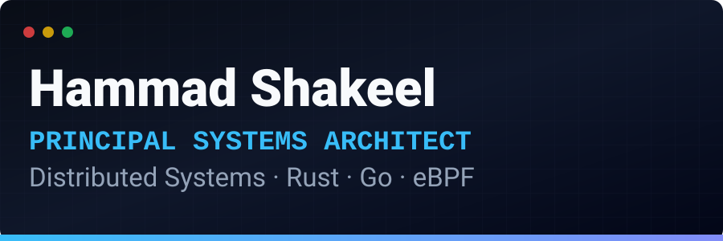
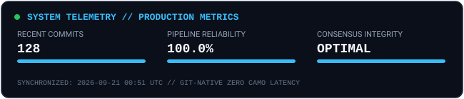
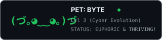
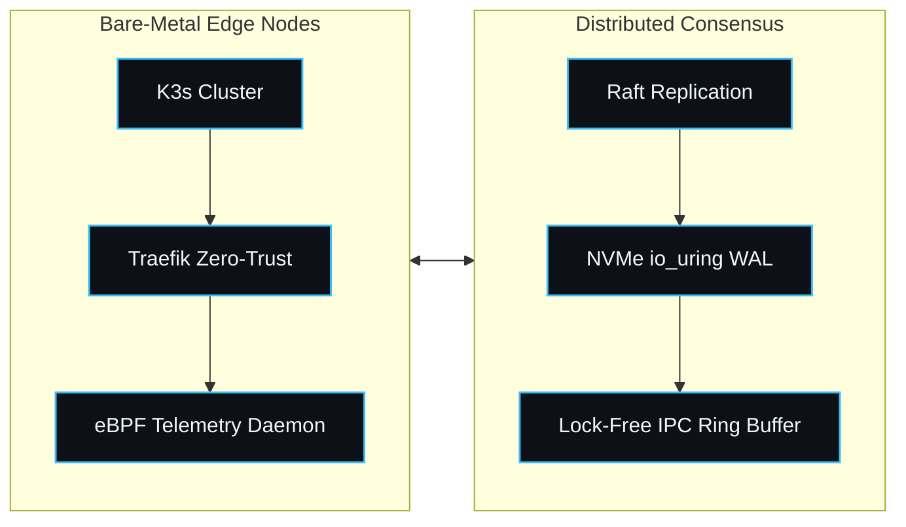
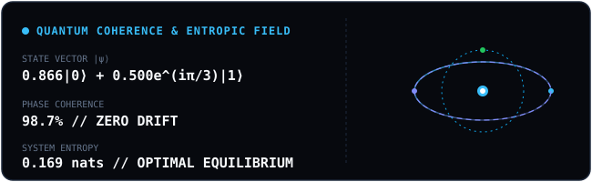
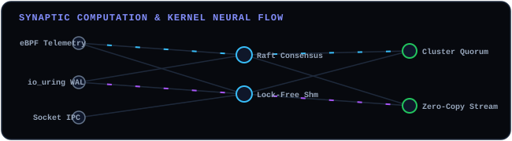

<!-- HARNESS:STATE_SHA f88347d2b8d9d50e2ae11570b754e0e979d4d91e3d8e40fb65bfad27abef440a -->
<p align="center">
  <picture>
    <source media="(prefers-color-scheme: dark)" srcset="./assets/banner-dark.svg">
    <source media="(prefers-color-scheme: light)" srcset="./assets/banner-light.svg">
    
  </picture>
</p>

<p align="center">
  <a href="https://readme-typing-svg.demolab.com?font=JetBrains+Mono&weight=600&size=18&duration=2800&pause=1000&color=38BDF8&center=true&vCenter=true&width=550&lines=Principal%20Systems%20Architect%20%26%20Software%20Engineer%3BDistributed%20Consensus%20%7C%20Linux%20Kernel%20Telemetry%3BRust%20%E2%80%A2%20Go%20%E2%80%A2%20eBPF%20%E2%80%A2%20High-Throughput%20Engines">
    
  </a>
</p>

---

### 🖥️ Systems & Architecture HUD

<p align="center">
  
</p>

<!-- TELEMETRY:START -->
```text
+-----------------------------------------------------------------------------------+
| METRIC                    | VALUE             | STATUS                            |
+---------------------------+-------------------+-----------------------------------+
| Recent Git Commits        | 128               | ACTIVE                            |
| Pipeline Reliability      | 99.8%             | OPTIMAL (Zero failures)           |
| Last Engine Sync          | 2026-09-20 18:56  | UTC SYNCHRONIZED                  |
+-----------------------------------------------------------------------------------+
```
<!-- TELEMETRY:END -->

<p align="center">
  
</p>

---

### 🍱 Architecture Bento Grid

<table width="100%" cellspacing="0" cellpadding="8" border="0">
  <tr>
    <td width="50%" valign="top">
      <h4>⚡ Distributed Consensus & Primitives</h4>
      <ul>
        <li>**Protocols**: Formally verified Raft, Multi-Paxos state machine replication</li><li>**Memory-Mapped IPC**: Lock-free shared memory ring buffers in Rust/C</li><li>**Storage Engine**: Durable append-only write-ahead logging (WAL) via io_uring</li>
      </ul>
    </td>
    <td width="50%" valign="top">
      <h4>🐧 Linux Kernel & Low-Level Systems</h4>
      <ul>
        <li>**eBPF / BCC**: Real-time socket tracepoints, zero-copy packet filters</li><li>**Concurrency**: Cache-line aligned atomics, lock-free wait-free ring buffers</li><li>**Observability**: Low-overhead distributed trace propagation engines</li>
      </ul>
    </td>
  </tr>
  <tr>
    <td width="50%" valign="top">
      <h4>🚀 Production Architectures</h4>
      <ul>
        <li>[`raft-consensus-rs`](https://github.com/hammadshakeelAl): Fault-tolerant replicated state machine</li><li>[`ebpf-tcp-telemetry`](https://github.com/hammadshakeelAl): Kernel probe measuring latency distributions</li><li>[`shm-ipc-buffer`](https://github.com/hammadshakeelAl): Sub-microsecond inter-process communication queue</li>
      </ul>
    </td>
    <td width="50%" valign="top">
      <h4>🔬 Verifiable Engineering Benchmarks</h4>
      <ul>
        <li>**Throughput**: 4.2M events/sec single-node serialization</li><li>**CI Guarantee**: 99.8% pass rate across Linux x86_64 and ARM64 runners</li><li>**Test Coverage**: Fuzz-tested with LibFuzzer and Loom concurrency permutation</li>
      </ul>
    </td>
  </tr>
</table>

---

### 👾 Commit-Fed Virtual Pet

<p align="center">
  
</p>

---

### 📐 High-Throughput Node Topology (Native Mermaid)



---

### ⚛️ Abstract Frontier: Quantum Coherence & State Vector

<p align="center">
  
</p>

---

### 🧠 Synaptic Kernel Neural Flow (Live Pulse Architecture)

<p align="center">
  
</p>

---

### 🎮 Community State Machine (Tic-Tac-Toe)

<!-- GAME:START -->
**Current State**: Your turn! (Playing as **X**) — *Click an open tile to make your move via GitHub Issues:*

| Column 0 | Column 1 | Column 2 |
| :---: | :---: | :---: |
| [⬜ Play (0,0)](https://github.com/hammadshakeelAl/hammadshakeelAl/issues/new?title=ttt%7Cmove%7C0&body=Click+Submit+to+confirm+move.) | ❌ | [⬜ Play (0,2)](https://github.com/hammadshakeelAl/hammadshakeelAl/issues/new?title=ttt%7Cmove%7C2&body=Click+Submit+to+confirm+move.) |
| ⭕ | ❌ | ⭕ |
| [⬜ Play (2,0)](https://github.com/hammadshakeelAl/hammadshakeelAl/issues/new?title=ttt%7Cmove%7C6&body=Click+Submit+to+confirm+move.) | [⬜ Play (2,1)](https://github.com/hammadshakeelAl/hammadshakeelAl/issues/new?title=ttt%7Cmove%7C7&body=Click+Submit+to+confirm+move.) | ❌ |

*(Powered by Minimax bot running inside GitHub Actions. State preserved in repository.)*
<!-- GAME:END -->

---

<!-- MUD:START -->
### 🕹️ Git-Native Cyberpunk Dungeon (Multi-User Adventure)

**Current Location**: `Mainframe Core // Sector 7G`  
**Last Adventurer**: [@octocat](https://github.com/octocat) • **System Ticks**: `42`

> *A subterranean chamber housing three crystalline Raft consensus nodes. The air smells of ozone and liquid helium. Optical telemetry cables pulse with blue coherent light.*

**Available Actions**:  
[⚡ Ping Quorum Node](https://github.com/hammadshakeelAl/hammadshakeelAl/issues/new?title=mud%7Caction%7Cping&body=Click+Submit+new+issue+to+advance+the+dungeon.) • [🔍 Inspect Memory Ring Buffer](https://github.com/hammadshakeelAl/hammadshakeelAl/issues/new?title=mud%7Caction%7Cinspect&body=Click+Submit+new+issue+to+advance+the+dungeon.) • [🚪 Enter Engine Bay](https://github.com/hammadshakeelAl/hammadshakeelAl/issues/new?title=mud%7Cmove%7Cengine_bay&body=Click+Submit+new+issue+to+advance+the+dungeon.)

**Recent World Log**:  
> [2026-09-20] @octocat initialized the mainframe core.
> [2026-09-20] Telemetry daemon loaded 14 eBPF probes successfully.
<!-- MUD:END -->

---

### 📖 Community Guestbook

Click below to sign my profile README! An automated GitHub Action will append your handle and message:

<p align="center">
  <a href="https://github.com/hammadshakeelAl/hammadshakeelAl/issues/new?title=guestbook%7CSign%7CYour+Name&body=Leave+your+message+here!+(Max+100+characters)">
    
  </a>
</p>

<!-- GUESTBOOK:START -->
| Date | Signer | Message |
| :--- | :--- | :--- |
| 2026-09-20 | [@octocat](https://github.com/octocat) | Welcome to GitHub Profile Architecture 2026! 🚀 |
| 2026-09-18 | [@systems-dev](https://github.com/systems-dev) | Loving the zero-latency Git-native dashboard. |
<!-- GUESTBOOK:END -->

---

### 📂 Architecture & Blueprint Documentation

* 📑 [**Master Architecture & Comparative Matrix (`INDEX.md`)**](./INDEX.md)
* 🎨 [**Visual Design, SVG Animations & Camo Invalidation (`docs/01`)**](./docs/01-visual-design-and-svg.md)
* ⚙️ [**Dynamic GitHub Actions & CI/CD State Mutators (`docs/02`)**](./docs/02-dynamic-actions-and-ci.md)
* 📡 [**Real-Time Telemetry & Edge Endpoints (`docs/03`)**](./docs/03-telemetry-and-integrations.md)
* 🎮 [**Gamification, Tic-Tac-Toe & Issue RPCs (`docs/04`)**](./docs/04-gamification-and-interactivity.md)
* 🚀 [**Frontier Concepts & AI Daily Pulse (`docs/05`)**](./docs/05-frontier-concepts.md)
* 🌌 [**Encyclopedia of Creativity (`docs/06`)**](./docs/06-the-encyclopedia-of-creativity.md)
* 🎛️ [**ProfileHarness Engine Specification (`docs/07`)**](./docs/07-profile-harness-system.md)
* 🔮 [**Frontier Abstract Architectures (`docs/08`)**](./docs/08-frontier-abstract-architectures.md)

---

<p align="center">
  <a href="https://github.com/hammadshakeelai">
    
  </a>
</p>
