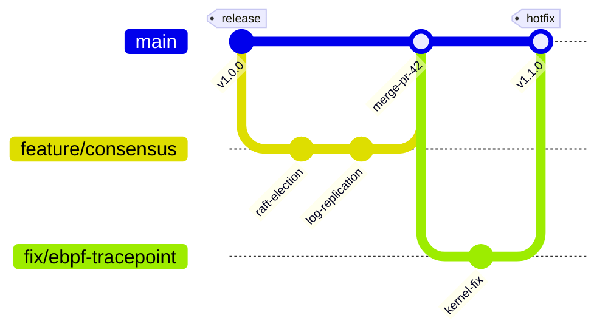
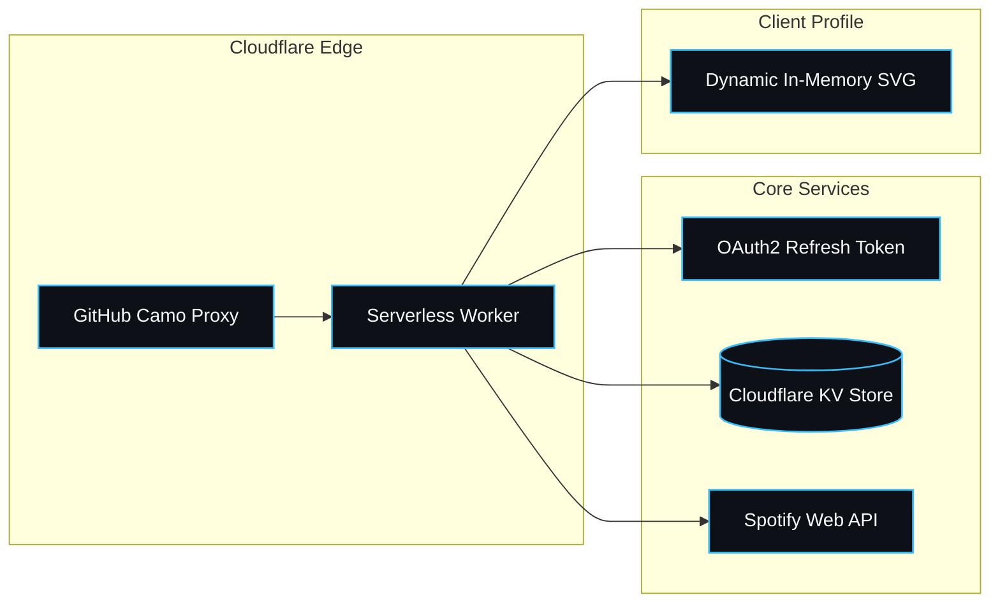
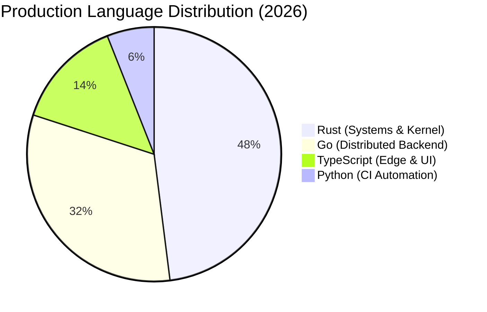
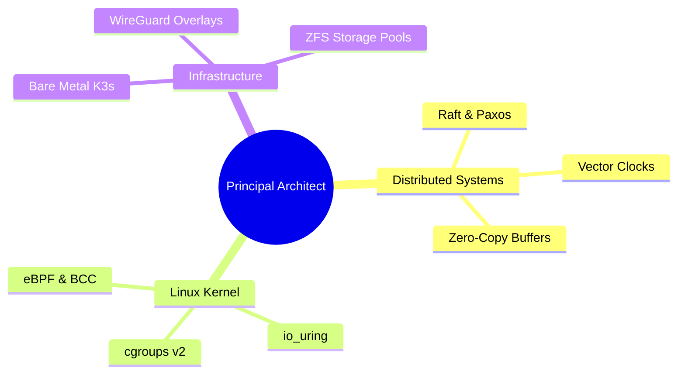

# The Encyclopedia of Creativity: Every Known Hack, Widget, & Edge Case for GitHub Profile READMEs

This document is the definitive master catalog of every creative, unconventional, interactive, and experimental technique discovered across the GitHub ecosystem.

---

## 1. Native HTML5 `<video>` Playback Hack

While GitHub Flavored Markdown restricts most media tags, GitHub permits native HTML5 `<video>` tags **if and only if** the asset is hosted on GitHub's internal attachment CDN (`user-attachments/assets`).

### The Exploitation Mechanism:
1. Open any Issue or Pull Request draft on GitHub.
2. Drag and drop an `.mp4` or `.webm` video file into the comment box.
3. GitHub uploads the video to its asset CDN and outputs a URL formatted as:
   `https://github.com/user-attachments/assets/5f8b9e12-3456-789a-bcde-f0123456789a`
4. Copy that URL and paste it directly into your `README.md`:

```html
<p align="center">
  <video src="https://github.com/user-attachments/assets/5f8b9e12-3456-789a-bcde-f0123456789a" controls="controls" muted="muted" width="100%" poster="https://raw.githubusercontent.com/username/username/main/assets/banner-dark.svg">
    Your browser does not support the video element.
  </video>
</p>
```

> **Engineering Tip**: Encode your video using standard **H.264 video with AAC audio** to guarantee hardware acceleration across macOS Safari, iOS Mobile, Chrome, and Firefox.

---

## 2. Native Mermaid.js Diagrams & Dynamic Visualizations

GitHub natively renders Mermaid.js code blocks directly within READMEs without any external image rendering or proxy requirements. This can be used to showcase system architectures, interactive user journeys, and live Git graphs.

### A. Git Branch History (`gitGraph`)
Visualize your open-source workflow or project lifecycle:

````markdown

````

### B. Core Architectural Flowchart (`flowchart TD`)
Showcase microservices or data flow:

````markdown

````

### C. Language Breakdown Pie Chart (`pie`)
````markdown

````

### D. Architectural Mindmap (`mindmap`)
````markdown

````

---

## 3. KaTeX LaTeX Math Art & Formula Aesthetics

GitHub natively parses math equations using MathJax/KaTeX via inline `$math$` or display block `$$math$$`. Beyond theoretical mathematics, you can construct matrices, geometric state arrays, and circuit formulas:

### A. System State Transition Matrix
```markdown
$$\mathbf{P}_{\text{consensus}} = \begin{pmatrix} 
1 - \epsilon & \epsilon & 0 \\
\frac{1}{2}\mu & 1 - \mu & \frac{1}{2}\mu \\
0 & \delta & 1 - \delta 
\end{pmatrix} \quad \text{where } \lim_{t \to \infty} \mathbf{P}^t = \mathbf{\pi}_{\text{stable}}$$
```

### B. Computational Complexity Specs
```markdown
$$\mathcal{O}(1) \text{ amortized latency} \iff \forall k \in \text{RingBuffer}, \quad \text{idx}_{\text{head}} \equiv \text{idx}_{\text{tail}} + 1 \pmod{2^N}$$
```

---

## 4. The Complete Playable Games Catalog (Issue RPCs)

### A. Connect Four
* **Mechanic**: 7 columns clickable via issue links (`issues/new?title=c4|drop|col=3`).
* **State Engine**: 6x7 grid matrix stored in `data/c4-state.json`.
* **Rendering**: Unicode color circles (🔴 Red = Player, 🟡 Yellow = CPU/Bot, ⚪ Empty).

### B. Wordle in Profile
* **Mechanic**: 5-letter word puzzle. Visitors guess by opening an issue with title `wordle|guess|CRANE`.
* **State Engine**: Checks dictionary validity, compares against daily target word, renders tiles:
  * 🟩 Green: Correct letter & position
  * 🟨 Yellow: Correct letter, wrong position
  * ⬛ Gray: Letter not in word
* **Leaderboard**: Automatically updates a top-guessers table in `README.md`.

### C. Conway's Game of Life
* **Dynamic Simulation**: Daily cron computes the next generation ($t+1$) of Conway's cellular automaton based on Moore neighborhoods:
  * Any live cell with 2–3 live neighbors survives.
  * Any dead cell with exactly 3 live neighbors becomes a live cell.
* **Rendering**: High-density grid rendered via markdown table or animated SVG committed to `assets/life.svg`.

### D. The Commit-Fed Virtual Pet (Tamagotchi / Commitchi)
* **Mechanic**: A pet lives in your profile.
* **Telemetry Input**: Queries your public commit history over the last 7 days.
* **State Transitions**:
  * **Hunger**: Increases by 1 every 12 hours without a commit. If you commit, hunger resets to 0.
  * **Mood**: 
    * `>= 5 commits/week`: `(づ｡◕‿‿◕｡)づ` — *Euphoric & Thriving!* (Level 3 Evolution)
    * `1-4 commits/week`: `(•‿•)` — *Healthy & Content.* (Level 2 Evolution)
    * `0 commits/week`: `(╯°□°)╯` — *Starving for Code!* (Needs commits!)

### E. Pokémon Encounter & Catching Engine
* **Mechanic**: A wild Pokémon appears in your profile README.
* **Interactions**:
  * `[🔴 Throw Pokéball](issues/new?title=pokemon|catch|pikachu)`
  * `[🏃 Run Away](issues/new?title=pokemon|flee)`
* **Reward**: On catch success, the visitor's GitHub handle is added to your README's "Hall of Pokémon Masters".

---

## 5. Lifestyle, Gaming & Social Telemetry Catalog

| Platform | Integration Method | Capabilities | Popular Public Engine |
| :--- | :--- | :--- | :--- |
| **Discord** | Lanyard API (`api.lanyard.rest`) | Real-time Discord status, active voice channel, rich presence game | `lanyard.cnrad.dev` / Custom Worker |
| **Spotify** | Spotify Web API (OAuth2) | Live playing track, progress bar, audio equalizer animation | Cloudflare Worker / `novatorem/novatorem` |
| **Steam** | Steam Web API | Currently played game, total playtime (last 2 weeks), Steam level | `steam-card` / Custom SVG |
| **Strava** | Strava v3 API (OAuth2) | Weekly running distance (km), cycling elevation, pace averages | `yihong0618/running_page` |
| **LeetCode** | LeetCode GraphQL API | Solved problems count (Easy/Med/Hard), global ranking percentile | `leetcard.jacoblin.cool` |
| **Chess.com** | Chess.com Public API | Live Blitz, Rapid, Bullet ratings, current win streak | `chess-readme` / Custom Badges |
| **Duolingo** | Duolingo API | Daily streak flame icon, target languages, total XP | `duolingo-readme-badge` |
| **Weather/Moon** | `wttr.in` | Local temperature, weather condition icon, moon phase | `wttr.in/:city?format=...` |

---

## 6. Contribution Graph Metamorphosis

### A. Platane/snk (The Snake Eater)
Generates an animated SVG of a snake that navigates through your green contribution squares, eating each commit dot:
```yaml
- uses: Platane/snk@v3
  with:
    github_user_name: ${{ github.repository_owner }}
    outputs: |
      assets/github-contribution-grid-snake.svg
      assets/github-contribution-grid-snake-dark.svg?palette=github-dark
```

### B. 3D Isometric Voxel Blocks (`yoshi389111/github-profile-3d-contrib`)
Converts your flat 2D commit grid into an isometric 3D landscape of towering hexagonal or cubic pillars, shaded according to commit frequency.

### C. Git Bonsai
A procedural pixel-art bonsai tree where:
* Trunk thickness = Total account age and lifetime commits.
* Leaf foliage density = Commits in the last 30 days.
* Flowers / Blossom = Active pull request review ratio.

---

## 7. Secret GitHub Profile Achievements & Hidden Badges

GitHub features a set of official profile achievements that appear in your profile sidebar. You can also showcase them explicitly in your README with official SVG badges:

| Achievement | Tier Criteria | Visual Badge |
| :--- | :--- | :--- |
| **Pull Shark** | Merged PRs (Bronze: 2, Silver: 16, Gold: 128, Diamond: 1024) | 🦈 Shark with surfboard |
| **Galaxy Brain** | Accepted answers in Discussions (Bronze: 2, Silver: 8, Gold: 16, Diamond: 32) | 🧠 Glowing cosmic brain |
| **YOLO** | Merged a pull request without code review | 🦹 Superhero mask / party horn |
| **Quickdraw** | Closed an issue or PR within 5 minutes of opening | ⚡ Western revolver / quick draw |
| **Pair Extraordinaire** | Co-authored commits in a merged pull request | 👯 Dual astronaut helmets |
| **Starstruck** | Created a repository that reached 16+ stars | 🌟 Golden star |
| **Public Sponsor** | Sponsored an open source creator via GitHub Sponsors | 💖 Heart sponsor badge |
| **Arctic Code Vault Contributor** | Contributed code preserved in the Svalbard Arctic World Archive | ❄️ Arctic vault emblem |
| **Mars 2020 Contributor** | Authored dependencies used in NASA's Mars Ingenuity Helicopter | 🚀 Mars helicopter badge |

---

## 8. Retro UI & Aesthetic Window Chrome (Windows 95, Mac OS 9, Cyberpunk)

By structuring HTML `<table>` elements and pure SVG headers, you can transform your profile into a vintage OS desktop:

```html
<!-- Retro Windows 95 Dialog Box -->
<table border="1" cellpadding="0" cellspacing="0" bgcolor="#c0c0c0" style="border: 2px outset #ffffff;">
  <tr bgcolor="#000080">
    <td style="padding: 4px; font-family: 'MS Sans Serif', Tahoma, sans-serif; font-size: 11px; font-weight: bold; color: #ffffff;">
      &nbsp;💾 System Information - ARCH-KERNEL-PROBE.EXE
    </td>
    <td align="right" style="padding: 2px;">
      <kbd>_</kbd> <kbd>X</kbd>
    </td>
  </tr>
  <tr>
    <td colspan="2" style="padding: 12px; font-family: 'Courier New', monospace; font-size: 12px; color: #000000;">
      <b>C:\SYSTEM32&gt;</b> KERNEL_INITIALIZED: 0x80041000<br>
      <b>MEMORY STATUS :</b> 262,144 MB ECC OK<br>
      <b>ACTIVE THREADS:</b> 128 HARDWARE CONCURRENCY UNITS<br>
      <b>SYSTEM STATE  :</b> QUORUM ACHIEVED // 0 NETWORK PARTITIONS<br>
    </td>
  </tr>
</table>
```

---

## 9. Zero-Database State Persistence in HTML Comments

Instead of relying on Cloudflare KV, Redis, or external databases, you can persist full state machines directly inside hidden HTML comments in `README.md`:

```markdown
<!-- PERSISTED_STATE:START -->
<!-- {
  "virtual_pet": { "name": "Byte", "hunger": 0, "xp": 1420, "level": 4 },
  "game_leaderboard": [
    { "user": "octocat", "score": 980 },
    { "user": "torvalds", "score": 850 }
  ]
} -->
<!-- PERSISTED_STATE:END -->
```

A Python GitHub Action can extract this JSON object with a single regex, manipulate the dictionary in memory, and serialize it back into the comment block during the same commit that updates the visual markdown table.
