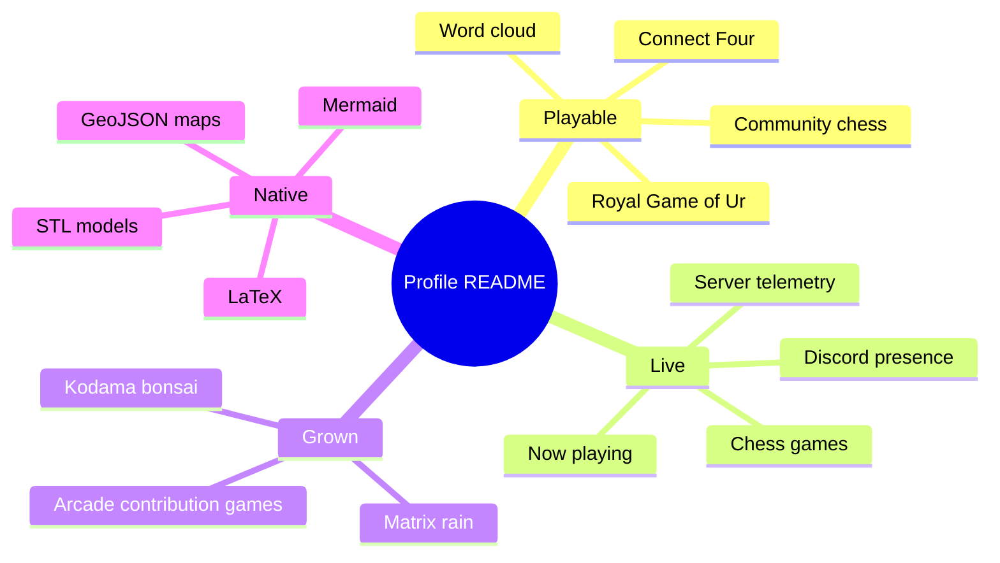
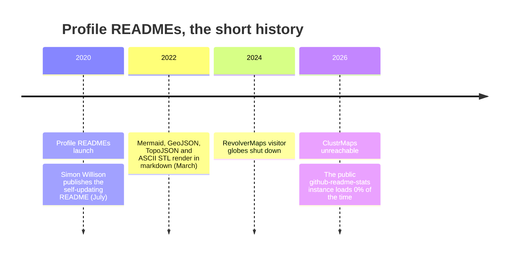
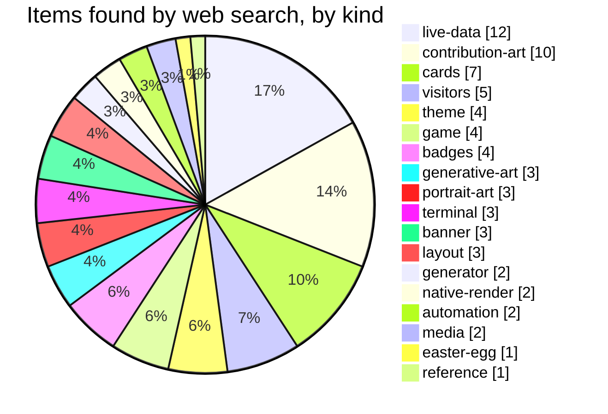

# 4 · What GitHub renders that almost nobody uses

Everything on this page is **native** — plain text in a markdown file that GitHub
itself turns into a map, a 3D model, a diagram or typeset maths. No image, no
service, nothing to go down. Code search found each of these on only a handful of
profiles ([chapter 2](02-curiosities.md#things-github-renders-that-almost-nobody-uses)).

Each exhibit below was checked on github.com after publishing; the results are
at the [bottom of the page](#verified).

---

## An interactive 3D model

GitHub renders an ASCII STL inside a ```` ```stl ```` fence as a model you can
spin and zoom. This one is built from real data: the last 24 months of repository
activity on [@hammadshakeelai](https://github.com/hammadshakeelai), one tower per
month, a row per year (the older year at the back) — the same numbers as the
showcase heatmap, as a city.

```stl
solid skyline
  facet normal 0 -1 0
    outer loop
      vertex -1.50 0.00 1.50
      vertex 36.50 0.00 -10.50
      vertex 36.50 0.00 1.50
    endloop
  endfacet
  facet normal 0 -1 0
    outer loop
      vertex -1.50 0.00 1.50
      vertex -1.50 0.00 -10.50
      vertex 36.50 0.00 -10.50
    endloop
  endfacet
  facet normal 0 1 0
    outer loop
      vertex -1.50 0.80 1.50
      vertex 36.50 0.80 1.50
      vertex 36.50 0.80 -10.50
    endloop
  endfacet
  facet normal 0 1 0
    outer loop
      vertex -1.50 0.80 1.50
      vertex 36.50 0.80 -10.50
      vertex -1.50 0.80 -10.50
    endloop
  endfacet
  facet normal 0 0 1
    outer loop
      vertex -1.50 0.00 1.50
      vertex 36.50 0.00 1.50
      vertex 36.50 0.80 1.50
    endloop
  endfacet
  facet normal 0 0 1
    outer loop
      vertex -1.50 0.00 1.50
      vertex 36.50 0.80 1.50
      vertex -1.50 0.80 1.50
    endloop
  endfacet
  facet normal 0 0 -1
    outer loop
      vertex 36.50 0.00 -10.50
      vertex -1.50 0.00 -10.50
      vertex -1.50 0.80 -10.50
    endloop
  endfacet
  facet normal 0 0 -1
    outer loop
      vertex 36.50 0.00 -10.50
      vertex -1.50 0.80 -10.50
      vertex 36.50 0.80 -10.50
    endloop
  endfacet
  facet normal 1 0 0
    outer loop
      vertex 36.50 0.00 1.50
      vertex 36.50 0.00 -10.50
      vertex 36.50 0.80 -10.50
    endloop
  endfacet
  facet normal 1 0 0
    outer loop
      vertex 36.50 0.00 1.50
      vertex 36.50 0.80 -10.50
      vertex 36.50 0.80 1.50
    endloop
  endfacet
  facet normal -1 0 0
    outer loop
      vertex -1.50 0.00 1.50
      vertex -1.50 0.80 1.50
      vertex -1.50 0.80 -10.50
    endloop
  endfacet
  facet normal -1 0 0
    outer loop
      vertex -1.50 0.00 1.50
      vertex -1.50 0.80 -10.50
      vertex -1.50 0.00 -10.50
    endloop
  endfacet
  facet normal 0 -1 0
    outer loop
      vertex 0.00 0.80 -5.00
      vertex 2.20 0.80 -8.40
      vertex 2.20 0.80 -5.00
    endloop
  endfacet
  facet normal 0 -1 0
    outer loop
      vertex 0.00 0.80 -5.00
      vertex 0.00 0.80 -8.40
      vertex 2.20 0.80 -8.40
    endloop
  endfacet
  facet normal 0 1 0
    outer loop
      vertex 0.00 0.80 -5.00
      vertex 2.20 0.80 -5.00
      vertex 2.20 0.80 -8.40
    endloop
  endfacet
  facet normal 0 1 0
    outer loop
      vertex 0.00 0.80 -5.00
      vertex 2.20 0.80 -8.40
      vertex 0.00 0.80 -8.40
    endloop
  endfacet
  facet normal 0 0 1
    outer loop
      vertex 0.00 0.80 -5.00
      vertex 2.20 0.80 -5.00
      vertex 2.20 0.80 -5.00
    endloop
  endfacet
  facet normal 0 0 1
    outer loop
      vertex 0.00 0.80 -5.00
      vertex 2.20 0.80 -5.00
      vertex 0.00 0.80 -5.00
    endloop
  endfacet
  facet normal 0 0 -1
    outer loop
      vertex 2.20 0.80 -8.40
      vertex 0.00 0.80 -8.40
      vertex 0.00 0.80 -8.40
    endloop
  endfacet
  facet normal 0 0 -1
    outer loop
      vertex 2.20 0.80 -8.40
      vertex 0.00 0.80 -8.40
      vertex 2.20 0.80 -8.40
    endloop
  endfacet
  facet normal 1 0 0
    outer loop
      vertex 2.20 0.80 -5.00
      vertex 2.20 0.80 -8.40
      vertex 2.20 0.80 -8.40
    endloop
  endfacet
  facet normal 1 0 0
    outer loop
      vertex 2.20 0.80 -5.00
      vertex 2.20 0.80 -8.40
      vertex 2.20 0.80 -5.00
    endloop
  endfacet
  facet normal -1 0 0
    outer loop
      vertex 0.00 0.80 -5.00
      vertex 0.00 0.80 -5.00
      vertex 0.00 0.80 -8.40
    endloop
  endfacet
  facet normal -1 0 0
    outer loop
      vertex 0.00 0.80 -5.00
      vertex 0.00 0.80 -8.40
      vertex 0.00 0.80 -8.40
    endloop
  endfacet
  facet normal 0 -1 0
    outer loop
      vertex 3.00 0.80 -5.00
      vertex 5.20 0.80 -8.40
      vertex 5.20 0.80 -5.00
    endloop
  endfacet
  facet normal 0 -1 0
    outer loop
      vertex 3.00 0.80 -5.00
      vertex 3.00 0.80 -8.40
      vertex 5.20 0.80 -8.40
    endloop
  endfacet
  facet normal 0 1 0
    outer loop
      vertex 3.00 0.80 -5.00
      vertex 5.20 0.80 -5.00
      vertex 5.20 0.80 -8.40
    endloop
  endfacet
  facet normal 0 1 0
    outer loop
      vertex 3.00 0.80 -5.00
      vertex 5.20 0.80 -8.40
      vertex 3.00 0.80 -8.40
    endloop
  endfacet
  facet normal 0 0 1
    outer loop
      vertex 3.00 0.80 -5.00
      vertex 5.20 0.80 -5.00
      vertex 5.20 0.80 -5.00
    endloop
  endfacet
  facet normal 0 0 1
    outer loop
      vertex 3.00 0.80 -5.00
      vertex 5.20 0.80 -5.00
      vertex 3.00 0.80 -5.00
    endloop
  endfacet
  facet normal 0 0 -1
    outer loop
      vertex 5.20 0.80 -8.40
      vertex 3.00 0.80 -8.40
      vertex 3.00 0.80 -8.40
    endloop
  endfacet
  facet normal 0 0 -1
    outer loop
      vertex 5.20 0.80 -8.40
      vertex 3.00 0.80 -8.40
      vertex 5.20 0.80 -8.40
    endloop
  endfacet
  facet normal 1 0 0
    outer loop
      vertex 5.20 0.80 -5.00
      vertex 5.20 0.80 -8.40
      vertex 5.20 0.80 -8.40
    endloop
  endfacet
  facet normal 1 0 0
    outer loop
      vertex 5.20 0.80 -5.00
      vertex 5.20 0.80 -8.40
      vertex 5.20 0.80 -5.00
    endloop
  endfacet
  facet normal -1 0 0
    outer loop
      vertex 3.00 0.80 -5.00
      vertex 3.00 0.80 -5.00
      vertex 3.00 0.80 -8.40
    endloop
  endfacet
  facet normal -1 0 0
    outer loop
      vertex 3.00 0.80 -5.00
      vertex 3.00 0.80 -8.40
      vertex 3.00 0.80 -8.40
    endloop
  endfacet
  facet normal 0 -1 0
    outer loop
      vertex 6.00 0.80 -5.00
      vertex 8.20 0.80 -8.40
      vertex 8.20 0.80 -5.00
    endloop
  endfacet
  facet normal 0 -1 0
    outer loop
      vertex 6.00 0.80 -5.00
      vertex 6.00 0.80 -8.40
      vertex 8.20 0.80 -8.40
    endloop
  endfacet
  facet normal 0 1 0
    outer loop
      vertex 6.00 0.80 -5.00
      vertex 8.20 0.80 -5.00
      vertex 8.20 0.80 -8.40
    endloop
  endfacet
  facet normal 0 1 0
    outer loop
      vertex 6.00 0.80 -5.00
      vertex 8.20 0.80 -8.40
      vertex 6.00 0.80 -8.40
    endloop
  endfacet
  facet normal 0 0 1
    outer loop
      vertex 6.00 0.80 -5.00
      vertex 8.20 0.80 -5.00
      vertex 8.20 0.80 -5.00
    endloop
  endfacet
  facet normal 0 0 1
    outer loop
      vertex 6.00 0.80 -5.00
      vertex 8.20 0.80 -5.00
      vertex 6.00 0.80 -5.00
    endloop
  endfacet
  facet normal 0 0 -1
    outer loop
      vertex 8.20 0.80 -8.40
      vertex 6.00 0.80 -8.40
      vertex 6.00 0.80 -8.40
    endloop
  endfacet
  facet normal 0 0 -1
    outer loop
      vertex 8.20 0.80 -8.40
      vertex 6.00 0.80 -8.40
      vertex 8.20 0.80 -8.40
    endloop
  endfacet
  facet normal 1 0 0
    outer loop
      vertex 8.20 0.80 -5.00
      vertex 8.20 0.80 -8.40
      vertex 8.20 0.80 -8.40
    endloop
  endfacet
  facet normal 1 0 0
    outer loop
      vertex 8.20 0.80 -5.00
      vertex 8.20 0.80 -8.40
      vertex 8.20 0.80 -5.00
    endloop
  endfacet
  facet normal -1 0 0
    outer loop
      vertex 6.00 0.80 -5.00
      vertex 6.00 0.80 -5.00
      vertex 6.00 0.80 -8.40
    endloop
  endfacet
  facet normal -1 0 0
    outer loop
      vertex 6.00 0.80 -5.00
      vertex 6.00 0.80 -8.40
      vertex 6.00 0.80 -8.40
    endloop
  endfacet
  facet normal 0 -1 0
    outer loop
      vertex 9.00 0.80 -5.00
      vertex 11.20 0.80 -8.40
      vertex 11.20 0.80 -5.00
    endloop
  endfacet
  facet normal 0 -1 0
    outer loop
      vertex 9.00 0.80 -5.00
      vertex 9.00 0.80 -8.40
      vertex 11.20 0.80 -8.40
    endloop
  endfacet
  facet normal 0 1 0
    outer loop
      vertex 9.00 0.80 -5.00
      vertex 11.20 0.80 -5.00
      vertex 11.20 0.80 -8.40
    endloop
  endfacet
  facet normal 0 1 0
    outer loop
      vertex 9.00 0.80 -5.00
      vertex 11.20 0.80 -8.40
      vertex 9.00 0.80 -8.40
    endloop
  endfacet
  facet normal 0 0 1
    outer loop
      vertex 9.00 0.80 -5.00
      vertex 11.20 0.80 -5.00
      vertex 11.20 0.80 -5.00
    endloop
  endfacet
  facet normal 0 0 1
    outer loop
      vertex 9.00 0.80 -5.00
      vertex 11.20 0.80 -5.00
      vertex 9.00 0.80 -5.00
    endloop
  endfacet
  facet normal 0 0 -1
    outer loop
      vertex 11.20 0.80 -8.40
      vertex 9.00 0.80 -8.40
      vertex 9.00 0.80 -8.40
    endloop
  endfacet
  facet normal 0 0 -1
    outer loop
      vertex 11.20 0.80 -8.40
      vertex 9.00 0.80 -8.40
      vertex 11.20 0.80 -8.40
    endloop
  endfacet
  facet normal 1 0 0
    outer loop
      vertex 11.20 0.80 -5.00
      vertex 11.20 0.80 -8.40
      vertex 11.20 0.80 -8.40
    endloop
  endfacet
  facet normal 1 0 0
    outer loop
      vertex 11.20 0.80 -5.00
      vertex 11.20 0.80 -8.40
      vertex 11.20 0.80 -5.00
    endloop
  endfacet
  facet normal -1 0 0
    outer loop
      vertex 9.00 0.80 -5.00
      vertex 9.00 0.80 -5.00
      vertex 9.00 0.80 -8.40
    endloop
  endfacet
  facet normal -1 0 0
    outer loop
      vertex 9.00 0.80 -5.00
      vertex 9.00 0.80 -8.40
      vertex 9.00 0.80 -8.40
    endloop
  endfacet
  facet normal 0 -1 0
    outer loop
      vertex 12.00 0.80 -5.00
      vertex 14.20 0.80 -8.40
      vertex 14.20 0.80 -5.00
    endloop
  endfacet
  facet normal 0 -1 0
    outer loop
      vertex 12.00 0.80 -5.00
      vertex 12.00 0.80 -8.40
      vertex 14.20 0.80 -8.40
    endloop
  endfacet
  facet normal 0 1 0
    outer loop
      vertex 12.00 0.80 -5.00
      vertex 14.20 0.80 -5.00
      vertex 14.20 0.80 -8.40
    endloop
  endfacet
  facet normal 0 1 0
    outer loop
      vertex 12.00 0.80 -5.00
      vertex 14.20 0.80 -8.40
      vertex 12.00 0.80 -8.40
    endloop
  endfacet
  facet normal 0 0 1
    outer loop
      vertex 12.00 0.80 -5.00
      vertex 14.20 0.80 -5.00
      vertex 14.20 0.80 -5.00
    endloop
  endfacet
  facet normal 0 0 1
    outer loop
      vertex 12.00 0.80 -5.00
      vertex 14.20 0.80 -5.00
      vertex 12.00 0.80 -5.00
    endloop
  endfacet
  facet normal 0 0 -1
    outer loop
      vertex 14.20 0.80 -8.40
      vertex 12.00 0.80 -8.40
      vertex 12.00 0.80 -8.40
    endloop
  endfacet
  facet normal 0 0 -1
    outer loop
      vertex 14.20 0.80 -8.40
      vertex 12.00 0.80 -8.40
      vertex 14.20 0.80 -8.40
    endloop
  endfacet
  facet normal 1 0 0
    outer loop
      vertex 14.20 0.80 -5.00
      vertex 14.20 0.80 -8.40
      vertex 14.20 0.80 -8.40
    endloop
  endfacet
  facet normal 1 0 0
    outer loop
      vertex 14.20 0.80 -5.00
      vertex 14.20 0.80 -8.40
      vertex 14.20 0.80 -5.00
    endloop
  endfacet
  facet normal -1 0 0
    outer loop
      vertex 12.00 0.80 -5.00
      vertex 12.00 0.80 -5.00
      vertex 12.00 0.80 -8.40
    endloop
  endfacet
  facet normal -1 0 0
    outer loop
      vertex 12.00 0.80 -5.00
      vertex 12.00 0.80 -8.40
      vertex 12.00 0.80 -8.40
    endloop
  endfacet
  facet normal 0 -1 0
    outer loop
      vertex 15.00 0.80 -5.00
      vertex 17.20 0.80 -8.40
      vertex 17.20 0.80 -5.00
    endloop
  endfacet
  facet normal 0 -1 0
    outer loop
      vertex 15.00 0.80 -5.00
      vertex 15.00 0.80 -8.40
      vertex 17.20 0.80 -8.40
    endloop
  endfacet
  facet normal 0 1 0
    outer loop
      vertex 15.00 0.80 -5.00
      vertex 17.20 0.80 -5.00
      vertex 17.20 0.80 -8.40
    endloop
  endfacet
  facet normal 0 1 0
    outer loop
      vertex 15.00 0.80 -5.00
      vertex 17.20 0.80 -8.40
      vertex 15.00 0.80 -8.40
    endloop
  endfacet
  facet normal 0 0 1
    outer loop
      vertex 15.00 0.80 -5.00
      vertex 17.20 0.80 -5.00
      vertex 17.20 0.80 -5.00
    endloop
  endfacet
  facet normal 0 0 1
    outer loop
      vertex 15.00 0.80 -5.00
      vertex 17.20 0.80 -5.00
      vertex 15.00 0.80 -5.00
    endloop
  endfacet
  facet normal 0 0 -1
    outer loop
      vertex 17.20 0.80 -8.40
      vertex 15.00 0.80 -8.40
      vertex 15.00 0.80 -8.40
    endloop
  endfacet
  facet normal 0 0 -1
    outer loop
      vertex 17.20 0.80 -8.40
      vertex 15.00 0.80 -8.40
      vertex 17.20 0.80 -8.40
    endloop
  endfacet
  facet normal 1 0 0
    outer loop
      vertex 17.20 0.80 -5.00
      vertex 17.20 0.80 -8.40
      vertex 17.20 0.80 -8.40
    endloop
  endfacet
  facet normal 1 0 0
    outer loop
      vertex 17.20 0.80 -5.00
      vertex 17.20 0.80 -8.40
      vertex 17.20 0.80 -5.00
    endloop
  endfacet
  facet normal -1 0 0
    outer loop
      vertex 15.00 0.80 -5.00
      vertex 15.00 0.80 -5.00
      vertex 15.00 0.80 -8.40
    endloop
  endfacet
  facet normal -1 0 0
    outer loop
      vertex 15.00 0.80 -5.00
      vertex 15.00 0.80 -8.40
      vertex 15.00 0.80 -8.40
    endloop
  endfacet
  facet normal 0 -1 0
    outer loop
      vertex 18.00 0.80 -5.00
      vertex 20.20 0.80 -8.40
      vertex 20.20 0.80 -5.00
    endloop
  endfacet
  facet normal 0 -1 0
    outer loop
      vertex 18.00 0.80 -5.00
      vertex 18.00 0.80 -8.40
      vertex 20.20 0.80 -8.40
    endloop
  endfacet
  facet normal 0 1 0
    outer loop
      vertex 18.00 0.80 -5.00
      vertex 20.20 0.80 -5.00
      vertex 20.20 0.80 -8.40
    endloop
  endfacet
  facet normal 0 1 0
    outer loop
      vertex 18.00 0.80 -5.00
      vertex 20.20 0.80 -8.40
      vertex 18.00 0.80 -8.40
    endloop
  endfacet
  facet normal 0 0 1
    outer loop
      vertex 18.00 0.80 -5.00
      vertex 20.20 0.80 -5.00
      vertex 20.20 0.80 -5.00
    endloop
  endfacet
  facet normal 0 0 1
    outer loop
      vertex 18.00 0.80 -5.00
      vertex 20.20 0.80 -5.00
      vertex 18.00 0.80 -5.00
    endloop
  endfacet
  facet normal 0 0 -1
    outer loop
      vertex 20.20 0.80 -8.40
      vertex 18.00 0.80 -8.40
      vertex 18.00 0.80 -8.40
    endloop
  endfacet
  facet normal 0 0 -1
    outer loop
      vertex 20.20 0.80 -8.40
      vertex 18.00 0.80 -8.40
      vertex 20.20 0.80 -8.40
    endloop
  endfacet
  facet normal 1 0 0
    outer loop
      vertex 20.20 0.80 -5.00
      vertex 20.20 0.80 -8.40
      vertex 20.20 0.80 -8.40
    endloop
  endfacet
  facet normal 1 0 0
    outer loop
      vertex 20.20 0.80 -5.00
      vertex 20.20 0.80 -8.40
      vertex 20.20 0.80 -5.00
    endloop
  endfacet
  facet normal -1 0 0
    outer loop
      vertex 18.00 0.80 -5.00
      vertex 18.00 0.80 -5.00
      vertex 18.00 0.80 -8.40
    endloop
  endfacet
  facet normal -1 0 0
    outer loop
      vertex 18.00 0.80 -5.00
      vertex 18.00 0.80 -8.40
      vertex 18.00 0.80 -8.40
    endloop
  endfacet
  facet normal 0 -1 0
    outer loop
      vertex 21.00 0.80 -5.00
      vertex 23.20 0.80 -8.40
      vertex 23.20 0.80 -5.00
    endloop
  endfacet
  facet normal 0 -1 0
    outer loop
      vertex 21.00 0.80 -5.00
      vertex 21.00 0.80 -8.40
      vertex 23.20 0.80 -8.40
    endloop
  endfacet
  facet normal 0 1 0
    outer loop
      vertex 21.00 2.40 -5.00
      vertex 23.20 2.40 -5.00
      vertex 23.20 2.40 -8.40
    endloop
  endfacet
  facet normal 0 1 0
    outer loop
      vertex 21.00 2.40 -5.00
      vertex 23.20 2.40 -8.40
      vertex 21.00 2.40 -8.40
    endloop
  endfacet
  facet normal 0 0 1
    outer loop
      vertex 21.00 0.80 -5.00
      vertex 23.20 0.80 -5.00
      vertex 23.20 2.40 -5.00
    endloop
  endfacet
  facet normal 0 0 1
    outer loop
      vertex 21.00 0.80 -5.00
      vertex 23.20 2.40 -5.00
      vertex 21.00 2.40 -5.00
    endloop
  endfacet
  facet normal 0 0 -1
    outer loop
      vertex 23.20 0.80 -8.40
      vertex 21.00 0.80 -8.40
      vertex 21.00 2.40 -8.40
    endloop
  endfacet
  facet normal 0 0 -1
    outer loop
      vertex 23.20 0.80 -8.40
      vertex 21.00 2.40 -8.40
      vertex 23.20 2.40 -8.40
    endloop
  endfacet
  facet normal 1 0 0
    outer loop
      vertex 23.20 0.80 -5.00
      vertex 23.20 0.80 -8.40
      vertex 23.20 2.40 -8.40
    endloop
  endfacet
  facet normal 1 0 0
    outer loop
      vertex 23.20 0.80 -5.00
      vertex 23.20 2.40 -8.40
      vertex 23.20 2.40 -5.00
    endloop
  endfacet
  facet normal -1 0 0
    outer loop
      vertex 21.00 0.80 -5.00
      vertex 21.00 2.40 -5.00
      vertex 21.00 2.40 -8.40
    endloop
  endfacet
  facet normal -1 0 0
    outer loop
      vertex 21.00 0.80 -5.00
      vertex 21.00 2.40 -8.40
      vertex 21.00 0.80 -8.40
    endloop
  endfacet
  facet normal 0 -1 0
    outer loop
      vertex 24.00 0.80 -5.00
      vertex 26.20 0.80 -8.40
      vertex 26.20 0.80 -5.00
    endloop
  endfacet
  facet normal 0 -1 0
    outer loop
      vertex 24.00 0.80 -5.00
      vertex 24.00 0.80 -8.40
      vertex 26.20 0.80 -8.40
    endloop
  endfacet
  facet normal 0 1 0
    outer loop
      vertex 24.00 0.80 -5.00
      vertex 26.20 0.80 -5.00
      vertex 26.20 0.80 -8.40
    endloop
  endfacet
  facet normal 0 1 0
    outer loop
      vertex 24.00 0.80 -5.00
      vertex 26.20 0.80 -8.40
      vertex 24.00 0.80 -8.40
    endloop
  endfacet
  facet normal 0 0 1
    outer loop
      vertex 24.00 0.80 -5.00
      vertex 26.20 0.80 -5.00
      vertex 26.20 0.80 -5.00
    endloop
  endfacet
  facet normal 0 0 1
    outer loop
      vertex 24.00 0.80 -5.00
      vertex 26.20 0.80 -5.00
      vertex 24.00 0.80 -5.00
    endloop
  endfacet
  facet normal 0 0 -1
    outer loop
      vertex 26.20 0.80 -8.40
      vertex 24.00 0.80 -8.40
      vertex 24.00 0.80 -8.40
    endloop
  endfacet
  facet normal 0 0 -1
    outer loop
      vertex 26.20 0.80 -8.40
      vertex 24.00 0.80 -8.40
      vertex 26.20 0.80 -8.40
    endloop
  endfacet
  facet normal 1 0 0
    outer loop
      vertex 26.20 0.80 -5.00
      vertex 26.20 0.80 -8.40
      vertex 26.20 0.80 -8.40
    endloop
  endfacet
  facet normal 1 0 0
    outer loop
      vertex 26.20 0.80 -5.00
      vertex 26.20 0.80 -8.40
      vertex 26.20 0.80 -5.00
    endloop
  endfacet
  facet normal -1 0 0
    outer loop
      vertex 24.00 0.80 -5.00
      vertex 24.00 0.80 -5.00
      vertex 24.00 0.80 -8.40
    endloop
  endfacet
  facet normal -1 0 0
    outer loop
      vertex 24.00 0.80 -5.00
      vertex 24.00 0.80 -8.40
      vertex 24.00 0.80 -8.40
    endloop
  endfacet
  facet normal 0 -1 0
    outer loop
      vertex 27.00 0.80 -5.00
      vertex 29.20 0.80 -8.40
      vertex 29.20 0.80 -5.00
    endloop
  endfacet
  facet normal 0 -1 0
    outer loop
      vertex 27.00 0.80 -5.00
      vertex 27.00 0.80 -8.40
      vertex 29.20 0.80 -8.40
    endloop
  endfacet
  facet normal 0 1 0
    outer loop
      vertex 27.00 1.20 -5.00
      vertex 29.20 1.20 -5.00
      vertex 29.20 1.20 -8.40
    endloop
  endfacet
  facet normal 0 1 0
    outer loop
      vertex 27.00 1.20 -5.00
      vertex 29.20 1.20 -8.40
      vertex 27.00 1.20 -8.40
    endloop
  endfacet
  facet normal 0 0 1
    outer loop
      vertex 27.00 0.80 -5.00
      vertex 29.20 0.80 -5.00
      vertex 29.20 1.20 -5.00
    endloop
  endfacet
  facet normal 0 0 1
    outer loop
      vertex 27.00 0.80 -5.00
      vertex 29.20 1.20 -5.00
      vertex 27.00 1.20 -5.00
    endloop
  endfacet
  facet normal 0 0 -1
    outer loop
      vertex 29.20 0.80 -8.40
      vertex 27.00 0.80 -8.40
      vertex 27.00 1.20 -8.40
    endloop
  endfacet
  facet normal 0 0 -1
    outer loop
      vertex 29.20 0.80 -8.40
      vertex 27.00 1.20 -8.40
      vertex 29.20 1.20 -8.40
    endloop
  endfacet
  facet normal 1 0 0
    outer loop
      vertex 29.20 0.80 -5.00
      vertex 29.20 0.80 -8.40
      vertex 29.20 1.20 -8.40
    endloop
  endfacet
  facet normal 1 0 0
    outer loop
      vertex 29.20 0.80 -5.00
      vertex 29.20 1.20 -8.40
      vertex 29.20 1.20 -5.00
    endloop
  endfacet
  facet normal -1 0 0
    outer loop
      vertex 27.00 0.80 -5.00
      vertex 27.00 1.20 -5.00
      vertex 27.00 1.20 -8.40
    endloop
  endfacet
  facet normal -1 0 0
    outer loop
      vertex 27.00 0.80 -5.00
      vertex 27.00 1.20 -8.40
      vertex 27.00 0.80 -8.40
    endloop
  endfacet
  facet normal 0 -1 0
    outer loop
      vertex 30.00 0.80 -5.00
      vertex 32.20 0.80 -8.40
      vertex 32.20 0.80 -5.00
    endloop
  endfacet
  facet normal 0 -1 0
    outer loop
      vertex 30.00 0.80 -5.00
      vertex 30.00 0.80 -8.40
      vertex 32.20 0.80 -8.40
    endloop
  endfacet
  facet normal 0 1 0
    outer loop
      vertex 30.00 2.80 -5.00
      vertex 32.20 2.80 -5.00
      vertex 32.20 2.80 -8.40
    endloop
  endfacet
  facet normal 0 1 0
    outer loop
      vertex 30.00 2.80 -5.00
      vertex 32.20 2.80 -8.40
      vertex 30.00 2.80 -8.40
    endloop
  endfacet
  facet normal 0 0 1
    outer loop
      vertex 30.00 0.80 -5.00
      vertex 32.20 0.80 -5.00
      vertex 32.20 2.80 -5.00
    endloop
  endfacet
  facet normal 0 0 1
    outer loop
      vertex 30.00 0.80 -5.00
      vertex 32.20 2.80 -5.00
      vertex 30.00 2.80 -5.00
    endloop
  endfacet
  facet normal 0 0 -1
    outer loop
      vertex 32.20 0.80 -8.40
      vertex 30.00 0.80 -8.40
      vertex 30.00 2.80 -8.40
    endloop
  endfacet
  facet normal 0 0 -1
    outer loop
      vertex 32.20 0.80 -8.40
      vertex 30.00 2.80 -8.40
      vertex 32.20 2.80 -8.40
    endloop
  endfacet
  facet normal 1 0 0
    outer loop
      vertex 32.20 0.80 -5.00
      vertex 32.20 0.80 -8.40
      vertex 32.20 2.80 -8.40
    endloop
  endfacet
  facet normal 1 0 0
    outer loop
      vertex 32.20 0.80 -5.00
      vertex 32.20 2.80 -8.40
      vertex 32.20 2.80 -5.00
    endloop
  endfacet
  facet normal -1 0 0
    outer loop
      vertex 30.00 0.80 -5.00
      vertex 30.00 2.80 -5.00
      vertex 30.00 2.80 -8.40
    endloop
  endfacet
  facet normal -1 0 0
    outer loop
      vertex 30.00 0.80 -5.00
      vertex 30.00 2.80 -8.40
      vertex 30.00 0.80 -8.40
    endloop
  endfacet
  facet normal 0 -1 0
    outer loop
      vertex 33.00 0.80 -5.00
      vertex 35.20 0.80 -8.40
      vertex 35.20 0.80 -5.00
    endloop
  endfacet
  facet normal 0 -1 0
    outer loop
      vertex 33.00 0.80 -5.00
      vertex 33.00 0.80 -8.40
      vertex 35.20 0.80 -8.40
    endloop
  endfacet
  facet normal 0 1 0
    outer loop
      vertex 33.00 0.80 -5.00
      vertex 35.20 0.80 -5.00
      vertex 35.20 0.80 -8.40
    endloop
  endfacet
  facet normal 0 1 0
    outer loop
      vertex 33.00 0.80 -5.00
      vertex 35.20 0.80 -8.40
      vertex 33.00 0.80 -8.40
    endloop
  endfacet
  facet normal 0 0 1
    outer loop
      vertex 33.00 0.80 -5.00
      vertex 35.20 0.80 -5.00
      vertex 35.20 0.80 -5.00
    endloop
  endfacet
  facet normal 0 0 1
    outer loop
      vertex 33.00 0.80 -5.00
      vertex 35.20 0.80 -5.00
      vertex 33.00 0.80 -5.00
    endloop
  endfacet
  facet normal 0 0 -1
    outer loop
      vertex 35.20 0.80 -8.40
      vertex 33.00 0.80 -8.40
      vertex 33.00 0.80 -8.40
    endloop
  endfacet
  facet normal 0 0 -1
    outer loop
      vertex 35.20 0.80 -8.40
      vertex 33.00 0.80 -8.40
      vertex 35.20 0.80 -8.40
    endloop
  endfacet
  facet normal 1 0 0
    outer loop
      vertex 35.20 0.80 -5.00
      vertex 35.20 0.80 -8.40
      vertex 35.20 0.80 -8.40
    endloop
  endfacet
  facet normal 1 0 0
    outer loop
      vertex 35.20 0.80 -5.00
      vertex 35.20 0.80 -8.40
      vertex 35.20 0.80 -5.00
    endloop
  endfacet
  facet normal -1 0 0
    outer loop
      vertex 33.00 0.80 -5.00
      vertex 33.00 0.80 -5.00
      vertex 33.00 0.80 -8.40
    endloop
  endfacet
  facet normal -1 0 0
    outer loop
      vertex 33.00 0.80 -5.00
      vertex 33.00 0.80 -8.40
      vertex 33.00 0.80 -8.40
    endloop
  endfacet
  facet normal 0 -1 0
    outer loop
      vertex 0.00 0.80 0.00
      vertex 2.20 0.80 -3.40
      vertex 2.20 0.80 0.00
    endloop
  endfacet
  facet normal 0 -1 0
    outer loop
      vertex 0.00 0.80 0.00
      vertex 0.00 0.80 -3.40
      vertex 2.20 0.80 -3.40
    endloop
  endfacet
  facet normal 0 1 0
    outer loop
      vertex 0.00 1.20 0.00
      vertex 2.20 1.20 0.00
      vertex 2.20 1.20 -3.40
    endloop
  endfacet
  facet normal 0 1 0
    outer loop
      vertex 0.00 1.20 0.00
      vertex 2.20 1.20 -3.40
      vertex 0.00 1.20 -3.40
    endloop
  endfacet
  facet normal 0 0 1
    outer loop
      vertex 0.00 0.80 0.00
      vertex 2.20 0.80 0.00
      vertex 2.20 1.20 0.00
    endloop
  endfacet
  facet normal 0 0 1
    outer loop
      vertex 0.00 0.80 0.00
      vertex 2.20 1.20 0.00
      vertex 0.00 1.20 0.00
    endloop
  endfacet
  facet normal 0 0 -1
    outer loop
      vertex 2.20 0.80 -3.40
      vertex 0.00 0.80 -3.40
      vertex 0.00 1.20 -3.40
    endloop
  endfacet
  facet normal 0 0 -1
    outer loop
      vertex 2.20 0.80 -3.40
      vertex 0.00 1.20 -3.40
      vertex 2.20 1.20 -3.40
    endloop
  endfacet
  facet normal 1 0 0
    outer loop
      vertex 2.20 0.80 0.00
      vertex 2.20 0.80 -3.40
      vertex 2.20 1.20 -3.40
    endloop
  endfacet
  facet normal 1 0 0
    outer loop
      vertex 2.20 0.80 0.00
      vertex 2.20 1.20 -3.40
      vertex 2.20 1.20 0.00
    endloop
  endfacet
  facet normal -1 0 0
    outer loop
      vertex 0.00 0.80 0.00
      vertex 0.00 1.20 0.00
      vertex 0.00 1.20 -3.40
    endloop
  endfacet
  facet normal -1 0 0
    outer loop
      vertex 0.00 0.80 0.00
      vertex 0.00 1.20 -3.40
      vertex 0.00 0.80 -3.40
    endloop
  endfacet
  facet normal 0 -1 0
    outer loop
      vertex 3.00 0.80 0.00
      vertex 5.20 0.80 -3.40
      vertex 5.20 0.80 0.00
    endloop
  endfacet
  facet normal 0 -1 0
    outer loop
      vertex 3.00 0.80 0.00
      vertex 3.00 0.80 -3.40
      vertex 5.20 0.80 -3.40
    endloop
  endfacet
  facet normal 0 1 0
    outer loop
      vertex 3.00 0.80 0.00
      vertex 5.20 0.80 0.00
      vertex 5.20 0.80 -3.40
    endloop
  endfacet
  facet normal 0 1 0
    outer loop
      vertex 3.00 0.80 0.00
      vertex 5.20 0.80 -3.40
      vertex 3.00 0.80 -3.40
    endloop
  endfacet
  facet normal 0 0 1
    outer loop
      vertex 3.00 0.80 0.00
      vertex 5.20 0.80 0.00
      vertex 5.20 0.80 0.00
    endloop
  endfacet
  facet normal 0 0 1
    outer loop
      vertex 3.00 0.80 0.00
      vertex 5.20 0.80 0.00
      vertex 3.00 0.80 0.00
    endloop
  endfacet
  facet normal 0 0 -1
    outer loop
      vertex 5.20 0.80 -3.40
      vertex 3.00 0.80 -3.40
      vertex 3.00 0.80 -3.40
    endloop
  endfacet
  facet normal 0 0 -1
    outer loop
      vertex 5.20 0.80 -3.40
      vertex 3.00 0.80 -3.40
      vertex 5.20 0.80 -3.40
    endloop
  endfacet
  facet normal 1 0 0
    outer loop
      vertex 5.20 0.80 0.00
      vertex 5.20 0.80 -3.40
      vertex 5.20 0.80 -3.40
    endloop
  endfacet
  facet normal 1 0 0
    outer loop
      vertex 5.20 0.80 0.00
      vertex 5.20 0.80 -3.40
      vertex 5.20 0.80 0.00
    endloop
  endfacet
  facet normal -1 0 0
    outer loop
      vertex 3.00 0.80 0.00
      vertex 3.00 0.80 0.00
      vertex 3.00 0.80 -3.40
    endloop
  endfacet
  facet normal -1 0 0
    outer loop
      vertex 3.00 0.80 0.00
      vertex 3.00 0.80 -3.40
      vertex 3.00 0.80 -3.40
    endloop
  endfacet
  facet normal 0 -1 0
    outer loop
      vertex 6.00 0.80 0.00
      vertex 8.20 0.80 -3.40
      vertex 8.20 0.80 0.00
    endloop
  endfacet
  facet normal 0 -1 0
    outer loop
      vertex 6.00 0.80 0.00
      vertex 6.00 0.80 -3.40
      vertex 8.20 0.80 -3.40
    endloop
  endfacet
  facet normal 0 1 0
    outer loop
      vertex 6.00 1.20 0.00
      vertex 8.20 1.20 0.00
      vertex 8.20 1.20 -3.40
    endloop
  endfacet
  facet normal 0 1 0
    outer loop
      vertex 6.00 1.20 0.00
      vertex 8.20 1.20 -3.40
      vertex 6.00 1.20 -3.40
    endloop
  endfacet
  facet normal 0 0 1
    outer loop
      vertex 6.00 0.80 0.00
      vertex 8.20 0.80 0.00
      vertex 8.20 1.20 0.00
    endloop
  endfacet
  facet normal 0 0 1
    outer loop
      vertex 6.00 0.80 0.00
      vertex 8.20 1.20 0.00
      vertex 6.00 1.20 0.00
    endloop
  endfacet
  facet normal 0 0 -1
    outer loop
      vertex 8.20 0.80 -3.40
      vertex 6.00 0.80 -3.40
      vertex 6.00 1.20 -3.40
    endloop
  endfacet
  facet normal 0 0 -1
    outer loop
      vertex 8.20 0.80 -3.40
      vertex 6.00 1.20 -3.40
      vertex 8.20 1.20 -3.40
    endloop
  endfacet
  facet normal 1 0 0
    outer loop
      vertex 8.20 0.80 0.00
      vertex 8.20 0.80 -3.40
      vertex 8.20 1.20 -3.40
    endloop
  endfacet
  facet normal 1 0 0
    outer loop
      vertex 8.20 0.80 0.00
      vertex 8.20 1.20 -3.40
      vertex 8.20 1.20 0.00
    endloop
  endfacet
  facet normal -1 0 0
    outer loop
      vertex 6.00 0.80 0.00
      vertex 6.00 1.20 0.00
      vertex 6.00 1.20 -3.40
    endloop
  endfacet
  facet normal -1 0 0
    outer loop
      vertex 6.00 0.80 0.00
      vertex 6.00 1.20 -3.40
      vertex 6.00 0.80 -3.40
    endloop
  endfacet
  facet normal 0 -1 0
    outer loop
      vertex 9.00 0.80 0.00
      vertex 11.20 0.80 -3.40
      vertex 11.20 0.80 0.00
    endloop
  endfacet
  facet normal 0 -1 0
    outer loop
      vertex 9.00 0.80 0.00
      vertex 9.00 0.80 -3.40
      vertex 11.20 0.80 -3.40
    endloop
  endfacet
  facet normal 0 1 0
    outer loop
      vertex 9.00 2.40 0.00
      vertex 11.20 2.40 0.00
      vertex 11.20 2.40 -3.40
    endloop
  endfacet
  facet normal 0 1 0
    outer loop
      vertex 9.00 2.40 0.00
      vertex 11.20 2.40 -3.40
      vertex 9.00 2.40 -3.40
    endloop
  endfacet
  facet normal 0 0 1
    outer loop
      vertex 9.00 0.80 0.00
      vertex 11.20 0.80 0.00
      vertex 11.20 2.40 0.00
    endloop
  endfacet
  facet normal 0 0 1
    outer loop
      vertex 9.00 0.80 0.00
      vertex 11.20 2.40 0.00
      vertex 9.00 2.40 0.00
    endloop
  endfacet
  facet normal 0 0 -1
    outer loop
      vertex 11.20 0.80 -3.40
      vertex 9.00 0.80 -3.40
      vertex 9.00 2.40 -3.40
    endloop
  endfacet
  facet normal 0 0 -1
    outer loop
      vertex 11.20 0.80 -3.40
      vertex 9.00 2.40 -3.40
      vertex 11.20 2.40 -3.40
    endloop
  endfacet
  facet normal 1 0 0
    outer loop
      vertex 11.20 0.80 0.00
      vertex 11.20 0.80 -3.40
      vertex 11.20 2.40 -3.40
    endloop
  endfacet
  facet normal 1 0 0
    outer loop
      vertex 11.20 0.80 0.00
      vertex 11.20 2.40 -3.40
      vertex 11.20 2.40 0.00
    endloop
  endfacet
  facet normal -1 0 0
    outer loop
      vertex 9.00 0.80 0.00
      vertex 9.00 2.40 0.00
      vertex 9.00 2.40 -3.40
    endloop
  endfacet
  facet normal -1 0 0
    outer loop
      vertex 9.00 0.80 0.00
      vertex 9.00 2.40 -3.40
      vertex 9.00 0.80 -3.40
    endloop
  endfacet
  facet normal 0 -1 0
    outer loop
      vertex 12.00 0.80 0.00
      vertex 14.20 0.80 -3.40
      vertex 14.20 0.80 0.00
    endloop
  endfacet
  facet normal 0 -1 0
    outer loop
      vertex 12.00 0.80 0.00
      vertex 12.00 0.80 -3.40
      vertex 14.20 0.80 -3.40
    endloop
  endfacet
  facet normal 0 1 0
    outer loop
      vertex 12.00 2.00 0.00
      vertex 14.20 2.00 0.00
      vertex 14.20 2.00 -3.40
    endloop
  endfacet
  facet normal 0 1 0
    outer loop
      vertex 12.00 2.00 0.00
      vertex 14.20 2.00 -3.40
      vertex 12.00 2.00 -3.40
    endloop
  endfacet
  facet normal 0 0 1
    outer loop
      vertex 12.00 0.80 0.00
      vertex 14.20 0.80 0.00
      vertex 14.20 2.00 0.00
    endloop
  endfacet
  facet normal 0 0 1
    outer loop
      vertex 12.00 0.80 0.00
      vertex 14.20 2.00 0.00
      vertex 12.00 2.00 0.00
    endloop
  endfacet
  facet normal 0 0 -1
    outer loop
      vertex 14.20 0.80 -3.40
      vertex 12.00 0.80 -3.40
      vertex 12.00 2.00 -3.40
    endloop
  endfacet
  facet normal 0 0 -1
    outer loop
      vertex 14.20 0.80 -3.40
      vertex 12.00 2.00 -3.40
      vertex 14.20 2.00 -3.40
    endloop
  endfacet
  facet normal 1 0 0
    outer loop
      vertex 14.20 0.80 0.00
      vertex 14.20 0.80 -3.40
      vertex 14.20 2.00 -3.40
    endloop
  endfacet
  facet normal 1 0 0
    outer loop
      vertex 14.20 0.80 0.00
      vertex 14.20 2.00 -3.40
      vertex 14.20 2.00 0.00
    endloop
  endfacet
  facet normal -1 0 0
    outer loop
      vertex 12.00 0.80 0.00
      vertex 12.00 2.00 0.00
      vertex 12.00 2.00 -3.40
    endloop
  endfacet
  facet normal -1 0 0
    outer loop
      vertex 12.00 0.80 0.00
      vertex 12.00 2.00 -3.40
      vertex 12.00 0.80 -3.40
    endloop
  endfacet
  facet normal 0 -1 0
    outer loop
      vertex 15.00 0.80 0.00
      vertex 17.20 0.80 -3.40
      vertex 17.20 0.80 0.00
    endloop
  endfacet
  facet normal 0 -1 0
    outer loop
      vertex 15.00 0.80 0.00
      vertex 15.00 0.80 -3.40
      vertex 17.20 0.80 -3.40
    endloop
  endfacet
  facet normal 0 1 0
    outer loop
      vertex 15.00 1.60 0.00
      vertex 17.20 1.60 0.00
      vertex 17.20 1.60 -3.40
    endloop
  endfacet
  facet normal 0 1 0
    outer loop
      vertex 15.00 1.60 0.00
      vertex 17.20 1.60 -3.40
      vertex 15.00 1.60 -3.40
    endloop
  endfacet
  facet normal 0 0 1
    outer loop
      vertex 15.00 0.80 0.00
      vertex 17.20 0.80 0.00
      vertex 17.20 1.60 0.00
    endloop
  endfacet
  facet normal 0 0 1
    outer loop
      vertex 15.00 0.80 0.00
      vertex 17.20 1.60 0.00
      vertex 15.00 1.60 0.00
    endloop
  endfacet
  facet normal 0 0 -1
    outer loop
      vertex 17.20 0.80 -3.40
      vertex 15.00 0.80 -3.40
      vertex 15.00 1.60 -3.40
    endloop
  endfacet
  facet normal 0 0 -1
    outer loop
      vertex 17.20 0.80 -3.40
      vertex 15.00 1.60 -3.40
      vertex 17.20 1.60 -3.40
    endloop
  endfacet
  facet normal 1 0 0
    outer loop
      vertex 17.20 0.80 0.00
      vertex 17.20 0.80 -3.40
      vertex 17.20 1.60 -3.40
    endloop
  endfacet
  facet normal 1 0 0
    outer loop
      vertex 17.20 0.80 0.00
      vertex 17.20 1.60 -3.40
      vertex 17.20 1.60 0.00
    endloop
  endfacet
  facet normal -1 0 0
    outer loop
      vertex 15.00 0.80 0.00
      vertex 15.00 1.60 0.00
      vertex 15.00 1.60 -3.40
    endloop
  endfacet
  facet normal -1 0 0
    outer loop
      vertex 15.00 0.80 0.00
      vertex 15.00 1.60 -3.40
      vertex 15.00 0.80 -3.40
    endloop
  endfacet
  facet normal 0 -1 0
    outer loop
      vertex 18.00 0.80 0.00
      vertex 20.20 0.80 -3.40
      vertex 20.20 0.80 0.00
    endloop
  endfacet
  facet normal 0 -1 0
    outer loop
      vertex 18.00 0.80 0.00
      vertex 18.00 0.80 -3.40
      vertex 20.20 0.80 -3.40
    endloop
  endfacet
  facet normal 0 1 0
    outer loop
      vertex 18.00 4.80 0.00
      vertex 20.20 4.80 0.00
      vertex 20.20 4.80 -3.40
    endloop
  endfacet
  facet normal 0 1 0
    outer loop
      vertex 18.00 4.80 0.00
      vertex 20.20 4.80 -3.40
      vertex 18.00 4.80 -3.40
    endloop
  endfacet
  facet normal 0 0 1
    outer loop
      vertex 18.00 0.80 0.00
      vertex 20.20 0.80 0.00
      vertex 20.20 4.80 0.00
    endloop
  endfacet
  facet normal 0 0 1
    outer loop
      vertex 18.00 0.80 0.00
      vertex 20.20 4.80 0.00
      vertex 18.00 4.80 0.00
    endloop
  endfacet
  facet normal 0 0 -1
    outer loop
      vertex 20.20 0.80 -3.40
      vertex 18.00 0.80 -3.40
      vertex 18.00 4.80 -3.40
    endloop
  endfacet
  facet normal 0 0 -1
    outer loop
      vertex 20.20 0.80 -3.40
      vertex 18.00 4.80 -3.40
      vertex 20.20 4.80 -3.40
    endloop
  endfacet
  facet normal 1 0 0
    outer loop
      vertex 20.20 0.80 0.00
      vertex 20.20 0.80 -3.40
      vertex 20.20 4.80 -3.40
    endloop
  endfacet
  facet normal 1 0 0
    outer loop
      vertex 20.20 0.80 0.00
      vertex 20.20 4.80 -3.40
      vertex 20.20 4.80 0.00
    endloop
  endfacet
  facet normal -1 0 0
    outer loop
      vertex 18.00 0.80 0.00
      vertex 18.00 4.80 0.00
      vertex 18.00 4.80 -3.40
    endloop
  endfacet
  facet normal -1 0 0
    outer loop
      vertex 18.00 0.80 0.00
      vertex 18.00 4.80 -3.40
      vertex 18.00 0.80 -3.40
    endloop
  endfacet
  facet normal 0 -1 0
    outer loop
      vertex 21.00 0.80 0.00
      vertex 23.20 0.80 -3.40
      vertex 23.20 0.80 0.00
    endloop
  endfacet
  facet normal 0 -1 0
    outer loop
      vertex 21.00 0.80 0.00
      vertex 21.00 0.80 -3.40
      vertex 23.20 0.80 -3.40
    endloop
  endfacet
  facet normal 0 1 0
    outer loop
      vertex 21.00 4.40 0.00
      vertex 23.20 4.40 0.00
      vertex 23.20 4.40 -3.40
    endloop
  endfacet
  facet normal 0 1 0
    outer loop
      vertex 21.00 4.40 0.00
      vertex 23.20 4.40 -3.40
      vertex 21.00 4.40 -3.40
    endloop
  endfacet
  facet normal 0 0 1
    outer loop
      vertex 21.00 0.80 0.00
      vertex 23.20 0.80 0.00
      vertex 23.20 4.40 0.00
    endloop
  endfacet
  facet normal 0 0 1
    outer loop
      vertex 21.00 0.80 0.00
      vertex 23.20 4.40 0.00
      vertex 21.00 4.40 0.00
    endloop
  endfacet
  facet normal 0 0 -1
    outer loop
      vertex 23.20 0.80 -3.40
      vertex 21.00 0.80 -3.40
      vertex 21.00 4.40 -3.40
    endloop
  endfacet
  facet normal 0 0 -1
    outer loop
      vertex 23.20 0.80 -3.40
      vertex 21.00 4.40 -3.40
      vertex 23.20 4.40 -3.40
    endloop
  endfacet
  facet normal 1 0 0
    outer loop
      vertex 23.20 0.80 0.00
      vertex 23.20 0.80 -3.40
      vertex 23.20 4.40 -3.40
    endloop
  endfacet
  facet normal 1 0 0
    outer loop
      vertex 23.20 0.80 0.00
      vertex 23.20 4.40 -3.40
      vertex 23.20 4.40 0.00
    endloop
  endfacet
  facet normal -1 0 0
    outer loop
      vertex 21.00 0.80 0.00
      vertex 21.00 4.40 0.00
      vertex 21.00 4.40 -3.40
    endloop
  endfacet
  facet normal -1 0 0
    outer loop
      vertex 21.00 0.80 0.00
      vertex 21.00 4.40 -3.40
      vertex 21.00 0.80 -3.40
    endloop
  endfacet
  facet normal 0 -1 0
    outer loop
      vertex 24.00 0.80 0.00
      vertex 26.20 0.80 -3.40
      vertex 26.20 0.80 0.00
    endloop
  endfacet
  facet normal 0 -1 0
    outer loop
      vertex 24.00 0.80 0.00
      vertex 24.00 0.80 -3.40
      vertex 26.20 0.80 -3.40
    endloop
  endfacet
  facet normal 0 1 0
    outer loop
      vertex 24.00 2.80 0.00
      vertex 26.20 2.80 0.00
      vertex 26.20 2.80 -3.40
    endloop
  endfacet
  facet normal 0 1 0
    outer loop
      vertex 24.00 2.80 0.00
      vertex 26.20 2.80 -3.40
      vertex 24.00 2.80 -3.40
    endloop
  endfacet
  facet normal 0 0 1
    outer loop
      vertex 24.00 0.80 0.00
      vertex 26.20 0.80 0.00
      vertex 26.20 2.80 0.00
    endloop
  endfacet
  facet normal 0 0 1
    outer loop
      vertex 24.00 0.80 0.00
      vertex 26.20 2.80 0.00
      vertex 24.00 2.80 0.00
    endloop
  endfacet
  facet normal 0 0 -1
    outer loop
      vertex 26.20 0.80 -3.40
      vertex 24.00 0.80 -3.40
      vertex 24.00 2.80 -3.40
    endloop
  endfacet
  facet normal 0 0 -1
    outer loop
      vertex 26.20 0.80 -3.40
      vertex 24.00 2.80 -3.40
      vertex 26.20 2.80 -3.40
    endloop
  endfacet
  facet normal 1 0 0
    outer loop
      vertex 26.20 0.80 0.00
      vertex 26.20 0.80 -3.40
      vertex 26.20 2.80 -3.40
    endloop
  endfacet
  facet normal 1 0 0
    outer loop
      vertex 26.20 0.80 0.00
      vertex 26.20 2.80 -3.40
      vertex 26.20 2.80 0.00
    endloop
  endfacet
  facet normal -1 0 0
    outer loop
      vertex 24.00 0.80 0.00
      vertex 24.00 2.80 0.00
      vertex 24.00 2.80 -3.40
    endloop
  endfacet
  facet normal -1 0 0
    outer loop
      vertex 24.00 0.80 0.00
      vertex 24.00 2.80 -3.40
      vertex 24.00 0.80 -3.40
    endloop
  endfacet
  facet normal 0 -1 0
    outer loop
      vertex 27.00 0.80 0.00
      vertex 29.20 0.80 -3.40
      vertex 29.20 0.80 0.00
    endloop
  endfacet
  facet normal 0 -1 0
    outer loop
      vertex 27.00 0.80 0.00
      vertex 27.00 0.80 -3.40
      vertex 29.20 0.80 -3.40
    endloop
  endfacet
  facet normal 0 1 0
    outer loop
      vertex 27.00 3.60 0.00
      vertex 29.20 3.60 0.00
      vertex 29.20 3.60 -3.40
    endloop
  endfacet
  facet normal 0 1 0
    outer loop
      vertex 27.00 3.60 0.00
      vertex 29.20 3.60 -3.40
      vertex 27.00 3.60 -3.40
    endloop
  endfacet
  facet normal 0 0 1
    outer loop
      vertex 27.00 0.80 0.00
      vertex 29.20 0.80 0.00
      vertex 29.20 3.60 0.00
    endloop
  endfacet
  facet normal 0 0 1
    outer loop
      vertex 27.00 0.80 0.00
      vertex 29.20 3.60 0.00
      vertex 27.00 3.60 0.00
    endloop
  endfacet
  facet normal 0 0 -1
    outer loop
      vertex 29.20 0.80 -3.40
      vertex 27.00 0.80 -3.40
      vertex 27.00 3.60 -3.40
    endloop
  endfacet
  facet normal 0 0 -1
    outer loop
      vertex 29.20 0.80 -3.40
      vertex 27.00 3.60 -3.40
      vertex 29.20 3.60 -3.40
    endloop
  endfacet
  facet normal 1 0 0
    outer loop
      vertex 29.20 0.80 0.00
      vertex 29.20 0.80 -3.40
      vertex 29.20 3.60 -3.40
    endloop
  endfacet
  facet normal 1 0 0
    outer loop
      vertex 29.20 0.80 0.00
      vertex 29.20 3.60 -3.40
      vertex 29.20 3.60 0.00
    endloop
  endfacet
  facet normal -1 0 0
    outer loop
      vertex 27.00 0.80 0.00
      vertex 27.00 3.60 0.00
      vertex 27.00 3.60 -3.40
    endloop
  endfacet
  facet normal -1 0 0
    outer loop
      vertex 27.00 0.80 0.00
      vertex 27.00 3.60 -3.40
      vertex 27.00 0.80 -3.40
    endloop
  endfacet
  facet normal 0 -1 0
    outer loop
      vertex 30.00 0.80 0.00
      vertex 32.20 0.80 -3.40
      vertex 32.20 0.80 0.00
    endloop
  endfacet
  facet normal 0 -1 0
    outer loop
      vertex 30.00 0.80 0.00
      vertex 30.00 0.80 -3.40
      vertex 32.20 0.80 -3.40
    endloop
  endfacet
  facet normal 0 1 0
    outer loop
      vertex 30.00 2.40 0.00
      vertex 32.20 2.40 0.00
      vertex 32.20 2.40 -3.40
    endloop
  endfacet
  facet normal 0 1 0
    outer loop
      vertex 30.00 2.40 0.00
      vertex 32.20 2.40 -3.40
      vertex 30.00 2.40 -3.40
    endloop
  endfacet
  facet normal 0 0 1
    outer loop
      vertex 30.00 0.80 0.00
      vertex 32.20 0.80 0.00
      vertex 32.20 2.40 0.00
    endloop
  endfacet
  facet normal 0 0 1
    outer loop
      vertex 30.00 0.80 0.00
      vertex 32.20 2.40 0.00
      vertex 30.00 2.40 0.00
    endloop
  endfacet
  facet normal 0 0 -1
    outer loop
      vertex 32.20 0.80 -3.40
      vertex 30.00 0.80 -3.40
      vertex 30.00 2.40 -3.40
    endloop
  endfacet
  facet normal 0 0 -1
    outer loop
      vertex 32.20 0.80 -3.40
      vertex 30.00 2.40 -3.40
      vertex 32.20 2.40 -3.40
    endloop
  endfacet
  facet normal 1 0 0
    outer loop
      vertex 32.20 0.80 0.00
      vertex 32.20 0.80 -3.40
      vertex 32.20 2.40 -3.40
    endloop
  endfacet
  facet normal 1 0 0
    outer loop
      vertex 32.20 0.80 0.00
      vertex 32.20 2.40 -3.40
      vertex 32.20 2.40 0.00
    endloop
  endfacet
  facet normal -1 0 0
    outer loop
      vertex 30.00 0.80 0.00
      vertex 30.00 2.40 0.00
      vertex 30.00 2.40 -3.40
    endloop
  endfacet
  facet normal -1 0 0
    outer loop
      vertex 30.00 0.80 0.00
      vertex 30.00 2.40 -3.40
      vertex 30.00 0.80 -3.40
    endloop
  endfacet
  facet normal 0 -1 0
    outer loop
      vertex 33.00 0.80 0.00
      vertex 35.20 0.80 -3.40
      vertex 35.20 0.80 0.00
    endloop
  endfacet
  facet normal 0 -1 0
    outer loop
      vertex 33.00 0.80 0.00
      vertex 33.00 0.80 -3.40
      vertex 35.20 0.80 -3.40
    endloop
  endfacet
  facet normal 0 1 0
    outer loop
      vertex 33.00 12.80 0.00
      vertex 35.20 12.80 0.00
      vertex 35.20 12.80 -3.40
    endloop
  endfacet
  facet normal 0 1 0
    outer loop
      vertex 33.00 12.80 0.00
      vertex 35.20 12.80 -3.40
      vertex 33.00 12.80 -3.40
    endloop
  endfacet
  facet normal 0 0 1
    outer loop
      vertex 33.00 0.80 0.00
      vertex 35.20 0.80 0.00
      vertex 35.20 12.80 0.00
    endloop
  endfacet
  facet normal 0 0 1
    outer loop
      vertex 33.00 0.80 0.00
      vertex 35.20 12.80 0.00
      vertex 33.00 12.80 0.00
    endloop
  endfacet
  facet normal 0 0 -1
    outer loop
      vertex 35.20 0.80 -3.40
      vertex 33.00 0.80 -3.40
      vertex 33.00 12.80 -3.40
    endloop
  endfacet
  facet normal 0 0 -1
    outer loop
      vertex 35.20 0.80 -3.40
      vertex 33.00 12.80 -3.40
      vertex 35.20 12.80 -3.40
    endloop
  endfacet
  facet normal 1 0 0
    outer loop
      vertex 35.20 0.80 0.00
      vertex 35.20 0.80 -3.40
      vertex 35.20 12.80 -3.40
    endloop
  endfacet
  facet normal 1 0 0
    outer loop
      vertex 35.20 0.80 0.00
      vertex 35.20 12.80 -3.40
      vertex 35.20 12.80 0.00
    endloop
  endfacet
  facet normal -1 0 0
    outer loop
      vertex 33.00 0.80 0.00
      vertex 33.00 12.80 0.00
      vertex 33.00 12.80 -3.40
    endloop
  endfacet
  facet normal -1 0 0
    outer loop
      vertex 33.00 0.80 0.00
      vertex 33.00 12.80 -3.40
      vertex 33.00 0.80 -3.40
    endloop
  endfacet
endsolid skyline
```

Generated by [`tools/book/native.py`](../../tools/book/native.py) — 300
triangles, 43 KB. GitHub stops rendering past 512 KB of markdown;
[readme-3d](https://github.com/nirholas/readme-3d) simplifies bigger meshes to fit.
The same file is 3D-printable.

---

## An interactive map

A ```` ```geojson ```` fence becomes a pannable map. Plotted: the most-copied
profile READMEs on GitHub, at the location each author gives on their profile
(pink = over 1,000 stars). Profiles that state no location are left off rather
than guessed.

```geojson
{
 "type": "FeatureCollection",
 "features": [
  {
   "type": "Feature",
   "geometry": {
    "type": "Point",
    "coordinates": [
     -50.22,
     -27.24
    ]
   },
   "properties": {
    "profile": "github.com/rafaballerini",
    "stars": 2696,
    "location": "Santa Catarina, Brazil",
    "marker-size": "large",
    "marker-color": "#f778ba"
   }
  },
  {
   "type": "Feature",
   "geometry": {
    "type": "Point",
    "coordinates": [
     2.17,
     41.39
    ]
   },
   "properties": {
    "profile": "github.com/midudev",
    "stars": 1465,
    "location": "Barcelona",
    "marker-size": "large",
    "marker-color": "#f778ba"
   }
  },
  {
   "type": "Feature",
   "geometry": {
    "type": "Point",
    "coordinates": [
     -79.38,
     43.65
    ]
   },
   "properties": {
    "profile": "github.com/novatorem",
    "stars": 758,
    "location": "Toronto",
    "marker-size": "medium",
    "marker-color": "#58a6ff"
   }
  },
  {
   "type": "Feature",
   "geometry": {
    "type": "Point",
    "coordinates": [
     55.27,
     25.2
    ]
   },
   "properties": {
    "profile": "github.com/anmol098",
    "stars": 689,
    "location": "Dubai",
    "marker-size": "medium",
    "marker-color": "#58a6ff"
   }
  },
  {
   "type": "Feature",
   "geometry": {
    "type": "Point",
    "coordinates": [
     -61.22,
     10.69
    ]
   },
   "properties": {
    "profile": "github.com/trinib",
    "stars": 508,
    "location": "Trinidad & Tobago",
    "marker-size": "medium",
    "marker-color": "#58a6ff"
   }
  },
  {
   "type": "Feature",
   "geometry": {
    "type": "Point",
    "coordinates": [
     -122.43,
     37.46
    ]
   },
   "properties": {
    "profile": "github.com/simonw",
    "stars": 443,
    "location": "Half Moon Bay, California",
    "marker-size": "small",
    "marker-color": "#58a6ff"
   }
  },
  {
   "type": "Feature",
   "geometry": {
    "type": "Point",
    "coordinates": [
     17.11,
     48.15
    ]
   },
   "properties": {
    "profile": "github.com/MartinHeinz",
    "stars": 440,
    "location": "Bratislava",
    "marker-size": "small",
    "marker-color": "#58a6ff"
   }
  },
  {
   "type": "Feature",
   "geometry": {
    "type": "Point",
    "coordinates": [
     -122.42,
     37.77
    ]
   },
   "properties": {
    "profile": "github.com/andyruwruw",
    "stars": 290,
    "location": "Bay Area, California",
    "marker-size": "small",
    "marker-color": "#58a6ff"
   }
  }
 ]
}
```

---

## Diagrams that stay sharp at any width

Mermaid is text, so it reflows and never pixelates — the one kind of "graphic"
that is automatically legible on a phone.

### A mind-map (what [pr2tik1](https://github.com/pr2tik1) uses as a skills section)



### A timeline



### A chart of this book's own sources



---

## Typeset maths

The rule that decides whether a banner can be read on a phone, stated exactly:

$$F_{\min} = \text{target} \times \frac{W}{R}$$

---

## Alerts, all five

> [!NOTE]
> Useful information the reader should know.

> [!TIP]
> Helpful advice.

> [!IMPORTANT]
> Key information.

> [!WARNING]
> Urgent information that needs attention.

> [!CAUTION]
> Risks or negative outcomes.

---

## Small things

- A footnote reference.[^why]
- Keyboard keys: <kbd>Ctrl</kbd> + <kbd>K</kbd>
- A task list:
  - [x] rendered by GitHub
  - [ ] rendered everywhere else

<details>
<summary><b>A collapsed section</b> — click to open</summary>

Anything can live in here, including images and tables, and it costs no vertical
space until someone asks for it.

</details>

[^why]: Footnotes render as numbered links with a back-reference at the bottom.

---

## Which inline HTML survives?

The line below uses nine rarely-used tags. GitHub's sanitizer keeps some and
strips others; which is which was read back from the rendered page.

<p id="probe">
<ruby>漢<rp>(</rp><rt>kan</rt><rp>)</rp></ruby> ·
<ins>inserted</ins> ·
<del>deleted</del> ·
<sup>sup</sup> / <sub>sub</sub> ·
<samp>sample output</samp> ·
<var>variable</var> ·
<mark>marked</mark> ·
<abbr title="HyperText Markup Language">HTML</abbr> ·
<q>quoted</q>
</p>

---

## Verified

Read back from this page as github.com rendered it (Chromium, 1280px, September
2026), by querying the DOM and then looking at a screenshot — an iframe existing
doesn't prove the diagram inside it parsed.

| Exhibit | Result |
|---|---|
| ASCII STL model | **renders** — an interactive viewer (`viewscreen.githubusercontent.com/markdown/stl`) with rotate, zoom and a solid/wireframe toggle |
| GeoJSON map | **renders** — pannable map with coloured markers; nearby points cluster |
| Mermaid `mindmap`, `timeline`, `pie` | **all three render** |
| LaTeX display maths | **renders** |
| Alerts — NOTE, TIP, IMPORTANT, WARNING, CAUTION | **all five render** |
| Footnotes, `<kbd>`, task lists, `<details>` | **render** |

**Inline HTML** — of the nine rare tags on the probe line, eight survive:
`<ruby>`/`<rt>`/`<rp>`, `<ins>`, `<del>`, `<sup>`, `<sub>`, `<samp>`, `<var>`,
`<mark>` and `<q>` all render. **`<abbr>` is stripped** (its text stays, the tag and
its tooltip go).

Two things we got wrong on the first attempt, both worth knowing:

- **GitHub's STL viewer is Y-up.** A model built Z-up (the usual CAD and 3D-print
  convention) appears lying on its back. Swap the axes when you export.
- **Backslashes in generated LaTeX** — our generator let the `\t` in `\text` and the
  `\f` in `\frac` become a tab and a form-feed, and GitHub rendered
  "exttargetimesrac". Write maths with raw strings.
