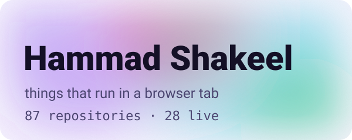

<picture>
  <source media="(prefers-color-scheme: dark)" srcset="designs/aurora-dark.svg">
  
</picture>

# The Profile README Book

A lookbook, a cabinet of curiosities and a dictionary of everything people put in
a GitHub profile README — the most beautiful, the strangest, the things GitHub can
render that almost nobody uses — plus new designs built from current trends.

It is also opinionated in one specific, measured way: **a profile has to work on a
phone.** Every image in chapter 1 was opened and measured; every design in chapter
5 is built so it can't fail that test.

## Chapters

| | | |
|---|---|---|
| **1** | [**The Lookbook**](01-lookbook.md) | The best-looking profiles we found, by visual style — editorial, brutalist, sci-fi, ink, data, retro, terminal, cinematic — plus the most-copied profiles in the world. Each with *steal* and *fix*. |
| **2** | [**Cabinet of Curiosities**](02-curiosities.md) | The rare and clever: a 4,500-year-old board game played by visitors, a community word cloud, live server telemetry, bonsai grown from commits, runnable business cards, and a graveyard of widgets that died. |
| **3** | [**Dictionary A–Z**](03-dictionary.md) | 129 kinds of README item, one line each, with where to get it and — where we measured it — whether it still loads. |
| **4** | [**What GitHub renders that almost nobody uses**](04-native.md) | Live, on the page: an interactive 3D model, a map, mind-maps, timelines, maths, all five alerts — and which rare HTML tags survive the sanitizer. |
| **5** | [**New designs**](05-new-designs.md) | Aurora, liquid glass, bento, neo-brutalism, kinetic type, holographic chrome, isometric, blueprint, halftone — as original SVGs that stay legible on a phone. All nine weigh 40 KB together. |

## Three things the book found

1. **The most beautiful profiles are the least readable.** Every one of the twenty
   hero images we measured in chapter 1 puts its smallest text between **2.2px and
   5.2px** on a phone. Beauty and legibility aren't in tension — nobody had drawn
   them on the same canvas yet. Chapter 5 does.
2. **The rarest, best items are native.** An interactive 3D model, a map, a
   mind-map: plain text in a markdown file, rendered by GitHub, impossible to break
   — and confirmed on only a handful of profiles anywhere.
3. **The ecosystem is fragile where it's popular.** The most-copied stats card has
   been dead for months; ClustrMaps and RevolverMaps are gone; GitHub disabled the
   popular keepalive Action for violating its terms. Everything that lasts here is
   either committed to your own repository or rendered by GitHub itself.

## How it was made

September 2026, from:

| Source | Scale |
|---|---|
| Profiles photographed and judged by eye | ~100 — curated "best of" lists, the most-starred profile repos, hand-made SVG profiles |
| Tool repositories crawled by topic and keyword | 2,855 |
| Entries in curated awesome-lists | 370 |
| Code-search probes for rare features | 95 |
| Web searches | ~30, in English, Chinese, Korean and Japanese |
| Hero SVGs opened and measured | 20 |
| Earlier survey this builds on | [446 profiles, 10,782 images](../survey/FINDINGS.md) |

Everything is reproducible from [`tools/book/`](../../tools/book): `collect.py`
(the crawl), `look.py` (the photographs), `native.py` and `designs.py` (the
exhibits), `filters.mjs` (the cross-engine filter test), `shot.py` (checking pages
as GitHub renders them). Raw data is in [`data/`](data).

**On using other people's work.** The lookbook shows each creator's own image,
loaded from their repository and credited, rather than re-hosted copies; the
screenshots used to choose them were kept out of the repository. If you're
featured and would rather not be, open an issue and the entry goes.

## Corrections made while writing

Recorded because a book that sounds researched should show where it was wrong:

- Four countries in the "famous profiles" table were written from memory; checked
  against each profile, one was wrong (Dubai, not India) and three state no
  location at all, so the table now says so.
- Pronouns for several creators had been inferred from their names. They were
  rewritten neutrally.
- One of three "confirmed" map examples turned out not to contain a map when
  opened; only examples we opened and checked are now marked confirmed.
- The 3D skyline first rendered lying on its back — GitHub's STL viewer is Y-up.
- The first skyline took the last 24 *active* months, silently dropping quiet
  ones; it now uses a continuous calendar window.
- Generated LaTeX lost its backslashes to Python escapes and rendered as
  "exttargetimesrac".
