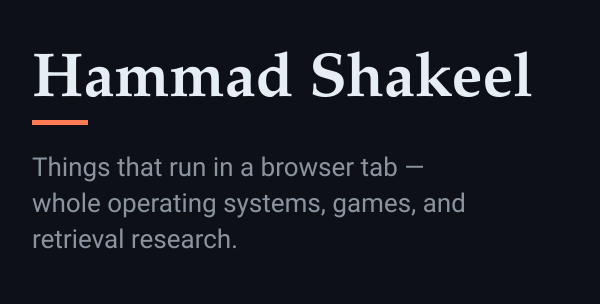

<picture>
  <source media="(prefers-color-scheme: dark)" srcset="header-dark.svg">
  <source media="(prefers-color-scheme: light)" srcset="header-light.svg">
  
</picture>

**Everything below runs in a browser tab.** Open a name to use it; source sits beside it.

### Operating systems in a tab

- **[LinuxWeb](https://hammadshakeelai.github.io/LinuxWeb/)** — Real Alpine Linux in a browser tab, home folder saved automatically · [source](https://github.com/hammadshakeelai/LinuxWeb)
- **[archbtw](https://hammadshakeelai.github.io/archbtw/)** — Arch Linux in v86, resumed from a snapshot at a shell full of toys · [source](https://github.com/hammadshakeelai/archbtw)
- **[RetroMuseum](https://hammadshakeelai.github.io/RetroMuseum/)** — Real Linux and retro operating systems, client-side, on the v86 emulator · [source](https://github.com/hammadshakeelai/RetroMuseum)
- **OpenVScode** — VS Code for Android phones — Python, C++ with Clang, Jupyter · [source](https://github.com/hammadshakeelai/OpenVScode)

### Games you can play right now

- **[Tidebreaker](https://hammadshakeelai.github.io/Tidebreaker/)** — Golden-hour boat regatta on a procedural low-poly ocean, three.js · [source](https://github.com/hammadshakeelai/Tidebreaker)
- **[Boat-Chase](https://hammadshakeelai.github.io/Boat-Chase/)** — 3D boat chase through island canals — outrun the Coast Guard · [source](https://github.com/hammadshakeelai/Boat-Chase)
- **[pacman](https://hammadshakeelai.github.io/pacman/)** — Pac-Man in vanilla JS with the original ghost targeting AI · [source](https://github.com/hammadshakeelai/pacman)
- **[retro-win32-arcade-web](https://hammadshakeelai.github.io/retro-win32-arcade-web/)** — Original C++ Win32 GUI games, playable in the browser · [source](https://github.com/hammadshakeelai/retro-win32-arcade-web)

### Close to the metal

- **[Doomsday in 8086](https://hammadshakeelai.github.io/Doomsday-Algorithm-In-Assembly-Language/)** — Conway's Doomsday algorithm in hand-written 8086 assembly, running in DOSBox · [source](https://github.com/hammadshakeelai/Doomsday-Algorithm-In-Assembly-Language)
- **[Assembly dry-runner](https://hammadshakeelai.github.io/Assembly-Language-Dry-Running-Tool-Project/)** — Step through assembly code line by line · [source](https://github.com/hammadshakeelai/Assembly-Language-Dry-Running-Tool-Project)

### Retrieval and research

- **paklegalbench** — Statute retrieval over Pakistani law, and the eval harness that measures it · [source](https://github.com/hammadshakeelai/paklegalbench)
- **[PersonalRag](https://hammadshakeelai.github.io/PersonalRag/)** — Chat with your PDFs in the browser — hybrid retrieval, page-level citations · [source](https://github.com/hammadshakeelai/PersonalRag)
- **[isospectral-sort](https://hammadshakeelai.github.io/isospectral-sort/)** — Dynamical, Lie-algebraic and soliton sorting systems in Python · [source](https://github.com/hammadshakeelai/isospectral-sort)

---

More on the main profile: [@hammadshakeelai](https://github.com/hammadshakeelai)
