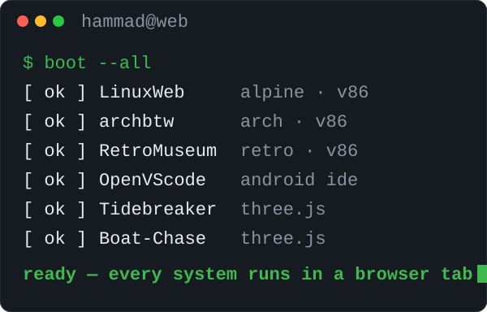
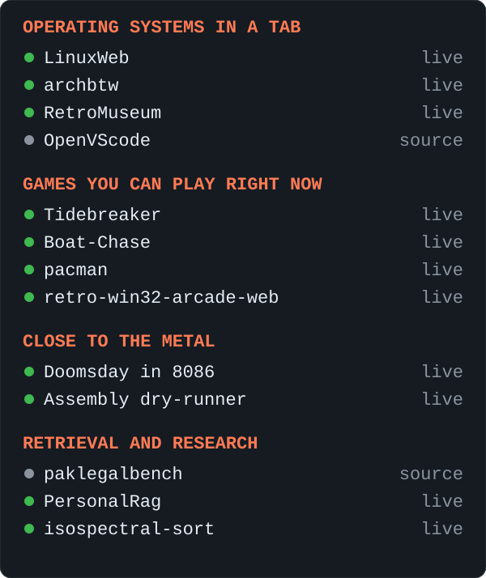

<picture>
  <source media="(prefers-color-scheme: dark)" srcset="boot-dark.svg">
  <source media="(prefers-color-scheme: light)" srcset="boot-light.svg">
  
</picture>

<picture>
  <source media="(prefers-color-scheme: dark)" srcset="monitor-dark.svg">
  <source media="(prefers-color-scheme: light)" srcset="monitor-light.svg">
  
</picture>

<b>Operating systems in a tab</b>

- **LinuxWeb** — Real Alpine Linux in a browser tab, home folder saved automatically · [open](https://hammadshakeelai.github.io/LinuxWeb/) · [source](https://github.com/hammadshakeelai/LinuxWeb)
- **archbtw** — Arch Linux in v86, resumed from a snapshot at a shell full of toys · [open](https://hammadshakeelai.github.io/archbtw/) · [source](https://github.com/hammadshakeelai/archbtw)
- **RetroMuseum** — Real Linux and retro operating systems, client-side, on the v86 emulator · [open](https://hammadshakeelai.github.io/RetroMuseum/) · [source](https://github.com/hammadshakeelai/RetroMuseum)
- **OpenVScode** — VS Code for Android phones — Python, C++ with Clang, Jupyter · [source](https://github.com/hammadshakeelai/OpenVScode)

<b>Games you can play right now</b>

- **Tidebreaker** — Golden-hour boat regatta on a procedural low-poly ocean, three.js · [open](https://hammadshakeelai.github.io/Tidebreaker/) · [source](https://github.com/hammadshakeelai/Tidebreaker)
- **Boat-Chase** — 3D boat chase through island canals — outrun the Coast Guard · [open](https://hammadshakeelai.github.io/Boat-Chase/) · [source](https://github.com/hammadshakeelai/Boat-Chase)
- **pacman** — Pac-Man in vanilla JS with the original ghost targeting AI · [open](https://hammadshakeelai.github.io/pacman/) · [source](https://github.com/hammadshakeelai/pacman)
- **retro-win32-arcade-web** — Original C++ Win32 GUI games, playable in the browser · [open](https://hammadshakeelai.github.io/retro-win32-arcade-web/) · [source](https://github.com/hammadshakeelai/retro-win32-arcade-web)

<b>Close to the metal</b>

- **Doomsday in 8086** — Conway's Doomsday algorithm in hand-written 8086 assembly, running in DOSBox · [open](https://hammadshakeelai.github.io/Doomsday-Algorithm-In-Assembly-Language/) · [source](https://github.com/hammadshakeelai/Doomsday-Algorithm-In-Assembly-Language)
- **Assembly dry-runner** — Step through assembly code line by line · [open](https://hammadshakeelai.github.io/Assembly-Language-Dry-Running-Tool-Project/) · [source](https://github.com/hammadshakeelai/Assembly-Language-Dry-Running-Tool-Project)

<b>Retrieval and research</b>

- **paklegalbench** — Statute retrieval over Pakistani law, and the eval harness that measures it · [source](https://github.com/hammadshakeelai/paklegalbench)
- **PersonalRag** — Chat with your PDFs in the browser — hybrid retrieval, page-level citations · [open](https://hammadshakeelai.github.io/PersonalRag/) · [source](https://github.com/hammadshakeelai/PersonalRag)
- **isospectral-sort** — Dynamical, Lie-algebraic and soliton sorting systems in Python · [open](https://hammadshakeelai.github.io/isospectral-sort/) · [source](https://github.com/hammadshakeelai/isospectral-sort)

More on the main profile: [@hammadshakeelai](https://github.com/hammadshakeelai)
