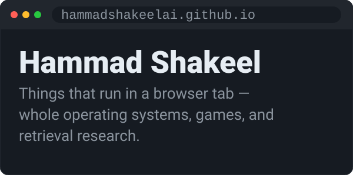
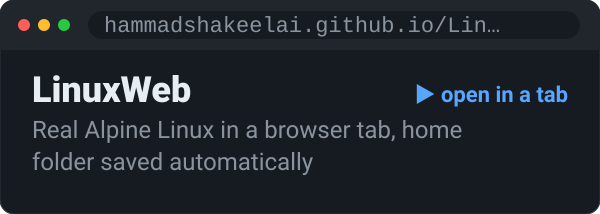
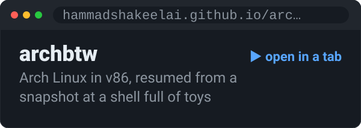
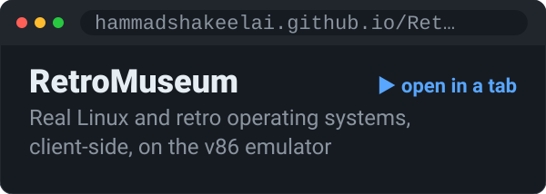
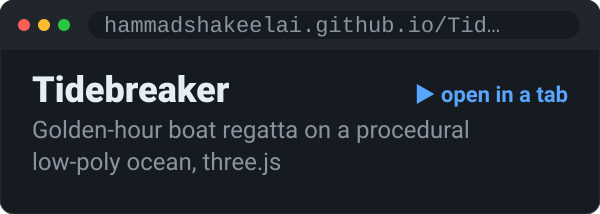
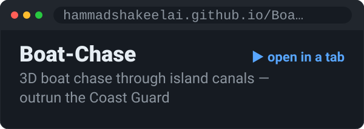
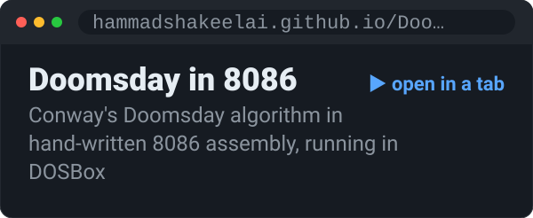
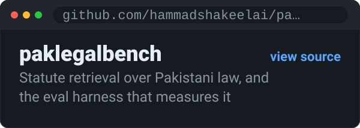
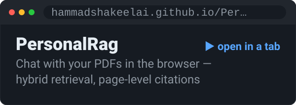

<picture>
  <source media="(prefers-color-scheme: dark)" srcset="header-dark.svg">
  <source media="(prefers-color-scheme: light)" srcset="header-light.svg">
  
</picture>

Each window below is a real project. Tap one to open it — they all run in a browser tab.

<a href="https://hammadshakeelai.github.io/LinuxWeb/">
<picture>
  <source media="(prefers-color-scheme: dark)" srcset="tab-linuxweb-dark.svg">
  <source media="(prefers-color-scheme: light)" srcset="tab-linuxweb-light.svg">
  
</picture>
</a>

<a href="https://hammadshakeelai.github.io/archbtw/">
<picture>
  <source media="(prefers-color-scheme: dark)" srcset="tab-archbtw-dark.svg">
  <source media="(prefers-color-scheme: light)" srcset="tab-archbtw-light.svg">
  
</picture>
</a>

<a href="https://hammadshakeelai.github.io/RetroMuseum/">
<picture>
  <source media="(prefers-color-scheme: dark)" srcset="tab-retromuseum-dark.svg">
  <source media="(prefers-color-scheme: light)" srcset="tab-retromuseum-light.svg">
  
</picture>
</a>

<a href="https://hammadshakeelai.github.io/Tidebreaker/">
<picture>
  <source media="(prefers-color-scheme: dark)" srcset="tab-tidebreaker-dark.svg">
  <source media="(prefers-color-scheme: light)" srcset="tab-tidebreaker-light.svg">
  
</picture>
</a>

<a href="https://hammadshakeelai.github.io/Boat-Chase/">
<picture>
  <source media="(prefers-color-scheme: dark)" srcset="tab-boatchase-dark.svg">
  <source media="(prefers-color-scheme: light)" srcset="tab-boatchase-light.svg">
  
</picture>
</a>

<a href="https://hammadshakeelai.github.io/Doomsday-Algorithm-In-Assembly-Language/">
<picture>
  <source media="(prefers-color-scheme: dark)" srcset="tab-doomsdayin8086-dark.svg">
  <source media="(prefers-color-scheme: light)" srcset="tab-doomsdayin8086-light.svg">
  
</picture>
</a>

<a href="https://github.com/hammadshakeelai/paklegalbench">
<picture>
  <source media="(prefers-color-scheme: dark)" srcset="tab-paklegalbench-dark.svg">
  <source media="(prefers-color-scheme: light)" srcset="tab-paklegalbench-light.svg">
  
</picture>
</a>

<a href="https://hammadshakeelai.github.io/PersonalRag/">
<picture>
  <source media="(prefers-color-scheme: dark)" srcset="tab-personalrag-dark.svg">
  <source media="(prefers-color-scheme: light)" srcset="tab-personalrag-light.svg">
  
</picture>
</a>

**Also:** [OpenVScode](https://github.com/hammadshakeelai/OpenVScode) · [pacman](https://hammadshakeelai.github.io/pacman/) · [retro-win32-arcade-web](https://hammadshakeelai.github.io/retro-win32-arcade-web/) · [Assembly dry-runner](https://hammadshakeelai.github.io/Assembly-Language-Dry-Running-Tool-Project/) · [isospectral-sort](https://hammadshakeelai.github.io/isospectral-sort/)

More on the main profile: [@hammadshakeelai](https://github.com/hammadshakeelai)
