# Frontier fixture gallery

Test fixtures for the visual-frontier experiments, rendered by GitHub.
Probed by `tools/frontier/probe_gh.mjs` in Chromium, Firefox and WebKit.

**anim.avif**

**anim.gif**

**anim.png**

**anim.webp**

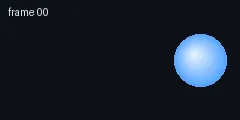

**embed-avif.svg**

**embed-gif.svg**

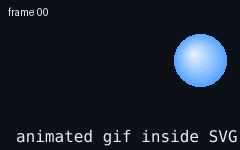

**embed-png.svg**

**embed-webp.svg**

**lighting-diffuse-distant-control.svg**

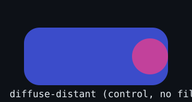

**lighting-diffuse-distant.svg**

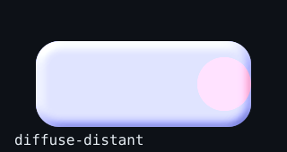

**lighting-specular-distant-control.svg**

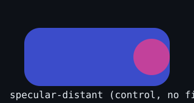

**lighting-specular-distant.svg**

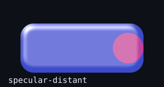

**lighting-specular-moving-control.svg**

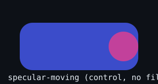

**lighting-specular-moving.svg**

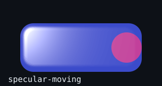

**lighting-specular-point-control.svg**

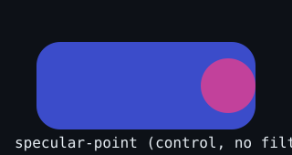

**lighting-specular-point.svg**

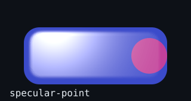

**lighting-specular-spot-control.svg**

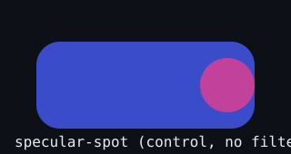

**lighting-specular-spot.svg**

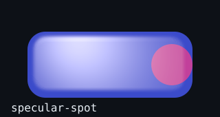
