# Technique gallery

Every technique in the catalogue as an original minimal example, embedded the
way a profile README embeds an image, so GitHub's own markdown pipeline renders
it. `tools/techniques/verify.py` loads this page on github.com and records, for
each image, whether it loaded, whether it actually animates inside GitHub's
page, and what the boundary tests reveal. Results: [VERIFIED.md](VERIFIED.md).

All examples use a 600-unit viewBox with text at 24 units or more, so text
stays at or above ~12px in the 309px phone column.

## Motion

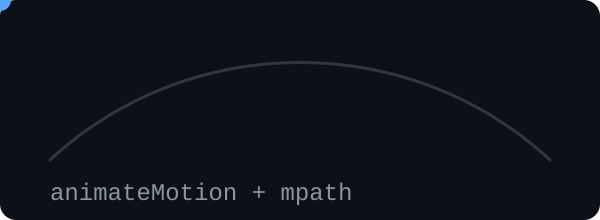

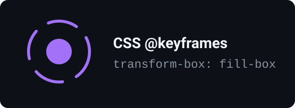

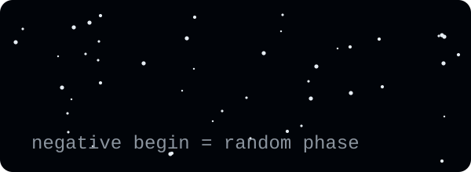

## Drawing

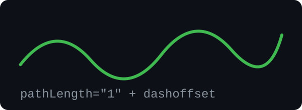

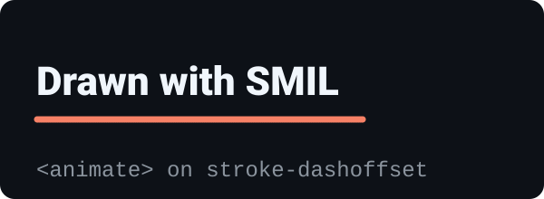

## Light and texture

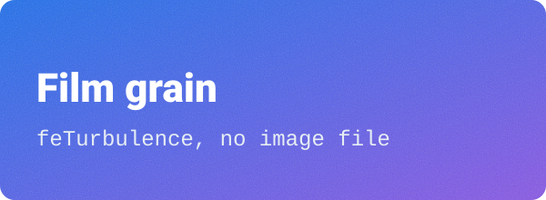

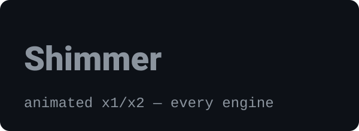

## Reveals and text


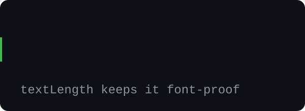

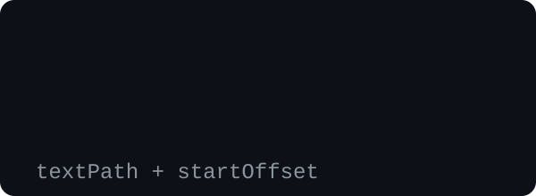


## Data

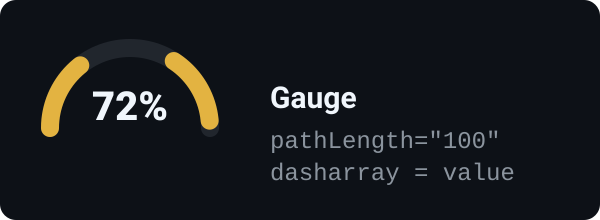

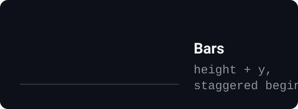

## Theme switching

Inside the SVG — follows the viewer's operating-system scheme:

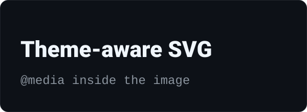

`<picture>` with `prefers-color-scheme` — follows the page:

<picture>
  <source media="(prefers-color-scheme: dark)" srcset="examples/theme-picture-dark.svg">
  <source media="(prefers-color-scheme: light)" srcset="examples/theme-picture-light.svg">
  
</picture>

Legacy URL fragments:

## Boundary tests

Each is built so the answer is visible in the render.

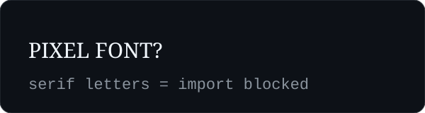


## Native markdown

<b>Real text, collapsed by default</b> — click to expand

Markdown inside `
` reflows to any width, stays selectable and
searchable, and is read by screen readers. It is the one layer of a profile that
survives every screen.

