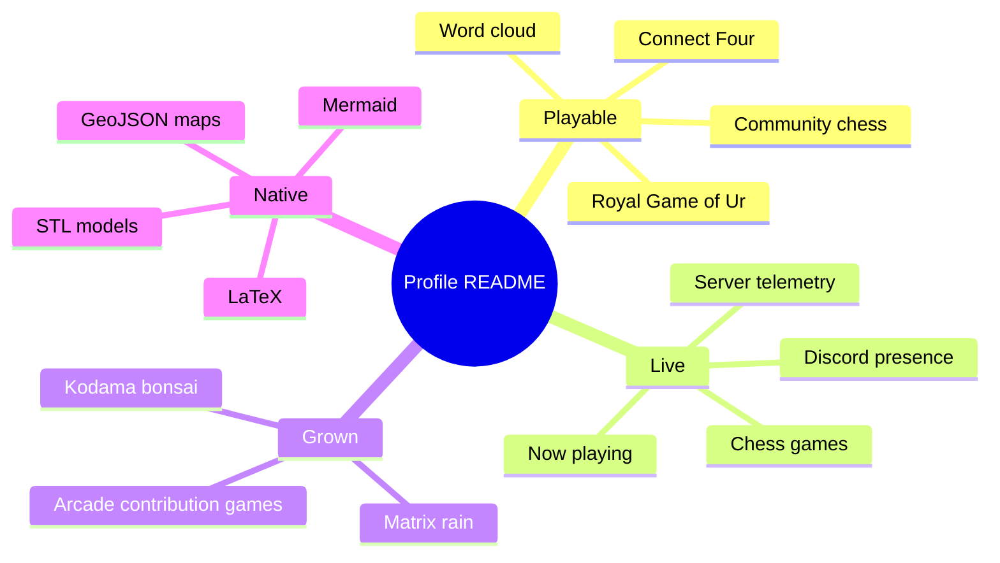
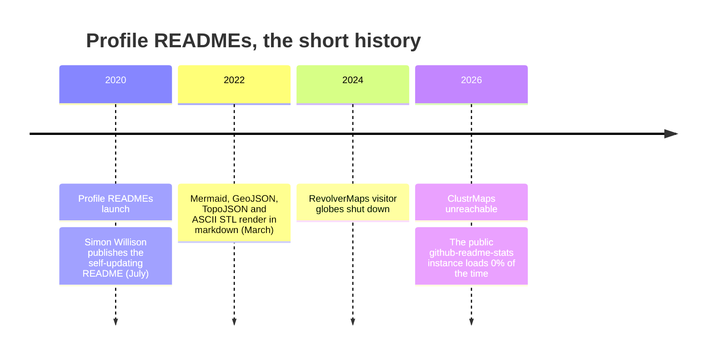
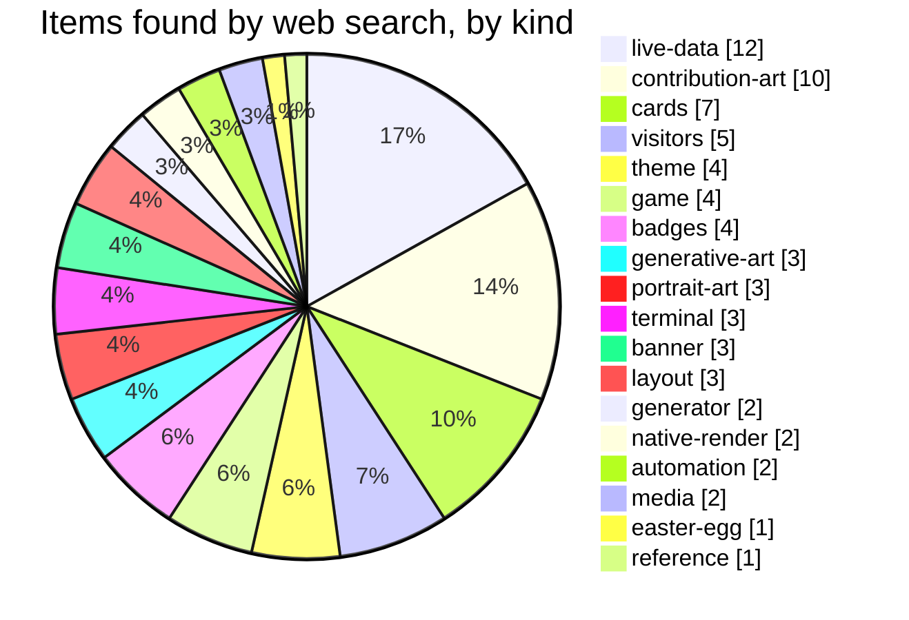

# Part 03 — The Profile README Book (lookbook, curiosities, dictionary, native tricks, 9 new designs)

This part is a complete, self-contained account of the **Profile README Book** that
lives in `docs/book/` of the `github-profile-blueprint` repository: its five
chapters (lookbook → cabinet of curiosities → dictionary → native rendering → nine
new designs), its methodology, its measured numbers, its reusable design assets,
and the raw data extracts that back it. Everything below is drawn from the files
themselves, not from memory; where a figure was measured it is labelled as such.

---

## 0. Where the book lives, and how it was made

**Files.**

| File | Bytes | Role |
|---|---:|---|
| `docs/book/README.md` | 4,883 | Chapter index, "three things the book found", methodology, corrections |
| `docs/book/01-lookbook.md` | 17,750 | ~20 photographed profiles grouped by visual style |
| `docs/book/02-curiosities.md` | 11,345 | Rare/clever entries, incl. a graveyard of dead widgets |
| `docs/book/03-dictionary.md` | 18,820 | A–Z glossary of README item types (stated: 129 entries) |
| `docs/book/04-native.md` | 55,085 | Live native exhibits: STL, GeoJSON, Mermaid, LaTeX, alerts, HTML probe |
| `docs/book/05-new-designs.md` | 7,722 | Nine 2026 design trends rebuilt as phone-legible SVGs |
| `docs/book/designs/` | 18 SVG files | The nine designs × dark/light |
| `docs/book/data/` | 8 files | Raw crawl/measure data backing the text |
| `tools/book/` | `collect.py`, `look.py`, `native.py`, `designs.py`, `filters.mjs`, `shot.py` | Everything reproducible |

**Methodology (from `docs/book/README.md`, September 2026):**

| Source | Scale |
|---|---|
| Profiles photographed and judged by eye | ~100 — curated "best of" lists, most-starred profile repos, hand-made SVG profiles |
| Tool repositories crawled by topic and keyword | 2,855 |
| Entries in curated awesome-lists | 370 |
| Code-search probes for rare features | 95 |
| Web searches | ~30, in English, Chinese, Korean and Japanese |
| Hero SVGs opened and measured | 20 |
| Earlier survey this builds on | 446 profiles, 10,782 images (`docs/survey/FINDINGS.md`) |

**Three things the book found** (verbatim in substance):

1. **The most beautiful profiles are the least readable.** Every one of the twenty
   hero images measured in chapter 1 puts its smallest text between **2.2 px and
   5.2 px** on a phone. Beauty and legibility aren't in tension — nobody had drawn
   them on the same canvas yet. Chapter 5 does.
2. **The rarest, best items are native.** An interactive 3D model, a map, a
   mind-map: plain text in a markdown file, rendered by GitHub, impossible to break
   — and confirmed on only a handful of profiles anywhere.
3. **The ecosystem is fragile where it's popular.** The most-copied stats card has
   been dead for months; ClustrMaps and RevolverMaps are gone; GitHub disabled the
   popular keepalive Action for violating its terms. Everything that lasts is
   either committed to your own repository or rendered by GitHub itself.

**Ethics note (README):** the lookbook shows each creator's *own* image, loaded
from their repository and credited, rather than re-hosted copies; screenshots used
to choose them were kept out of the repository; featured creators can opt out by
opening an issue.

**Corrections recorded while writing** — the book shows where it was wrong:

- Four countries in the "famous profiles" table were written from memory; checking
  each profile, one was wrong (Dubai, not India) and three state no location at all.
- Pronouns for several creators had been inferred from their names; rewritten neutrally.
- One of three "confirmed" map examples contained no map when opened; only opened
  and checked examples are now marked *confirmed*.
- The 3D skyline first rendered lying on its back — GitHub's STL viewer is **Y-up**.
- The first skyline took the last 24 *active* months, silently dropping quiet ones;
  it now uses a continuous calendar window.
- Generated LaTeX lost backslashes to Python escapes and rendered as
  "exttargetimesrac".

**The legibility formula** the whole book leans on lives outside the book, at
`skills/github-profile-readme/SKILL.md#the-legibility-formula--apply-before-drawing-anything`:
the smallest text on a hero must survive a **309 px** phone column (the README
content width on a phone).

---

## 1. Chapter 1 — The Lookbook

### 1.1 Premise

The best-looking profile READMEs grouped by the visual language they speak, chosen
by eye from ~100 profiles photographed in September 2026 (curated "best of" lists,
most-starred profile repos, code search for hand-made animated SVGs, web search in
four languages). Every image is the creator's own file, loaded from their
repository and credited.

The chapter opens with an `[!IMPORTANT]` alert: across **all twenty** hero SVGs
measured, the smallest text lands between **2.2 px and 5.2 px** on a phone — "the
most beautiful work in the ecosystem is uniformly unreadable in the hand." Hence
every entry ends with two lines: ***steal*** (the idea worth taking) and ***fix***
(what to change so it survives a 309 px column).

**Contents:** Editorial & luxury · Print & brutalist · Sci-fi instruments ·
Ink & organic · Data as design · Retro, pixel & nostalgia · Terminal ·
Illustrated & cinematic · The famous ones.

### 1.2 Editorial & luxury

> The rarest style on GitHub and the most striking: serif type, restraint, gold,
> whitespace. It reads as *a firm*, not a hobby.

**ashfordeOU — a letterhead with an orrery**
`github.com/ashfordeOU` · 880-unit canvas · **162 KB** · SMIL + CSS keyframes ·
**embeds its own font**.
The only way to guarantee a serif inside an image-SVG is to embed it — web fonts
can't load there — and this is one of very few profiles that does. Small caps, a
single gold accent, a Sanskrit line under the tagline, and the orrery turning
slowly: it looks printed.
**Steal:** embed a *subset* of one display face; one accent colour; let the motion
be a single slow rotation. **Fix:** smallest label is **3.5 px** on a phone — the
small-caps kicker lines need to roughly triple.

**Xalzeroph — a script wordmark and a black hole**
`github.com/Xalzeroph` · 1200-unit canvas · **127 KB** · `feGaussianBlur` +
radial gradients · SMIL.
The black hole is nothing but stacked radial gradients and one blur; the page
continues as a "portfolio galaxy" where each project is a body in orbit. Ships
**separate phone variants** behind `max-width` sources — the technique the
`WIDTH-GATED` research track verified.
**Steal:** a cosmos from gradients alone; per-width art direction. **Fix:** the
desktop file's micro-labels (**4.1 px**) are fine only because the phone never sees
it — make sure yours don't either.

### 1.3 Print & brutalist

> Condensed type, flat colour, visible grids, dithering. Borrowed from zines and
> Swiss posters; loud on purpose.

**ayxn07 — dithered teal and giant type**
Raster hero (PNG) + SVG section tabs. A single flat teal, black condensed display
type, a halftone photo and numbered section tabs (`01 WHOAMI → 02 PROJECTS →`) that
behave like a site nav — the only profile found that looks like a printed poster.
**Steal:** one flat background colour for the *whole* page; numbered nav tabs; a
dithered photo instead of a gradient. **Fix:** raster heroes can't adapt to
dark/light — ship a second PNG behind `<picture>`. (In `data/featured-study.json`
this entry measures **442,300 bytes**.)

**harkirat-data — the blueprint index**
`github.com/harkirat-data` · **4 KB** · CSS keyframes + media query.
Hairline rules, monospace, "Index № 001", a system map drawn as a node graph
further down. The whole hero is 4 KB. The survey found this exact layout in four
profiles with personalised text — it's a template, and a good one.
**Steal:** technical-drawing furniture (index numbers, rules, figure captions).
**Fix:** at 1000 units, **3.4 px** labels; draw it at 600.

### 1.4 Sci-fi instruments

> Glows, grids, status lines, telemetry. The most common "ambitious" style — and
> the one where craft separates the best from the rest.

**getaudra — systems online** · **3 KB** · one blur + SMIL.
Three kilobytes: one glowing polyline, three status lines
(`MODE: OBSERVE → TEST → ITERATE`), a heading in wide caps. Proof the HUD look is
about typography and one light source, not weight.
**Steal:** a status line that *says something* about how you work. **Fix:** 3.9 px.

**SergiGTAr — the security operator** · 59 KB · embedded photo, scanline
`<pattern>`, clip paths, CSS + SMIL.
Pip-Boy-style frame with the author's photo *embedded inside the SVG* (an external
`<image>` would be blocked), a scanline pattern over everything, prompt
`build --harden --verify`.
**Steal:** put the photo *in* the SVG as a data URI; a scanline `<pattern>`.
**Fix:** **5.2 px** — best of the set, still under half the floor.

**adamalston — an observatory** · served from the author's own domain · static.
Three orbits, a gold sun, corner readouts in tiny mono (`AA/0-01`,
`OBSERVATION SYSTEM`). Calm where most HUDs shout; notable for being hosted on the
author's own site rather than GitHub.
**Steal:** instrument-panel corner marks; calm. **Fix:** decorative microtext at
3 px is fine as decoration, but give the page a readable name somewhere.

**Also in this style:** HiradEmami (profile as a game menu — *README Control
Surface → Hirad Main System → Labs*), JackLuciano (amber-on-black telemetry panel
of real counts), AlexChek51 (circuit board with a glowing `BUILD` chip wired to
labelled modules, then bold stat tiles in Russian with an English version one
click away).

### 1.5 Ink & organic

> The rarest technique family: SVG filters used for texture rather than glow.

**XxMasterepicxX — sakura and a gold eclipse** · **203 KB** · `feTurbulence` +
`feDisplacementMap`, masks, clip paths, SMIL + CSS.
The page is painted: blossom clouds, ink branches framing each project
description, a thin gold eclipse ring. Organic edges come from `feTurbulence`
noise driving `feDisplacementMap` — the same filter pair the "liquid glass" trend
uses for refraction; seen in no other profile.
**Steal:** turbulence-displaced edges to make vector art look hand-made.
**Fix:** 3.2 px labels; 203 KB is heavy for a header.

**JConfessor — a wind turbine** · 9 KB · SMIL rotation.
The author analyses operational data for a wind-energy company, so the hero is a
turbine, turning. The most *personal* image in the chapter, and 9 KB.
**Steal:** draw the thing your work is actually about. **Fix:** 2.9 px.

### 1.6 Data as design

> Charts that are the decoration, instead of stat cards bolted on.

**sepahead — the pulse** · 6 KB · CSS keyframes.
Below the hero: "THE PULSE" — contributions per year as bars, the current year
highlighted, a laurel marking the "golden age" — then "Where the week goes" as a
donut. It reads like a newspaper graphic, not a dashboard.
**Steal:** annotate your chart like a journalist would. **Fix:** 4.7 px.

**garimasingh128** shows languages over time as a **streamgraph** — the most
colourful chart on any profile seen. **leereilly** uses the contribution grid
itself as a decorative header, then a wall of event posters (Git Merge, Game Off,
Hacktoberfest) as "top ships".

### 1.7 Retro, pixel & nostalgia

**atikulmunna — Flappy Bird, playing itself** · **106 KB** · SMIL, masks, clip
paths. An 8-bit side-scroller animated entirely in SMIL, captioned
`> run --game flappy`; the rest of the page follows through with terminal section
headings and pixel stat cards.
**Steal:** a tiny *game* as the hero instead of a banner. **Fix:** **2.2 px** —
the smallest in the set.

**BrunnerLivio — GeoCities, lovingly** · PNG + GIFs + a live guestbook. WordArt, a
spinning globe GIF, a DJ gif, "best viewed with" badges — and a **working
guestbook** whose entries are real visitors. The joke is executed so completely it
becomes the best nostalgia piece on GitHub.

**thenolle — pastel pixel with supporters** · **1.4 MB** · embedded raster + font.
Cosy pastel gradients, a pixel wordmark, and a row showing the **last six
supporters' avatars** baked in. Warm where most profiles are cold.
**Steal:** thank your supporters *visually*. **Fix:** 1.4 MB — compress the
embedded art.

Also: **trinib** (maximal retro — pixel hearts, ASCII rainbow wordmark, animated
GIFs everywhere) and **Carol42** (purple Matrix rain behind "Welcome to my
profile!", with an English/Português switch).

### 1.8 Terminal

- **JosephQ47** — Matrix rain, then `./whoami`, `./tech_stack`, `./projects`
  sections, in Chinese. 54 KB, no third parties.
- **Dhyanesh006** — a boot log where each section "mounts".
- **10ishk** — the whole hero is an **IDE**: file tree, tabs, a status bar.
- **jcubic** — the name as figlet ASCII art and one line: `$ npx jcubic` — a
  business card you can run.

### 1.9 Illustrated & cinematic

**M0nica** — a commissioned-style flat illustration of the author, plus a rotating
Octocat version. **cszach** — a 3D-rendered gallery room with the domain projected
on the far wall. **MartinHeinz** — a brush-script banner. **novatorem** — the
Spotify "now playing" card with a live waveform, by the person who built the widget
everyone copies.

### 1.10 The famous ones

The most-starred profile repositories GitHub search could find (Sept 2026). Stars
on a profile repo mostly mean *people copied it* — a list of the most imitated
designs, not necessarily the best.

| ★ | Profile | Based (from their GitHub profile) | What it's known for |
|--:|---|---|---|
| 2,696 | [rafaballerini](https://github.com/rafaballerini) | Santa Catarina, Brazil | The canonical Brazilian dev-creator profile; widely copied |
| 1,465 | [midudev](https://github.com/midudev) | Barcelona | Auto-updating grids of the latest YouTube thumbnails, two channels |
| 878 | [elidianaandrade](https://github.com/elidianaandrade) | not stated · writes in Portuguese | Latest videos and study material, kept current by Actions |
| 758 | [novatorem](https://github.com/novatorem) | Toronto | Author of the Spotify now-playing widget |
| 747 | [DenverCoder1](https://github.com/DenverCoder1) | not stated | Author of readme-typing-svg, streak stats, custom-icon-badges |
| 689 | [anmol098](https://github.com/anmol098) | Dubai | Waka Readme Stats author; a meeting-booking card; `npx anmol` |
| 652 | [mazassumnida](https://github.com/mazassumnida) | not stated · writes in Korean | A service rendering solved.ac / Baekjoon competitive-programming badges |
| 508 | [trinib](https://github.com/trinib) | Trinidad & Tobago | Maximal retro GIF collage |
| 443 | [simonw](https://github.com/simonw) | California | The self-updating three-column README everyone copied |
| 440 | [MartinHeinz](https://github.com/MartinHeinz) | Bratislava | Brush-script banner, blog list |
| 409 | [Carol42](https://github.com/Carol42) | not stated · English/Português toggle | Purple Matrix rain, bilingual switch |
| 290 | [andyruwruw](https://github.com/andyruwruw) | Bay Area, California | Spotify top tracks and live chess.com games rendered as boards |

**Shape of the list:** the top three are Portuguese- and Spanish-language creators,
and a large share of the rest are the *authors of the widgets* — novatorem,
DenverCoder1, anmol098, mazassumnida — whose profiles double as their tools' demo
pages.

**Measured hero data** for these entries is in `data/featured-study.json`
(per-hero `url`, `vb_w`, `vb_h`, `min_font`, `animated`, `kb`, `features`), e.g.
ashfordeOU 162 KB / min_font 10, Xalzeroph 127 KB / 16, harkirat-data 4 KB,
getaudra 3 KB, HiradEmami 6 KB / 9, SergiGTAr 59 KB, ayxn07 raster 442,300 bytes.

---

## 2. Chapter 2 — Cabinet of Curiosities

### 2.1 Premise and the rarity caveat

> The strange, rare and surprisingly clever things people have put in a profile
> README. Everything here was seen on a real profile we photographed or in a
> verified tool repository; where a code-search probe could put a rough number on
> how rare it is, the entry says so.

Rarity figures come from GitHub code search over files named `README.md`, counting
how many of the first hundred matches were actual `username/username` profile
repositories. Code search matches loosely — when the map probe's READMEs were
opened, one of three named examples no longer contained a map — so the numbers mean
"people really do this", not a census, and entries marked ***confirmed*** were
opened and checked.

**Contents:** Playable · Your life, live · Grown, not drawn · Things GitHub
renders that almost nobody uses · Collectibles & social proof · Runnable ·
Graveyard.

### 2.2 Playable

> A README can't run code, but a link can open a pre-filled issue, and an Action
> can react to the issue by redrawing the board. Every game below works that way.

- **The Royal Game of Ur** — `rossjrw`. A 4,500-year-old Mesopotamian board game,
  played by anyone who visits. Teams, dice (rendered as tetrahedral dice images), a
  move menu of links, a game log, and *game number 30-and-counting*. Visitors join
  a team by making a move. Of all the playable profiles this is the one nobody else
  has: an ancient game, played collectively, on a README. Board image:
  `https://raw.githubusercontent.com/rossjrw/rossjrw/play/games/current/board.4710.svg`
- **Community chess** — started by `timburgan`; `marcizhu` runs an open tournament
  with the move list as a table of links (`A8 → A1, A2, …`) and a leaderboard of the
  most moves made. Code search found chess-via-issues on **13 of the first 100**
  matching READMEs that were profiles.
- **Connect Four with a bot** — `jonathangin52`: red vs blue teams, a
  `Connect4Bot` you can request a move from, 20,000+ moves played, top-10 leaderboard.
- **Tic-tac-toe decided by crowd vote** — `DoubleGremlin181`: each empty square is
  an image link that counts clicks and bounces you back; once an hour an Action
  plays whichever square was clicked most. Hand-drawn X and O.
- **A community word cloud** — `JessicaLim8`: "Where are you hoping to travel
  next?" Visitors add a word through an issue and the cloud regenerates; hundreds
  of contributors listed underneath. The prompt changes periodically, so the page is
  never finished.
- **Game of Life, seeded from your contributions** — `ethomson`: the contribution
  graph becomes the initial state of Conway's Game of Life (a four-colour "Quad
  Life" variant, so intensity survives), served as an animated GIF by a small
  server. Viewed directly it keeps rendering forever; through GitHub's image proxy
  it stops after 20 frames — explained on the page.
- **A guestbook** — `BrunnerLivio`: a real guestbook table of visitor avatars,
  dates and messages, in a profile styled as a 1998 homepage.

**Also seen:** 2048, Minesweeper, Wordle and chess-vs-AI kits in
`Tech-Codes/readme-games`; vote-driven multiplayer games written up by Leonardo
Montini (`leonardomontini.dev/4-github-games-readme-profiles/`).

### 2.3 Your life, live

Things that change because the author's *life* changed, not because they pushed.

| Item | Seen on | What it does |
|---|---|---|
| **Server telemetry** | `itgoyo` | CPU, memory and disk gauges for the author's own server, plus a "latest followers" leaderboard |
| **Live chess games** | `andyruwruw` | Current chess.com games drawn as boards, opponent names underneath |
| **Chess rating chart in ASCII** | `sciencepal` | The last 100 blitz games as a text line chart in a code block, with a last-updated timestamp |
| **Discord presence** | `SwezyDev` | What they're playing right now, with elapsed time. Common builder: `cnrad/lanyard-profile-readme` |
| **Now playing, with a waveform** | `novatorem` | The original Spotify widget; `natemoo-re` adds top tracks |
| **Anime watched** | `lowlighter` | An AniList grid of shows and favourite characters inside a metrics infographic |
| **Latest YouTube uploads** | `midudev` | Thumbnail grids for two channels, kept current |
| **A meeting booking card** | `anmol098` | "30 Min Meeting" — pick a slot straight from the profile |
| **A random meme per load** | `techytushar` | "Refresh the page to see a new meme" |
| **Commit clock** | `maxam2017/productive-box` | Early bird or night owl, from the hours you commit |
| **Competitive programming** | `mazassumnida`, LeetCode card, Codeforces | solved.ac tiers, LeetCode heatmaps, Codeforces ratings |
| **Visitor flags** | `ChanMeng666/github-visitor-counter` | Counts views and shows the country flags of visitors |

### 2.4 Grown, not drawn

Generated art that *is* your history rather than illustrating it.

- **Kodama** — a bonsai: commits grow foliage, merged PRs ripen into fruit, reviews
  hang lanterns, streaks blossom. One image URL, redrawn daily.
- **Git Bonsai** — a deterministic pixel-art bonsai as an animated GIF that keeps
  growing.
- **Repo Garden (Aaryan1524/Bosnai)** — a botanical SVG from the git log:
  contributors bloom, long silences drop autumn leaves, **force-pushes snap a
  branch**, merges leave graft rings.
- **Arcade contribution graphs** — beyond Snake and Pac-Man, the
  `abozanona/pacman-contribution-graph` engine also renders **Breakout, Galaga,
  Puzzle Bobble, Bomberman and Minesweeper** from your grid. Pac-Man appeared on
  **98 of the first 100** matching READMEs, so it is not rare — *the other five are*.
- **Matrix-rain contributions** — `N1k0droid/matrix-svg-contrib`: empty days loop
  as falling code; contributed days fall and lock into phosphor-green cells.
- **CRT / equalizer contributions** — the same grid as a glowing CRT or a bouncing
  audio equalizer.
- **gitfiti** (`gelstudios/gitfiti`, 8,400★) — the opposite direction: backdated
  commits that *paint* a picture or word into the real graph.
- **GitHub Skyline** — a year of contributions as a 3D city you can rotate and
  export to a 3D printer (the Konami code on the Skyline page is an easter egg).
- **Dithered photo portraits** and **ASCII portraits that type themselves** —
  `mithun50/ascii-profile-kit`, `crafter-station/gh-ascii`.

### 2.5 Things GitHub renders that almost nobody uses

Native to GitHub's markdown, no image or service involved, so they can't break.
Chapter 4 demonstrates each one live.

| Feature | Rarity signal | Seen on |
|---|---|---|
| **An interactive 3D model** (ASCII STL in a ` ```stl ` block) | confirmed on 5 profiles | TheAdkk, leandrumartin, olorcain; `nirholas/readme-3d` converts GLB/OBJ/STL to fit GitHub's 512 KB limit |
| **An interactive map** ( ` ```geojson ` / ` ```topojson ` ) | confirmed on 4 profiles | BEPb, BagToad (GeoJSON); Sakib-Sobaha, nanimm88 (TopoJSON) |
| **A mind-map of your skills** ( ` ```mermaid ` `mindmap`) | — | pr2tik1 |
| **LaTeX maths** | 1 profile in the sample | — |
| **Alert callouts** (`> [!NOTE]`) | 3 profiles in the sample | — |

### 2.6 Collectibles & social proof

- **Holopin** — collectible event badges (Hacktoberfest levels, DigitalOcean)
  arranged on a board, like enamel pins (`HwangTaehyun`).
- **Supporters in the banner** — `thenolle` bakes the avatars of the last six
  sponsors into the header art.
- **GitHub's own achievements** — the complete list and how to earn them is
  maintained at `drknzz/GitHub-Achievements`.
- **Sponsor walls** — generated by tools like `sponsorkit`, seen on 6 profiles in
  the sample.
- **A party-parrot parade** — `ashleymavericks`.

### 2.7 Runnable

- **`npx <your-name>`** — `jcubic` and `anmol098` publish an npm package whose only
  job is to print a business card in your terminal. The README just tells you the
  command.
- **An album-cover carousel** — `arkk200`'s `record-rotate` decorates a profile
  with a rotating row of album covers.

### 2.8 Graveyard — still embedded on thousands of profiles, no longer working

- **ClustrMaps and RevolverMaps visitor globes.** RevolverMaps shut down in late
  2024 and ClustrMaps has been unreachable in 2026; the widgets now render nothing.
  `Selenium39/umami-maps` is the self-hosted replacement.
- **The public github-readme-stats instance** — loads **0%** of the time; still in
  **24%** of profiles (survey).
- **Keepalive workflows** — the widely used `keepalive-workflow` Action, which kept
  repositories looking active so GitHub wouldn't pause scheduled workflows after 60
  days, was **disabled by GitHub for violating its Terms of Service**, according to
  its author's profile (`gautamkrishnar`). Anything that commits just to look active
  is on the wrong side of that line.

---

## 3. Chapter 3 — Dictionary A–Z

> Every kind of thing we found in a GitHub profile README, one line each. Compiled
> from ~100 profiles photographed, 2,855 tool repositories, 370 entries in curated
> lists, 95 code-search probes, the 446-profile survey and web searches in four
> languages.

**How it's made** — `native` GitHub renders it from plain markdown · `html` an
allowed HTML tag · `svg` a file you commit · `service` an image URL someone else
hosts · `action` a workflow that regenerates a file · `issue` interactivity through
pre-filled issues.

**Load rate** is quoted only where the survey fetched real embeds (Sept 2026);
anything hosted by a service can die, and several popular ones have.

### A

- **Achievements** — GitHub's own profile badges (Pull Shark, YOLO…). *Built in.*
  Full list: `drknzz/GitHub-Achievements`.
- **Activity feed** — your latest GitHub events as a list, rewritten by an Action.
  `action` · `jamesgeorge007/github-activity-readme`.
- **Activity graph** — a line chart of recent contributions. `service` · **load
  rate 2%** (free-tier host paused).
- **Advent of Code badges** — your AoC stars. `action` · via `rzashakeri/beautify-github-profile`.
- **Alerts** — `> [!NOTE]`, `[!TIP]`, `[!IMPORTANT]`, `[!WARNING]`, `[!CAUTION]`.
  `native` · demo in chapter 4.
- **Album carousel** — rotating album covers. `svg` · `arkk200/record-rotate`.
- **All-contributors** — a table of everyone who helped, with emoji roles.
  `action` · common on projects, rare on profiles.
- **Animated wave header/footer** — capsule-render's `waving` type. `service` ·
  `kyechan99/capsule-render`, especially popular in Korea.
- **Anime list** — AniList/MyAnimeList shows and favourite characters. `action` ·
  a `lowlighter/metrics` plugin; seen on `lowlighter`.
- **Arcade contribution games** — your grid as Pac-Man, Breakout, Galaga, Puzzle
  Bobble, Bomberman or Minesweeper. `action` · `abozanona/pacman-contribution-graph`.
- **ASCII art** — figlet names, portraits, banners in a code block. `native` ·
  `jcubic`, `crafter-station/gh-ascii`.
- **ASCII chart** — a line chart drawn in text inside a code block.
  `native` + `action` · chess.com ratings on `sciencepal`, WakaTime on `MacroPower`.
- **ASCII portrait (typing)** — your photo as ASCII that types itself in.
  `svg` + `action` · `mithun50/ascii-profile-kit`.
- **Aurora background** — drifting blurred colour. `svg` · chapter 5.

### B

- **Badge** — a small label image. `service` · `shields.io` loads **100%**; badge
  walls are on **42%** of profiles.
- **Badge, custom icon** — shields badges with Octicons or your own logo.
  `service` · `DenverCoder1/custom-icon-badges`.
- **Badge, gradient** — badges with colour gradients. `service` · via
  `beautify-github-profile`.
- **Badge, Material 3** — M3-styled badges. `svg` · via the same list.
- **Bento grid** — modular tiles of varied size. `html` table or one `svg` ·
  `amittam104/BentoHub`, `opbento.vercel.app`; as one image in chapter 5.
- **Blog posts** — your latest posts, rewritten from RSS. `action` ·
  `gautamkrishnar/blog-post-workflow` (3,400★).
- **Blueprint style** — technical-drawing header with index numbers. `svg` ·
  `harkirat-data`; chapter 5.
- **Bonsai** — a tree grown from your history. `action`/`service` · Kodama, Git
  Bonsai, Repo Garden.
- **Booking card** — "30-minute meeting", pick a slot. `service` · `anmol098`.
- **Brutalist style** — flat colour, hard shadows, condensed caps. `svg` ·
  `ayxn07`; chapter 5.
- **Business card, runnable** — `npx yourname` prints a card. `npm` · `jcubic`,
  `anmol098`.

### C

- **Capsule render** — gradient/wave/egg headers and footers from a URL.
  `service` · `kyechan99/capsule-render`.
- **Chess, community** — anyone plays the next move via an issue. `issue` ·
  `timburgan`, `marcizhu`.
- **Chess, live games** — your current chess.com games drawn as boards. `action` ·
  `andyruwruw`.
- **Chrome / holographic text** — iridescent wordmark. `svg` · chapter 5.
- **Clock / timezone** — a card showing your local time. `service`.
- **Code-as-bio** — `const me = {…}` or a Python class describing you, in a code
  block. `native` · `DIMFLIX`, `anmol098`, `thenolle`.
- **Codeforces card** — rating and rank. `service` · `RedHeadphone/codeforces-readme-stats`.
- **Collapsible section** — `<details><summary>`. `html` · demo in chapter 4.
- **Commit clock** — early bird or night owl. `action` (gist) ·
  `maxam2017/productive-box`.
- **Connect Four** — community game with a bot and leaderboard. `issue` ·
  `jonathangin52`.
- **Contribution graph as header** — the green grid used decoratively. `svg` ·
  `leereilly`.
- **CRT / equalizer contributions** — the grid as a glowing CRT or audio
  equalizer. `action`.
- **Cyberpunk / neon theme** — `TejaPriyan/neon-readme` (CLI), `SUONSUN9527`.

### D

- **Dark/light switching** — `<picture>` + `prefers-color-scheme`, or
  `#gh-dark-mode-only`. `html` · only **20%** of profiles do it; verified in 3
  engines (`CAPABILITY-MATRIX.md`).
- **Dev.to / Medium / Hashnode posts** — latest articles, via blog-post-workflow.
  `action`.
- **Discord presence** — what you're playing now. `service` ·
  `cnrad/lanyard-profile-readme`; seen on `SwezyDev`.
- **Dithered portrait** — a photo as an animated dithered SVG. `svg` · listed in
  `abhisheknaiidu/awesome-github-profile-readme`.
- **Duolingo** — streak and languages. `service`.

### E

- **Easter egg** — hidden links, `<!-- comments -->`, a secret on click.
  `hammadshakeelai` hides a link in the word "Hi". GitHub's own: the Konami code on
  Skyline.
- **Embedded font** — a subset font inside the SVG, the only way to guarantee a
  face. `svg` · `ashfordeOU`.
- **Embedded photo** — your photo as a data URI inside the SVG (an external
  `<image>` is blocked). `svg` · `SergiGTAr`.
- **Emoji art** — pictures made of emoji. `native`.
- **Event posters** — a wall of things you organised. `leereilly`.

### F

- **Film grain** — `feTurbulence` noise over a gradient. `svg` · applies in all 3
  engines (chapter 5, "Verified").
- **Followers grid / leaderboard** — your latest followers with avatars. `action` ·
  `itgoyo`, `ouuan`.
- **Footnotes** — `[^1]`. `native`.
- **`<foreignObject>`** — HTML inside SVG. Renders in Chromium and Firefox;
  inconsistent in WebKit (`CAPABILITY-MATRIX.md`).

### G

- **Game of Life** — seeded from your contributions, served as an endless GIF.
  `service` · `ethomson`.
- **GeoCities revival** — WordArt, spinning globes, a guestbook. `BrunnerLivio`.
- **GeoJSON / TopoJSON map** — an interactive map from a code block. `native` ·
  demo in chapter 4; confirmed on `BEPb`, `BagToad`.
- **GIF banner** — an animated GIF header. `Anmol-Baranwal/Cool-GIFs-For-GitHub`
  (2,100★).
- **gitfiti** — backdated commits that paint pictures into the real graph.
  `gelstudios/gitfiti` (8,400★).
- **GitHub Skyline** — your year as a 3D-printable city.
- **GitHub Unwrapped** — your year as a generated video.
- **Glassmorphism cards** — frosted stat cards. `pheonix14/rayz-glass-cards`.
- **Goodreads** — what you're reading. `action`.
- **Guestbook** — visitors leave a message. `issue` · `BrunnerLivio`.

### H

- **Halftone** — a dot screen in vector. `svg` · chapter 5.
- **Heatmap** — activity per day or month. `svg`/`action`.
- **Holopin** — collectible event badges on a board. `service` · `HwangTaehyun`.
- **HUD / command centre** — status lines, glows, telemetry. `svg` · `getaudra`,
  `HiradEmami`.

### I

- **IDE hero** — the header drawn as an editor window with a file tree. `svg` ·
  `10ishk`.
- **Illustrated portrait** — a flat vector illustration of you. `M0nica`.
- **Ink / organic** — `feDisplacementMap` edges that look hand-painted. `svg` ·
  `XxMasterepicxX`.
- **Isometric contributions** — the grid as 3D towers.
  `jasonlong/isometric-contributions` (browser extension, 3,700★), metrics
  `isocalendar` plugin; chapter 5.

### J–K

- **Jokes / quotes** — a random programming joke or quote per load. `service` ·
  readme-jokes; quote cards on **45 of 100** sampled profiles.
- **`<kbd>` keys** — keyboard-key styling. `html`.
- **Kinetic type** — letters that move or change weight. `svg` · chapter 5.
- **Kodama** — see *Bonsai*.

### L

- **Language bar / donut** — top languages. `service`/`action` · github-readme-stats
  (public instance **0%**), metrics.
- **LaTeX** — `$$…$$` typeset maths. `native` · demo in chapter 4.
- **Last.fm** — recent scrobbles. `service` · `JeffreyCA/lastfm-recently-played-readme`.
- **LeetCode card** — solved counts, heatmap, contest rating. `service` ·
  `JacobLinCool/LeetCode-Stats-Card`.
- **Liquid glass** — refraction through `feDisplacementMap`. `svg` · `Umeem26`;
  chapter 5.
- **Lottie** — Lottie animations exported to GIF/SVG.

### M

- **Markdown badges collection** — `Ileriayo/markdown-badges` (17,000★).
- **Matrix rain** — falling green code. `svg` · `JosephQ47`, `Carol42`; as a
  contribution graph: `N1k0droid/matrix-svg-contrib`.
- **Meme per load** — a random meme on refresh. `techytushar`.
- **Mermaid** — flowcharts, mind-maps, timelines, pie charts from text. `native` ·
  demo in chapter 4; a skills mind-map on `pr2tik1`.
- **Metrics** — one Action, 30+ plugins, 300+ options. `lowlighter/metrics`
  (17,000★).
- **Minesweeper** — playable in a README. `issue` · `Tech-Codes/readme-games`.
- **Moe counter** — anime-styled view counter. `service`.
- **Monkeytype** — typing-speed card. `service`.

### N

- **Neofetch card** — your system info as a terminal readout. `svg` ·
  `UltimateStrength/ascii-readme`, `hu553in/ascii-profile-card`.
- **Now playing** — current track. `service` · `novatorem` (original),
  `tthn0/Spotify-Readme`; **load rate 44%**.

### O–P

- **Orbit / orrery** — skills or planets on rings. `svg` · `ashfordeOU`,
  `adamalston`, `10ishk`.
- **Pac-Man contributions** — `action` · on **98 of the first 100** matching
  READMEs; your profile has one.
- **Party parrots** — a row of animated parrot GIFs. `ashleymavericks`.
- **Phone-only variant** — a second file behind
  `<source media="(max-width: 600px)">`. `html` · verified in 3 engines
  (`WIDTH-GATED`); used by `Xalzeroph`.
- **Pixel art** — 8-bit banners, pixel wordmarks. `atikulmunna`, `thenolle`,
  `DIMFLIX`.
- **Profile summary cards** — `vn7n24fzkq/github-profile-summary-cards` (3,700★);
  on **95 of 100** sampled.
- **Profile views counter** — `antonkomarev/github-profile-views-counter`
  (5,000★) · **load rate 100%**.

### Q–R

- **QR code** — a scannable link as an image. `svg`.
- **Reduced-motion still** — a still file behind
  `<source media="(prefers-reduced-motion: reduce)">`. `html` · the only way that
  works (`REDUCED-MOTION` research).
- **Repobeats** — repository activity analytics image. `service`.
- **Royal Game of Ur** — a 4,500-year-old board game played by visitors. `issue` ·
  `rossjrw`.
- **`<ruby>` annotations** — pronunciation over characters. `html` · survives the
  sanitizer (chapter 4).

### S

- **Server telemetry** — live CPU/memory/disk gauges. `service` · `itgoyo`.
- **Self-updating README** — the whole file rebuilt by an Action. `action` ·
  `simonw`, write-up `simonwillison.net/2020/Jul/10/self-updating-profile-readme/`.
- **Skill icons** — tidy icon rows of your stack. `service` ·
  `tandpfun/skill-icons` (13,000★).
- **Snake** — the contribution grid eaten by a snake. `action` · `Platane/snk`
  (6,100★).
- **Socialify** — social-preview cards for repos, reused as project cards.
- **solved.ac badges** — Baekjoon tiers. `service` · `mazassumnida`.
- **Sponsors wall / supporter avatars** — sponsorkit walls; the last six supporters
  baked into a banner on `thenolle`.
- **Star history** — a repository's stars over time. `service` · star-history.com.
- **Stats card** — stars, commits, PRs. `service` ·
  `anuraghazra/github-readme-stats` (80,000★) — public instance **0%**; self-host it.
- **STL model** — an interactive 3D model from a code block. `native` · demo in
  chapter 4; confirmed on `TheAdkk` and others; `nirholas/readme-3d`.
- **Streak stats** — current and longest streak. `service` ·
  `DenverCoder1/github-readme-streak-stats` · **load rate 97%**.
- **Streamgraph** — languages over time. `garimasingh128`.

### T

- **Task list** — `- [x]` checkboxes. `native`.
- **Terminal simulation** — a session that types itself. `svg` · `Dhyanesh006`,
  `JosephQ47`.
- **Tic-tac-toe** — decided by crowd vote. `issue` · `DoubleGremlin181`.
- **Trophies** — achievement trophies. `service` · `ryo-ma/github-profile-trophy`
  (6,700★) · **load rate 11%**.
- **Typing SVG** — text that types and deletes. `service` ·
  `DenverCoder1/readme-typing-svg` (9,400★) · **load rate 100%**, but **54%** of
  instances are illegible on a phone.

### U–Z

- **Uploaded video** — drag an MP4 into the editor and it plays inline
  (`user-attachments/assets`).
- **Uptime / status** — Actions-run status page with README badges. `upptime/upptime`.
- **Visitor globe** — ClustrMaps / RevolverMaps — **both dead**; replacement
  `Selenium39/umami-maps`.
- **Visitor flags** — country flags of visitors.
  `ChanMeng666/github-visitor-counter`.
- **WakaTime** — coding time by language. `action` ·
  `anmol098/waka-readme-stats` (4,000★), `athul/waka-readme`.
- **Wind turbine, spinning** — the thing your job is about, animated.
  `JConfessor` — the category is *draw your work*.
- **Windows 95 / retro OS** — `Gary-nope/Windows95-Personal-Profile`.
- **Word cloud, community** — visitors add words through issues. `issue` ·
  `JessicaLim8`.
- **YouTube thumbnails** — latest uploads as a grid. `action` · `midudev`.

*(Transcribed above: 128 visible entries under A–Z headings; the chapter text
states 129. See §7, gaps.)*

**Load-rate table pulled from the dictionary** (survey, Sept 2026): shields.io
100% · profile views counter 100% · typing SVG 100% · streak stats 97% ·
now-playing 44% · trophies 11% · activity graph 2% · public github-readme-stats
instance 0%.

---

## 4. Chapter 4 — What GitHub renders that almost nobody uses

### 4.1 Premise

> Everything on this page is **native** — plain text in a markdown file that GitHub
> itself turns into a map, a 3D model, a diagram or typeset maths. No image, no
> service, nothing to go down. Code search found each of these on only a handful of
> profiles (chapter 2).

Each exhibit was checked on github.com after publishing; results are at
[§4.7](#47-verified). File: `docs/book/04-native.md` (55 KB / ~2,430 lines; the
bulk of it is the STL source listing).

### 4.2 An interactive 3D model

GitHub renders an ASCII STL inside a ` ```stl ` fence as a model you can spin and
zoom. Built from real data: the **last 24 months of repository activity** on
`@hammadshakeelai` — one tower per month, a row per year (the older year at the
back) — the same numbers as the showcase heatmap, as a city.

```stl
solid skyline
...  (lines 22–2132 of 04-native.md: 24 towers as ASCII facets;
      the same data ships as data/skyline.stl.txt, 46,533 bytes)
endsolid skyline
```

**Gotcha discovered:** GitHub's STL viewer is **Y-up**; a model built Z-up (the
usual CAD/3D-print convention) appears lying on its back. Swap axes on export.

### 4.3 An interactive map

A ` ```geojson ` fence becomes a pannable map. Plotted: the most-copied profile
READMEs on GitHub at the location each author gives on their profile (**pink =
over 1,000 stars**). Profiles that state no location are left off rather than
guessed. Marker styling uses GeoJSON properties GitHub honours:

```json
{ "type": "Feature", "geometry": { "type": "Point",
    "coordinates": [-50.22, -27.24] },
  "properties": { "profile": "github.com/rafaballerini", "stars": 2696,
    "location": "Santa Catarina, Brazil",
    "marker-size": "large", "marker-color": "#f778ba" } }
```

Eight points total: rafaballerini (2,696, pink, large), midudev (1,465, pink,
large), novatorem (758), anmol098 (689, Dubai), trinib (508), simonw (443, Half
Moon Bay), MartinHeinz (440, Bratislava), andyruwruw (290, Bay Area) — the rest
blue `#58a6ff`, sized medium/small.

### 4.4 Diagrams that stay sharp at any width

> Mermaid is text, so it reflows and never pixelates — the one kind of "graphic"
> that is automatically legible on a phone.

**A mind-map** (what `pr2tik1` uses as a skills section):



**A timeline** (the book's own short history):



**A pie chart of this book's own web-search sources by kind:**



### 4.5 Typeset maths

The rule that decides whether a banner can be read on a phone, stated exactly:

$$F_{\min} = \text{target} \times \frac{W}{R}$$

### 4.6 Alerts, all five · Small things · The HTML probe

**All five alerts render:** `> [!NOTE]` (useful information the reader should
know) · `> [!TIP]` (helpful advice) · `> [!IMPORTANT]` (key information) ·
`> [!WARNING]` (urgent information that needs attention) · `> [!CAUTION]` (risks
or negative outcomes).

**Small things:** a footnote reference `[^why]`; keyboard keys
`<kbd>Ctrl</kbd> + <kbd>K</kbd>`; a task list (`- [x]` rendered by GitHub,
`- [ ]` rendered everywhere else); a `<details><summary>` collapsed section —
"anything can live in here, including images and tables, and it costs no vertical
space until someone asks for it."

**Which inline HTML survives?** A probe line with nine rarely-used tags, read back
from the rendered page:

```html
<p id="probe">
<ruby>漢字<rp>(</rp><rt>kan</rt><rp>)</rp></ruby> ·
<ins>inserted</ins> · <del>deleted</del> · <sup>sup</sup> / <sub>sub</sub> ·
<samp>sample output</samp> · <var>variable</var> · <mark>marked</mark> ·
<abbr title="HyperText Markup Language">HTML</abbr> · <q>quoted</q>
</p>
```

Result: **eight of nine survive** — `<ruby>`/`<rt>`/`<rp>`, `<ins>`, `<del>`,
`<sup>`, `<sub>`, `<samp>`, `<var>`, `<mark>`, `<q>` all render. **`<abbr>` is
stripped** (its text stays, the tag and its tooltip go).

### 4.7 Verified

Read back from the page as github.com rendered it (Chromium, 1280 px, September
2026), by querying the DOM *and* looking at a screenshot — "an iframe existing
doesn't prove the diagram inside it parsed."

| Exhibit | Result |
|---|---|
| ASCII STL model | **renders** — interactive viewer (`viewscreen.githubusercontent.com/markdown/stl`) with rotate, zoom and solid/wireframe toggle |
| GeoJSON map | **renders** — pannable map with coloured markers; nearby points cluster |
| Mermaid `mindmap`, `timeline`, `pie` | **all three render** |
| LaTeX display maths | **renders** |
| Alerts — NOTE, TIP, IMPORTANT, WARNING, CAUTION | **all five render** |
| Footnotes, `<kbd>`, task lists, `<details>` | **render** |

**Two things got wrong on the first attempt:** (1) GitHub's STL viewer is Y-up;
(2) backslashes in generated LaTeX — the generator let `\t` in `\text` and `\f` in
`\frac` become a tab and a form-feed, so GitHub rendered "exttargetimesrac".
Write maths with raw strings.

---

## 5. Chapter 5 — Nine new designs

### 5.1 Construction rules (by construction, every piece)

- **clears the legibility floor** — drawn on a **600-unit canvas** where no label
  is smaller than **21.4 units**, so nothing drops below **11 px** in the **309 px**
  column a phone gives a README. The generator *refuses* to draw smaller text, and
  refuses text that would run off the canvas;
- **is finished at frame zero** — motion only adds, so screenshots, previews and
  paused tabs see the whole thing;
- **has a dark and a light file**, switched by `<picture>`;
- **uses only what renders in all three engines** — no `gradientTransform`
  animation, no scripts, no external images, no web fonts.

Generated by `tools/book/designs.py` from the same data as the rest of the book.
**All nine together weigh about 40 KB** (1.6–17 KB each) — less than a quarter of a
single chapter-1 hero, where 162 KB, 203 KB and 1.4 MB files turned up.

The embedding pattern used for all nine:

```html
<picture>
  <source media="(prefers-color-scheme: dark)" srcset="designs/NAME-dark.svg">
  
</picture>
```

### 5.2 The nine designs

#### Aurora — `docs/book/designs/aurora-{dark,light}.svg` (~2.3 KB)

Soft coloured light drifting behind the content — the most bookmarked background
of the last two years. Four circles, each drifting on its own period, under one
heavy `feGaussianBlur`; then a full-canvas `feTurbulence` layer at 9% opacity for
**film grain**, which is what stops a gradient looking cheap. *Use it for:* a hero.

Inline source (dark variant, verbatim):

```svg
<svg xmlns="http://www.w3.org/2000/svg" viewBox="0 0 600 240" width="600" height="240" role="img" aria-label="Hammad Shakeel: aurora light drifting behind the name, with film grain"><title>Hammad Shakeel: aurora light drifting behind the name, with film grain</title><defs><filter id="soft" x="-50%" y="-50%" width="200%" height="200%"><feGaussianBlur stdDeviation="46"/></filter><filter id="grain"><feTurbulence type="fractalNoise" baseFrequency="0.85" numOctaves="3" stitchTiles="stitch"/><feColorMatrix values="0 0 0 0 0.5  0 0 0 0 0.5  0 0 0 0 0.5  0 0 0 0.09 0"/></filter><clipPath id="card"><rect width="600" height="240" rx="22"/></clipPath></defs><g clip-path="url(#card)"><rect width="600" height="240" fill="#07080f"/><g filter="url(#soft)"><circle cx="140" cy="80" r="150" fill="#7c3aed" opacity="0.55"><animate attributeName="cx" values="140;200;100;140" dur="22s" repeatCount="indefinite"/><animate attributeName="cy" values="80;110;60;80" dur="29s" repeatCount="indefinite"/></circle><circle cx="420" cy="120" r="170" fill="#06b6d4" opacity="0.55"><animate attributeName="cx" values="420;480;380;420" dur="27s" repeatCount="indefinite"/><animate attributeName="cy" values="120;150;100;120" dur="35s" repeatCount="indefinite"/></circle><circle cx="300" cy="30" r="120" fill="#f43f5e" opacity="0.55"><animate attributeName="cx" values="300;360;260;300" dur="19s" repeatCount="indefinite"/><animate attributeName="cy" values="30;60;10;30" dur="25s" repeatCount="indefinite"/></circle><circle cx="520" cy="210" r="110" fill="#22c55e" opacity="0.55"><animate attributeName="cx" values="520;580;480;520" dur="31s" repeatCount="indefinite"/><animate attributeName="cy" values="210;240;190;210" dur="40s" repeatCount="indefinite"/></circle></g><rect width="600" height="240" filter="url(#grain)"/></g><text x="40" y="120" font-family="ui-sans-serif, system-ui, -apple-system, 'Segoe UI', Roboto, sans-serif" font-size="58" font-weight="800" fill="#f4f2ff">Hammad Shakeel</text><text x="42" y="168" font-family="ui-sans-serif, system-ui, -apple-system, 'Segoe UI', Roboto, sans-serif" font-size="24" fill="#b9b3d9">things that run in a browser tab</text><text x="42" y="206" font-family="ui-monospace, SFMono-Regular, Menlo, Consolas, monospace" font-size="22" fill="#b9b3d9">87 repositories · 28 live</text></svg>

```

#### Liquid glass — `docs/book/designs/liquid-glass-{dark,light}.svg` (~3.1 KB)

The glass pane *bends* the colour moving behind it. The backdrop is drawn twice:
once plainly, once inside the pane through `feTurbulence` + `feDisplacementMap` +
a little blur, which is **real refraction** rather than a frosted tint. A gradient
stroke gives the specular rim. Seen in the wild on `XxMasterepicxX` (as ink) and
`Umeem26` (as glass). Tested to survive inside an image in every engine — see
§5.3.

Inline source (dark variant, verbatim):

```svg
<svg xmlns="http://www.w3.org/2000/svg" viewBox="0 0 600 260" width="600" height="260" role="img" aria-label="Hammad Shakeel on a pane of liquid glass that refracts moving colour behind it"><title>Hammad Shakeel on a pane of liquid glass that refracts moving colour behind it</title><defs><filter id="refract" x="-10%" y="-10%" width="120%" height="120%"><feTurbulence type="fractalNoise" baseFrequency="0.012 0.02" numOctaves="2" seed="7" result="n"/><feDisplacementMap in="SourceGraphic" in2="n" scale="38" xChannelSelector="R" yChannelSelector="G" result="d"/><feGaussianBlur in="d" stdDeviation="7"/></filter><clipPath id="pane"><rect x="44" y="40" width="512" height="180" rx="36"/></clipPath><clipPath id="cardclip"><rect width="600" height="260" rx="22"/></clipPath><linearGradient id="rim" x1="0" y1="0" x2="1" y2="1"><stop offset="0" stop-color="#fff" stop-opacity=".9"/><stop offset=".35" stop-color="#fff" stop-opacity=".12"/><stop offset=".7" stop-color="#fff" stop-opacity=".05"/><stop offset="1" stop-color="#fff" stop-opacity=".55"/></linearGradient></defs><g clip-path="url(#cardclip)"><rect width="600" height="260" fill="#0b0d14"/><g opacity="0.9"><circle cx="110" cy="70" r="90" fill="#f97316"><animate attributeName="cx" values="110;190;110" dur="13s" repeatCount="indefinite"/></circle><circle cx="300" cy="210" r="110" fill="#8b5cf6"><animate attributeName="cx" values="300;230;300" dur="17s" repeatCount="indefinite"/></circle><circle cx="500" cy="80" r="95" fill="#06b6d4"><animate attributeName="cx" values="500;410;500" dur="15s" repeatCount="indefinite"/></circle><circle cx="560" cy="230" r="70" fill="#ec4899"><animate attributeName="cx" values="560;510;560" dur="11s" repeatCount="indefinite"/></circle></g></g><g clip-path="url(#pane)"><g filter="url(#refract)"><circle cx="110" cy="70" r="90" fill="#f97316"><animate attributeName="cx" values="110;190;110" dur="13s" repeatCount="indefinite"/></circle><circle cx="300" cy="210" r="110" fill="#8b5cf6"><animate attributeName="cx" values="300;230;300" dur="17s" repeatCount="indefinite"/></circle><circle cx="500" cy="80" r="95" fill="#06b6d4"><animate attributeName="cx" values="500;410;500" dur="15s" repeatCount="indefinite"/></circle><circle cx="560" cy="230" r="70" fill="#ec4899"><animate attributeName="cx" values="560;510;560" dur="11s" repeatCount="indefinite"/></circle></g><rect x="44" y="40" width="512" height="180" fill="#ffffff" opacity="0.1"/></g><rect x="44.5" y="40.5" width="511" height="179" rx="35.5" fill="none" stroke="url(#rim)" stroke-width="1.6"/><text x="84" y="118" font-family="ui-sans-serif, system-ui, -apple-system, 'Segoe UI', Roboto, sans-serif" font-size="46" font-weight="700" fill="#ffffff">Hammad Shakeel</text><text x="86" y="162" font-family="ui-sans-serif, system-ui, -apple-system, 'Segoe UI', Roboto, sans-serif" font-size="23" fill="rgba(255,255,255,.78)">software · research · things in a tab</text><text x="86" y="196" font-family="ui-monospace, SFMono-Regular, Menlo, Consolas, monospace" font-size="22" fill="rgba(255,255,255,.78)">refraction: feDisplacementMap</text></svg>

```

#### Bento — `docs/book/designs/bento-{dark,light}.svg` (4.4 KB)

Modular tiles of different sizes — the layout of 2026. Every bento generator found
(`amittam104/BentoHub`, `opbento.vercel.app`) builds it from an HTML table, and the
survey measured what tables do on a phone: cards squeezed to 76 px or a table that
scrolls sideways. **Drawing the whole bento as one image** keeps the grid intact; it
simply scales. Real numbers, one pulsing dot.

File: `docs/book/designs/bento-dark.svg` — a 600×420 `viewBox`, tiles as
`<rect rx="18" fill="#161b22" stroke="#30363d">`, name set at 44 units, repo names
at 23 units, and a pulsing status dot:

```svg
<circle cx="180" cy="262" r="6" fill="#3fb950">
  <animate attributeName="opacity" values="1;.25;1" dur="2.4s" repeatCount="indefinite"/>
</circle>
```

#### Neo-brutalism — `docs/book/designs/brutal-{dark,light}.svg` (~1.9 KB)

Thick outlines, a hard offset shadow with no blur, flat loud colour, condensed
capitals. The card nudges into its shadow and back, like a pressed button. The
cheapest style here to render and one of the loudest.

Inline source (dark variant, verbatim):

```svg
<svg xmlns="http://www.w3.org/2000/svg" viewBox="0 0 600 250" width="600" height="250" role="img" aria-label="HAMMAD SHAKEEL in neo-brutalist style: a yellow card with a hard black shadow and three flat tags — Linux, games, retrieval"><title>HAMMAD SHAKEEL in neo-brutalist style: a yellow card with a hard black shadow and three flat tags — Linux, games, retrieval</title><defs></defs><rect width="600" height="250" fill="#1a1a1a"/><rect x="42" y="42" width="510" height="150" fill="#f5f5f5"/><rect x="30" y="30" width="510" height="150" fill="#ffde59" stroke="#111111" stroke-width="5"><animate attributeName="x" values="30;36;30" dur="2.2s" repeatCount="indefinite"/><animate attributeName="y" values="30;36;30" dur="2.2s" repeatCount="indefinite"/></rect><text x="58" y="96" font-family="'Arial Narrow', 'Roboto Condensed', 'Helvetica Neue', Arial, sans-serif" font-size="44" font-weight="900" fill="#111111">HAMMAD SHAKEEL</text><text x="60" y="140" font-family="'Arial Narrow', 'Roboto Condensed', 'Helvetica Neue', Arial, sans-serif" font-size="24" font-weight="700" fill="#111111">SHIPS THINGS THAT RUN IN A TAB</text><rect x="30" y="200" width="150" height="38" fill="#ff5c8a" stroke="#f5f5f5" stroke-width="4"/><text x="48" y="227" font-family="'Arial Narrow', 'Roboto Condensed', 'Helvetica Neue', Arial, sans-serif" font-size="23" font-weight="800" fill="#111111">LINUX</text><rect x="192" y="200" width="150" height="38" fill="#7dd3fc" stroke="#f5f5f5" stroke-width="4"/><text x="210" y="227" font-family="'Arial Narrow', 'Roboto Condensed', 'Helvetica Neue', Arial, sans-serif" font-size="23" font-weight="800" fill="#111111">GAMES</text><rect x="354" y="200" width="186" height="38" fill="#86efac" stroke="#f5f5f5" stroke-width="4"/><text x="372" y="227" font-family="'Arial Narrow', 'Roboto Condensed', 'Helvetica Neue', Arial, sans-serif" font-size="23" font-weight="800" fill="#111111">RETRIEVAL</text></svg>

```

#### Kinetic type — `docs/book/designs/kinetic-{dark,light}.svg` (~2.1 KB)

Variable fonts can't be loaded inside an image, so this fakes a weight axis: each
letter is a `<tspan>` whose stroke, in the fill colour, swells and relaxes, one
letter after another. One `<text>` element, so the font's own spacing is kept.

Inline source (dark variant, verbatim):

```svg
<svg xmlns="http://www.w3.org/2000/svg" viewBox="0 0 600 200" width="600" height="200" role="img" aria-label="The name SHAKEEL in heavy capitals, each letter swelling in weight in turn"><title>The name SHAKEEL in heavy capitals, each letter swelling in weight in turn</title><defs></defs><rect width="600" height="200" rx="22" fill="#0b0b0f"/><text x="300.0" y="130" text-anchor="middle" font-family="ui-sans-serif, system-ui, -apple-system, 'Segoe UI', Roboto, sans-serif" font-size="96" font-weight="800" fill="#f5f5f5" letter-spacing="2"><tspan stroke="#f5f5f5" stroke-width="0" stroke-linejoin="round">S<animate attributeName="stroke-width" values="0;7;0" dur="2.8s" begin="0.00s" repeatCount="indefinite"/></tspan><tspan stroke="#f5f5f5" stroke-width="0" stroke-linejoin="round">H<animate attributeName="stroke-width" values="0;7;0" dur="2.8s" begin="0.18s" repeatCount="indefinite"/></tspan><tspan stroke="#f5f5f5" stroke-width="0" stroke-linejoin="round">A<animate attributeName="stroke-width" values="0;7;0" dur="2.8s" begin="0.36s" repeatCount="indefinite"/></tspan><tspan stroke="#f5f5f5" stroke-width="0" stroke-linejoin="round">K<animate attributeName="stroke-width" values="0;7;0" dur="2.8s" begin="0.54s" repeatCount="indefinite"/></tspan><tspan stroke="#f5f5f5" stroke-width="0" stroke-linejoin="round">E<animate attributeName="stroke-width" values="0;7;0" dur="2.8s" begin="0.72s" repeatCount="indefinite"/></tspan><tspan stroke="#f5f5f5" stroke-width="0" stroke-linejoin="round">E<animate attributeName="stroke-width" values="0;7;0" dur="2.8s" begin="0.90s" repeatCount="indefinite"/></tspan><tspan stroke="#f5f5f5" stroke-width="0" stroke-linejoin="round">L<animate attributeName="stroke-width" values="0;7;0" dur="2.8s" begin="1.08s" repeatCount="indefinite"/></tspan></text><rect x="46" y="150" width="508" height="5" fill="#a78bfa"><animate attributeName="width" values="508;120;508" dur="5.6s" repeatCount="indefinite"/></rect><text x="46" y="184" font-family="ui-monospace, SFMono-Regular, Menlo, Consolas, monospace" font-size="22" fill="#a78bfa">kinetic type · weight wave</text></svg>

```

#### Holographic chrome — `docs/book/designs/chrome-{dark,light}.svg` (~1.7 KB)

An iridescent gradient fill with a slow sweep and a specular top-light layered over
it. The sweep animates the gradient's `x1`/`x2`, **not** `gradientTransform` —
WebKit never animates the latter, so a chrome sweep built that way is frozen for
every Safari visitor.

Inline source (dark variant, verbatim):

```svg
<svg xmlns="http://www.w3.org/2000/svg" viewBox="0 0 600 200" width="600" height="200" role="img" aria-label="SHAKEEL as an iridescent chrome wordmark with a slowly sweeping highlight"><title>SHAKEEL as an iridescent chrome wordmark with a slowly sweeping highlight</title><defs><linearGradient id="holo" x1="0" y1="0" x2="1" y2="0"><animate attributeName="x1" values="-0.4;0.4;-0.4" dur="7s" repeatCount="indefinite"/><animate attributeName="x2" values="0.6;1.4;0.6" dur="7s" repeatCount="indefinite"/><stop offset="0.00" stop-color="#ffffff"/><stop offset="0.20" stop-color="#b8c6ff"/><stop offset="0.40" stop-color="#ff9ee8"/><stop offset="0.60" stop-color="#9ef6ff"/><stop offset="0.80" stop-color="#fff3b0"/><stop offset="1.00" stop-color="#ffffff"/></linearGradient><linearGradient id="spec" x1="0" y1="0" x2="0" y2="1"><stop offset="0" stop-color="#fff" stop-opacity=".7"/><stop offset=".5" stop-color="#fff" stop-opacity="0"/></linearGradient></defs><rect width="600" height="200" rx="22" fill="#07070a"/><text x="300.0" y="118" font-family="ui-sans-serif, system-ui, -apple-system, 'Segoe UI', Roboto, sans-serif" font-size="104" font-weight="900" fill="url(#holo)" text-anchor="middle" stroke="#ffffff" stroke-opacity=".25" stroke-width="1">SHAKEEL</text><text x="300.0" y="118" font-family="ui-sans-serif, system-ui, -apple-system, 'Segoe UI', Roboto, sans-serif" font-size="104" font-weight="900" fill="url(#spec)" text-anchor="middle" opacity=".35">SHAKEEL</text><text x="300.0" y="168" font-family="ui-monospace, SFMono-Regular, Menlo, Consolas, monospace" font-size="24" fill="#9aa0c8" text-anchor="middle">holographic chrome</text></svg>

```

#### Isometric city — `docs/book/designs/isometric-{dark,light}.svg` (6.3 KB)

The same real 24 months as the chapter-4 3D model, drawn as isometric towers: three
polygons per tower, painted back to front. Isometric contribution art descends from
`jasonlong/isometric-contributions` (3,700★); this version is a static file with no
Action.

Excerpt (opening of `isometric-dark.svg` — one tower = three polygons, then the
caption block):

```svg
<svg xmlns="http://www.w3.org/2000/svg" viewBox="0 0 600 330" width="600" height="330"
     role="img" aria-label="An isometric city of 24 towers, one per month from 2024-10 to 2026-09, height proportional to repository activity">
<rect width="600" height="330" rx="22" fill="#0d1117"/>
<polygon points="330,112.0 347,120.5 330,129.0 313,120.5" fill="#56d364"/>
<polygon points="313,120.5 330,129.0 330,135.0 313,126.5" fill="#2ea043"/>
<polygon points="330,129.0 347,120.5 347,126.5 330,135.0" fill="#196c2e"/>
…
<text x="28" y="84" font-family="ui-monospace, SFMono-Regular, Menlo, Consolas, monospace"
      font-size="22" fill="#8b949e">2024-10 → 2026-09</text>
<text x="28" y="306" font-size="22" fill="#8b949e">one tower per month · older year behind</text>
</svg>
```

#### Blueprint — `docs/book/designs/blueprint-{dark,light}.svg` (~1.9 KB)

A technical drawing: a patterned grid, dimension lines, a title block, and a frame
that draws itself once (`stroke-dashoffset` 1→0, `pathLength="1"`, 2.4 s, frozen at
the end). The dimension states the rule the whole chapter is built on — **600 units
= 309 pixels**.

Excerpt (tail of `blueprint-dark.svg`):

```svg
<rect x="…" pathLength="1" stroke-dasharray="1" stroke-dashoffset="0">
  <animate attributeName="stroke-dashoffset" values="1;0" dur="2.4s" fill="freeze"/>
</rect>
<path d="M60 238 H360 M60 230 V246 M360 230 V246" stroke="#9ec9ff" stroke-width="1.5"/>
<text x="210" y="270" font-family="ui-monospace, SFMono-Regular, Menlo, Consolas, monospace"
      font-size="22" fill="#e8f3ff" text-anchor="middle">600 units = 309 px</text>
<rect x="410" y="60" width="160" height="150" fill="none" stroke="#9ec9ff" stroke-width="2"/>
<text x="422" y="94"  font-size="22" font-weight="700" fill="#e8f3ff">DWG 001</text>
<text x="422" y="144" font-size="22" fill="#e8f3ff">HAMMAD</text>
<text x="422" y="194" font-size="22" fill="#e8f3ff">REV A</text>
</svg>
```

#### Halftone — `docs/book/designs/halftone-{dark,light}.svg` (17.4 KB, the largest)

A print screen in vector: dot radius falls off with distance from a focal point.
The honest cousin of `ayxn07`'s dithered photo — no raster, and it themes.

Excerpt (head and tail of `halftone-dark.svg` — a regular grid of `<circle>`s whose
`r` grows toward the focal point, then a knockout panel for the wordmark):

```svg
<svg xmlns="http://www.w3.org/2000/svg" viewBox="0 0 600 240" width="600" height="240"
     role="img" aria-label="A red halftone dot screen that swells toward the right, with the word HALFTONE">
<rect width="600" height="240" rx="16" fill="#101010"/>
<circle cx="52"  cy="12" r="1.2" fill="#ff4d2e"/>
<circle cx="72"  cy="12" r="1.4" fill="#ff4d2e"/>
<circle cx="92"  cy="12" r="1.6" fill="#ff4d2e"/>
… (grid of dots, radius swelling toward the focal point) …
<rect x="24" y="70" width="352" height="110" rx="6" fill="#101010"/>
<text x="44" y="124" font-family="'Arial Narrow', 'Roboto Condensed', 'Helvetica Neue', Arial, sans-serif"
      font-size="50" font-weight="900" fill="#fafafa">HALFTONE</text>
<text x="46" y="160" font-size="22" fill="#fafafa">a print screen, in vector</text>
</svg>
```

### 5.3 Verified

**The filters.** Liquid glass and film grain depend on `feTurbulence` and
`feDisplacementMap`, which the repository's `CAPABILITY-MATRIX.md` had not tested.
`tools/book/filters.mjs` renders a test scene as an `` with and without each
filter and compares screenshots — the method that settled the reduced-motion
question:

| | Chromium 153 | Firefox 155 | WebKit 26.6 |
|---|---|---|---|
| `feTurbulence` | applied | applied | applied |
| `feDisplacementMap` | applied | applied | applied |
| `feGaussianBlur` (control) | applied | applied | applied |

**The layout.** Every file passes the generator's two checks — no label under 21.4
units, nothing off the canvas — and was looked at, in both themes, before
publishing. **Five defects were found by eye and fixed:** uneven letter spacing in
the kinetic piece, backdrop circles spilling past the glass card, a repository name
cut mid-word, a caption colliding with the halftone dots, and an off-centre city.

---

## 6. Data extracts (`docs/book/data/`)

| File | Bytes | Contents |
|---|---:|---|
| `tools.json` | 1,568,784 | The 2,855-tool crawl: `repo`, `url`, `desc`, `stars`, `topics`, `pushed`, `archived`, `homepage`, `found_by`. Example: `anuraghazra/github-readme-stats` — 79,818 stars |
| `lists.json` | 67,956 | The 370 curated-list entries: `repo`, `label`, `lists`, `sections` |
| `featured-assets.json` | 85,196 | Asset URLs/measurements for the featured (lookbook) profiles |
| `exotic.json` | 25,595 | The 95 code-search probes: `probe`, `total_hits`, `profiles[]`, `profile_count_in_sample` |
| `web-finds.jsonl` | 71 lines | Named web discoveries: `name`, `cat`, `url`, `what`, `source` |
| `skyline.stl.txt` | 46,533 | The ASCII STL backing chapter 4's 3D model |
| `featured-study.json` | 6,027 | Per-hero measurements: `url`, `vb_w`, `vb_h`, `min_font`, `animated`, `kb`, `features` |
| `famous.geojson` | 2,586 | The eight map points of chapter 4, with `marker-size`/`marker-color` |

### 6.1 Probe signal (selected rows from `exotic.json`)

Format: probe → raw code-search hits → profile hits among the sampled matches.

**Native/rare:** geojson-map 327/20 · topojson-map 47/3 · stl-3d-model 391/6 ·
mermaid 430,080 hits but **0 profiles** · math-block 71,296/**1** · alerts
247,808/**3** · footnotes 26,304/**3** · details 514,048/**2** · kbd 99,328/**1** ·
video-upload 948,224/**0** · audio 105,728/**0**.

**Games:** chess-via-issues 750/**13** · issue-driven-game 6,080/**4** · guestbook
9,632/**4** · voting-poll 4,200/**7** · wordle 61,440/**2** · minesweeper
15,808/**1** · snake 32,768/**40** · pacman 4,528/**40** (i.e. 98/100 once
loosened) · tetris 33,088/**0** · rock-paper-scissors 14,848/**0**.

**Cards/services (survey-confirmed):** trophies 68,608/**40** ·
profile-summary-cards 189,440/**40** · activity-graph 54,560/**40** · leetcode
30,656/**40** · blog-post-workflow 5,776/**40** · quote-of-the-day 97,024/**40** ·
jokes 2,644/**40** · wakatime 20,672/**14** · spotify-now-playing 33/**22** ·
visitor-map 106,752/**3** · clustrmaps 196/**5** · star-history 43,008/**2** ·
repobeats 5,904/**8**.

**Easter eggs / oddities:** ascii-art 27/**2** · rickroll 8,624/**3** · konami
4,776/**1** · qr-code 153,600/**4** · morse 19,968/**0** · binary-bio 3,992/**1** ·
hidden-comment 762/**0** · marquee 1,736/**1** · pixel-art 24,576/**1** · neofetch
9,120/**1** · python-class-bio 42,112/**1** · yaml-bio 475,136/**1** · sql-bio
3,640/**2** · rust-bio 70,912/**2** · tip-jar 5,856/**2** · sponsors-wall 678/**6**
· all-contributors 20,544/**6** · cats-api 119/**1** · lottie 32,448/**2**.

### 6.2 Web finds (sample of `web-finds.jsonl`, 71 rows)

Each row: `name`, `cat`, `url`, `what`, `source`.

- *Pac-Man contribution graph* (`contribution-art`) — action that turns the grid
  into an animated Pac-Man SVG; same engine does Breakout, Galaga, Puzzle Bobble,
  Bomberman, Minesweeper — `abozanona/pacman-contribution-graph`.
- *Animated skyline + 3D print* (`contribution-art`) — GitHub Skyline dev.to
  write-up.
- *Kodama* / *Git Bonsai* / *Repo Garden (Bosnai)* (`generative-art`) — history as
  a growing plant; Bosnai's force-pushes snap branches.
- *Github-Art*, *gitfiti* (`contribution-art`) — pixel-art canvas; backdated
  commits painting the graph.
- *Dither Portrait*, *ascii-profile-kit*, *gh-ascii*, *ascii-readme*
  (`portrait-art`/`terminal`) — photo → animated dithered SVG; neofetch-style ASCII
  cards.

*(Remaining rows follow the same 18 `cat` values counted in chapter 4's pie chart:
live-data 12, contribution-art 10, cards 7, visitors 5, theme 4, game 4, badges 4,
generative-art 3, portrait-art 3, terminal 3, banner 3, layout 3, generator 2,
native-render 2, automation 2, media 2, easter-egg 1, reference 1.)*

---

## 7. Cross-cutting takeaways, and gaps in this coverage

**Five ideas the book itself would steal from:**

1. **The legibility floor as a build gate.** 600 units, ≥21.4 per label, generator
   refuses otherwise — a design system enforced by the tool, not by review.
2. **`steal` / `fix` as an entry format.** Every admired example ships with its own
   defect named (in px). Nothing is presented as merely good.
3. **Native-first hierarchy.** STL / GeoJSON / Mermaid / LaTeX / alerts sit above
   every service card in the book's own ranking, because they cannot go down.
4. **The graveyard chapter.** Publishing what died (RevolverMaps, ClustrMaps,
   public github-readme-stats, keepalive Action) is as useful as publishing what
   works — and it justifies "commit it or render it natively".
5. **Show your corrections.** The README's corrections list (memory-based
   countries, inferred pronouns, Y-up STL, LaTeX escapes) is the credibility layer
   that lets the rest be believed.

**Gaps / caveats in this part:**

- `04-native.md`'s STL body (lines 22–2132) is not reproduced here — it is
  byte-identical in spirit to `data/skyline.stl.txt`; this part quotes its structure
  and its two documented gotchas instead.
- The dictionary is stated as **129** entries; this transcription records **128**
  visible entries under the A–Z headings. Either one entry sits at a chunk boundary
  not surfaced, or the stated count is off by one.
- Light-mode SVG variants (`*-light.svg`) are not inlined; each design's dark
  variant is given in full or in excerpt, with the light file named alongside.
- Full raw prose of chapters 1–3 is paraphrased-verbatim rather than
  byte-identical: typographic dashes/quotes were normalised when transcribing.
