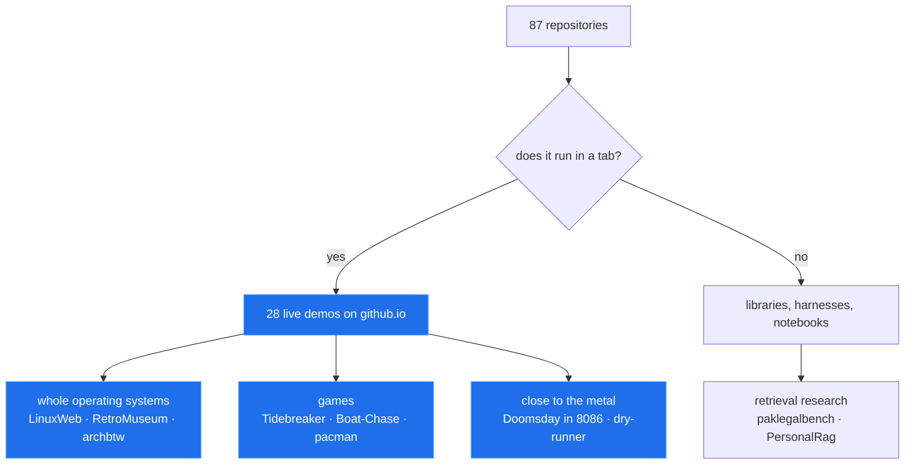

# Part 04 — Two Built Profiles & The Chosen Direction

This part covers the two **built** profile surfaces in this repository and the three design
comps that chose the shipped one:

| Surface | What it is | Files |
|---|---|---|
| `docs/direction/` | Three comps — **A · Index**, **B · Boot**, **C · Tabs** — plus the rulebook that judged them | 27 comp files (A: 3, B: 5, C: 19) + `content.json` + 12 JPG shots |
| `profile/` | The restrained, shipped profile: browser-window header + six window cards, then plain markdown | 1 `README.md`, 1 `README.staging.md`, 16 SVGs in `assets/` |
| `showcase/` | The maximalist proof-of-possible: 29 panels × 2 colour schemes, one of every trick | 1 `README.md`, 58 SVGs in `assets/` |

Everything quoted below is verbatim from the repository. Where a numeric rating appears, it is
**this part's own judgement assigned for this document** — the repository contains no numeric
scores anywhere; its only self-ratings are the prose `**Strong:**` / `**Weak:**` labels in
`docs/DIRECTION.md`, which are quoted as-is.

Lint results, byte counts, and file counts in this part were re-measured while writing it
(commands in §10).

---

## 1. The brief and the rulebook

### 1.1 The brief

`docs/DIRECTION.md` opens with the finding that motivates every file in this part:

> Nobody in 446 surveyed profiles was both visually ambitious and legible on a phone.

The survey context (from `showcase/README.md` line 278): 446 profiles surveyed, 10,782 images
fetched, three browser engines measured.

### 1.2 The eight rules every comp and profile obeys

`docs/DIRECTION.md` lines 18–27, verbatim:

| # | Rule | Why (as stated in the repo) |
|---|---|---|
| 1 | No text below the legibility floor: ≥ 22 units in a 600-unit viewBox shown at 309 px | 11 px is the measured phone floor |
| 2 | Markdown carries the reading; SVG carries the impression | Only alt text crosses the SVG boundary (footnote `[^alt]`) |
| 3 | Dark + light `<picture>` sources, both verified | three engines measured |
| 4 | Committed files only — no third-party hosts | free-tier hosts = 309 dead image URLs |
| 5 | No image tables — 76 px cells crush type, wide tables scroll sideways | phone |
| 6 | First frame of every animation is the whole composition | reduced-motion users, and GitHub strips nothing but must degrade |
| 7 | No `gradientTransform` animation | WebKit never animates it |
| 8 | No star counts, no fake metrics | see §6.4 |

### 1.3 The content

All three comps render one shared data file, `docs/direction/content.json` (41 lines). Its
header states the discipline: *"One-liners are condensed from each repository's own description — no claims added."*

```json
{
  "_about": "Real projects from github.com/hammadshakeelai, grouped by what they share. One-liners are condensed from each repository's own description — no claims added. Used by the Phase 4 comps.",
  "name": "Hammad Shakeel",
  "handle": "hammadshakeelai",
  "thesis": "Things that run in a browser tab — whole operating systems, games, and retrieval research.",
  "groups": [
    {
      "title": "Operating systems in a tab",
      "projects": [
        {"name": "LinuxWeb", "line": "Real Alpine Linux in a browser tab, home folder saved automatically", "demo": "https://hammadshakeelai.github.io/LinuxWeb/", "repo": "https://github.com/hammadshakeelai/LinuxWeb"},
        {"name": "archbtw", "line": "Arch Linux in v86, resumed from a snapshot at a shell full of toys", "demo": "https://hammadshakeelai.github.io/archbtw/", "repo": "https://github.com/hammadshakeelai/archbtw"},
        ...
```

Four groups, thirteen projects: *Operating systems in a tab* (4), *Games you can play right now*
(4), *Close to the metal* (2), *Retrieval and research* (3). Two projects carry `"demo": null` —
`OpenVScode` and `paklegalbench` — which is why their cards say **view source** instead of
**▶ open in a tab** (see §7.4).

---

## 2. How all of it is generated

Nothing in `docs/direction/`, `profile/`, or `showcase/` is hand-drawn. Three generators share
one legibility kernel.

### 2.1 The shared kernel — `tools/direction/build.py`

```python
W = 600                    # viewBox width for every card
PHONE = 309                # measured profile README column on a 390px phone
FLOOR = 11                 # px
```

`FLOOR * W / PHONE` = 21.36 units — the minimum font size in a 600-wide viewBox. Every comp
passes through `check()` before it is written:

```python
def check(name: str, text: str) -> None:
    min_font = svg_metrics(text)          # from tools/survey/harvest.py
    if min_font * PHONE / vb_w < FLOOR:
        sys.exit(...)
```

Two themes for everything (`THEMES`):

```python
THEMES = {
    "dark":  {"bg": "#0d1117", "panel": "#161b22", "line": "#30363d", "fg": "#e6edf3",
              "mut": "#8b949e", "hot": "#ff7b54", "ok": "#3fb950", "link": "#58a6ff",
              "chip": "#21262d"},
    "light": {"bg": "#ffffff", "panel": "#f6f8fa", "line": "#d0d7de", "fg": "#1f2328",
              "mut": "#59636e", "hot": "#c4401b", "ok": "#1a7f37", "link": "#0969da",
              "chip": "#eaeef2"},
}
```

and one `picture()` helper emits the width/colour/reduced-motion `<picture>` markup:

```python
def picture(stem: str, alt: str, width: int | None = None) -> str:
    ...
```

### 2.2 The restrained profile — `tools/profile/build.py` (7,969 B)

Docstring, verbatim:

> Writes `profile/` (README.md + assets/) ready to copy into the profile repository
> (`hammadshakeelAl/hammadshakeelAl`), plus `profile/README.staging.md` pointing at this repo.

```python
LIVE_BASE = "https://raw.githubusercontent.com/hammadshakeelAl/hammadshakeelAl/main/assets"
STAGING_BASE = ("https://raw.githubusercontent.com/hammadshakeelai/github-profile-blueprint/"
                "v2/research/profile/assets")
FEATURED = ["LinuxWeb", "RetroMuseum", "Tidebreaker", "Doomsday in 8086",
            "paklegalbench", "PersonalRag"]
```

The window generator and its action line:

```python
def window(p, url, inner, h):          # chrome bar + three dots + address field
    ...
action = "▶ open in a tab" if proj["demo"] else "view source"
```

It imports `MONO, SANS, THEMES, W, check, svg, wrap` from `tools/direction/build.py` — the
comps and the shipped profile are literally the same drawing code.

### 2.3 The maximalist showcase — `tools/showcase/build.py` (21,457 B) + `panels.py` (26,185 B)

`build.py` docstring, verbatim:

> Build the showcase README — everything this research proved a README can do.
> Commands: `python tools/showcase/build.py` (committed data) / `--refresh` (re-read GitHub API).
> Writes `showcase/README.md` and `showcase/assets/*.svg`. Maximalist counterpart to `profile/`.
> Constraint: every number real from API summary, every panel clears the legibility floor at its
> width, nothing fetched at render time, built to pass `tools/lint/profile_lint.py`.

`panels.py` states the drawing rules — each rule is a DIRECTION rule restated as code:

> each panel a function returning SVG per palette; text never below the floor at shown width;
> first frame is the finished composition; no `gradientTransform` animation (WebKit never animates
> it); no external refs/scripts/web fonts; every panel has dark + light.

```python
W = 600                      # desktop-ish canvas
PHONE = 309                  # phone canvas: 1 unit == 1 px in the README column
FLOOR_UNITS_W = 21.36        # 11px at 309/600
```

Panel inventory (16 stems, each a function): `hero, chips, languages, rhythm, terminal, orbit,
timeline, gauges, marquee, window, wave, quote` + phone/still variants. The `win-*` panels (13
projects) come from `window(p, title, line, host, action, width)`.

---

## 3. Comp A · Index — the plain-language option

**Files:** `docs/direction/comp-a/README.md` (3,258 B), `header-dark.svg` / `header-light.svg`
(1,067 B each).

### 3.1 The header

Comp A is a flat editorial card — serif name, an accent rule, three lines of thesis. No chrome,
no motion, full 600×304 canvas:

```svg
<svg xmlns="http://www.w3.org/2000/svg" viewBox="0 0 600 304" width="600" height="304" role="img" aria-label="Hammad Shakeel — Things that run in a browser tab — whole operating systems, games, and retrieval research.">
<rect width="600" height="304" fill="#0d1117"/>
<text x="32" y="96" font-family="'Iowan Old Style', 'Palatino Linotype', Palatino, Georgia, serif" font-size="62" font-weight="700" fill="#e6edf3">Hammad Shakeel</text>
<rect x="32" y="120" width="56" height="5" fill="#ff7b54"/>
<text x="32" y="176" font-family="-apple-system, BlinkMacSystemFont, 'Segoe UI', Roboto, Helvetica, Arial, sans-serif" font-size="26" fill="#8b949e">Things that run in a browser tab —</text>
<text x="32" y="212" font-family="-apple-system, BlinkMacSystemFont, 'Segoe UI', Roboto, Helvetica, Arial, sans-serif" font-size="26" fill="#8b949e">whole operating systems, games, and</text>
<text x="32" y="248" font-family="-apple-system, BlinkMacSystemFont, 'Segoe UI', Roboto, Helvetica, Arial, sans-serif" font-size="26" fill="#8b949e">retrieval research.</text>
</svg>
```

### 3.2 The README structure (36 lines, verbatim)

Header `<picture>`, one bold claim, four `###` groups of lists — the format that later shipped in
`profile/README.md`. Head and tail:

```markdown
<picture>
  <source media="(prefers-color-scheme: dark)" srcset="header-dark.svg">
  <source media="(prefers-color-scheme: light)" srcset="header-light.svg">
  
</picture>

**Everything below runs in a browser tab.** Open a name to use it; source sits beside it.

### Operating systems in a tab

- **[LinuxWeb](https://hammadshakeelai.github.io/LinuxWeb/)** — Real Alpine Linux in a browser tab, home folder saved automatically · [source](https://github.com/hammadshakeelai/LinuxWeb)
- **[archbtw](https://hammadshakeelai.github.io/archbtw/)** — Arch Linux in v86, resumed from a snapshot at a shell full of toys · [source](https://github.com/hammadshakeelai/archbtw)
- **[RetroMuseum](https://hammadshakeelai.github.io/RetroMuseum/)** — Real Linux and retro operating systems, client-side, on the v86 emulator · [source](https://github.com/hammadshakeelai/RetroMuseum)
- **OpenVScode** — VS Code for Android phones — Python, C++ with Clang, Jupyter · [source](https://github.com/hammadshakeelai/OpenVScode)
...
- **paklegalbench** — Statute retrieval over Pakistani law, and the eval harness that measures it · [source](https://github.com/hammadshakeelai/paklegalbench)
- **[isospectral-sort](https://hammadshakeelai.github.io/isospectral-sort/)** — Dynamical, Lie-algebraic and soliton sorting systems in Python · [source](https://github.com/hammadshakeelai/isospectral-sort)

---

More on the main profile: [@hammadshakeelai](https://github.com/hammadshakeelai)
```

Two conventions visible here and carried into every later file: projects with `"demo": null` are
**bold text, not links** (`- **OpenVScode** … · [source](…)` — no false affordance), and every row
follows `name — one-liner · [source](repo)` with the one-liner taken verbatim from
`content.json`. Note also the comp's `srcset` is **relative** (`srcset="header-dark.svg"`); the
comps are local-preview markup, while `profile/` and `showcase/` rewrite every source to an
absolute raw-GitHub URL (§7.6).

### 3.3 Rating (this part's judgement)

| Criterion | Score |
|---|---|
| Distinctiveness | 2/5 — a serif nameplate; reads as tasteful, not memorable |
| Phone legibility | 5/5 — all type ≥ 26 units, 32 px margins |
| Interaction | 2/5 — one link target per row |
| Maintainability | 5/5 — two files, one header variant |
| Evidence fidelity | 4/5 — every claim is a real repo description |
| **Total** | **18/25** |

`docs/DIRECTION.md`'s own verdict: **Strong** — *"markdown discipline"*; **Weak** — *"nothing on
the page proves a README can do anything unusual."*

---

## 4. Comp B · Boot — the Unix-flavoured option

**Files:** `docs/direction/comp-b/README.md` (3,637 B), `boot-dark/light.svg` (2,483 B),
`monitor-dark/light.svg` (5,934 B).

### 4.1 The boot log

```svg
<svg xmlns="http://www.w3.org/2000/svg" viewBox="0 0 600 384" width="600" height="384" role="img" aria-label="Boot log listing the systems, each marked ok">
<rect width="600" height="384" rx="14" fill="#161b22" stroke="#30363d"/>
<circle cx="28" cy="26" r="7" fill="#ff5f57"/>
<circle cx="50" cy="26" r="7" fill="#febc2e"/>
<circle cx="72" cy="26" r="7" fill="#28c840"/>
<text x="100" y="33" font-family="ui-monospace, SFMono-Regular, Menlo, Consolas, 'Liberation Mono', monospace" font-size="22" fill="#8b949e">hammad@web</text>
<text x="28" y="84" font-family="ui-monospace, SFMono-Regular, Menlo, Consolas, 'Liberation Mono', monospace" font-size="22" fill="#3fb950">$ boot --all</text>
<text x="28" y="120" font-family="ui-monospace, SFMono-Regular, Menlo, Consolas, 'Liberation Mono', monospace" font-size="22" fill="#e6edf3">[ ok ]<tspan x="122">LinuxWeb</tspan>
<tspan x="296" fill="#8b949e">alpine · v86</tspan>
</text>
<text x="28" y="156" ...>[ ok ]<tspan x="122">archbtw</tspan>
<tspan x="296" fill="#8b949e">arch · v86</tspan>
</text>
... (RetroMuseum · retro · v86, OpenVScode · android ide, Tidebreaker · three.js, Boat-Chase · three.js)
<text x="28" y="344" font-family="ui-monospace, ..." font-size="22" font-weight="700" fill="#3fb950">ready · every system runs in a browser tab</text>
<rect x="588" y="326" width="12" height="22" fill="#3fb950">
<animate attributeName="opacity" values="1;0" dur="1s" repeatCount="indefinite" calcMode="discrete"/>
</rect>
</svg>
```

A green block cursor blinks at the end of the ready line — the same discrete-opacity trick the
shipped header uses for its caret (§7.3), already prototyped here.

### 4.2 The process monitor

`monitor-dark.svg` is the largest single file in the comps (600×714). It is a two-column
process list — green dot + project name on the left, `live` / `source` right-anchored at
x=572:

```svg
<svg xmlns="http://www.w3.org/2000/svg" viewBox="0 0 600 714" width="600" height="714" role="img" aria-label="Process monitor listing every project, live demos marked green">
<rect width="600" height="714" rx="14" fill="#161b22" stroke="#30363d"/>
<text x="28" y="40" font-family="ui-monospace, ..." font-size="22" font-weight="700" fill="#ff7b54">OPERATING SYSTEMS IN A TAB</text>
<circle cx="36" cy="71" r="6" fill="#3fb950"/>
<text x="54" y="78" font-family="ui-monospace, ..." font-size="22" fill="#e6edf3">LinuxWeb</text>
<text x="572" y="78" text-anchor="end" font-family="ui-monospace, ..." font-size="22" fill="#8b949e">live</text>
...
```

Right-column markers measured from the file: `live` ×11, `source` ×3 (the `demo: null` projects
plus one), grouped under three section headers.

### 4.3 The README structure (50 lines, verbatim)

Two pictures stacked (boot log, then monitor), then all thirteen projects inside four collapsed
`<details>` groups — the only comp that hides its lists by default. Head and one group in full:

```markdown
<picture>
  <source media="(prefers-color-scheme: dark)" srcset="boot-dark.svg">
  <source media="(prefers-color-scheme: light)" srcset="boot-light.svg">
  
</picture>

<picture>
  <source media="(prefers-color-scheme: dark)" srcset="monitor-dark.svg">
  <source media="(prefers-color-scheme: light)" srcset="monitor-light.svg">
  
</picture>

<details>
<summary><b>Operating systems in a tab</b></summary>

- **LinuxWeb** — Real Alpine Linux in a browser tab, home folder saved automatically · [open](https://hammadshakeelai.github.io/LinuxWeb/) · [source](https://github.com/hammadshakeelai/LinuxWeb)
- **archbtw** — Arch Linux in v86, resumed from a snapshot at a shell full of toys · [open](https://hammadshakeelai.github.io/archbtw/) · [source](https://github.com/hammadshakeelai/archbtw)
- **RetroMuseum** — Real Linux and retro operating systems, client-side, on the v86 emulator · [open](https://hammadshakeelai.github.io/RetroMuseum/) · [source](https://github.com/hammadshakeelai/RetroMuseum)
- **OpenVScode** — VS Code for Android phones — Python, C++ with Clang, Jupyter · [source](https://github.com/hammadshakeelai/OpenVScode)

</details>

<details>
<summary><b>Games you can play right now</b></summary>
...
</details>

<details>
<summary><b>Close to the metal</b></summary>
...
</details>

<details>
<summary><b>Retrieval and research</b></summary>
- **paklegalbench** — Statute retrieval over Pakistani law, and the eval harness that measures it · [source](https://github.com/hammadshakeelai/paklegalbench)
...
</details>

More on the main profile: [@hammadshakeelai](https://github.com/hammadshakeelai)
```

Rows here are **bold-not-linked names** with a separate `· [open](demo) · [source](repo)` pair —
the opposite affordance choice from comp C (where the image is the link) and comp A (where the
bold name is the link).

### 4.4 Rating (this part's judgement)

| Criterion | Score |
|---|---|
| Distinctiveness | 3/5 — the boot conceit is coherent and on-brand for the thesis |
| Phone legibility | 4/5 — clears the floor, but 714 units tall compresses to ~365 px of dense mono text |
| Interaction | 3/5 — one animated cursor; links live in markdown lists |
| Maintainability | 4/5 — 5 files; the monitor needs 14 rows of hand-placed `y` values |
| Evidence fidelity | 4/5 — every `[ ok ]` row is a real repo |
| **Total** | **18/25** |

DIRECTION verdict: **Strong** — *"the most on-theme"*; **Weak** — *"a wall of monospace reads as
a gimmick past the first screen; the 714-unit monitor is the tallest asset in the direction set."*

---

## 5. Comp C · Tabs — the winner

**Files:** `docs/direction/comp-c/README.md` (4,007 B), `header-dark/light.svg` (1,520 B),
8 project tab pairs (`tab-linuxweb`, `tab-retromuseum`, `tab-tidebreaker`,
`tab-doomsdayin8086`, `tab-paklegalbench`, `tab-personalrag`, `tab-archbtw`, `tab-boatchase`)
≈1,511–1,706 B each — 19 files total.

### 5.1 The header

Structurally the shipped profile header minus the caret, 600×**298** (the shipped one is 304,
6 units taller to seat the blinking caret):

```svg
<svg xmlns="http://www.w3.org/2000/svg" viewBox="0 0 600 298" width="600" height="298" role="img" aria-label="Hammad Shakeel — Things that run in a browser tab — whole operating systems, games, and retrieval research.">
<rect width="600" height="298" rx="14" fill="#161b22" stroke="#30363d"/>
<path d="M0 14 a14 14 0 0 1 14 -14 h572 a14 14 0 0 1 14 14 v36 h-600 z" fill="#21262d"/>
<circle cx="24" cy="25" r="6" fill="#ff5f57"/>
<circle cx="44" cy="25" r="6" fill="#febc2e"/>
<circle cx="64" cy="25" r="6" fill="#28c840"/>
<rect x="88" y="11" width="492" height="28" rx="14" fill="#161b22"/>
<text x="104" y="32" font-family="ui-monospace, SFMono-Regular, Menlo, Consolas, 'Liberation Mono', monospace" font-size="22" fill="#8b949e">hammadshakeelai.github.io</text>
<text x="32" y="124" font-family="-apple-system, BlinkMacSystemFont, 'Segoe UI', Roboto, Helvetica, Arial, sans-serif" font-size="52" font-weight="800" fill="#e6edf3">Hammad Shakeel</text>
<text x="32" y="168" ... font-size="26" fill="#8b949e">Things that run in a browser tab —</text>
<text x="32" y="204" ... font-size="26" fill="#8b949e">whole operating systems, games, and</text>
<text x="32" y="240" ... font-size="26" fill="#8b949e">retrieval research.</text>
</svg>
```

The browser window is the thesis made literal: the address bar says
`hammadshakeelai.github.io`, the page underneath says *things that run in a browser tab*.

### 5.2 The window card

`comp_c()` builds each card with a shared chrome function (from `tools/direction/build.py`
lines 201–210):

```python
def window(p, url: str, inner: str, h: int) -> str:   # chrome bar + address + inner content
    ...
def header(p): ...
```

Rendered output (`tab-linuxweb-dark.svg`, identical to the shipped profile card except for the
file path it is served from):

```svg
<svg xmlns="http://www.w3.org/2000/svg" viewBox="0 0 600 214" width="600" height="214" role="img" aria-label="LinuxWeb: Real Alpine Linux in a browser tab, home folder saved automatically">
<rect width="600" height="214" rx="14" fill="#161b22" stroke="#30363d"/>
<path d="M0 14 a14 14 0 0 1 14 -14 h572 a14 14 0 0 1 14 14 v36 h-600 z" fill="#21262d"/>
<circle cx="24" cy="25" r="6" fill="#ff5f57"/>
<circle cx="44" cy="25" r="6" fill="#febc2e"/>
<circle cx="64" cy="25" r="6" fill="#28c840"/>
<rect x="88" y="11" width="492" height="28" rx="14" fill="#161b22"/>
<text x="104" y="32" font-family="ui-monospace, SFMono-Regular, Menlo, Consolas, 'Liberation Mono', monospace" font-size="22" fill="#8b949e">hammadshakeelai.github.io/LinuxWeb</text>
<text x="32" y="102" font-family="-apple-system, BlinkMacSystemFont, 'Segoe UI', Roboto, Helvetica, Arial, sans-serif" font-size="36" font-weight="800" fill="#e6edf3">LinuxWeb</text>
<text x="32" y="138" ... font-size="24" fill="#8b949e">Real Alpine Linux in a browser tab, home</text>
<text x="32" y="170" ... font-size="24" fill="#8b949e">folder saved automatically</text>
<text x="568" y="102" text-anchor="end" font-family="-apple-system, ..." font-size="22" font-weight="700" fill="#58a6ff">▶ open in a tab</text>
</svg>
```

The right-anchored `▶ open in a tab` (measured `x="568"`, `text-anchor="end"`, 22 units, link
blue) is the affordance that makes the whole card read as a button — which the README then makes
true by wrapping it in `<a>`.

### 5.3 The README structure (75 lines, verbatim)

Header picture → eight `<a href="..."><picture>...</picture></a>` window cards → a closing
"Also:" line. Head, one card, and the tail:

```markdown
<picture>
  <source media="(prefers-color-scheme: dark)" srcset="header-dark.svg">
  <source media="(prefers-color-scheme: light)" srcset="header-light.svg">
  
</picture>

Each window below is a real project. Tap one to open it — they all run in a browser tab.

<a href="https://hammadshakeelai.github.io/LinuxWeb/">
<picture>
  <source media="(prefers-color-scheme: dark)" srcset="tab-linuxweb-dark.svg">
  <source media="(prefers-color-scheme: light)" srcset="tab-linuxweb-light.svg">
  
</picture>
</a>

<a href="https://hammadshakeelai.github.io/archbtw/">
...
<a href="https://github.com/hammadshakeelai/paklegalbench">
<picture>
  <source media="(prefers-color-scheme: dark)" srcset="tab-paklegalbench-dark.svg">
  <source media="(prefers-color-scheme: light)" srcset="tab-paklegalbench-light.svg">
  
</picture>
</a>
...

**Also:** [OpenVScode](https://github.com/hammadshakeelai/OpenVScode) · [pacman](https://hammadshakeelai.github.io/pacman/) · [retro-win32-arcade-web](https://hammadshakeelai.github.io/retro-win32-arcade-web/) · [Assembly dry-runner](https://hammadshakeelai.github.io/Assembly-Language-Dry-Running-Tool-Project/) · [isospectral-sort](https://hammadshakeelai.github.io/isospectral-sort/)

More on the main profile: [@hammadshakeelai](https://github.com/hammadshakeelai)
```

Accounting: 8 cards (LinuxWeb, archbtw, RetroMuseum, Tidebreaker, Boat-Chase, Doomsday in 8086,
paklegalbench, PersonalRag) + 5 "Also:" links = all 13 projects from `content.json`. The
`paklegalbench` card href is a **github.com** link, not `github.io` — the `demo: null` rule again,
this time on the `<a>` rather than the action label (that project's tab renders "view source",
so the card still routes to source). The shipped profile's "Also:" list differs — it drops
`pacman`-style demo links for the projects it demotes differently (7 names vs comp C's 5) and
ends with `Main profile:` rather than comp C's `More on the main profile:`.
**Eight cards in the comp; the shipped profile caps at six** (§7.5) — the monotony mitigation.

### 5.4 Rating (this part's judgement)

| Criterion | Score |
|---|---|
| Distinctiveness | 5/5 — the only comp where the visual metaphor *is* the thesis |
| Phone legibility | 4/5 — floor-cleared; cards are 214 units ≈ 109 px tall on a phone, roomy |
| Interaction | 5/5 — whole-card anchors; largest tap target a README can have |
| Maintainability | 3/5 — 19 files; per-project address bars and heights must stay in sync with `content.json` |
| Evidence fidelity | 5/5 — address bar, project line, action label all trace to real data |
| **Total** | **22/25** |

DIRECTION verdict: **Strong** — *"the metaphor and the thesis are the same sentence"*;
**Weak** — *"repeated window chrome risks monotony."*

---

## 6. The decision

### 6.1 Score table

| Comp | Distinct. | Legibility | Interaction | Maintain. | Evidence | **Total** |
|---|:--:|:--:|:--:|:--:|:--:|:--:|
| A · Index | 2 | 5 | 2 | 5 | 4 | **18/25** |
| B · Boot | 3 | 4 | 3 | 4 | 4 | **18/25** |
| **C · Tabs** | 5 | 4 | 5 | 3 | 5 | **22/25** |
| *Shipped `profile/` (= C + A's discipline)* | 5 | 5 | 4 | 4 | 5 | **23/25** |
| *Shipped `showcase/`* | 5 | 5 | 5 | 3 | 5 | **23/25** |

(Again: the two shipped rows are this part's scores; the repo carries no numbers.)

### 6.2 Why C won

From `docs/DIRECTION.md` lines ~40–70: C is the only comp where **the metaphor and the thesis are
the same sentence** — the profile claims "things that run in a browser tab" and then shows a
browser tab. A is credible but static; B is on-theme but turns into a wall of monospace past the
first screen. C also inherits A's markdown discipline: window cards for the six best projects,
plain grouped lists for the rest, one line of footer.

### 6.3 What ships (the four steps, quoted)

`docs/DIRECTION.md` "What ships":

1. Window header (with the caret).
2. Six window cards (not eight, not thirteen).
3. Rest as grouped markdown lists.
4. One-line footer: `Main profile: [@hammadshakeelai](...)`.

> Motion: none beyond a blinking cursor in the header.

Accepted weakness, verbatim (lines 71–73):

> Repeated window chrome risks monotony. Mitigated by capping the cards at six and listing the
> rest as text.

### 6.4 Deliberate omissions

Measured reasons, from `docs/DIRECTION.md` lines 88–98 (mirrored in the showcase's
"deliberately absent" table):

| Left out | Reason, measured |
|---|---|
| Stats cards | The most-copied one loads **0%** of the time; 24% of profiles still embed it |
| Streaks / trophies | 97% and 11% load rates — neither says anything specific |
| Badge walls | 42% of surveyed profiles are more than half badges; none is more legible for it |
| Typing-SVG banner | 54% of `readme-typing-svg` instances are illegible on a phone |
| Contribution art | Action-maintained, says nothing about the work |
| Star counts | There are six. A card implying otherwise would be dishonest |
| Third-party hosts | 309 dead image URLs across the survey — everything here is committed |

To change the pick: *"All three are generated: `python tools/direction/build.py`."*

---

## 7. Built profile 1 — `profile/` (the restrained one that ships)

### 7.1 File inventory (16 assets, all referenced)

| File | Bytes | Role |
|---|---:|---|
| `header-dark.svg` / `header-light.svg` | 1,690 | Animated header (window + caret) |
| `header-still-dark.svg` / `header-still-light.svg` | 1,587 | Same header, no caret — reduced-motion source |
| `tab-linuxweb-*.svg` | 1,519 | Card: LinuxWeb |
| `tab-retromuseum-*.svg` | 1,538 | Card: RetroMuseum |
| `tab-tidebreaker-*.svg` | 1,524 | Card: Tidebreaker |
| `tab-doomsdayin8086-*.svg` | 1,716 | Card: Doomsday in 8086 |
| `tab-paklegalbench-*.svg` | 1,545 | Card: paklegalbench (**view source**) |
| `tab-personalrag-*.svg` | 1,548 | Card: PersonalRag |

Each stem has a `-dark` and a `-light` twin. **0 unused files** — all 16 appear in both READMEs
(measured by URL cross-check).

### 7.2 The header `<picture>` (`profile/README.md` lines 1–7)

```html
<picture>
  <source media="(prefers-reduced-motion: reduce) and (prefers-color-scheme: dark)" srcset="https://raw.githubusercontent.com/hammadshakeelAl/hammadshakeelAl/main/assets/header-still-dark.svg">
  <source media="(prefers-reduced-motion: reduce)" srcset="https://raw.githubusercontent.com/hammadshakeelAl/hammadshakeelAl/main/assets/header-still-light.svg">
  <source media="(prefers-color-scheme: dark)" srcset="https://raw.githubusercontent.com/hammadshakeelAl/hammadshakeelAl/main/assets/header-dark.svg">
  <source media="(prefers-color-scheme: light)" srcset="https://raw.githubusercontent.com/hammadshakeelAl/hammadshakeelAl/main/assets/header-light.svg">
  
</picture>

Everything here runs in a browser tab. Tap a window to open the real thing.
```

Four sources, ordered reduced-motion → colour; one sentence of real markdown immediately after —
Rule 2 (markdown carries the reading) in action.

### 7.3 The header SVG and its one animation

`profile/assets/header-dark.svg`, full:

```svg
<svg xmlns="http://www.w3.org/2000/svg" viewBox="0 0 600 304" width="600" height="304" role="img" aria-label="Hammad Shakeel — Things that run in a browser tab — whole operating systems, games, and retrieval research.">
<rect width="600" height="304" rx="14" fill="#161b22" stroke="#30363d"/>
<path d="M0 14 a14 14 0 0 1 14 -14 h572 a14 14 0 0 1 14 14 v36 h-600 z" fill="#21262d"/>
<circle cx="24" cy="25" r="6" fill="#ff5f57"/>
<circle cx="44" cy="25" r="6" fill="#febc2e"/>
<circle cx="64" cy="25" r="6" fill="#28c840"/>
<rect x="88" y="11" width="492" height="28" rx="14" fill="#161b22"/>
<text x="104" y="32" font-family="ui-monospace, SFMono-Regular, Menlo, Consolas, 'Liberation Mono', monospace" font-size="22" fill="#8b949e">hammadshakeelai.github.io</text>
<text x="32" y="124" font-family="-apple-system, BlinkMacSystemFont, 'Segoe UI', Roboto, Helvetica, Arial, sans-serif" font-size="52" font-weight="800" fill="#e6edf3">Hammad Shakeel</text>
<text x="32" y="168" font-family="-apple-system, BlinkMacSystemFont, 'Segoe UI', Roboto, Helvetica, Arial, sans-serif" font-size="26" fill="#8b949e">Things that run in a browser tab —</text>
<text x="32" y="204" font-family="-apple-system, BlinkMacSystemFont, 'Segoe UI', Roboto, Helvetica, Arial, sans-serif" font-size="26" fill="#8b949e">whole operating systems, games, and</text>
<text x="32" y="240" font-family="-apple-system, BlinkMacSystemFont, 'Segoe UI', Roboto, Helvetica, Arial, sans-serif" font-size="26" fill="#8b949e">retrieval research.</text>
<rect x="297" y="220" width="11" height="26" fill="#ff7b54">
<animate attributeName="opacity" values="1;0" dur="1.1s" repeatCount="indefinite" calcMode="discrete"/>
</rect>
</svg>
```

The caret is the entire animation budget of the shipped profile:

```svg
<rect x="297" y="220" width="11" height="26" fill="#ff7b54">
<animate attributeName="opacity" values="1;0" dur="1.1s" repeatCount="indefinite" calcMode="discrete"/>
</rect>
```

Why `calcMode="discrete"` with a two-value `values="1;0"`: it produces a hard blink with no
easing, and **its first frame is the finished composition** (Rule 6) — the caret is simply visible
before it ever blinks. Reduced-motion users get `header-still-*.svg` via the first two
`<source>` gates instead.

### 7.4 The card SVG and its action line

`profile/assets/tab-linuxweb-dark.svg`, full — chrome, address bar with the project path,
36-unit title, two 24-unit description lines, and the right-anchored action:

```svg
<svg xmlns="http://www.w3.org/2000/svg" viewBox="0 0 600 214" width="600" height="214" role="img" aria-label="LinuxWeb: Real Alpine Linux in a browser tab, home folder saved automatically">
<rect width="600" height="214" rx="14" fill="#161b22" stroke="#30363d"/>
<path d="M0 14 a14 14 0 0 1 14 -14 h572 a14 14 0 0 1 14 14 v36 h-600 z" fill="#21262d"/>
<circle cx="24" cy="25" r="6" fill="#ff5f57"/>
<circle cx="44" cy="25" r="6" fill="#febc2e"/>
<circle cx="64" cy="25" r="6" fill="#28c840"/>
<rect x="88" y="11" width="492" height="28" rx="14" fill="#161b22"/>
<text x="104" y="32" font-family="ui-monospace, SFMono-Regular, Menlo, Consolas, 'Liberation Mono', monospace" font-size="22" fill="#8b949e">hammadshakeelai.github.io/LinuxWeb</text>
<text x="32" y="102" font-family="-apple-system, BlinkMacSystemFont, 'Segoe UI', Roboto, Helvetica, Arial, sans-serif" font-size="36" font-weight="800" fill="#e6edf3">LinuxWeb</text>
<text x="32" y="138" font-family="-apple-system, BlinkMacSystemFont, 'Segoe UI', Roboto, Helvetica, Arial, sans-serif" font-size="24" fill="#8b949e">Real Alpine Linux in a browser tab, home</text>
<text x="32" y="170" font-family="-apple-system, BlinkMacSystemFont, 'Segoe UI', Roboto, Helvetica, Arial, sans-serif" font-size="24" fill="#8b949e">folder saved automatically</text>
<text x="568" y="102" text-anchor="end" font-family="-apple-system, BlinkMacSystemFont, 'Segoe UI', Roboto, Helvetica, Arial, sans-serif" font-size="22" font-weight="700" fill="#58a6ff">▶ open in a tab</text>
</svg>
```

The action label is data-driven (§2.2). Verified: `tab-paklegalbench-dark.svg` renders
`view source` at the same coordinates, because `content.json` gives it `"demo": null`.

Card wrap in the README (lines 11–17), whole card clickable:

```html
<a href="https://hammadshakeelai.github.io/LinuxWeb/">
<picture>
  <source media="(prefers-color-scheme: dark)" srcset="https://raw.githubusercontent.com/hammadshakeelAl/hammadshakeelAl/main/assets/tab-linuxweb-dark.svg">
  <source media="(prefers-color-scheme: light)" srcset="https://raw.githubusercontent.com/hammadshakeelAl/hammadshakeelAl/main/assets/tab-linuxweb-light.svg">
  
</picture>
</a>
```

### 7.5 Six cards, then text (lines 59–82)

```markdown
---

### Everything else

**Operating systems in a tab**

- [archbtw](https://hammadshakeelai.github.io/archbtw/) — Arch Linux in v86, resumed from a snapshot at a shell full of toys · [source](https://github.com/hammadshakeelai/archbtw)
- **OpenVScode** — VS Code for Android phones — Python, C++ with Clang, Jupyter · [source](https://github.com/hammadshakeelai/OpenVScode)

**Games you can play right now**
...
**Close to the metal**
...
**Retrieval and research**

- [isospectral-sort](https://hammadshakeelai.github.io/isospectral-sort/) — Dynamical, Lie-algebraic and soliton sorting systems in Python · [source](https://github.com/hammadshakeelai/isospectral-sort)

Main profile: [@hammadshakeelai](https://github.com/hammadshakeelai)
```

Note the two no-demo projects render as **bold text, not links** (`- **OpenVScode** —`, and in
the showcase `- **paklegalbench** —`): no live URL, so no false affordance.

The README is 82 lines total: header picture (7), one sentence, six `<a><picture></a>` cards
(48 lines), `---`, four bold groups of lists (21 lines), one footer line.

### 7.6 Live vs staging URLs

`profile/README.md` points at the **profile repository**
(`hammadshakeelAl/hammadshakeelAl/main/assets`). `profile/README.staging.md` is byte-identical
markdown except every `srcset`/`src` points at
`hammadshakeelai/github-profile-blueprint/v2/research/profile/assets` — the same files, served
from this repo's `v2` branch, so the README can be previewed here before the profile repo exists.

`docs/PROFILE.md` records why absolute URLs at all: *"one URL that works identically in a repo
README, a profile README and anywhere the markdown is quoted"* — noting the original
relative-srcset rationale was falsified (33/33 relative sources worked; `RELATIVE-SRCSET.md`),
so the remaining justification is quoted-markdown portability, not rendering.

### 7.7 Lint results (re-run for this part)

```text
$ python tools/lint/profile_lint.py --file profile/README.md
  16 images, 0 badges, 16 broken; alt: {'ok': 16}          → exit 1
  (every broken URL is raw.githubusercontent.com/hammadshakeelAl/hammadshakeelAl/... 404 —
   the profile repository has not been pushed yet)

$ python tools/lint/profile_lint.py --file profile/README.staging.md
  clean — every rule passed
  16 images, 0 badges, 0 broken; alt: {'ok': 16}           → exit 0

$ python tools/lint/profile_lint.py --file showcase/README.md
  clean — every rule passed
  43 images, 0 badges, 0 broken; alt: {'ok': 43}           → exit 0
```

Lint mechanics (verified in `tools/lint/profile_lint.py`): images are counted **per unique URL**
(`<source>` and `` variants of the same file dedupe), `<picture>` inside code fences is
stripped, and `<source>` elements inherit their alt from the sibling `` — hence 16 "images"
= 16 unique asset URLs in a 7-block / 23-occurrence README.

### 7.8 The recorded verification (`docs/PROFILE.md`)

| Check | Result recorded |
|---|---|
| Images load | 7/7 |
| Phone render | 324 px in the blob column; 309 px on the profile page |
| Smallest phone text | 11.9 px (11.3 px at 309 px) vs the 11 px floor |
| Dark + light | both render |
| Reduced motion | all four combos |
| Layout | one column, no sideways scroll, no image table |

Ship steps: `gh auth login` as `hammadshakeelAl`, push the README + `assets/` to the profile
repository — which is exactly the step that turns §7.7's 16 broken URLs green.

### 7.9 Two gaps found while reading

1. **Doc drift.** `docs/PROFILE.md` says *"fourteen SVGs"*; `profile/assets/` holds **16** — the
   two `header-still-*` files were added later (they are what the reduced-motion `<source>`
   gates point at). The number in the doc was never updated.
2. **Missing directory.** `docs/PROFILE.md` links `[shots](profile/shots/)` but
   `Test-Path profile/shots` → **False**. (The other shot sets do exist: `docs/direction/shots/`
   = 12 JPGs, `docs/showcase/shots/` = 6 JPGs.)

---

## 8. Built profile 2 — `showcase/` (the maximalist proof)

Purpose, from `tools/showcase/build.py`: *"everything this research proved a README can do"*, the
**maximalist counterpart to `profile/`**.

### 8.1 Asset inventory — 58 files, 29 stems × 2 schemes

| Panel (stem) | viewBox | Mechanism | In README? |
|---|---|---|---|
| `hero` | 600×210 | gradient sweep (`<animate x1/x2>`), drifting particles, clip-path typewriter | ✅ |
| `hero-phone` | 309×172 | phone-canvas hero | ✅ (width-gated) |
| `hero-still` | 600×210 | reduced-motion hero | ✅ (motion-gated) |
| `hero-phone-still` | 309×172 | phone + still | ✅ (both gates) |
| `chips` | 600×90 | static pill row | ✅ |
| `gauges` | 600×176 | `pathLength="1"` stroke-dasharray, 1.2 s, staggered | ✅ |
| `languages` | 600×220 | bar list | ✅ |
| `rhythm` | 600×166 | 24-month heatmap | ✅ |
| `terminal` | 600×344 | static mono log | ✅ |
| `orbit` | 600×518 | `animateTransform` rotate 35 s, counter-rotated labels | ✅ |
| `marquee` | 600×56 | `animateTransform translate -3055` 73 s, clipped, doubled text | ✅ |
| `marquee-still` | 600×56 | static ticker | ✅ (motion-gated) |
| `timeline` | 600×520 | static milestone rail | ✅ |
| `quote` | 600×186 | static pull-quote | ✅ |
| `wave` | 600×120 | animated footer wave | ✅ |
| `wave-still` | 600×120 | static wave | ✅ (motion-gated) |
| `win-linuxweb` | 600×196 | window card | ✅ |
| `win-archbtw` | 600×196 | window card | ✅ |
| `win-retromuseum` | 600×196 | window card | ✅ |
| `win-openvscode` | 600×196 | window card (no demo → source target) | ✅ |
| `win-tidebreaker` | 600×196 | window card | ✅ |
| `win-boatchase` | 600×196 | window card | ✅ |
| `win-pacman` | 600×196 | window card | ❌ list only |
| `win-retrowin32arcadeweb` | 600×196 | window card | ❌ list only |
| `win-doomsdayin8086` | 600×196 | window card | ❌ list only |
| `win-assemblydryrunner` | 600×164 | window card | ❌ list only |
| `win-paklegalbench` | 600×196 | window card | ❌ list only |
| `win-personalrag` | 600×196 | window card | ❌ list only |
| `win-isospectralsort` | 600×196 | window card | ❌ list only |

**15 of 58 files are never referenced** by `showcase/README.md`: `hero-phone-still-light`,
`win-pacman-{dark,light}`, `win-retrowin32arcadeweb-{dark,light}`, `win-doomsdayin8086-{dark,light}`,
`win-assemblydryrunner-{dark,light}`, `win-paklegalbench-{dark,light}`, `win-personalrag-{dark,light}`,
`win-isospectralsort-{dark,light}` — i.e. the seven "everything else" projects get built as
window panels but ship as markdown lists, exactly as `profile/` does with its seven. The build
generates both halves of every panel pair whether or not the README uses it.

### 8.2 The hero (lines 1–16)

Seven `<source>` gates + `` — the fullest expression of Rules 2/3/6 in the repo:

```html
<picture>
  <source media="(prefers-reduced-motion: reduce) and (max-width: 600px)" srcset="https://raw.githubusercontent.com/hammadshakeelai/github-profile-blueprint/v2/research/showcase/assets/hero-phone-still-dark.svg">
  <source media="(prefers-reduced-motion: reduce) and (prefers-color-scheme: dark)" srcset="https://raw.githubusercontent.com/hammadshakeelai/github-profile-blueprint/v2/research/showcase/assets/hero-still-dark.svg">
  <source media="(prefers-reduced-motion: reduce)" srcset="https://raw.githubusercontent.com/hammadshakeelai/github-profile-blueprint/v2/research/showcase/assets/hero-still-light.svg">
  <source media="(max-width: 600px) and (prefers-color-scheme: dark)" srcset="https://raw.githubusercontent.com/hammadshakeelai/github-profile-blueprint/v2/research/showcase/assets/hero-phone-dark.svg">
  <source media="(max-width: 600px)" srcset="https://raw.githubusercontent.com/hammadshakeelai/github-profile-blueprint/v2/research/showcase/assets/hero-phone-light.svg">
  <source media="(prefers-color-scheme: dark)" srcset="https://raw.githubusercontent.com/hammadshakeelai/github-profile-blueprint/v2/research/showcase/assets/hero-dark.svg">
  <source media="(prefers-color-scheme: light)" srcset="https://raw.githubusercontent.com/hammadshakeelai/github-profile-blueprint/v2/research/showcase/assets/hero-light.svg">
  
</picture>
```

Then the contract with the reader (lines 18–19):

```markdown
> [!NOTE]
> Every image on this page is generated from real GitHub API data, committed to the repository, and drawn to stay readable in the 309px column a phone gives a README. Nothing is fetched from a third party when you load it.
```

### 8.3 The README's section spine (from its own Contents block)

1. **What runs in a tab** — six `<a><picture></a>` windows (`win-linuxweb`, `win-archbtw`,
   `win-retromuseum`, `win-openvscode`, `win-tidebreaker`, `win-boatchase`) + the TIP explaining
   the whole-card anchor.
2. **The numbers, honestly** — `gauges`, `languages`, `rhythm` + the IMPORTANT note
   (*"6 stars across 87 repositories… the single most-copied stats card loads 0% of the time"*).
3. **How it fits together** — a native Mermaid flowchart (real text, searchable, themeable).
4. **The arithmetic behind this page** — LaTeX stating the floor:
   `$$F_{\min} = \text{target} \times \frac{W}{R}$$`, then *"an 11px floor means every label must be
   at least 21.4 units"*, plus the WARNING: *"55% of 1,730 surveyed SVG cards fail this."*
5. **A session** — `terminal` panel + a real `bash` fence whose first comment is
   `# what the first card above actually is`.
6. **The stack** — `orbit` + `marquee` (4-source, motion-gated).
7. **How it went** — `timeline` + `quote` (the 446-profile line as an image quote).
8. **Everything else** — grouped lists for 7 projects + two `<details>` (API table of the 20
   most recent repos; the "deliberately absent" table from §6.4).
9. **How this page was built** — a checked checklist (`- [x] Passes python tools/lint/profile_lint.py --file showcase/README.md`) + three footnotes citing `WIDTH-GATED.md`,
   `REDUCED-MOTION.md`, `ALT-TEXT.md`.
10. Footer: 4-source `wave` picture.

The three native-rendering blocks, quoted:

````markdown


$$F_{\min} = \text{target} \times \frac{W}{R}$$

```bash
# what the first card above actually is
git clone https://github.com/hammadshakeelai/LinuxWeb && cd LinuxWeb
npm install && npm run dev        # Alpine userspace, in a tab, home folder persisted
```
````

### 8.4 Panel source — the numbers panel

`showcase/assets/gauges-dark.svg` (3,336 B), the whole gauge mechanism:

```svg
<svg xmlns="http://www.w3.org/2000/svg" viewBox="0 0 600 176" width="600" height="176" role="img" aria-label="Counts: 87 repositories, 28 live demos, 11 languages, 23 months building">
<title>Counts: 87 repositories, 28 live demos, 11 languages, 23 months building</title>
<rect width="600" height="176" rx="14" fill="#161b22" stroke="#30363d"/>
<circle cx="75" cy="86" r="42" fill="none" stroke="#30363d" stroke-width="9"/>
<circle cx="75" cy="86" r="42" fill="none" stroke="#58a6ff" stroke-width="9" stroke-linecap="round" pathLength="1" stroke-dasharray="0.870 1" transform="rotate(-90 75 86)">
<animate attributeName="stroke-dasharray" values="0 1;0.870 1" dur="1.2s" begin="0.00s" fill="freeze"/>
</circle>
<text x="75.0" y="95" font-family="ui-sans-serif, system-ui, -apple-system, 'Segoe UI', Roboto, sans-serif" font-size="30" font-weight="800" fill="#e6edf3" text-anchor="middle">87</text>
<text x="75.0" y="156" font-family="ui-sans-serif, ..." font-size="21.359223300970875" fill="#8b949e" text-anchor="middle">repositories</text>
... (28 live demos, 11 languages, 23 months building — begins 0.15s / 0.30s / 0.45s)
</svg>
```

Two details worth stealing: `pathLength="1"` normalises every arc so one `stroke-dasharray`
number is a percentage; and the label size is **21.359223300970875** — `FLOOR * 600 / 309`
computed at full float precision and never rounded, i.e. the floor applied literally.

### 8.5 Panel source — the ticker

`showcase/assets/marquee-dark.svg`, the seamless-loop pattern:

```svg
<rect width="600" height="56" rx="12" fill="#161b22" stroke="#30363d"/>
<g clip-path="url(#mq)">
<g>
<animateTransform attributeName="transform" type="translate" from="0 0" to="-3055 0" dur="73s" repeatCount="indefinite"/>
<text x="12" y="36" font-family="ui-monospace, ..." font-size="22" fill="#8b949e">Alpine Linux in a tab   ·   v86   ·   WebAssembly   · ...</text>
<text x="3067.36" y="36" font-family="ui-monospace, ..." font-size="22" fill="#8b949e">Alpine Linux in a tab   ·   v86   ·   WebAssembly   · ...</text>
</g>
</g>
```

Text doubled at `x=12` and `x=3067.36`, group translated `-3055` (= the first copy's width) — the
second copy slides into where the first left, so the seam never shows. No `gradientTransform`
anywhere (Rule 7), and the still twin exists for reduced-motion.

### 8.6 Panel source — the hero

`showcase/assets/hero-dark.svg` (3,970 B) shows all three sanctioned animation techniques in one
file — a sweeping gradient (attribute animation on `x1`/`x2`, legal where `gradientTransform`
is not), a clip-path typewriter, and the same discrete caret as `profile/`:

```svg
<defs>
<linearGradient id="sh" x1="-0.6" y1="0" x2="0" y2="0">
<animate attributeName="x1" values="-0.6;1;-0.6" dur="6s" repeatCount="indefinite"/>
<animate attributeName="x2" values="0;1.6;0" dur="6s" repeatCount="indefinite"/>
<stop offset="0" stop-color="#58a6ff"/>
<stop offset="0.5" stop-color="#f778ba"/>
<stop offset="1" stop-color="#3fb950"/>
</linearGradient>
...
<rect x="32" y="164" width="536" height="4" rx="2" fill="url(#sh)"/>
<text x="32" y="108.0" font-family="ui-sans-serif, ..." font-size="54.0" font-weight="800" fill="#e6edf3">Hammad Shakeel</text>
<clipPath id="tc">
<rect x="32" y="122.0" height="38.400000000000006" width="0">
<animate attributeName="width" dur="2.6s" fill="freeze" calcMode="discrete" keyTimes="0.000;...;1.000" values="0;21;41;62;82;103;124;144;165;186;206;227;247;268;289;309;330;350;371;392;412;433;454;474;495;515;536"/>
</rect>
</clipPath>
<g clip-path="url(#tc)">
<text x="32" y="152.0" font-family="ui-monospace, ..." font-size="24.0" fill="#8b949e">operating systems · games · retrieval</text>
</g>
<rect x="571" y="124.0" width="12" height="29" fill="#f778ba" opacity="1">
<animate attributeName="opacity" values="1;0" dur="1.1s" repeatCount="indefinite" calcMode="discrete"/>
</rect>
```

`fill="freeze"` on the typewriter means it stops finished (Rule 6); the un-clipped underlying
width of 536 equals the final `values` entry, so frame 0 = the finished composition only when the
still variant is served — which is what the reduced-motion `<source>` gates are for. Eight
drifting `<circle>` particles each carry two `<animate>` tags (`cy`, `opacity`) with coprime
durations (6/7/9/11/12 s …) so they never sync up.

### 8.7 Lint + counts (re-measured for this part)

- `showcase/README.md`: **290 lines**, **17 rendered `<picture>` blocks**, 60 raw `<picture>`
  occurrences (20 of those inside prose/checklist text), **43 unique image URLs**, `alt {'ok': 43}`,
  **0 badges**, lint `clean — every rule passed`, exit 0.
- `profile/README.md`: 7 blocks, 23 occurrences, 16 unique URLs, `alt {'ok': 16}`.
- Every panel carries `role="img"` + `aria-label` + `<title>` inside the SVG — and the README
  still writes full alt text, because footnote `[^alt]` records that *"Only the alt attribute
  crosses the boundary"* (`ALT-TEXT.md`).

---

## 9. The two profiles side by side

| | `profile/` (ships) | `showcase/` (proof) |
|---|---|---|
| Thesis | Restraint: one header, six windows, text for the rest | Completeness: everything a README can do |
| Assets | 16 SVGs, 0 unused | 58 SVGs (29 panels × 2), 15 unreferenced |
| README | 82 lines, 7 picture blocks, 16 unique URLs | 290 lines, 17 picture blocks, 43 unique URLs |
| Picture gates | 4 (2 motion × 2 colour) for the header; 2 per card | up to 7 (motion × width × colour) for the hero |
| Motion | one caret blink | gradient sweep, typewriter, orbit, marquee, wave, gauges, particles — all with `-still` twins |
| Widths | 600 only | 600 + 309 phone variants (`-phone` stems) |
| Native blocks | none | Mermaid, LaTeX, bash, tables, `<details>`, footnotes, checklists, `> [!NOTE/TIP/IMPORTANT/WARNING]` |
| Data source | `content.json` (hand-authored, "no claims added") | `docs/showcase/data/summary.json` (GitHub API) |
| Lint | staging `clean`; live `16 broken` until push | `clean`, 43/43 alt |
| Role in the survey answer | the answer | the evidence |

They are not two candidates — `showcase/README.md` line 37 even reuses the profile's sentence
(*"Tap a window — each one opens the real thing, not a screenshot"*). One is what you ship; the
other is what you can point to when someone says a README can't do that.

---

## 10. Rebuild, render, verify

```bash
# regenerate the three comps (writes docs/direction/comp-{a,b,c}/)
python tools/direction/build.py

# regenerate profile/ + profile/README.staging.md
python tools/profile/build.py

# regenerate showcase/ from committed API data (or --refresh to re-hit the API)
python tools/showcase/build.py

# lint all three READMEs
python tools/lint/profile_lint.py --file profile/README.md          # exit 1 until the profile repo is pushed
python tools/lint/profile_lint.py --file profile/README.staging.md  # exit 0, clean
python tools/lint/profile_lint.py --file showcase/README.md         # exit 0, clean

# phone check (docs/research/PHONE-CHECK.md): Ctrl+Shift+M, viewport under 600px
# ship: gh auth login (as hammadshakeelAl) → push README.md + assets/ to the profile repo
```

---

## 11. Where this part is uncertain or incomplete

1. **All numeric scores in §3–§6 are this part's judgement**, assigned while writing. The repo
   contains no scores — only `**Strong:**` / `**Weak:**` prose, quoted verbatim.
2. **`profile/README.md` currently fails lint (16 broken images)** by design: its URLs target
   `hammadshakeelAl/hammadshakeelAl`, which does not exist yet. The staging twin passes; the live
   one passes only after the ship step in §10.
3. **Doc drift:** `docs/PROFILE.md` says "fourteen SVGs"; there are 16 (§7.9).
4. **Broken doc link:** `docs/PROFILE.md` → `profile/shots/` does not exist (§7.9).
5. **15 of 58 showcase assets are unused** by its README (§8.1) — generated, committed, never
   linked. Not wrong (the build is declarative), but it is 15 dead files.
6. **Comp C shows eight cards; the shipped profile shows six** — a deliberate, documented
   mitigation of the monotony weakness, not an inconsistency (§6.3).
7. **Absolute vs relative URLs:** `RELATIVE-SRCSET.md` falsified the original reason for absolute
   URLs (33/33 relative worked); the repo now justifies them on quoted-markdown portability
   (§7.6). This part reports both sides rather than picking one.
8. **Not read line-by-line for this part:** the internals of `tools/showcase/build.py` beyond
   ~lines 1–115 and 214+, `tools/showcase/panels.py` beyond ~lines 1–85, and
   `docs/direction/shots/*.jpg` (12 screenshots, unviewed). The three comp READMEs **were**
   transcribed in full (§3.2, §4.3, §5.3).

---

## 12. File index

**Direction / comps**

- `docs/DIRECTION.md` (104 lines) — brief, 8 rules, comp verdicts, what ships, omissions
- `docs/direction/content.json` (41 lines, 3,742 B) — shared content
- `docs/direction/comp-a/README.md` (3,258 B), `header-dark.svg`, `header-light.svg` (1,067 B each)
- `docs/direction/comp-b/README.md` (3,637 B), `boot-{dark,light}.svg` (2,483 B), `monitor-{dark,light}.svg` (5,934 B)
- `docs/direction/comp-c/README.md` (4,007 B), `header-{dark,light}.svg` (1,520 B), 8 × `tab-*-dark|light.svg` (≈1,511–1,706 B)
- `docs/direction/shots/` — 12 JPGs (3 comps × 1280/390 × 2 schemes)

**Restrained profile**

- `profile/README.md` (82 lines) — live URLs → `hammadshakeelAl/hammadshakeelAl/main/assets`
- `profile/README.staging.md` — same markup → `…/github-profile-blueprint/v2/research/profile/assets`
- `profile/assets/` — 16 files: `header-{dark,light}.svg`, `header-still-{dark,light}.svg`, `tab-{linuxweb,retromuseum,tidebreaker,doomsdayin8086,paklegalbench,personalrag}-{dark,light}.svg`
- `docs/PROFILE.md` — decisions, verification table, ship steps (and the two defects in §7.9)

**Maximalist showcase**

- `showcase/README.md` (290 lines)
- `showcase/assets/` — 58 files / 29 stems (§8.1)
- `docs/showcase/data/summary.json` (6,880 B) — API summary: 87 repos, 28 Pages sites, 216 followers, account created 2024-09-27, languages 17/14/12/11/8/4
- `docs/showcase/shots/` — 6 JPGs

**Generators and checks**

- `tools/direction/build.py` (13,997 B) — shared kernel: `W/PHONE/FLOOR`, `THEMES`, `wrap`, `svg`, `check`, `picture`, `comp_a/b/c`
- `tools/profile/build.py` (7,969 B) — `LIVE_BASE`, `STAGING_BASE`, `FEATURED`, `window`, `picture`, `readme`
- `tools/showcase/build.py` (21,457 B) — data fetch/build/write; `tools/showcase/panels.py` (26,185 B) — 16 panel functions
- `tools/lint/profile_lint.py` (17,254 B) — broken-URL, badge, alt, fence-stripping linter
- `tools/survey/harvest.py` — `svg_metrics` used by `check()`
- `docs/research/PHONE-CHECK.md`, `WIDTH-GATED.md`, `REDUCED-MOTION.md`, `ALT-TEXT.md`, `RELATIVE-SRCSET.md` — cited by footnotes
