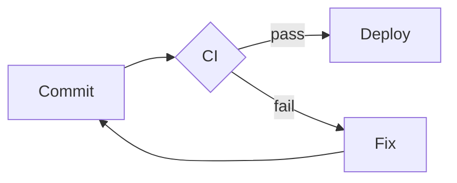

# Part 07 — The Generator & Toolkit Ecosystem (embed code, alive/dead status)

Every embed you paste into a profile README is a small lease on someone else's server.
This part is the field guide to that ecosystem: what each tool is, the exact code to paste,
whether it still answers when GitHub's image proxy knocks — and what to do when it doesn't.

**How the status marks were produced.** Each entry carries one of three marks:

| Mark | Meaning |
|---|---|
| **ALIVE** | Probed on 2026-09-26 and returned a real image (HTTP 200, `image/svg+xml` / `image/png`), *and/or* the survey measured ≥90% of its URLs in real profile READMEs loading. |
| **RISKY** | Answers today, but depends on a free Vercel/Heroku tier, one maintainer, an API token, or showed a 50–89% load rate in the survey. It will probably break eventually; have a fallback. |
| **DEAD** | Probe failed (402/404/503) on the canonical instance *and/or* the survey measured <50% live. Pasting the documented URL today produces a broken image. |

Survey numbers (`live %`, `illegible on phone`) come from `docs/survey/GENERATORS.md`:
**live** = share of distinct image URLs that returned a usable image;
**illegible on phone** = share of rendered images whose largest text is under 11px at 390px
(bracket = sample size). Maintenance status (`active/slowing/dormant/archived`) comes from
`docs/survey/TOOLS.md`: active = pushed within 6 months, slowing = within 2 years, dormant = older.

**The single most important finding of the survey:** the canonical `github-readme-stats`
public instance loaded **0%** of the time (215/215 URLs Vercel-paused), and overall **41% of
profiles show at least one broken image** — 309 broken URLs from Vercel alone. Hosting tier
predicts survival better than popularity:

1. **Dedicated infrastructure survives** — `img.shields.io` (100%), `komarev.com` (100%),
   DenverCoder1's `*.demolab.com` services (97–100%).
2. **Committed assets survive forever** — anything an Action writes into *your* repo
   (`Platane/snk` output branch: 93%; your own `user-attachments`: 99%).
3. **Free PaaS instances die quietly** — Vercel/Heroku/deta.dev: `github-readme-stats`
   public (0%), `github-readme-activity-graph` (2%), `github-profile-trophy` (11%),
   `lowlighter/metrics` hosted (0%), spotify cards (44%).

Rule of thumb for everything below: **prefer ALIVE + dedicated infra; if you must use a
Vercel URL, deploy your own copy of the repo and paste your own domain.**

---

## 1. Stats cards

### 1.1 `github-readme-stats` (the canonical one) — public instance **DEAD**, self-host **RISKY**

`anuraghazra/github-readme-stats` · 79.8k stars · pushed 2026-08-31 · maintenance `active`
but the README declares the project no longer maintained; successor is
`stats-organization/github-stats-extended`.

Survey: **public instance 0% live** (215 URLs, all `vercel-paused`);
**self-hosted 94% live** (86 URLs) · self-hosted illegible on phone 20% (82).
Probe 2026-09-26: `https://github-readme-stats.vercel.app/api?...` → **503**.

The snippet everyone still pastes, and why it's broken:

```markdown
<!-- DEAD — the shared instance is paused. Do not paste this. -->

```

**Option A — use a community mirror that is up today (RISKY, someone else's free tier):**

```markdown
<!-- Probed 200, image/svg, 2026-09-26. Someone else's Vercel project — it can pause too. -->


```

**Option B — self-host (the correct answer; ~10 minutes).** The repo's README documents
both a Vercel deploy and the recommended GitHub-Action route. With the Action you get a
card committed to *your* repository, so the image can only die if *you* delete it:

```yaml
# .github/workflows/stats.yml — deploy your own card generator (Vercel route)
name: deploy stats card
on:
  schedule: [ { cron: "0 0 * * *" } ]   # regenerate daily
  workflow_dispatch:
jobs:
  build:
    runs-on: ubuntu-latest
    steps:
      - uses: actions/checkout@v4
      # Deploy anuraghazra/github-readme-stats to your own Vercel account once
      # (vercel import → env: PAT_1 = a fine-grained token with public repo read),
      # then point README at https://YOUR-STATS.vercel.app/api?username=USERNAME
```

**Option C — the maintained successor (ALIVE):**

`stats-organization/github-stats-extended` — pushed 2026-09-23, 1.3k stars, plus
`stats-organization/github-readme-stats-action` (pushed 2026-09-19) which renders the card
inside your workflow and commits the SVG. Same parameters in spirit (`username`, `theme`,
`hide`, `show_icons`).

```markdown
<!-- After deploying your own instance of github-stats-extended -->

```

### 1.2 `FajarKim/github-readme-profile` — **ALIVE**

58 stars · pushed 2026-09-06 · `active`. A maintained `github-readme-stats`-alike with a
public instance that still answers: probe 200 `image/svg+xml` (10.6 KB), 2026-09-26.

```markdown


```

Useful params: `show` (`reviews,issues_closed,discussions_started,discussions_answered`),
`hide` (`repos,stars,forks,commits,prs,prs_merged,issues,contributed`), `format`
(`svg|png|json|xml`), `photo_resize`, `border_width`, `border_radius`.
**RISKY caveat:** it is one person's free Vercel project — treat it as a mirror, not a
dependency; the deploy-on-Vercel button in its README is the escape hatch.

### 1.3 `vn7n24fzkq/github-profile-summary-cards` — **ALIVE** (note the endpoint path)

3.7k stars · pushed 2026-09-10 · `active`. Survey: **89% live** (53 URLs),
illegible on phone 60% (52). Probe 2026-09-26: 200 `image/svg+xml`.

Beware: the path is `/api/cards/<card>` (plural `cards`), not `/api/cards-stats`.
Old `profile-summary-cards.vercel.app` URLs → 404 (DEAD).

```markdown
<!-- Stats card — probed 200, 2026-09-26 -->

<!-- Profile details — probed 200 -->

<!-- Repo per language -->

<!-- Most commit language -->

<!-- Productive time (pass your UTC offset) -->

<!-- Optional: animation=load, duration=3, hide_logo=true, bg_color=00000000 -->
```

Self-host: the repo ships a GitHub Action that writes one SVG per card into your own
profile repo — that variant inherits the "committed assets survive" guarantee.

### 1.4 `lowlighter/metrics` — repo **ALIVE**, public hosts **DEAD** → self-host only

17.2k stars · pushed 2026-05-29 · `active` (last release v3.34, 2023-09 — releases are slow,
the Action channel is alive). Survey: self-hosted/Action-rendered **97% live** (30 URLs),
illegible on phone 83% (29); **hosted instances 0% live** (3 URLs: 500s and a timeout).

`metrics` is the power tool: 30+ plugins, 300+ options, renders full infographics as SVG or
Markdown. It is also the heaviest thing you can put on a profile — 83% illegible on phone
is the highest of any surviving generator. Use it sparingly.

```yaml
# .github/workflows/metrics.yml — the only sanctioned way to run it in 2026
name: metrics
on:
  schedule: [ { cron: "0 0 * * 0" } ]
  workflow_dispatch:
permissions:
  contents: write
jobs:
  metrics:
    runs-on: ubuntu-latest
    steps:
      - uses: lowlighter/metrics@latest
        with:
          # requires a token with public repo read; keep it in Secrets
          token: ${{ secrets.METRICS_TOKEN }}
          user: USERNAME
          template: classic
          base: header, activity, community, repositories, metadata
          output: metrics.svg
          # commit the SVG into this repo, then reference it from README:
          # 
```

### 1.5 Long-tail stats generators (all `active` in `TOOLS.md`)

| Tool | Status | Probe / survey | Embed sketch |
|---|---|---|---|
| `rowkav09/GitHub-profile-stats` (41★, pushed 2026-09-21) | **RISKY** (new, small) | not in survey | see its README — "paste one line", Vercel-hosted |
| `dvigo/github-stats` (0★, pushed 2026-07-22) | **RISKY** | not probed | self-host SVG generator |
| `rafaeloliveiraz/gitglance` (2★, pushed 2026-09-13) | **RISKY** | not probed | self-host, "no rate-limit headaches" — explicitly built as the answer to 503s |
| `creativecodeco/gitcard-studio` (11★, pushed 2026-09-14) | **RISKY** | not probed | API + web studio, real-time cards |
| `JacobLinCool/LeetCode-Stats-Card` (949★, pushed 2026-09-25) | **ALIVE** (survey 100% live, 6 URLs) but illegible on phone **100%** (5) | direct probe of `leetcode-card.vercel.app` returned 404 on 2026-09-26 → **RISKY**, verify with a live username first | `` |
| `HwangTaehyun/github-repository-contribution-stats` (241★) | **RISKY** (`slowing`) | — | per-repo contribution stats |

---

## 2. Animations

### 2.1 `Platane/snk` — the contribution snake — **ALIVE** (because it commits its output)

6.1k stars · pushed 2026-04-29 · `active` · latest release v3.5.0 (2026-04-25).
Survey: **93% live** (74 URLs; failures are stale raw links, not the generator).
Probe 2026-09-26: the `output` branch SVG → 200, 100 KB, `image/svg+xml`.

```yaml
# .github/workflows/snake.yml
name: snk
on:
  schedule: [ { cron: "30 */3 * * *" } ]
  workflow_dispatch:
permissions:
  contents: write
jobs:
  snake:
    runs-on: ubuntu-latest
    steps:
      - uses: actions/checkout@v4
      - uses: Platane/snk/svg-only@v3
        with:
          github_user_name: USERNAME
          # out_files: "dist/github-contribution-grid-snake.svg,dist/github-contribution-grid-snake-dark.svg"
      - name: Commit output
        run: |
          git config user.name snk
          git config user.email snk@localhost
          git add -f dist && git commit -m "snake" && git push
```

```markdown
<!-- Committed to YOUR repo — no third-party server involved -->
<picture>
  <source media="(prefers-color-scheme: dark)" srcset="https://raw.githubusercontent.com/USERNAME/USERNAME/output/github-contribution-grid-snake-dark.svg">
  <source media="(prefers-color-scheme: light)" srcset="https://raw.githubusercontent.com/USERNAME/USERNAME/output/github-contribution-grid-snake.svg">
  
</picture>
```

Phone note: survey measured 100% illegible on phone — but on a sample of **2** images.
Ignore the rating; the snake reads fine because it is a picture, not text.

### 2.2 `dahan8473/snake-and-commits` — playable snake variant — **RISKY** (new)

26★ · pushed 2026-09-21 · `active`. Same commit-to-your-repo model, "zero dependencies,
drop-in Action", also emits light/dark SVGs:

```markdown


```

### 2.3 `Ashutosh00710/github-readme-activity-graph` — canonical instance **DEAD**

2.3k stars · pushed 2026-05-17 · repo `active` but survey: **2% live** (58 URLs —
55 `vercel-disabled`, 2 404s). Probe 2026-09-26: `github-readme-activity-graph.vercel.app`
→ **402**. This is the second-most-pasted broken image on GitHub.

```markdown
<!-- DEAD — this is what most READMEs still contain -->

```

Fix — fork and self-host (the repo README now says "DEPLOYMENT MOVED" and points at a new
Vercel project, which itself returned 402 to us; the only durable fix is your own deploy):

```markdown

```

### 2.4 `ryo-ma/github-profile-trophy` — canonical instance **DEAD**, forks **ALIVE**

6.7k stars · pushed 2026-07-25 · repo `active`. Survey: canonical **11% live** (37 URLs,
31 `vercel-disabled`); **forked/self-hosted trophy instances 100% live** (5 URLs).
Probe 2026-09-26: `github-profile-trophy.vercel.app` → **402**.

```markdown
<!-- DEAD on the shared instance -->


<!-- ALIVE: your own fork's deployment -->

```

Params worth knowing: `title=Followers`, `title=Stars,Followers`, `title=-Stars` (negation),
`rank=S,AAA`, `row`/`column` (`-1` = auto), `theme` (`onedark`, `flat`, …).

### 2.5 `DenverCoder1/readme-typing-svg` — typewriter — **ALIVE**

9.4k stars · pushed 2026-09-17 · `active`. Survey: **100% live** (103 URLs) — but
**illegible on phone 54%** (98): default 24px+ text survives, but many pasted configs shrink
below 11px at 390px. Probe 2026-09-26: 200 `image/svg+xml`.

```markdown

```

Params: `font`, `weight`, `size` (**keep ≥20**), `duration`/`pause` (ms), `color`,
`center`/`vCenter`, `width`, `lines` (`;`-separated), `repeat=true`, `demo=true`.
Its host `demolab.com` is the same operator behind streak-stats and custom-icon-badges —
dedicated infra, which is why it loads 100%.

### 2.6 `DenverCoder1/github-readme-streak-stats` — **ALIVE**

7.1k stars · pushed 2026-09-25 · `active`. Survey: **97% live** (97 URLs; 3 vercel-disabled),
illegible on phone **23%** (90) — the best text-size profile of any big card. Probe: 200.

```markdown

```

Params: `user`, `theme` (100+ named themes), `hide_border`, `background`, `border_radius`,
`date_format`, `locale`, `type=png`. Self-host: the repo ships an Action.

### 2.7 `yoshi389111/github-profile-3d-contrib` — 3D contribution cube — **ALIVE**

1.75k stars · pushed 2026-09-13 · `active` · release v0.9.3 (2026-06-15).
An Action that renders your calendar as a 3D isometric block and **commits the PNGs to
your repo** (`images/result/...`). No live server → survives.

```yaml
# .github/workflows/3dcontrib.yml
name: 3d-contrib
on:
  schedule: [ { cron: "0 0 * * *" } ]
  workflow_dispatch:
permissions:
  contents: write
jobs:
  contrib:
    runs-on: ubuntu-latest
    steps:
      - uses: actions/checkout@v4
      - uses: yoshi389111/github-profile-3d-contrib@v0.9.3
        env:
          GITHUB_TOKEN: ${{ secrets.GITHUB_TOKEN }}
          USERNAME: USERNAME
      - run: |
          git config user.name bot && git config user.email bot@localhost
          git add -f images && git commit -m "3d" && git push
```

### 2.8 Pixel, rainbow and other look-changers

| Tool | Status | Evidence | Embed |
|---|---|---|---|
| `LuciNyan/pixel-profile` (567★, pushed 2026-04-14) | **RISKY** | probe 200 `image/png` 161 KB, 2026-09-26 — but Vercel-hosted | `` — themes: `rainbow`, `road_trip`, `fuji`, `monica`, `summer`; `pixelate_avatar=false` |
| `kyechan99/capsule-render` (1.8k★, pushed 2026-09-18, `active`) | **ALIVE** | survey **100% live** (65 URLs), illegible 28% (29); probe 200 SVG | see §6 header banner |
| rainbow contribution grid (Platane/snk dark/light `<picture>`) | **ALIVE** | §2.1 | — |
| `nanaco666/git-minecraft` / `nrysk/gh-miner` (Minecraft mine/graph) | **RISKY** | 1★ / tiny, no survey presence, browser-extension or branch-based | verify before use; gh-miner writes `contributions.png` on a `gh-miner` branch |
| `egorthinks/git-bonsai` (5★, `active`) | **RISKY** | pixel-art bonsai grown from your history; playground-linked | outputs committed or via playground |
| `starlash7/github-candles` (1★, pushed 2026-09-20) | **RISKY** | contribution graph as a trading chart, SVG committed (`chart-year.svg`) | `` |
| `flycran/github-gravity` (2★, `active`) | **RISKY** | physics-based contribution animation | Action → committed SVG |
| `prsdx/YourTomo` (6★, `active`) | **RISKY** | pixel cat that reacts to activity; zero-dep Python → animated SVG | Action → committed SVG |
| `0xharkirat/dither-portrait` (1★, `active`) | **RISKY** | photo → animated dithered SVG | Action → committed SVG |
| `seuthootDev/github-readme-insight-terminal-ascii` (9★, `active`) | **RISKY** | terminal-style ASCII SVG of your contributions | Action → committed SVG |

**Why the long tail still matters:** everything in that table is `active` and commits its
output. None of them can suffer a `vercel-paused` event. The creative frontier moved from
"hosted widget" to "rendered by an Action into your own repo" — the single most durable
pattern in this ecosystem.

### 2.9 GIFs and giphy/tenor

Survey: giphy **98% live** (66 URLs), tenor **100%** (17), emoji GIFs (slackmojis,
partyparrot) **100%** (27). These are content CDNs, not generators — they survive.

```markdown


```

Caveat from the survey: animated images with **autoplay GIFs were never measured for phone
text size** — they carry no text, so they can't be illegible, but they also can't be read
at all when GitHub's proxy serves a static first frame. Put words in text, not in GIFs.

---

## 3. Badges, counters and icon systems

### 3.1 `badges/shields` — **ALIVE**, the load-bearing wall

27.2k stars · pushed 2026-09-25 · `active`. Survey: **100% live** (3,690 URLs — the single
largest source of images in profiles), median 690 ms, **illegible on phone 53%** (4,502).
Note the survey's own post-mortem: shields draws at `font-size="110"` in SVG units, and the
"100px" text reading is a measurement artifact — real badges are ~11px, i.e. borderline but
usable at 390px. 53% illegibility comes mostly from `style=` variants that shrink text.

```markdown
<!-- Static -->


<!-- Dynamic: profile-level -->


```

Keep `style=flat` / `flat-square` for phone legibility; `for-the-badge` is the worst
offender for 390px reading (it's big, but its all-caps text wraps and clips).

### 3.2 `DenverCoder1/custom-icon-badges` — **ALIVE**

976★ · pushed 2026-01-26 · `slowing` (repo) but its `demolab.com` host is the same
dedicated infra as streak-stats. Probe 200, 2026-09-26.

```markdown


```

Any octicon name or any icon from *your own* repo (`logo=repo-icon@main`) can be used —
that's how people brand badges without hosting an icon CDN.

### 3.3 Icon sets (survey: all **ALIVE**)

| Set | Survey live | Illegible | Notes |
|---|---|---|---|
| `tandpfun/skill-icons` (13.1k★, `slowing` 2026-02-27) | **100%** (197 URLs) | — | `` |
| `devicons/devicon` (11.8k★, `active`) | **100%** (201) | — | raw SVG paths from `cdn.jsdelivr.net/gh/devicons/devicon` |
| `simple-icons/simple-icons` (25.9k★, `active`) | **100%** (72) | — | brand SVGs, tint with `?color=` on jsDelivr |
| icon CDNs (icons8 / vectorlogo.zone / iconify / wikimedia / flaticon) | **92%** (189; 403/400s) | 100% (2) | third-party CDNs hotlink-block; prefer jsDelivr mirrors |

```markdown


```

### 3.4 Profile view counters

| Counter | Status | Evidence |
|---|---|---|
| `antonkomarev/github-profile-views-counter` (komarev) | **ALIVE** | survey **100% live** (103 URLs), median 1701 ms, illegible 45% (103); probe 200 on 2026-09-26; repo `slowing` (last push 2026-01-26) |
| `api.visitorbadge.io` | **ALIVE** | probe 200 SVG, 2026-09-26 |
| `visitor-badge.laobi.icu` | **ALIVE** | probe 200 SVG, 2026-09-26 |
| generic "visitor badge" (heroku/deta hosts) | **DEAD-ish** | survey **59% live** (44 URLs): 14× HTTP 410 Gone, 3× DNS failures; illegible 67% (24) |
| `api.countapi.xyz` | **DEAD** | probe ERR on 2026-09-26 — the countapi service shut down |
| `visitcount.itsvg.in` | **DEAD** | probe 404, 2026-09-26 |
| `journey-ad/Moe-Counter` (3.1k★, `active`) | **RISKY** | survey **100% live** (7 URLs) but our probe of `count.getloli.com` returned **403** (hotlink/UA protection) on 2026-09-26 — GitHub's camo fetched it fine during the survey; treat as "works, but you don't control it". Self-host: `ghcr.io/journey-ad/moe-counter` |

```markdown
<!-- komarev — the safe default -->

<!-- visitorbadge.io — alive, customizable -->

<!-- moe-counter — anime counter, themes via ?theme= -->

<!-- local moe-counter you host yourself -->

```

### 3.5 Charts-of-charts

- **`api.star-history.com`** — **ALIVE** (probe 200 SVG, 64 KB, 2026-09-26):
  ``
- **`2016rshah/githubchart-api`** (ghchart) — **RISKY**: survey 100% live (2 URLs) but repo
  last pushed **2024-03-19** (`dormant`-adjacent) and our probe got HTTP 500 for a
  placeholder user. Use only if you verify it live first:
  `` — phone illegible 100% (2).

---

## 4. Music, time-tracking and content feeds

### 4.1 Spotify now-playing — category **RISKY** (survey 44% live)

Survey: **44% live** (9 URLs — 2× HTTP 500, 1× network failure), illegible 0% (4, so the
text that does render is big enough). Three surviving options:

**a) `kittinan/spotify-github-profile` — ALIVE-ish (moved off Vercel in 2024).**
2.2k★ · pushed 2026-07-21 · `active`. Its README announces: *"Vercel free tier is not
enough — moved to self-host at Digital Ocean. Replace `spotify-github-profile.vercel.app`
with `spotify-github-profile.kittinanx.com`."* That migration is exactly the RISKY pattern:
the old URL everyone pasted is dead; the new one is one person's droplet.

```markdown
<!-- Current documented endpoint (OAuth connect first: /api/login) -->

```

Themes: `default`, `compact`, `natemoo-re`, `novatorem`, `karaoke`, `spotify-embed`, `apple`.
Params: `background_color`, `border_radius`, `bar_color`. Probe 2026-09-26 returned a small
`text/html` body for a non-linked uid — expected: **you must complete the Spotify OAuth
flow before the card exists.**

**b) `novatorem/novatorem` — RISKY.** 758★ · pushed 2026-02-16 · `slowing`. Fork-and-deploy
model (Unlicense), Last.fm-backed, "fork this to recreate". Same 44%-live fate as its twin
in the survey.

**c) `icortesb/vinilo` — the durable answer — ALIVE by construction.**
Pushed 2026-09-13, 0★, `active`. *"Your recently played Spotify tracks
as a static SVG in your README. No server, no handing over your token."* An Action renders
the SVG into a branch of **your** repo:

```markdown

```

No live host → cannot 404 unless you delete the file. This is the pattern to prefer.

### 4.2 WakaTime coding stats — **ALIVE** (survey 100% live)

Survey: **100% live** (9 URLs), illegible 44% (9). Two routes:

**a) `anmol098/waka-readme-stats` (4.0k★, pushed 2026-08-24, `active`)** — GitHub Action,
writes a markdown section straight into your README (stats, editor breakdown, languages,
daily average):

```yaml
# .github/workflows/waka.yml
name: waka
on:
  schedule: [ { cron: "0 0 * * *" } ]
  workflow_dispatch:
permissions:
  contents: write
jobs:
  waka:
    runs-on: ubuntu-latest
    steps:
      - uses: anmol098/waka-readme@master
        with:
          WAKATIME_API_KEY: ${{ secrets.WAKATIME_API_KEY }}
          GITHUB_TOKEN: ${{ secrets.GITHUB_TOKEN }}
          # MARKDOWN_START / MARKDOWN_END comments in your README delimit the block
```

**b) `athul/waka-readme` (1.8k★, `slowing` 2026-02-18)** — weekly metrics badge/section, same
Action-to-README pattern.

Note: `wakatime.com/badge/...` direct badge URLs **404'd** in our probe (they require a real
account badge slug, not a placeholder) — generate yours at wakatime.com/badges first.

### 4.3 Blog / RSS / YouTube feed — `gautamkrishnar/blog-post-workflow` — **ALIVE**

3.4k★ · pushed 2026-08-10 · `active` · latest release **1.9.7** (2026-08-10).
The standard way to keep "latest posts" in a README: a cron Action polls your feed and
rewrites a marked block.

```yaml
# .github/workflows/blog.yml
name: blog-post-workflow
on:
  schedule: [ { cron: "0 */6 * * *" } ]
  workflow_dispatch:
permissions:
  contents: write
jobs:
  build:
    runs-on: ubuntu-latest
    steps:
      - uses: actions/checkout@v4
      - uses: gautamkrishnar/blog-post-workflow@master
        with:
          MAX_POST: 5
          FEED_URL: https://blog.example.com/feed.xml
          # also supports: STACKOVERFLOW_USERS, YOUTUBE playlists, MARKER config
          COMMIT_NAME: blog-bot
          COMMIT_EMAIL: bot@example.com
```

```markdown
<!-- BEGIN: Latest blog posts list -->
<!-- AUTO-GENERATED CONTENT (do not modify between the markers) -->
<!-- END: Latest blog posts list -->
```

### 4.4 Dead content integrations (do not paste)

| Integration | Status | Evidence |
|---|---|---|
| `omidnikrah/github-readme-medium` | **DEAD** | repo `dormant` (2023-03-12); `github-readme-medium.vercel.app` → 404 probe |
| `gazf/github-readme-twitter` | **DEAD** | repo `archived` |
| `DenverCoder1/github-readme-youtube-stats` | **DEAD** | repo `archived` (2021) |
| `omidnikrah/github-readme-stackoverflow` | **RISKY** | `dormant` (2024-02-21); survey shows SO cards at 100% (5 URLs) — a *different* generator is carrying those |
| `abhisheknaiidu/todoist-readme` | **DEAD** | `dormant` (2023) |
| `arg3t/goodreads-readme` | **RISKY** | `slowing` (2024-12) — "current book" badge, no survey sample |
| `ABSphreak/readme-jokes` (712★) | **RISKY** | `slowing` (2025-02); survey `readme-jokes/quotes` **93% live** (15 URLs); the old `readme-jokes.herokuapp.com/api` → **404** (Heroku free tier gone) — use the survey-documented working host or fetch jokes yourself in an Action |
| `PiyushSuthar/github-readme-quotes` (625★) | **RISKY** | `slowing` (2025-07) |
| movie / show "currently watching" card | **GAP** | **no established repo found** in the survey (0 rows) and no verifiable public generator located in 2026-09 checks — write your own Action (Trakt/TVmaze API → committed SVG) rather than paste an unverified URL |

---

## 5. Widgets: avatars, clocks, weather, dots and odds

### 5.1 DiceBear avatars — **ALIVE**

Probe 200 `image/svg+xml`, 2026-09-26. Deterministic generated avatars, no account:

```markdown

<!-- styles: adventurer, bottts, croodles, identicon, pixel-art, rings, shapes, ... -->

```

Risk profile: public API, rate-limited, but backed by a real org (DiceBear) — RISKY-lite.
For zero risk, generate once and commit the SVG.

### 5.2 Clock / timestamp / timezone — **ALIVE via Action** (no good hosted widget)

There is no reliable dedicated "clock image" host in the survey. The two working patterns:

```yaml
# actions-js/profile-readme — writes a live timestamp into your README
- uses: actions-js/profile-readme@master
  with:
    username: USERNAME
    github_token: ${{ secrets.GITHUB_TOKEN }}
    my cool name > 🗣 Updated at:
    # <!-- TIMESTAMP:{"format":"HH:mm z","tz":"Europe/Berlin"} --> is auto-rewritten
```

```markdown
<!-- manual, zero-dependency: let shields render a clock-ish badge -->

```

And the OG pattern — `in-c0/daily-badge` (2★, pushed 2026-09-25, `active`): *"a cute message
refreshed daily, in your timezone — VS Code extension + shields.io endpoint"*:

```markdown

```

(Verify the exact endpoint slug in that repo's README before pasting — tiny, brand-new
project, **RISKY**.)

### 5.3 Weather — **GAP / RISKY**

No profile-README weather generator survives in the survey (0 rows). Probes:
`github-readme-weather.vercel.app` → 404; `wttr.in/London?format=svg` → 200 but returned a
3-byte body (not an image). Home-Assistant "weather clock" repos found in search are
unrelated to READMEs.

Honest options, in order:
1. **Self-host** `wttr.in`'s SVG output inside your own Action and commit it.
2. Call a weather API (Open-Meteo, no key) in a cron Action → write text/markdown into README.
3. **Don't.** A weather widget is one more daily-failure point for ~40px of value.

### 5.4 Header banners — `capsule-render` — **ALIVE**

1.8k★ · pushed 2026-09-18 · `active`. Survey: **100% live** (65 URLs), illegible 28% (29).

```markdown

<!-- also: type=wave|wave&flip=true|rect|shadow|starter; gradients via color1/color2; theme=skinny -->
```

### 5.5 "Other users' repos" and raw assets — survey's quiet workhorse

**89% live** (241 URLs) for images people borrow from other people's repositories —
27 of those failures are `http-404` from repos that deleted or renamed files. This is the
classic "grab a decorative SVG from someone's README" habit: free, but you don't own it.

```markdown
<!-- Fragile: you depend on that repo never cleaning up -->

<!-- Durable fork of the same idea: download it, commit it to YOUR repo -->

```

### 5.6 Activity-feed Actions (markdown, not images)

| Tool | Status | Survey/repo evidence |
|---|---|---|
| `jamesgeorge007/github-activity-readme` (953★) | **ALIVE** | `active`, pushed 2026-08-05 — writes recent events between markers |
| `actions-js/profile-readme` (84★) | **RISKY** | marketplace `v1`, small; timestamp/feed widgets |
| `seijikohara/profile-cards-action` (3★, v1.2.0) | **RISKY** | the *right* idea: renders overview/streak/rhythm/treemap cards **inside your workflow**, embeds fonts as base64, commits SVG — zero third-party hosting |
| `umutphp/github-action-dynamic-profile-page` (57★) | **RISKY** | `slowing` (2024-09) |
| `rishavanand/github-profilinator` (1.2k★) | **DEAD** | `archived` (2025-04) — GUI component generator, kept only as reference |
| `rahuldkjain/github-profile-readme-generator` (24.4k★) | **RISKY** | `slowing` (2025-10) — still the most-copied *scaffold*, but its suggested snippets include the dead `github-readme-stats` public URL |

---

## 6. Free-form creative markdown — the techniques that need no server

Everything in this section renders natively in GitHub's markdown pipeline: **no image, no
uptime, no 41% breakage risk.** Ratings are `/5` for design impact on a profile README;
**phone** notes flag anything likely to fail the 390px / 11px test from the survey.

### 6.1 Tables as layout — impact 5/5 · phone 4/5

Profiles use tables as grids: two-column hero (avatar + intro), stat rows, side-by-side cards.

```markdown
<table>
  <tr>
    <td width="50%" valign="top">
      <h1>USERNAME</h1>
      <p>Builder of things. I make tools that outlive their servers.</p>
      
    </td>
    <td width="50%" valign="top" align="center">
      
    </td>
  </tr>
</table>
```

Phone note: `width="50%"` columns collapse acceptably at 390px; avoid 3+ columns (they
squash below legibility). Preferred over `<div>` hacks — tables are first-class markdown.

### 6.2 `<details>` progressive disclosure — 5/5 · phone 5/5

Keeps the above-the-fold profile clean while preserving depth; GitHub renders the marker.

```markdown
<details>
<summary>📂 <b>Repositories I'm proud of</b> (click)</summary>

| Repo | What it does |
|---|---|
| `tool-a` | 2k stars, my contribution graph as a game |
| `tool-b` | Static SVGs, no servers involved |

</details>
```

### 6.3 Alert callouts — 4/5 · phone 5/5

```markdown
> [!NOTE]
> I'm currently open to staff platform roles.

> [!TIP]
> Every widget on this page is either committed to this repo or served by dedicated infra.

> [!WARNING]
> `github-readme-stats.vercel.app` is down — self-host it.
```

### 6.4 Thematic links & hover-free navigation rows — 4/5 · phone 4/5

```markdown
<p align="center">
  <a href="https://github.com/USERNAME?tab=repositories"></a>
  <a href="https://example.com"></a>
  <a href="mailto:hi@example.com"></a>
</p>
```

### 6.5 Footer quote / signature block — 3/5 · phone 5/5

```markdown
---
<p align="center">
  <i>"Slow is smooth, smooth is fast."</i><br>
  <sub>— something I tell myself before every refactor</sub>
</p>
```

### 6.6 Skill / progress bars — 4/5 · phone ⚠️ 2/5

Pure-text bars survive everything; shield-based bars risk the 11px test.

```markdown
```text
TypeScript   ████████████████████░░  85%
Rust         ██████████░░░░░░░░░░░░  45%
Design       █████████████████░░░░░  75%
```
```

(phone: `text` blocks render at the theme's mono size — legible; but long lines wrap or
clip at 390px. Keep ≤ 40 chars per row.)

### 6.7 Emoji grid / icon wall — 3/5 · phone 5/5

```markdown
<p align="center">
  
  
  
  
</p>
```

Or pure emoji (zero HTTP): `🧠 ⚡ 🛠️ 📚 🎯` — the only "icon system" with literally 100%
uptime.

### 6.8 Footnotes — 3/5 · phone 4/5

```markdown
I work in Rust[^1] and TypeScript[^2].

[^1]: Since 2021 — mostly CLI tooling.
[^2]: Since 2015 — long enough to complain about it.
```

### 6.9 Mermaid diagrams — 4/5 · phone 3/5

GitHub renders Mermaid natively in READMEs (no service):

````markdown

````

Phone note: diagrams wider than ~20 nodes scroll horizontally; keep ≤ 6 nodes for a profile.

### 6.10 LaTeX math — 3/5 · phone 3/5

```markdown
Inline: $e^{i\pi} + 1 = 0$

$$
\operatorname{profile}(x) = \sum_{\text{tools}} \text{uptime}(x) - \text{hubris}
$$
```

### 6.11 `<picture>` theme switching — 5/5 · phone 5/5

The single best technique for dark/light correctness — used in §2.1, reusable for any SVG:

```markdown
<picture>
  <source media="(prefers-color-scheme: dark)" srcset="https://raw.githubusercontent.com/USERNAME/USERNAME/main/assets/logo-dark.svg">
  <source media="(prefers-color-scheme: light)" srcset="https://raw.githubusercontent.com/USERNAME/USERNAME/main/assets/logo-light.svg">
  
</picture>
```

Also: the `#gh-dark-mode-only` / `#gh-light-mode-only` fragment trick works for ``
links to shields:

```markdown

```

### 6.12 SMIL animations inside a committed SVG — 5/5 · phone 5/5 (zero servers)

The survey's exemplar profiles do this: `search: animateMotion` / `animateTransform` /
`keyframes` appeared across dozens of profiles (e.g. `022UGDW213`: 17 animated elements).
Write your own SVG, commit it, animate it:

```svg
<!-- assets/header.svg — committed to YOUR repo -->
<svg xmlns="http://www.w3.org/2000/svg" width="846" height="120" viewBox="0 0 846 120">
  <defs>
    <linearGradient id="g" x1="0" y1="0" x2="1" y2="0">
      <stop offset="0" stop-color="#58a6ff"/>
      <stop offset="1" stop-color="#bc8cff"/>
      <animate attributeName="x1" values="0;1;0" dur="6s" repeatCount="indefinite"/>
    </linearGradient>
  </defs>
  <text x="24" y="72" font-family="monospace" font-size="40" fill="url(#g)">USERNAME</text>
  <circle r="6" fill="#3fb950">
    <animateMotion dur="8s" repeatCount="indefinite" path="M0,100 L846,100"/>
  </circle>
</svg>
```

```markdown

```

Because GitHub serves this through ``, **CSS and external fonts inside the SVG are
dropped** — SMIL animations work, `@font-face` does not, `<style>` media queries do not.
Keep animation to attributes SMIL can animate (`x`, `opacity`, `fill`, `path`, `transform`).

### 6.13 CSS-in-SVG (the illusion) — 4/5 · phone 4/5

You *can* ship keyframes if they're inline in the SVG (some browsers apply them even in
`` context; GitHub's proxy may serve raw SVG to camo which some clients render
directly). Prefer SMIL (6.12) for guaranteed motion; use inline CSS only for static styling:

```svg
<style>.label{font:600 14px monospace;fill:#c9d1d9;letter-spacing:.08em}</style>
<text class="label" x="20" y="30">SYSTEMS ENGINEER</text>
```

### 6.14 HTML `align`, `width`, `height`, `<sub>/<sup>/<kbd>/<br>` — 4/5 · phone 5/5

The micro-toolkit that makes markdown read like layout:

```markdown
<p align="center"><sub>Maintainer of <b>tool-a</b> · <b>tool-b</b> · contributor to <b>tool-c</b></sub></p>

Use <kbd>Ctrl</kbd>+<kbd>K</kbd> to open the palette.

v2.4.0 <sup>latest</sup> · 2026 <sup>©</sup>

Line one<br>
Line two
```

### 6.15 `<!-- -->` marker blocks for Action-written content — 5/5 · phone 5/5

Not visual, but the enabling technique for every dynamic section that survives: READMEs
that Actions rewrite (waka, blog feed, activity, daily badge) delimit their territory so
humans don't clobber it:

```markdown
<!-- WAKA:START -->
(stats appear here, rewritten nightly)
<!-- WAKA:END -->
```

### 6.16 What not to do (from the survey)

- **Don't paste the `github-readme-stats.vercel.app` public URL** — 0% live, 215 broken
  images in the sample.
- **Don't chase 10+ badges in a row** — shields' 53% illegibility is mostly stacking
  `for-the-badge` style rows that wrap on phones.
- **Don't host words as images** — any technique that puts a sentence into an SVG (metrics
  headers, leetcode cards, trophies: 100% illegible in the sample) is a phone-hostile
  technique. Text in text; pictures for pictures.
- **Don't borrow raw assets from strangers** (89% live = 1-in-7 chance of a broken image);
  download and commit them instead.

---

## 7. Quick reference — status board

| # | Tool / technique | Status | Live % (survey) | Phone-illegible | Survives because |
|---|---|---|---|---|---|
| 1 | shields.io | **ALIVE** | 100% (3690) | 53% (4502) | dedicated infra |
| 2 | komarev view counter | **ALIVE** | 100% (103) | 45% (103) | dedicated infra |
| 3 | readme-typing-svg | **ALIVE** | 100% (103) | 54% (98) | demolab.com |
| 4 | streak-stats | **ALIVE** | 97% (97) | 23% (90) | demolab.com |
| 5 | snk snake (committed) | **ALIVE** | 93% (74) | n=2 | committed to your repo |
| 6 | github-profile-summary-cards | **ALIVE** | 89% (53) | 60% (52) | live probe 200 |
| 7 | summary-cards (Action, committed) | **ALIVE** | — | — | committed |
| 8 | lowlighter/metrics (Action) | **ALIVE** | 97% (30) | 83% (29) | committed |
| 9 | lowlighter/metrics (hosted) | **DEAD** | 0% (3) | — | Vercel/hosts gone |
| 10 | github-readme-stats (public) | **DEAD** | 0% (215) | — | vercel-paused |
| 11 | github-readme-stats (self-host) | **RISKY** | 94% (86) | 20% (82) | your own instance |
| 12 | FajarKim gh-readme-profile | **RISKY** | — | — | live probe 200, one person's Vercel |
| 13 | github-stats-extended (+ Action) | **ALIVE** | — | — | maintained successor |
| 14 | activity-graph (canonical) | **DEAD** | 2% (58) | 100% (1) | — |
| 15 | trophy (canonical) | **DEAD** | 11% (37) | 100% (4) | — |
| 16 | trophy (self-hosted forks) | **ALIVE** | 100% (5) | 100% (5) | your deploy |
| 17 | 3d-contrib | **ALIVE** | — | — | committed PNGs |
| 18 | capsule-render | **ALIVE** | 100% (65) | 28% (29) | live probe 200 |
| 19 | skill-icons | **ALIVE** | 100% (197) | — | CDN |
| 20 | devicon / simple-icons | **ALIVE** | 100% (201/72) | — | jsDelivr |
| 21 | visitor badge (generic hosts) | **RISKY/DEAD** | 59% (44) | 67% (24) | 410s & DNS rot |
| 22 | visitorbadge.io / laobi | **ALIVE** | — | — | probes 200 |
| 23 | moe-counter | **RISKY** | 100% (7) | 100% (1) | 403 to our UA |
| 24 | spotify (kittinan/novatorem) | **RISKY** | 44% (9) | 0% (4) | DO droplet now |
| 25 | vinilo (committed) | **ALIVE** | — | — | committed SVG |
| 26 | wakatime cards | **ALIVE** | 100% (9) | 44% (9) | Action / badge |
| 27 | blog-post-workflow | **ALIVE** | — | — | Action rewrites README |
| 28 | medium/twitter/youtube readers | **DEAD** | — | — | repos archived/dormant |
| 29 | dicebear avatars | **ALIVE** | — | — | probe 200 |
| 30 | star-history | **ALIVE** | — | — | probe 200 |
| 31 | LeetCode-Stats-Card | **RISKY** | 100% (6) | 100% (5) | vercel, probe 404 |
| 32 | ghchart (githubchart-api) | **RISKY** | 100% (2) | 100% (2) | repo idle since 2024, probe 500 |
| 33 | pixel-profile | **RISKY** | — | — | probe 200, Vercel-hosted |
| 34 | countapi.xyz / visitcount.itsvg.in | **DEAD** | — | — | probes failed |
| 35 | readme-jokes (old heroku host) | **DEAD/RISKY** | 93% (15) | 6% (17) | old host 404 |
| 36 | weather widget | **GAP** | — | — | nothing reliable exists |
| 37 | movie/show card | **GAP** | — | — | no verifiable repo |
| 38 | native markdown (tables, details, alerts, mermaid, LaTeX, SMIL SVG) | **ALIVE** | 100% by construction | varies | it's GitHub's own renderer |

---

## 8. The three rules this evidence supports

1. **Host-tier beats popularity.** 79k stars did not save the public
   `github-readme-stats`; 6.6k stars did not save `github-profile-trophy`. Dedicated
   infra (shields, komarev, demolab) and committed files load; free PaaS instances pause.
2. **The Action pattern is the durable pattern.** Every tool that *commits* its output —
   snk, 3d-contrib, metrics, waka, vinilo, blog-feed, the new long tail (bonsai, candles,
   gravity, YourTomo) — inherits your repo's 100% uptime. Prefer tools with a
   `.github/workflows/*.yml` in their README over tools with only a URL to paste.
3. **Text belongs in text.** The techniques with the worst phone scores are the ones that
   render *sentences* as images (metrics 83%, trophies/leetcode 100%). Keep words in
   markdown, keep pictures as pictures, and anything you do render as SVG should either be
   ≥20px tall or committed to your own repository.

*Probed 2026-09-26 against the endpoints listed; survey figures from
`docs/survey/GENERATORS.md`, `docs/survey/TOOLS.md`, `docs/survey/FINDINGS.md`.*
