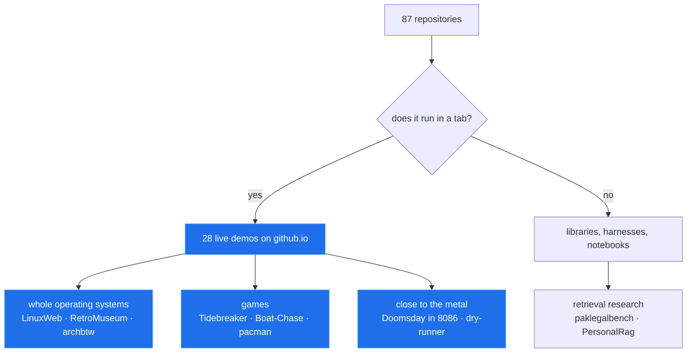

<picture>
  <source media="(prefers-reduced-motion: reduce) and (max-width: 600px)" srcset="https://raw.githubusercontent.com/hammadshakeelai/github-profile-blueprint/v2/research/showcase/assets/hero-phone-still-dark.svg">
  <source media="(prefers-reduced-motion: reduce) and (prefers-color-scheme: dark)" srcset="https://raw.githubusercontent.com/hammadshakeelai/github-profile-blueprint/v2/research/showcase/assets/hero-still-dark.svg">
  <source media="(prefers-reduced-motion: reduce)" srcset="https://raw.githubusercontent.com/hammadshakeelai/github-profile-blueprint/v2/research/showcase/assets/hero-still-light.svg">
  <source media="(max-width: 600px) and (prefers-color-scheme: dark)" srcset="https://raw.githubusercontent.com/hammadshakeelai/github-profile-blueprint/v2/research/showcase/assets/hero-phone-dark.svg">
  <source media="(max-width: 600px)" srcset="https://raw.githubusercontent.com/hammadshakeelai/github-profile-blueprint/v2/research/showcase/assets/hero-phone-light.svg">
  <source media="(prefers-color-scheme: dark)" srcset="https://raw.githubusercontent.com/hammadshakeelai/github-profile-blueprint/v2/research/showcase/assets/hero-dark.svg">
  <source media="(prefers-color-scheme: light)" srcset="https://raw.githubusercontent.com/hammadshakeelai/github-profile-blueprint/v2/research/showcase/assets/hero-light.svg">
  
</picture>

<picture>
  <source media="(prefers-color-scheme: dark)" srcset="https://raw.githubusercontent.com/hammadshakeelai/github-profile-blueprint/v2/research/showcase/assets/chips-dark.svg">
  <source media="(prefers-color-scheme: light)" srcset="https://raw.githubusercontent.com/hammadshakeelai/github-profile-blueprint/v2/research/showcase/assets/chips-light.svg">
  
</picture>

> [!NOTE]
> Every image on this page is generated from real GitHub API data, committed to the repository, and drawn to stay readable in the 309px column a phone gives a README. Nothing is fetched from a third party when you load it.

## Contents

- [What runs in a tab](#what-runs-in-a-tab)
- [The numbers, honestly](#the-numbers-honestly)
- [How it fits together](#how-it-fits-together)
- [The arithmetic behind this page](#the-arithmetic-behind-this-page)
- [A session](#a-session)
- [The stack](#the-stack)
- [How it went](#how-it-went)
- [Everything else](#everything-else)
- [How this page was built](#how-this-page-was-built)

---

## What runs in a tab

28 of 87 repositories publish a live site. Tap a window — each one opens the real thing, not a screenshot.

<a href="https://hammadshakeelai.github.io/LinuxWeb/">
<picture>
  <source media="(prefers-color-scheme: dark)" srcset="https://raw.githubusercontent.com/hammadshakeelai/github-profile-blueprint/v2/research/showcase/assets/win-linuxweb-dark.svg">
  <source media="(prefers-color-scheme: light)" srcset="https://raw.githubusercontent.com/hammadshakeelai/github-profile-blueprint/v2/research/showcase/assets/win-linuxweb-light.svg">
  
</picture>
</a>

<a href="https://hammadshakeelai.github.io/archbtw/">
<picture>
  <source media="(prefers-color-scheme: dark)" srcset="https://raw.githubusercontent.com/hammadshakeelai/github-profile-blueprint/v2/research/showcase/assets/win-archbtw-dark.svg">
  <source media="(prefers-color-scheme: light)" srcset="https://raw.githubusercontent.com/hammadshakeelai/github-profile-blueprint/v2/research/showcase/assets/win-archbtw-light.svg">
  
</picture>
</a>

<a href="https://hammadshakeelai.github.io/RetroMuseum/">
<picture>
  <source media="(prefers-color-scheme: dark)" srcset="https://raw.githubusercontent.com/hammadshakeelai/github-profile-blueprint/v2/research/showcase/assets/win-retromuseum-dark.svg">
  <source media="(prefers-color-scheme: light)" srcset="https://raw.githubusercontent.com/hammadshakeelai/github-profile-blueprint/v2/research/showcase/assets/win-retromuseum-light.svg">
  
</picture>
</a>

<a href="https://github.com/hammadshakeelai/OpenVScode">
<picture>
  <source media="(prefers-color-scheme: dark)" srcset="https://raw.githubusercontent.com/hammadshakeelai/github-profile-blueprint/v2/research/showcase/assets/win-openvscode-dark.svg">
  <source media="(prefers-color-scheme: light)" srcset="https://raw.githubusercontent.com/hammadshakeelai/github-profile-blueprint/v2/research/showcase/assets/win-openvscode-light.svg">
  
</picture>
</a>

<a href="https://hammadshakeelai.github.io/Tidebreaker/">
<picture>
  <source media="(prefers-color-scheme: dark)" srcset="https://raw.githubusercontent.com/hammadshakeelai/github-profile-blueprint/v2/research/showcase/assets/win-tidebreaker-dark.svg">
  <source media="(prefers-color-scheme: light)" srcset="https://raw.githubusercontent.com/hammadshakeelai/github-profile-blueprint/v2/research/showcase/assets/win-tidebreaker-light.svg">
  
</picture>
</a>

<a href="https://hammadshakeelai.github.io/Boat-Chase/">
<picture>
  <source media="(prefers-color-scheme: dark)" srcset="https://raw.githubusercontent.com/hammadshakeelai/github-profile-blueprint/v2/research/showcase/assets/win-boatchase-dark.svg">
  <source media="(prefers-color-scheme: light)" srcset="https://raw.githubusercontent.com/hammadshakeelai/github-profile-blueprint/v2/research/showcase/assets/win-boatchase-light.svg">
  
</picture>
</a>

> [!TIP]
> The whole card is the link. An SVG can't be clicked *inside* on GitHub — scripts and hover are stripped — but wrapping it in an anchor makes the entire panel a tap target, which is the largest control a README can have.

---

## The numbers, honestly

<picture>
  <source media="(prefers-color-scheme: dark)" srcset="https://raw.githubusercontent.com/hammadshakeelai/github-profile-blueprint/v2/research/showcase/assets/gauges-dark.svg">
  <source media="(prefers-color-scheme: light)" srcset="https://raw.githubusercontent.com/hammadshakeelai/github-profile-blueprint/v2/research/showcase/assets/gauges-light.svg">
  
</picture>

<picture>
  <source media="(prefers-color-scheme: dark)" srcset="https://raw.githubusercontent.com/hammadshakeelai/github-profile-blueprint/v2/research/showcase/assets/languages-dark.svg">
  <source media="(prefers-color-scheme: light)" srcset="https://raw.githubusercontent.com/hammadshakeelai/github-profile-blueprint/v2/research/showcase/assets/languages-light.svg">
  
</picture>

<picture>
  <source media="(prefers-color-scheme: dark)" srcset="https://raw.githubusercontent.com/hammadshakeelai/github-profile-blueprint/v2/research/showcase/assets/rhythm-dark.svg">
  <source media="(prefers-color-scheme: light)" srcset="https://raw.githubusercontent.com/hammadshakeelai/github-profile-blueprint/v2/research/showcase/assets/rhythm-light.svg">
  
</picture>

> [!IMPORTANT]
> You will not find a star count, a streak, or a trophy here. This account has **6 stars** across 87 repositories, and a card claiming otherwise would be theatre. The survey behind this page found the single most-copied stats card in the ecosystem loads **0%** of the time — it has been dead for months while 24% of profiles still embed it.

---

## How it fits together

GitHub renders Mermaid natively, so this is real text — searchable, themeable, and legible at any width without an image.



---

## The arithmetic behind this page

GitHub renders LaTeX, so the rule every panel here obeys can be stated exactly rather than described. For text drawn at size $F$ in a viewBox of width $W$, rendered into a column of width $R$:

$$\text{effective px} = F \times \frac{R}{W}$$

$$F_{\min} = \text{target} \times \frac{W}{R}$$

A phone gives a README $R = 309$px. At $W = 600$ units, an 11px floor means every label must be at least $21.4$ units — which is why nothing on this page is drawn small.

> [!WARNING]
> **55% of 1,730 surveyed SVG cards fail this**, and 90% of them are perfectly legible at full size. They die only because the phone column shrinks them.

---

## A session

<picture>
  <source media="(prefers-color-scheme: dark)" srcset="https://raw.githubusercontent.com/hammadshakeelai/github-profile-blueprint/v2/research/showcase/assets/terminal-dark.svg">
  <source media="(prefers-color-scheme: light)" srcset="https://raw.githubusercontent.com/hammadshakeelai/github-profile-blueprint/v2/research/showcase/assets/terminal-light.svg">
  
</picture>

```bash
# what the first card above actually is
git clone https://github.com/hammadshakeelai/LinuxWeb && cd LinuxWeb
npm install && npm run dev        # Alpine userspace, in a tab, home folder persisted
```

---

## The stack

<picture>
  <source media="(prefers-color-scheme: dark)" srcset="https://raw.githubusercontent.com/hammadshakeelai/github-profile-blueprint/v2/research/showcase/assets/orbit-dark.svg">
  <source media="(prefers-color-scheme: light)" srcset="https://raw.githubusercontent.com/hammadshakeelai/github-profile-blueprint/v2/research/showcase/assets/orbit-light.svg">
  
</picture>

<picture>
  <source media="(prefers-reduced-motion: reduce) and (prefers-color-scheme: dark)" srcset="https://raw.githubusercontent.com/hammadshakeelai/github-profile-blueprint/v2/research/showcase/assets/marquee-still-dark.svg">
  <source media="(prefers-reduced-motion: reduce)" srcset="https://raw.githubusercontent.com/hammadshakeelai/github-profile-blueprint/v2/research/showcase/assets/marquee-still-light.svg">
  <source media="(prefers-color-scheme: dark)" srcset="https://raw.githubusercontent.com/hammadshakeelai/github-profile-blueprint/v2/research/showcase/assets/marquee-dark.svg">
  <source media="(prefers-color-scheme: light)" srcset="https://raw.githubusercontent.com/hammadshakeelai/github-profile-blueprint/v2/research/showcase/assets/marquee-light.svg">
  
</picture>

---

## How it went

<picture>
  <source media="(prefers-color-scheme: dark)" srcset="https://raw.githubusercontent.com/hammadshakeelai/github-profile-blueprint/v2/research/showcase/assets/timeline-dark.svg">
  <source media="(prefers-color-scheme: light)" srcset="https://raw.githubusercontent.com/hammadshakeelai/github-profile-blueprint/v2/research/showcase/assets/timeline-light.svg">
  
</picture>

<picture>
  <source media="(prefers-color-scheme: dark)" srcset="https://raw.githubusercontent.com/hammadshakeelai/github-profile-blueprint/v2/research/showcase/assets/quote-dark.svg">
  <source media="(prefers-color-scheme: light)" srcset="https://raw.githubusercontent.com/hammadshakeelai/github-profile-blueprint/v2/research/showcase/assets/quote-light.svg">
  
</picture>

---

## Everything else

**Games you can play right now**

- [pacman](https://hammadshakeelai.github.io/pacman/) — Pac-Man in vanilla JS with the original ghost targeting AI · [source](https://github.com/hammadshakeelai/pacman)
- [retro-win32-arcade-web](https://hammadshakeelai.github.io/retro-win32-arcade-web/) — Original C++ Win32 GUI games, playable in the browser · [source](https://github.com/hammadshakeelai/retro-win32-arcade-web)

**Close to the metal**

- [Doomsday in 8086](https://hammadshakeelai.github.io/Doomsday-Algorithm-In-Assembly-Language/) — Conway's Doomsday algorithm in hand-written 8086 assembly, running in DOSBox · [source](https://github.com/hammadshakeelai/Doomsday-Algorithm-In-Assembly-Language)
- [Assembly dry-runner](https://hammadshakeelai.github.io/Assembly-Language-Dry-Running-Tool-Project/) — Step through assembly code line by line · [source](https://github.com/hammadshakeelai/Assembly-Language-Dry-Running-Tool-Project)

**Retrieval and research**

- **paklegalbench** — Statute retrieval over Pakistani law, and the eval harness that measures it · [source](https://github.com/hammadshakeelai/paklegalbench)
- [PersonalRag](https://hammadshakeelai.github.io/PersonalRag/) — Chat with your PDFs in the browser — hybrid retrieval, page-level citations · [source](https://github.com/hammadshakeelai/PersonalRag)
- [isospectral-sort](https://hammadshakeelai.github.io/isospectral-sort/) — Dynamical, Lie-algebraic and soliton sorting systems in Python · [source](https://github.com/hammadshakeelai/isospectral-sort)

<details>
<summary><b>The twenty most recent repositories, straight from the API</b></summary>

| Repository | Language | Live | Created |
|---|---|:--:|---|
| [T-rex](https://github.com/hammadshakeelai/T-rex) | JavaScript | ✅ | 2026-09-23 |
| [prompt-engineering-mastery](https://github.com/hammadshakeelai/prompt-engineering-mastery) | HTML | — | 2026-09-22 |
| [github-profile-blueprint](https://github.com/hammadshakeelai/github-profile-blueprint) | Python | — | 2026-09-20 |
| [Machine-Learning](https://github.com/hammadshakeelai/Machine-Learning) | Jupyter Notebook | — | 2026-09-20 |
| [web-game-link](https://github.com/hammadshakeelai/web-game-link) | — | — | 2026-09-20 |
| [terminal-tictactoe](https://github.com/hammadshakeelai/terminal-tictactoe) | TypeScript | ✅ | 2026-09-20 |
| [cuda-course](https://github.com/hammadshakeelai/cuda-course) | — | — | 2026-09-20 |
| [system-design-and-architecture](https://github.com/hammadshakeelai/system-design-and-architecture) | Makefile | — | 2026-09-20 |
| [isospectral-sort](https://github.com/hammadshakeelai/isospectral-sort) | Python | ✅ | 2026-09-19 |
| [retro-win32-arcade-web](https://github.com/hammadshakeelai/retro-win32-arcade-web) | C++ | ✅ | 2026-09-19 |
| [notes-app](https://github.com/hammadshakeelai/notes-app) | Python | — | 2026-09-18 |
| [archbtw](https://github.com/hammadshakeelai/archbtw) | TypeScript | ✅ | 2026-09-16 |
| [pacman](https://github.com/hammadshakeelai/pacman) | JavaScript | ✅ | 2026-09-16 |
| [Tidebreaker](https://github.com/hammadshakeelai/Tidebreaker) | JavaScript | ✅ | 2026-09-15 |
| [Boat-Chase](https://github.com/hammadshakeelai/Boat-Chase) | JavaScript | ✅ | 2026-09-15 |
| [tidal-rush](https://github.com/hammadshakeelai/tidal-rush) | HTML | ✅ | 2026-09-15 |
| [accounting-harness](https://github.com/hammadshakeelai/accounting-harness) | Python | ✅ | 2026-09-13 |
| [LinuxWeb](https://github.com/hammadshakeelai/LinuxWeb) | TypeScript | ✅ | 2026-09-13 |
| [RetroMuseum](https://github.com/hammadshakeelai/RetroMuseum) | TypeScript | ✅ | 2026-09-12 |
| [PersonalRag](https://github.com/hammadshakeelai/PersonalRag) | TypeScript | ✅ | 2026-09-10 |

</details>

<details>
<summary><b>What is deliberately absent, and why</b></summary>

| Left out | Reason, measured |
|---|---|
| Stats cards | The most-copied one loads 0% of the time; 24% of profiles still embed it |
| Streaks and trophies | 97% and 11% load rates respectively — and neither says anything specific |
| Badge walls | 42% of surveyed profiles are more than half badges; none is more legible for it |
| A typing-SVG banner | 54% of `readme-typing-svg` instances are illegible on a phone |
| Snake / Pac-Man contribution art | Action-maintained, and says nothing about the work |
| Star counts | There are six. A card implying otherwise would be dishonest |

</details>

---

## How this page was built

Generated by [`tools/showcase/build.py`](../tools/showcase/build.py) from [`docs/showcase/data/summary.json`](../docs/showcase/data/summary.json), which comes from the GitHub API. Every panel is committed SVG; nothing renders through a third party.

- [x] Every image generated from real data
- [x] Dark and light variants for all 29 panels
- [x] Phone-scale variants served by a width-gated `<picture>` source[^width]
- [x] Still variants served to anyone who asked for reduced motion[^motion]
- [x] Alt text on every image — the only channel out of an SVG[^alt]
- [x] Passes `python tools/lint/profile_lint.py --file showcase/README.md`
- [ ] Checked by hand on a real phone — [the five-minute check](../docs/research/PHONE-CHECK.md)

Press <kbd>Ctrl</kbd> + <kbd>Shift</kbd> + <kbd>M</kbd> in a desktop browser and drag the viewport under 600px: the hero and the cards swap to files drawn in phone units.

The research behind every rule above is in [`docs/`](https://github.com/hammadshakeelai/github-profile-blueprint/tree/v2/research/docs) — 446 profiles surveyed, 10,782 images fetched, three browser engines measured.

<picture>
  <source media="(prefers-reduced-motion: reduce) and (prefers-color-scheme: dark)" srcset="https://raw.githubusercontent.com/hammadshakeelai/github-profile-blueprint/v2/research/showcase/assets/wave-still-dark.svg">
  <source media="(prefers-reduced-motion: reduce)" srcset="https://raw.githubusercontent.com/hammadshakeelai/github-profile-blueprint/v2/research/showcase/assets/wave-still-light.svg">
  <source media="(prefers-color-scheme: dark)" srcset="https://raw.githubusercontent.com/hammadshakeelai/github-profile-blueprint/v2/research/showcase/assets/wave-dark.svg">
  <source media="(prefers-color-scheme: light)" srcset="https://raw.githubusercontent.com/hammadshakeelai/github-profile-blueprint/v2/research/showcase/assets/wave-light.svg">
  
</picture>

[^width]: Width-gated `<picture>` sources were verified serving a phone-specific file at 390px and a desktop one at 1280px in Chromium, Firefox and WebKit — [WIDTH-GATED.md](../docs/research/WIDTH-GATED.md).
[^motion]: `prefers-reduced-motion` never applies *inside* an SVG referenced as an image, in any engine. Gating a `<picture>` source on it does work — [REDUCED-MOTION.md](../docs/research/REDUCED-MOTION.md).
[^alt]: An `` whose SVG declares `role`, `aria-label`, `<title>` and `<desc>` still exposes an accessible name of `""`. Only the alt attribute crosses the boundary — [ALT-TEXT.md](../docs/research/ALT-TEXT.md).
